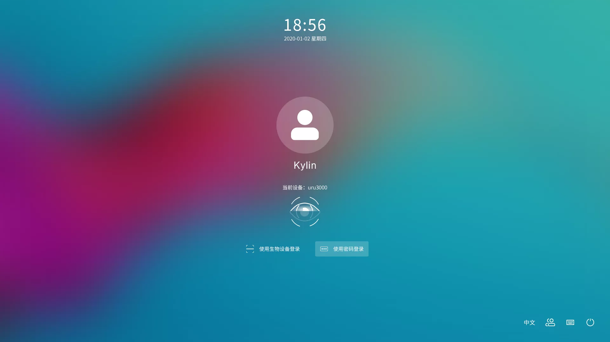
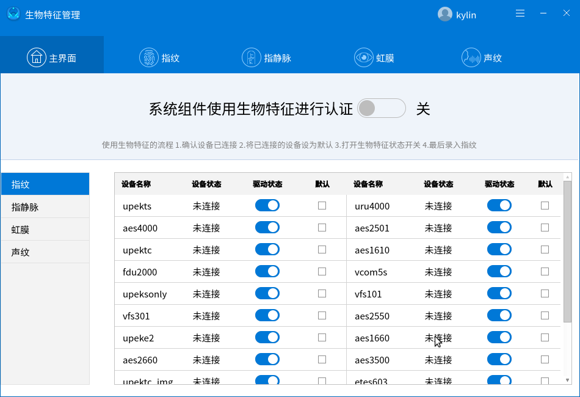
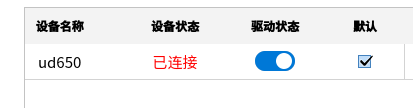
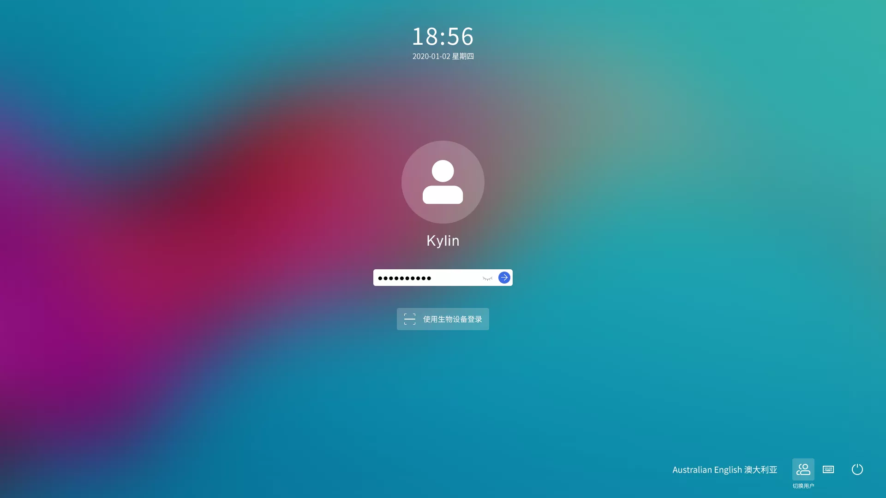
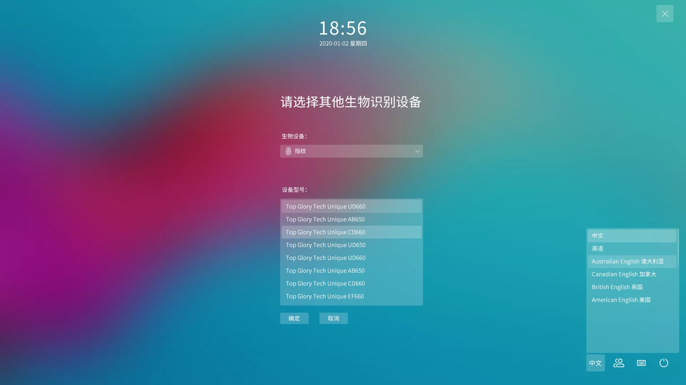
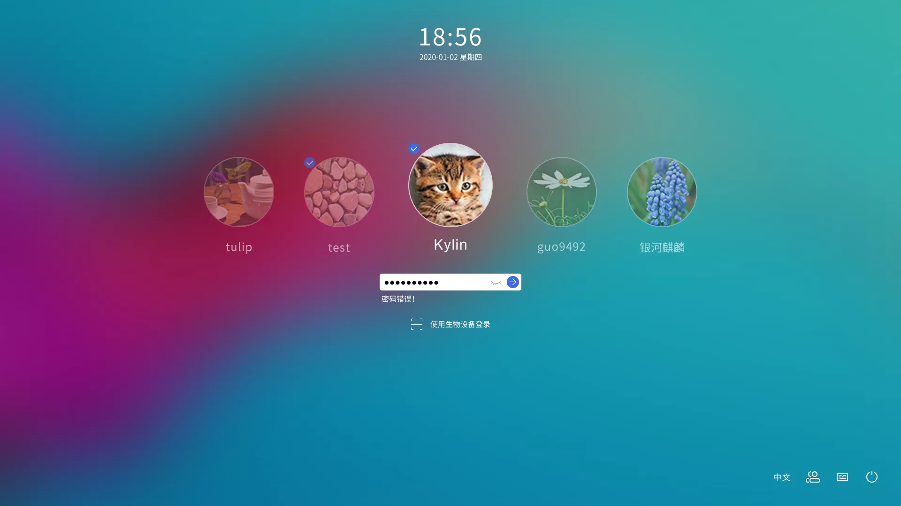
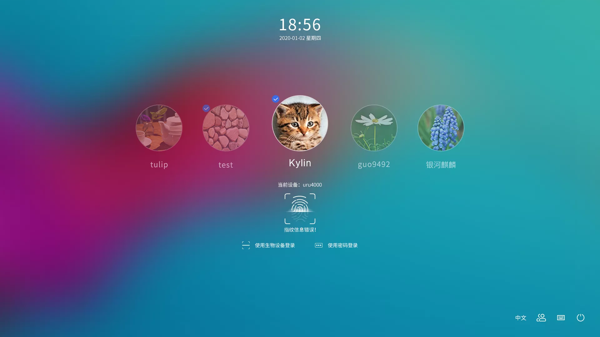

# Biometric manager
## Overview
Biometric authentication is more convenient and secure than traditional password, it does not need to remember complex passwords but user's fingerprint.Each person's fingerprint is different from others in uniqueness and stability for a certain period of time, so it is not easy to be forged or counterfeited.Using fingerprint authentication technology to identify user has the characteristics of security, reliability and accuracy.Biometric authentication can support login, screenlock, and authorization.

To default to biocertification, 4 conditions need to be met.

1.Confirm that the device is connected and the drive status is on.

2.System components using biometric authentication switch state is on.

3.Set the connected device as the default device.

4.Fingerprints are entered by the user using the device.

The unlock interface for biometric manager fingerprint authentication is shown in Fig. 2.

## Basic Function
### Biometric Manager
Biometric Manager is an aid for managing biometrics developed by the Kylin team.The main functions include biometric authentication management, biometric service management, biometric device driver management and biometric feature management.

As shown in Fig.3, above the main interface of the management tool, the main interface, fingerprint, finger vein, iris and voice print are shown, respectively. The Delegate Management Tool has five pages.

#### Main Interface
At the top of the main interface, "System components authenticated with biometric features" is the switch that turns on biometric features, and only when this switch is turned on can biometric authentication be used.

The left side of the main interface shows the type of the biometric feature, and the right side shows the driver device to which that type corresponds, showing the device name, whether the device status is connected, the driver status, and whether it is the default device.When users want to use a certain biometric device, users need to connect to it first and then set it as the default device so that users can use it for biometric authentication, as shown in the Figure below.

### Log In
The login application provides a graphical interface to enter the desktop, requiring the user to enter the user's password to log in, after successful login, users can start the desktop environment and enter the desktop.The interface for logging in with a password is shown in Fig. 11.

Verification biometrics can also be used for authentication after biometric authentication has been turned on.Logging in defaults to biometric authentication when all conditions for biometric authentication are met. If no default device is set at this point, password authentication will be used by default, but a biometric button will be displayed on the login screen and you can switch to the biometric interface by clicking on it.

When the number of biometric devices inserted is 2 or more, the Other Devices button will be displayed, click the button to select other devices, the Other Devices interface is shown below.

### Screenlock
If the control center is set to display the screenlock when the system is idle, the screenlock program will be launched when the system is idle, requiring the user to enter the password to unlock the screenlock before entering the desktop.The interface and operation of the screenlock and login are essentially similar, unlockable by entering a password and unlockable using biometric authentication.The screenlock shown in Fig. 9 and Fig. 10 can be unlocked with multiple users switching.

### Sudo Command
The sudo command can also be used to authenticate with biometric features when the conditions for authenticating with biometric features are met, just follow the text prompts to verify the biometric features.

## FAQ
### What to do if the screenlock is stuck and I can’t enter my password?
1.switch to the character terminal by Ctrl + Alt + F1.

2.Enter the user name and password of the user who is in the screenlock.

3.Execute the command "killall ukui-screensaver-dialog".

4.Cut back to the graphical interface by Ctrl + Alt + F7, or Ctrl + Alt + F8 if multiple users are logged in.
### Can’t use biocertification?
1.Opening biometric management tools.

2.Confirm whether the biometric switch is on, whether the device is connected, whether the drive state is on or not.

3.Check whether the device is set as the default device.

4.Check whether fingerprints have been entered.
### How to turn off biometrics
Simply turn on thebiometric managerand turn off the system component above the main interface using the Biometric Status switch.
## Appendix
### List of currently supported fingerprint devices
|Biological Feature|Manufacturer|Model |Submodel
| :------------ | :------------ | :------------ | :------------ |
|Finger vein|TOP GLORY TECH|UD650|UD650
|Iris|Beijing Institute of Radio Metrology and Measurement|A210|A210
|Fingerprint (21 drivers in total, 122 devices from 10 manufacturers)|Hangzhou Grow Technology|R301|R301
|	|Shenzhen Aratek Biometrics Technology Co. Ltd.|EM03|EM03
||	|	EM1600	|EM1600
|||		TL-FRT610	|TL-FRT610
	||AuthenTec	|AES1610	|0x1600
		|||AES1660	|0x2660,0x2680,0x2683,0x2686, 0x2689,0x268c,0x268f,0x2682, 0x2685,0x2688,0x268b,0x268e, 0x2681,0x2684,0x2687,0x268a, 0x268d,0x2691
		|||AES2500/AES2501	|0x2500,0x2580
		|||AES2550/AES2810	|0x2550,0x2810
		|||AES2660|	0x2660,0x2682,0x2685,0x2688, 0x268b,0x268e,0x2680,0x2683, 0x2686,0x2689,0x268c,0x268f, 0x2681,0x2684,0x2687,0x268a,  0x268d,0x2691
|||		AES3500	|0x5731
	|||	AES4000	|0x5501
	||ElanTech	|Fingerprint Sensor	|0x0903,0x0c02,0x0c05,0x0c08, 0x0c0b,0x0c0e,0x0c11,0x0c14, 0x0c17,0x0c1a,0x0c1d,0x0c20, 0x0c23,0x0c26,0x0c29,0x0c2c, 0x0c2f,0x0c32,0x0c01,0x0c04, 0x0c07,0x0c0a,0x0c0d,0x0c10, 0x0c13,0x0c16,0x0c19,0x0c1c, 0x0c1f,0x0c22,0x0c25,0x0c28, 0x0c2b,0x0c2e,0x0c31,0x0907, 0x0c03,0x0c06,0x0c09,0x0c0c, 0x0c0f,0x0c12,0x0c15,0x0c18, 0x0c1b,0x0c1e,0x0c21,0x0c24, 0x0c27,0x0c2a,0x0c2d,0x0c30, 0x0c33
||	EgisTec(aka Lightuning)	|ES603	|0x0603
	||Secugen|	FDU 2000	|0x0300
	||UPEK	|Eikon 2|	0x2016
	|||	TouchStrip Sensor-Only|	0x1000, 0x1001
	|||	TouchChip/Eikon Touch 300|	0x2015, 0x3001
|||		TouchChip Fingerprint Coprocessor	|0x2020
|||		TouchStrip|	0x2016
	||Digital Persona	|U.are.U 4000/4000B/4500|	0x00bc,0x00bd,0x0007,0x0008, 0x00bb,0x00ca,0x000
	||Veridicom	|5thSense|	0x0110
	||Validity|	VFS0050	|0x0050
		|||VFS101|	0x0001
	|||	VFS301	|0x0005,0x0008
		|||VFS5011	|0x0010,0x0011, 0x0017,0x0018

