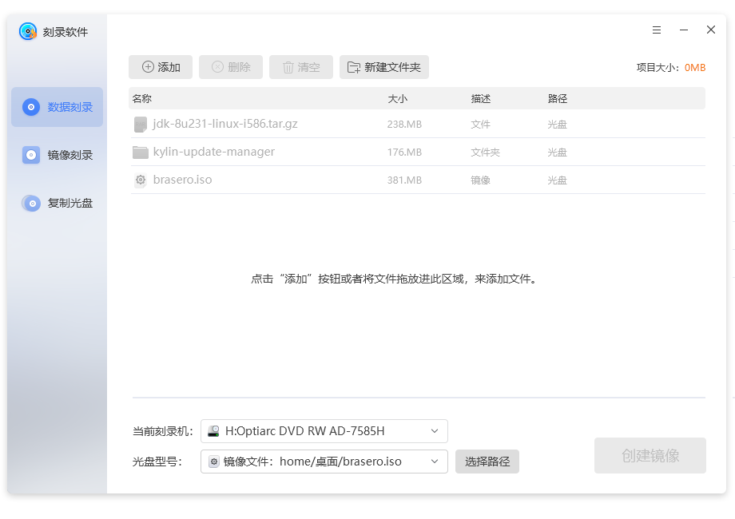
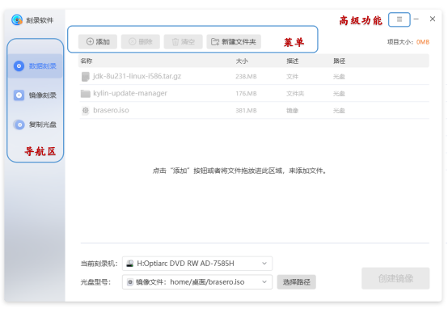
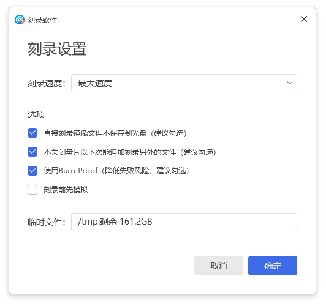
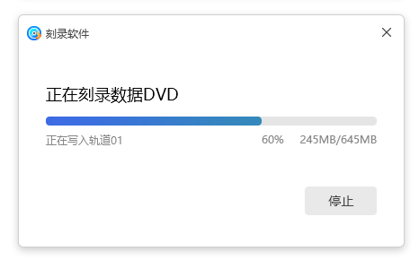
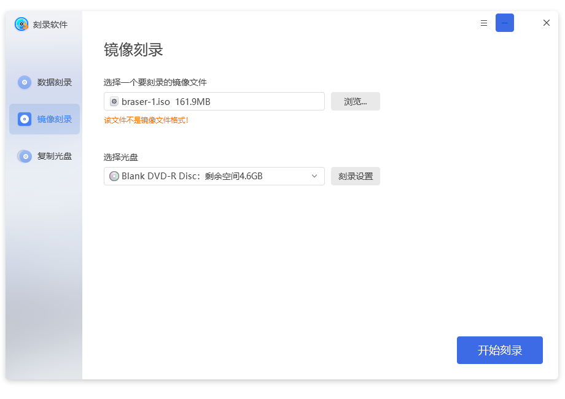
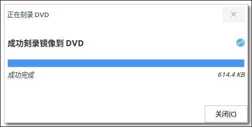
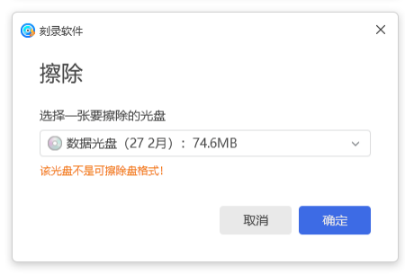
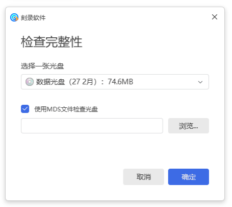
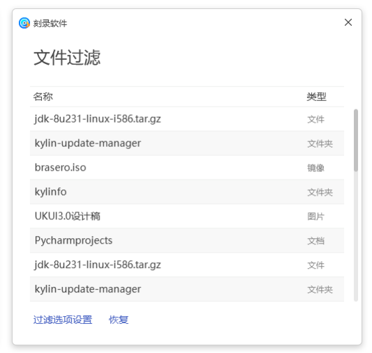

# 光盘刻录器帮助手册
## 概 述
本手册包括光盘刻录器的功能介绍，以及部分功能模块的详细介绍。

光盘刻录器是一款用于帮助用户刻录光盘的工具，包括数据刻录和镜像刻录两种方式。为用户提供了刻录光盘、擦除光盘、检查光盘完整性等功能。

光盘刻录器通过图形界面，直观的显示光盘刻录器为用户提供的功能，方便用户使用。

## 基本功能
基本功能图标及其功能介绍：

### 主界面
用户在主界面的上方可以看到有添加、删除、清空和新建文件夹。在界面的左侧一栏有数据刻录、镜像刻录、复制光盘三个选项。在主界面的用户可以看到最近项目。主界面如图 1所示。
#### 使用步骤简介
###### 1)最小化
点击右上角的最小化图标，将光盘刻录器最小化到任务栏。
###### 2)最大化
点击右上角的最大化图标，将光盘刻录器的界面最大化成屏幕的大小。
###### 3)缩小窗口
点击窗口最大化是右上角的缩小图标，将最大化的光盘刻录器恢复原来大小。
###### 4)数据刻录
点击数据刻录界面，光盘里无内容时，点击“添加”按钮或者将文件拖放进此区域来添加文件；若是光盘里有内容，直接将光盘里的内容导入进来，但不能进行编辑。
###### 5)镜像刻录
点击镜像刻录，显示镜像刻录界面。
###### 6)复制光盘
点击复制光盘，显示复制光盘界面。
### 数据刻录
数据刻录界面通过添加、删除、清空、新建文件夹按钮进行操作。在加入文件时，如果未插入CD/DVD盘片时，会出现提示语。界面会显示你加入的文件名称、大小、描述以及空间。在界面的下方会显示光盘类型、光盘的大小、估算项目的大小以及刻录按钮，如果要生成镜像文件则显示的是生成的镜像文件而不是光盘的大小。
数据刻录界面如图 3所示：

#### 使用步骤简介
###### 1)添加
点击添加，在项目中添加要刻录的文件。选择文件界面如图 4所示：

###### 2)删除
点击删除，删除在项目中选中的文件。
###### 3)清空
点击清空，清空界面内所有文件。
###### 4)新建文件夹
点击新建文件夹，即在项目中添加一个新的文件夹。
光盘刻录设置界面如图 5所示：

光盘刻录设置界面可以进行刻录速度选择、选项的勾选以及临时文件的选择。

选项中的直接刻录镜像文件而不保存到光盘，勾选该选项可以提高刻录的速度。

勾选不关闭盘片以下次能追加刻录另外的文件选项，可以在本次刻录结束后，下次刻录另外的文件能从上次结束的地方追加刻录。

使用Burn-Proof，勾选该选项可以降低失败的风险。

勾选刻录前先模拟选项，会在刻录前模拟刻录，如果刻录失败则不会真正刻入光盘，减少光盘存储空间的消耗。

点击光盘刻录设置界面的刻录，进行刻录，显示刻录进度界面。如图 6所示：

刻录成功结束后，显示数据刻录成功界面。如图 7所示：

### 镜像刻录
镜像刻录界面如图 8所示：

#### 使用步骤简介
###### 1)选择光盘镜像
点击浏览，选择要刻录的光盘镜像。
###### 2)点击要选入的盘片
选择一个要进行刻录操作的盘片（系统识别到了盘片后会自动显示在盘片选择区）。
###### 3)点击开始刻录
在步骤一和步骤二的基础上，点击开始刻录，开始刻录镜像。镜像刻录进度界面如图 9所示：

 刻录成功结束后，显示刻录成功界面。镜像刻录成功界面如图 10所示：

###### 4)关闭
点击关闭，即完成镜像刻录。
### 复制光盘
复制光盘界面如所示：

#### 使用步骤简介
###### 1)选择光盘镜像
点击浏览，选择要复制的光盘镜像。
###### 2)点击要选入的盘片
选择一个要进行刻录操作的盘片（系统识别到了盘片后会自动显示在盘片选择区）。
###### 3)点击创建镜像
在步骤一和步骤二的基础上，点击创建镜像，开始复制。复制光盘进度界面如图 12所示：

 刻录成功结束后，显示刻录成功界面。镜像刻录成功界面如图 13所示：

###### 4)点击关闭，即完成复制
## 高级功能
用户在主界面，点击“”图标，可进入光盘刻录器的高级功能选项，如图 14所示。

### 弹出选项
用户通过高级功能选项中弹出选项，对选中的盘进行弹出操作，即可将该选中的盘弹出。
### 擦除选项
用户通过高级功能选项中擦除选项，对选中的光盘进行擦除操作，如图 15所示。

### 检查完整性选项
用户通过高级功能选项中检查完整性选项，进入检查完整性界面。如图 16所示：

### 文件过滤设置
用户通过高级功能选项中文件过滤设置选项，进入文件过滤界面。如图 17所示：

也可以通过点击“查看文件过滤”，进入文件过滤界面，如图 18所示：

### 帮助
### 关于
## 常见问题
### 用户在使用时需要注意什么？
1）镜像刻录时需要先将要刻录的文件生成.iso后缀的镜像文件。本手册提供一种生成镜像文件的方法：先点击数据刻录，添加要生成镜像文件的源文件，在没有放入光盘前，点击刻录，即可生成.iso后缀的镜像文件。

2）擦除光盘，该功能只可以用于可读可写的光盘，只读光盘不能进行擦除操作。
## 附 录
### 快捷键

|选项	|快捷键	|操作内容
| :------------ | :------------ | :------------ |
|打开（O）...|Ctrl+O|	打开项目
|保存（S）|Ctrl+S	|保存项目
|退出（Q）|	Ctrl+Q|	退出光盘科路器
|目录（C）|	F1	|查看用户手册
