# Eom
## Overview
Eom is a software to view images, can open a variety of formats, support for zoom, slide show pictures, full screen, thumbnails, etc.

The main interface is divided into four parts: title bar (minimize, maximize, close), menu bar, toolbar and status bar.

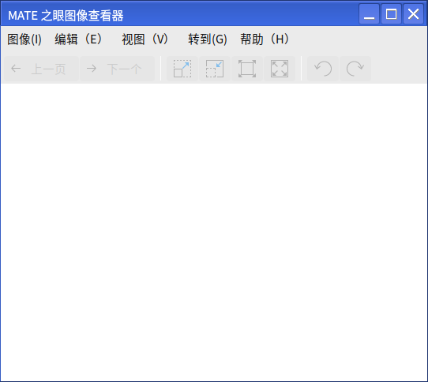

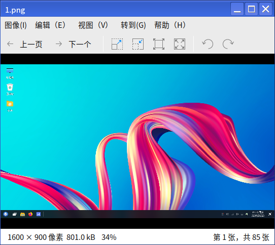

 

## Basic Functions
The main interface is shown in figure below.

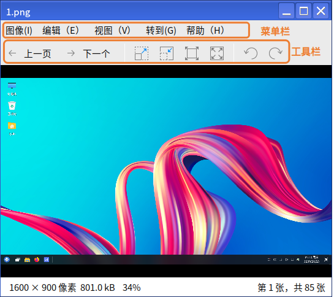

Icon and its function introduction:

|Icons|Descriptions|Icons|Descriptions
| :------------ | :------------ | :------------ | :------------ |
|| Previous || Next
|| Zoom in the picture|| Zoom out the picture
|| Display pictures in normal size || Fit the image to the window
|| Rotate the picture 90 degrees counterclockwise || Rotate the picture 90 degrees clockwise

 

## Advanced Functions
Users can perform related operations on Eom through the image, edit, view, go, and help options of the menu.

Icon and its function introduction:

|Icons|Descriptions|Icons|Descriptions
| :------------ | :------------ | :------------ | :------------ |
|| Open image || Save
|| Save As ||Print
|| Open the included folder||History opened image
|| Properties || Close
|| Undo || Copy
|| Horizontal flip || Vertical flip
|| Rotate clockwise || Rotate counterclockwise
|| Move to recycle bin || Preferences
|| The first image || The last image
|| Enter the user-guide || About Eom

 

### Picture
Users can enter the image option by clicking: Menu > Image, to open, save as, and print the image.

#### Turn on
Users can select the image to view by clicking: Menu > Image > Open.

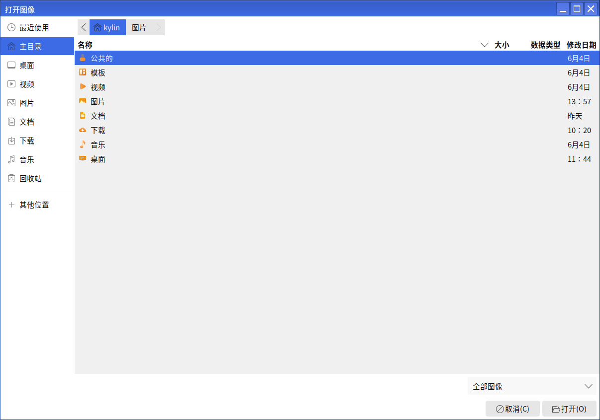

The opening method is shown in the figure below:

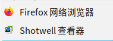

#### Print
Users can click the menu: Menu > image > print to print the image.

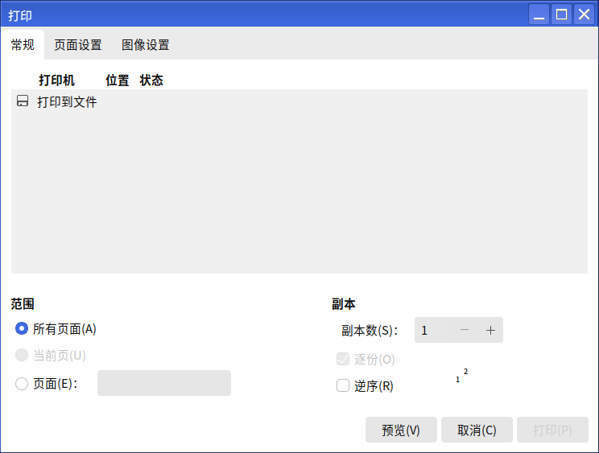

#### Attributes
Users can view the image properties by clicking: Menu > Image> Properties.

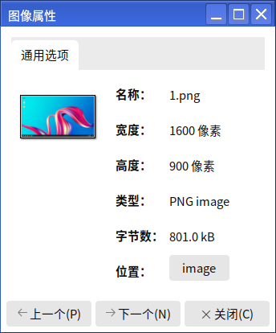

### Edit
Users can enter the editing options by clicking: Menu > Edit to copy, flip, rotate, etc.

#### toolbar
Users can select the image to be viewed by clicking: Menu > Edit > Toolbar.

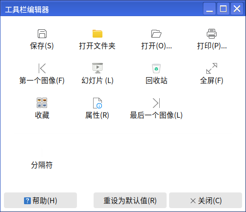

#### fPreferences
Users can click: Menu > Edit > Preferences to define image effects, set slideshows and activity plug-ins according to user needs.

### View
Users can enter the view option by clicking: Menu > View, and set whether to display the toolbar, status bar, and atlas of the image viewer interface, and can perform full-screen, slideshow, zoom-in and zoom-out operations for viewing pictures.

#### Atlas
Users can click: Menu > View > Atlas.

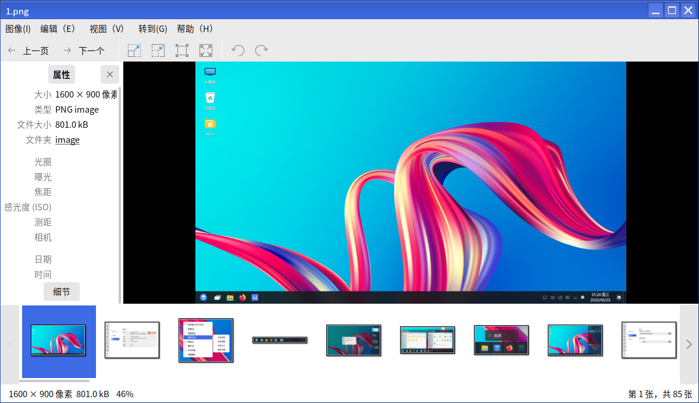

### Go to
Users can access the Go to option by clicking on: Menu > Go to, which is designed to operate on browsing pictures, for previous, next, first, last and random browsing.

### Help
The user can access the Help option by clicking: Menu > Help.

#### Content
Users can jump to the user-guide by clicking: Menu > Help > Content.

#### About
Users can view information about Eom by clicking on: Menu > Help > About.

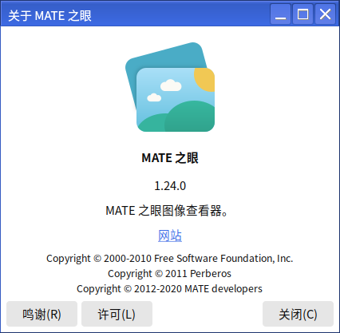

 

## FAQ
### Showing history open pictures in Eom's image drop-down menu does not display
If the problem shown below is displayed, it means that the history picture is no longer in the current path.

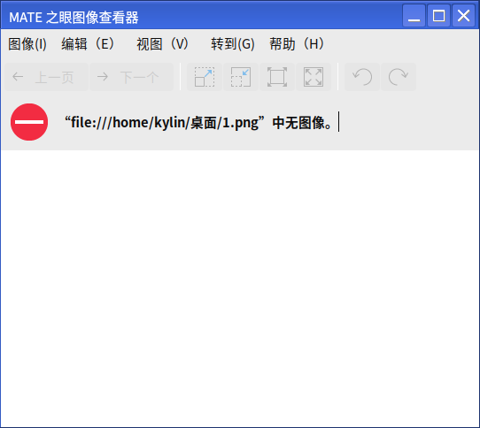

 

## Appendix
### Shortcuts

|Options | Shortcuts| Actions
| :------------ | :------------ | :------------ | 
|Open (O)... | Ctrl+O |to select an image and open it
|Save(S) |Ctrl+S |Save Image
|Save As |Shift+Ctrl+S| Save Image As
|Print (P)... | Ctrl+P| to print image
|Set Desktop Background (D) | Ctrl+F8| Set the current image to the desktop background
|Property(R) | Alt+Enter| View Image Properties
|Close (C) | Ctrl+W| Close Eom
|Undo |Ctrl+Z| Undo Operation
|Copy (C) | Ctrl+C | Copy Image
|Clockwise Rotation(R) | Ctrl+R | Clockwise rotation of the current image.
|Rotate counterclockwise (L) | Shift+Ctrl+R| Rotate counterclockwise on the current image.
|Fullscreen (F) | F11| View Image in Full Screen
|Zoom(Z) |Ctrl++ |Zoom in on current image
|Zoom Out (O) | Ctrl+- | Zoom in on the current image
|Normal Size(N) | Ctrl+0 | display image in normal size
|Best Length (B) | F | Fit Image to Window
|Previous Image(P) | Alt+Left | View Previous Image
|Next Image (N) | Alt+Right | View Next Image
|First image (F) | Alt+Home| Jump to the first image.
|Last image (L) | Alt+End | Jump to last image
|Random Image(R) |Ctrl+M |Random View Image

