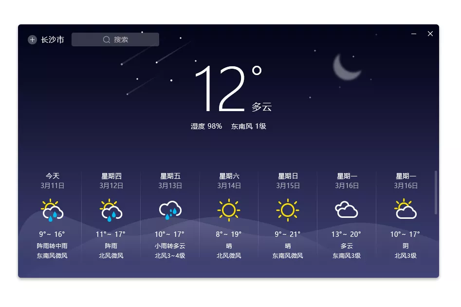
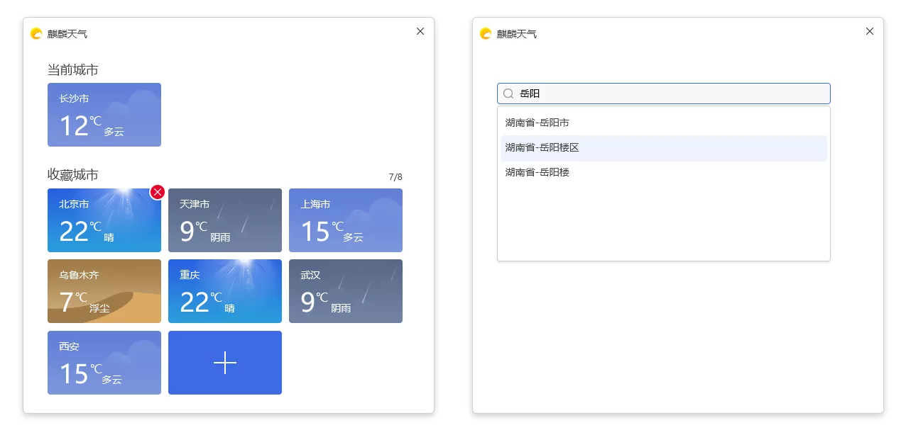

# Kylin Weather Indicator
## Overview
Kylin Weather Indicator is a software that helps users to get weather forecast, through the graphical interface of city management and search, users can quickly get city weather information and life index information,For example: weekly climate, dressing index, cold index, UV index, car wash index, air index, exercise index, etc.
The main interface of Kylin Weather Indicator is shown in Fig. 1.

## Basic Function
### Main Interface
In the Kylin Weather Indicator interface shown in Fig. 2, you can view the weather details of Changsha City for a week in real time, such as temperature, humidity, wind speed, etc.

#### Use Steps
###### 1) Search City Or Area
Click the search box in the upper right corner, type the city or region the user needs to search for, and make a filtered list of relevant cities as the user types, as shown in Fig. 3.

Clicking on Kylin Weather Indicator City Management will provide users with a graphical management interface as shown in Fig. 4, users can collect the city weather that they need to pay attention to.

######2) Minimize
Click on the minimize icon and Kylin Weather Indicator will minimize to the tray tool.
###### 3) Close
Click on the close icon and Kylin Weather Indicator will be closed.
## FAQ
### Why can’t  I get weather information?
Please keep the network open.
