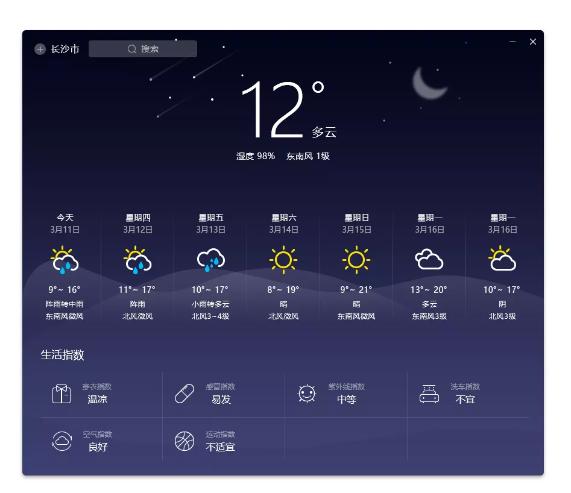
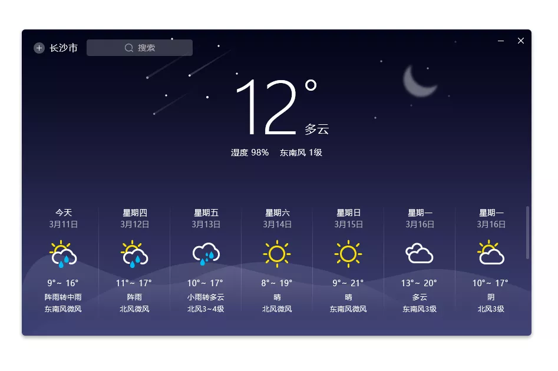
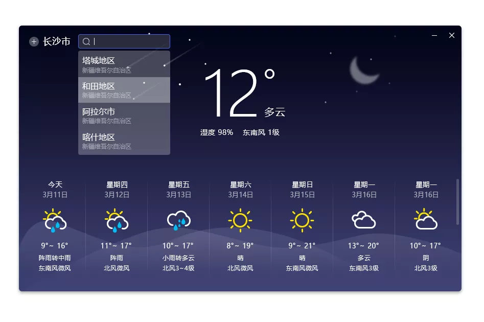

# 麒麟天气帮助手册
## 概 述
麒麟天气是一款帮助用户获取天气预报的软件，通过图形界面的城市管理和搜索，方便用户快速获取城市天气信息及生活指数信息，如：每周气候、穿衣指数、感冒指数、紫外线指数、洗车指数、空气指数、运动指数等。

麒麟天气的主界面如下图所示。

## 基本功能
### 主界面
在麒麟天气界面，可以实时查看长沙市一周的气候详情，如温湿度、风速等。

#### 使用操作简介
###### 1)搜索城市或地区
点击右上角搜索框，键入用户需要搜索的城市或地区，在用户键入的同时列出相关城市的筛选列表。

点击麒麟天气城市管理，将为用户提供图形化管理界面，用户可以更具需要收藏需要关注的城市天气。

###### 2)最小化
点击最小化图标，麒麟天气将最小到托盘工具。

###### 3)关闭
点击关闭图标，麒麟天气将被关闭。

## 常见问题
### 获取不到天气信息怎么办？
保持网络的畅通。
