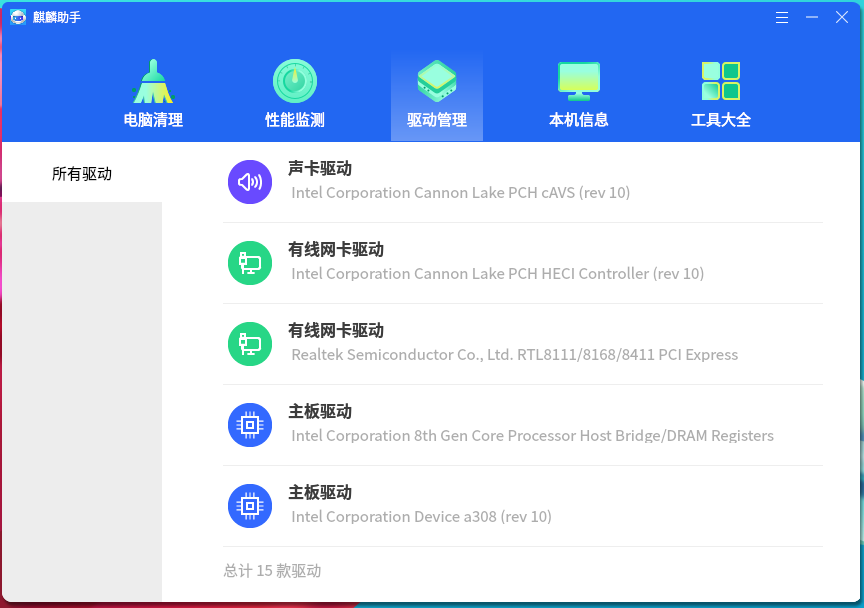
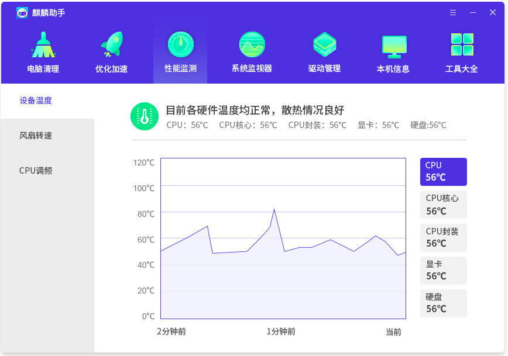
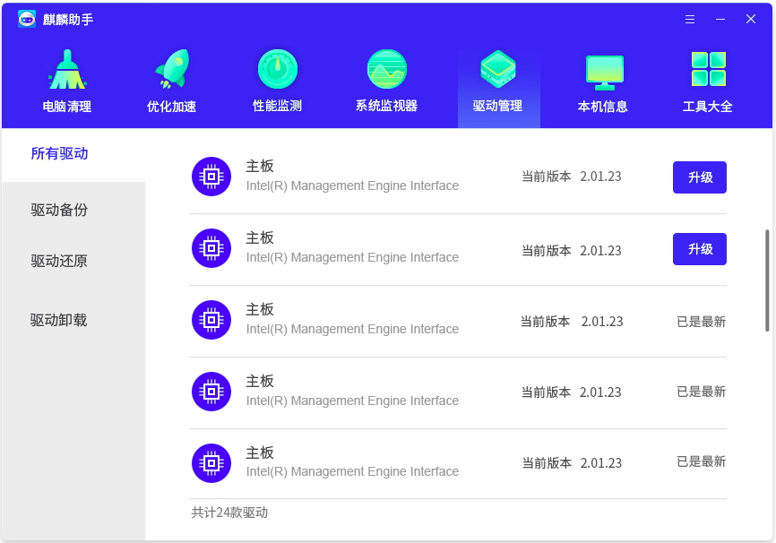
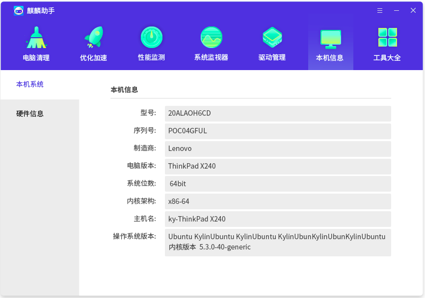
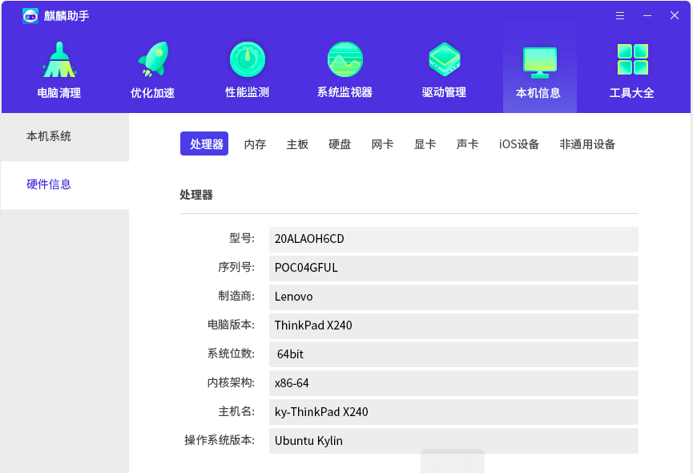
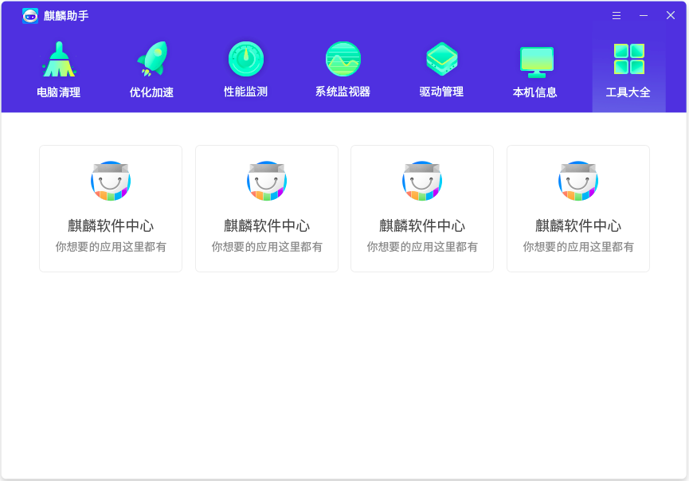

# Kylin Assistant
## Overview
Kylin Assistant as a system-level configuration tool, mainly for the system to expand the configuration. In addition, you can check the hardware details of the current computer in real time, so that users can better understand the composition of the computer.

Kylin Assistant provides 7 functions, as shown in Figure 1.

 

## Computer Clean
As the start page of Kylin Assistant, Computer Clean is designed in a simple style, simplifying the page structure, providing a simple system cleaning function.

Clicking the "Start Cleaning" button, the program begins to scan the system. After the scan is complete, the "One-click Cleaning" button shows up, as shown below.
 

This feature only scans for non-time-consuming cleanup items, such as system history traces, browser cookies, and package cache.

Users can click the “Details” button to see the informations.

 

<<<<<<< HEAD
## Optimized Acceleration
=======
## Optimization and Speedup
>>>>>>> 1d6456ae2a910a895865932739640437cb471f01

It provides three options: 

- Startup at power on: Optimize boot-up softwares.

- System speedup: Optimize system and memory settings.

- Software speedup: Exit softwares which are temporarily unused.

As shown in Figure 3.

Clicking the “Speedup Immediately” button, the program begins to scan the optimized options. After the scan is complete, “One-click Optimizing” button shows up, as shown below.

Users can click the “Details” button to see the informations.

 

## Performance Monitor
Users can get the informations about device temperature, fan speed and CPU FM through this feature. As shown in Figure 5.

 

## Driver Manager
Users can get the version of all drivers in the system though this feature. It can upgrade the driver’s version, backup and restore the drivers, uninstall the drivers also. As shown in Figure 6.
 

 

## Local Information
Users can get the informations of this compuer (including model, kernel architecture, OS version, etc) and kinds of hardwares. As shown in Figure 7 and Figure 8.

 

## Tools
As the extension of Kylin Assistant, “Tools” uses plug-in development mode, and all functions are integrated into Kylin Assistant in the form of plug-ins. The main interface is shown in the figure below.
 

 

## FAQ
### No "Memory" information be seen in "Local Information"
Because Kylin Assistant does not get the memory information from the underlying interface, the "Memory" entry will not be displayed on the interface either.

