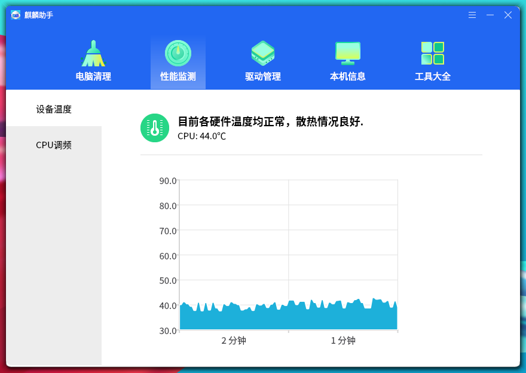
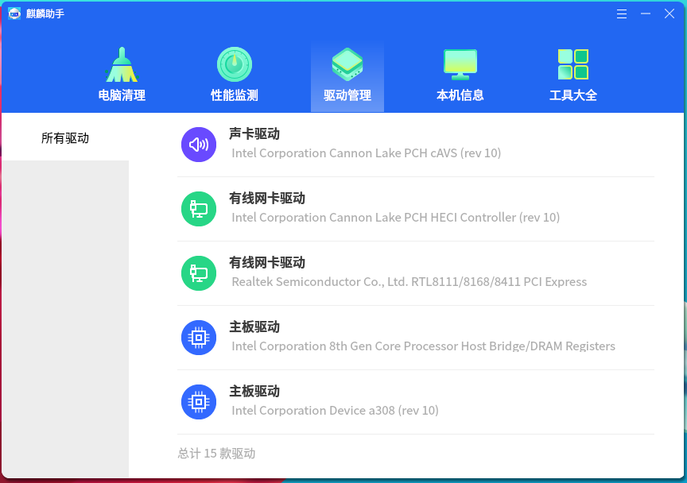
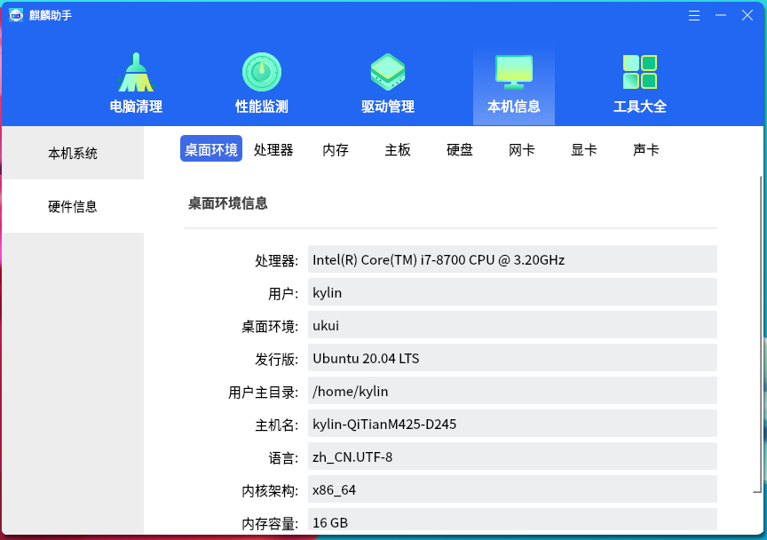
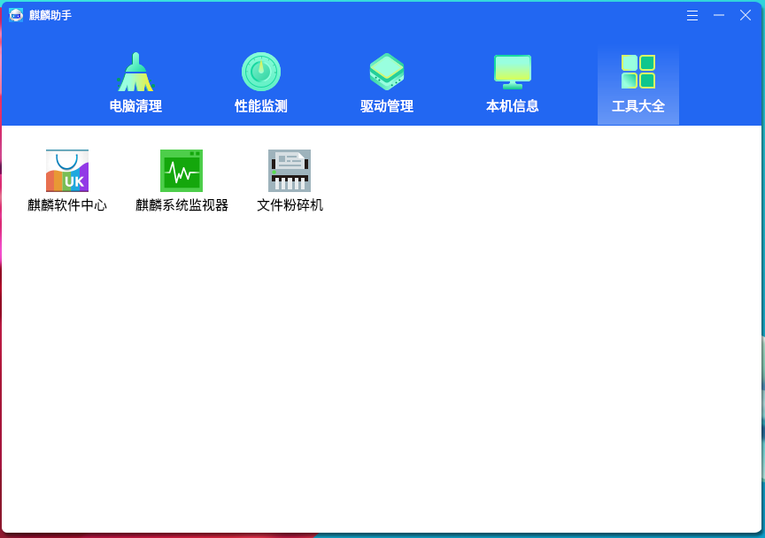
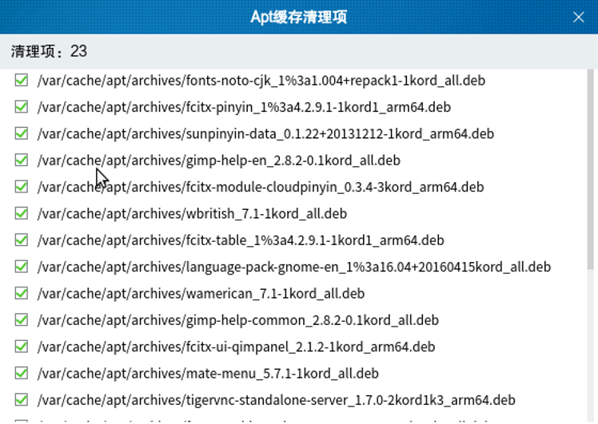
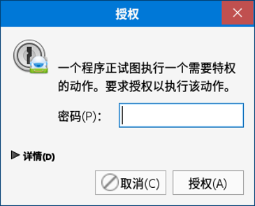

# 麒麟助手帮助手册
## 概 述
麒麟助手作为系统级工具配置工具，主要针对系统配置进行扩展性加强配置，另外可以实时查询当前计算机的硬件详细信息，便于用户加深了解计算机组成。

麒麟助手提供了7个功能，如图 1所示。

 

## 电脑清理
“电脑清理”作为麒麟助手的开始页，秉承简约的设计风格，简化页面结构，提供简易的系统清理功能。

点击“开始清理”按钮，程序开始对系统进行扫描；扫描完成后，界面出现“一键清理”按钮，如下图所示。
 

该功能仅扫描系统历史痕迹、浏览器Cookies、软件包缓存这些非耗时清理项。

用户可点击“详情”，查看具体情况。

 

## 优化加速
该功能提供了三个可加速的选项：

- 开机启动：优化开机启动软件；

- 系统加速：优化系统和内存设置；

- 软件加速：退出暂时不使用的软件。

如图3所示。

点击“立即加速”按钮，程序开始对加速项进行扫描；扫描完成后，界面出现“一键优化”按钮，如下图所示。

用户可点击“详情”，查看具体情况。

 

## 性能监测
用户可通过该功能，查看设备温度、风扇转速和CPU调频的信息。如图 5所示。

 

## 驱动管理
用户可通过该功能，查看系统中所有驱动的当前版本，以及对驱动进行升级、备份还原和卸载。
 

 

## 本机信息
用户可通过该功能，查看本机系统，包含型号、内核架构、操作系统版本等，和各项硬件信息。如图 7，图 8所示。
 

 

 

## 工具大全
“工具大全”作为麒麟助手的功能扩展，使用了插件的开发模式，其中的所有功能均以插件的形式整合进麒麟助手，主界面如下图所示。
 

 

## 常见问题
### “本机信息”中未看到“内存”信息
出现该情况是因为麒麟助手从底层接口未获取到内存相关信息，所以界面上也不会显示“内存”条目。

