# 麒麟影音帮助手册
## 概 述
麒麟影音是由麒麟团队开发的一款视频播放软件，简单易用的界面设计，旨在为用户的休闲娱乐提供便捷的视频体验。

麒麟影音是一款基于MPlayer和MPV的图形化前端桌面产品，主界面简约、直观，由标题栏（显示列表、最小化、最大化及关闭）和播放窗口（播放、上一项、暂停、下一项、音量调节、全屏、播放列表）组成，如图1所示。

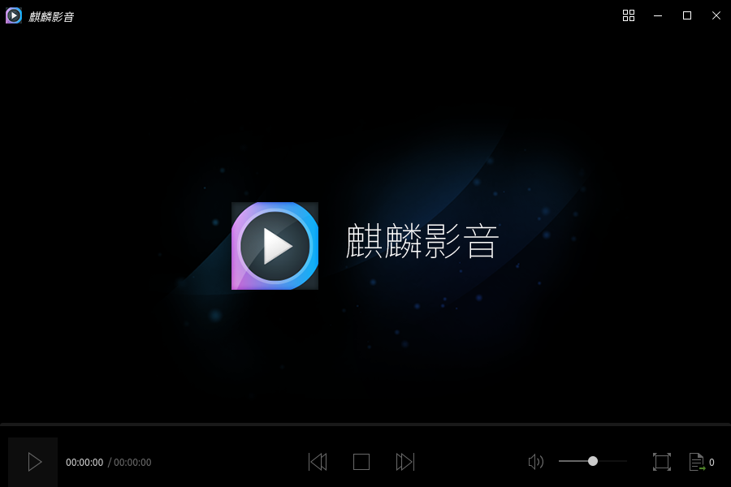

播放影像时的麒麟影音如图2所示。

麒麟影音包含丰富的音视频源格式，支持的音视频、字幕格式如下所示。

|类目|	支持格式
| :------------ | :------------ |
|视频	|(*.avi *.vfw *.divx *.mpg *.mpeg *.m1v *.m2v *.mpv *.dv *.3gp *.mov *.mp4 *.m4v *.mqv *.dat *.vcd *.ogg *.ogm *.ogv *.ogx *.asf *.wmv *.bin *.iso *.vob *.mkv *.nsv *.ram *.flv *.rm *.swf *.ts *.rmvb *.dvr-ms *.m2t *.m2ts *.mts *.rec *.wtv *.f4v *.hdmov *.webm *.vp8 *.bik *.smk *.m4b *.wtv *.part )
|音频	|(*.mp3 *.ogg *.oga *.wav *.wma *.aac *.ac3 *.dts *.ra *.ape *.flac *.thd *.mka *.m4a *.opus )
|字幕|	(*.srt *.sub *.ssa *.ass *.idx *.txt *.smi *.rt *.utf *.aqt *.vtt )

 

## 基本功能
主界面介绍：

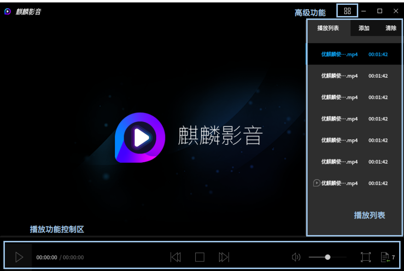

图标及其功能介绍：

|图 标|	图标功能说明	|图 标	|图标功能说明
| :------------ :| :------------ | :------------ | :------------ |
||	高级功能（显示列表）||		最小化
||	最大化		||关闭
||	播放按钮	||	上一个
||	暂停		||下一个
||	音量调节	||	全屏
||	打开播放列表	||||	

### 全 屏
用户可以通过点击右下角的“”图标或双击屏幕，即可进行全屏操作。

### 播放列表
用户可以通过点击右下角的“”图标，查看播放队列、添加及清除文件，如图4所示。

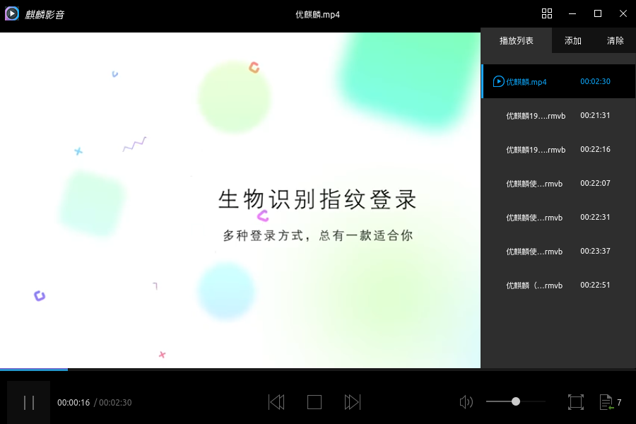

#### 下拉菜单
在播放列表中单击鼠标右键出现下拉菜单，菜单中功能按钮及其操作内容如下所示。

| 功能按钮 |	操作内容 |
|:------------|:------------|
|播 放|	播放选定列表中的视频源|
|删除选项（S）|	删除选定列表中的视频源|
|从硬盘删除（D）|	删除选定列表中及硬盘中的视频源|

 

#### 添 加
用户可以通过点击播放列表中“添加”或通过显示列表（图标“”）中“打开文件”选项，进入到如图5所示文件选择窗口，对需要添加的播放源的路径进行选择，选定文件后（可多选，Ctrl+鼠标左键点击选择）“打开”即可。如：打开桌面文件夹“优麒麟视频”，查看视频源。

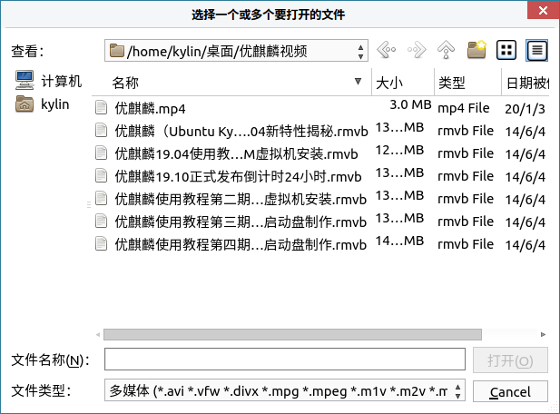

#### 清 除
- 方式一：用户可以通过点击播放列表中“清除”，弹出如图6所示窗口，选择“是”即对播放列表进行清空操作，反之选择“否”。

- 方式二：用户可以通过移动鼠标，鼠标停留的位置（列表底色变深）将会出现“”图标，单击鼠标左键即可对应删除，如图7所示。

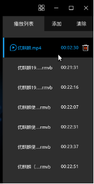

- 方式三：基于方式二的基础上，单击鼠标右键出现下拉菜单，选择“删除选项”或“从硬盘删除”即可。

 

## 高级功能
用户可以通过显示列表（图标“”）对软件进行基本设置，点击麒麟影音主界面右上角的四格图标，选择下拉菜单选项进行操作。

主界面介绍：

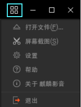

图标及其功能介绍：

|图标	|图标功能说明	|图标|	图标功能说明
| :------------ | :------------ | :------------ | :------------ |
||	打开文件||		屏幕截图
||	设置||		帮助
||	关于麒麟影音	||	退出 

 

### 屏幕截图
用户可以通过“屏幕截图”选项，对当前视频场景进行截图并保存于本地，可自定义保存路径及图片格式，如下表所示。

|指标	|详细信息
|:-------|:--------|
|默认路径	|/home/kylin/图片/kylin_video_screenshots |
|默认图片格式	|png、ppm、pgm、pgmyuv、tga、jpg、jpeg |

 

### 设 置
用户可以通过“设置”选项，对常规、视频、音频、性能、字母、屏幕截图、快捷键进行个性化设置，如图9所示。

设置界面的个性化定制选项如下所示。

|指标	|详细信息
| :------------ | :------------ |
|常规设置	|播放引擎：MPlayer或MPV，自定义最小化时暂停和视频播放时进行预览
|视频设置	|默认启用后期处理、使用软件视频均衡器、直接渲染、双缓冲（√）、使用切片方式绘制视频；输出驱动为默认模式
|音频设置	|自定义音量、同步、声道；输出驱动为默认模式
|性能设置	|自定义缓存和解码
|字幕设置	|自动加载*.srt、*.sub等格式字幕文件；默认字幕编码、可选择自动检测语种
|屏幕截图	|设置保存路径及图片格式
|快捷键	|自定义

 

#### 常规设置
常规设置选项可以选择MPlayer、MPV两种播放引擎，并可根据用户需求，选择是否最小化时暂停和视频播放时进行预览。详情如图10所示。

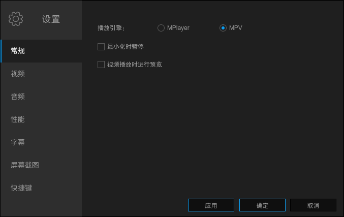

#### 视频设置
视频设置输出驱动为默认模式，其他选项可根据用户需要进行定制：默认启用后期处理、使用软件视频均衡器、直接渲染、双缓冲、使用切片方式绘制视频。详情如图11所示。

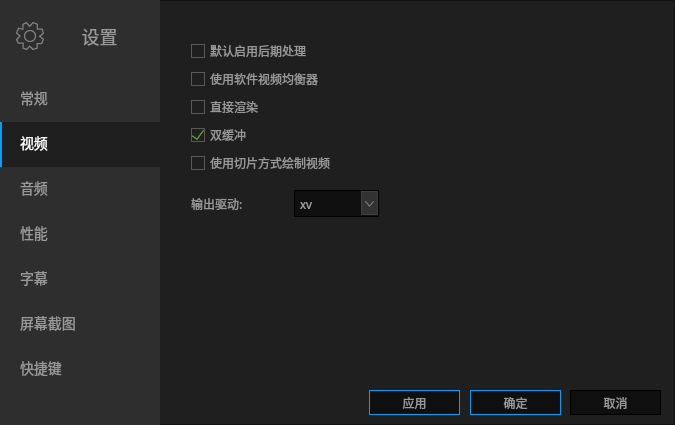

#### 音频设置
音频设置可根据用户需求对音量（全局音量、使用软件音量控制、默认音量标准化、最大放大率），同步进行选择（音频/视频自动同步、因子）。

输出驱动为默认模式。

默认声道：2（立体声）、4（4.0环绕声）、6(5.1环绕声）、7(6.1环绕声）、8(7.1环绕声）、8。

详情如图12所示。

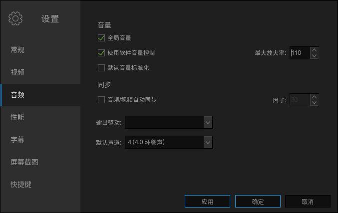

#### 性能设置
性能设置可根据用户需求对缓存（本地文件缓存KB、流缓存KB）和解码（仅MPEG1/2和H.264解码线程、硬件解码）进行个性化定制。详情如图13所示。

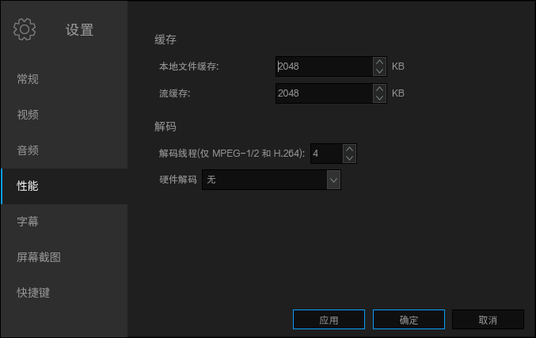

硬件解码格式如下所示。

||详细信息
| :------------ | :------------ |
|硬件解码	|无、自动、vdapu、vaapl、vaapl-copy

 

#### 字幕设置
字幕设置可自动地，对格式为*.srt、*.sub等格式的“影片的名称相同、所有包含影片名称的字幕、目录中所有的字幕”文件进行加载。

默认字幕编码UTF-8（UTF-8）等，且可尝试自动检测相关语种，如：汉语（zh）、俄语（ru）等。

详情如图14所示。

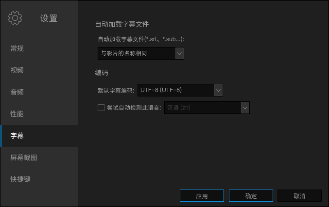

#### 屏幕截图设置
截屏截图界面如图15所示。

#### 快捷键设置
快捷键设置表格允许用户更改大多数现有的动作快捷键，如图16所示。

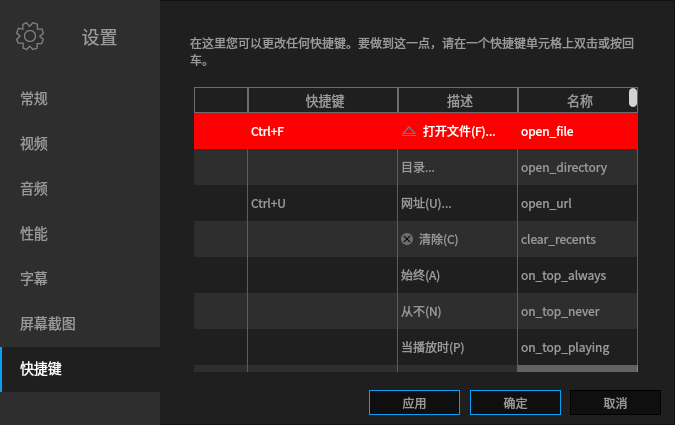

用户可双击或按回车可进入修改快捷键对话框。

有两种方法来更改快捷键：

- 如果捕捉按钮已启用，那么只需按下您想要指派给此动作的新按键或组合件（这种方式并是不适用于所有按键）。

- 如果捕捉按钮已关闭，可输入按键的完整名称。详情如图17所示，快捷键设置见附录。

### 帮 助
用户可以通过“帮助”选项，查看麒麟影音支持的视频、音频及字幕格式，如图18所示。

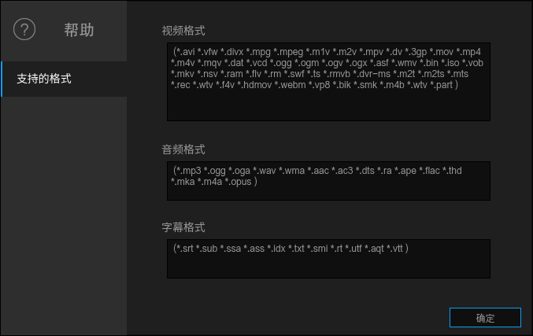

### 关于麒麟影音
用户可以通过“关于麒麟影音”选项，了解麒麟的产品信息、版本信息以及相关链接，如图19所示，麒麟影音贡献者相关信息如图20所示。

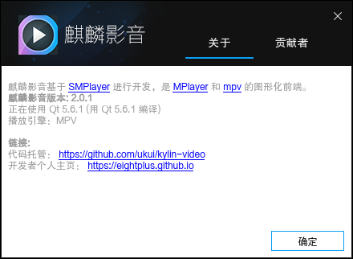

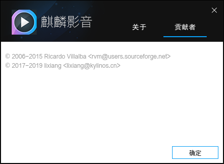

### 退 出
用户可以通过“退出”选项或点击关闭键退出软件。

 

## 常见问题
### 视频源无法播放
尝试在常规设置中切换播放引擎MPlayer或MPV。

 

## 附 录
### 快捷键
无提示快捷键的部分，可根据用户的需求自定义快捷方式。

|快捷键	|描述|	名称
| :------------ | :------------ | :------------ |
|Ctrl+F|	打开文件（F）	|open_file
|	|目录|	open_directory
|Ctrl+U	|清除（C）	|clear_recents
||	始终（A）|	on_top_always
|	|从不（N）|	on_top_never
|	|当播放时（P）	|on_top_playing
|Left,Ctrl+Shift+B|	-10秒|	rewind1
|Down	|-1分	|rewind2
|PgDown	|-10分	|rewind3
|right,Ctrl+Shift+F	|+10秒|	forward1
|Up	|+1分|	forward2
|PgUp|	+10分|	forward3
|Ctrl+J	|跳转到（J）|	jump_to
|Backspace|	正常速度	|normal_speed
|{|	半速	|halve_speed
|}	|双倍速度|	double_speed
|[|	速度-10%|	dec_speed
|]	|速度+10%|inc_speed
||	速度-4%	|dec_speed_4
||	速度+4%	|inc_speed_4
||	速度-1%	|dec_speed_1
|	|速度+1%	|inc_speed_1
|<,Mesia Previous	|上一个	|play_prev
|>,Media Next	|下一个	|play_next
|	|顺序播放	|order_play
|	|随机播放	|random_play
|	|列表循环播放|	list_loop_play
|	|自动（A）	|aspect_detect
|	|1:1	|aspect_1:1
|	|5:4|	aspect_5:4
|	|4:3|	aspect_4:3
|	|11:8|	aspect_11:8
|	|14:10|	aspect_14:10
|	|3:2|	aspect_3:2
|	|14:9|	aspect_14:9
|	|16:10|	aspect_16:10
|	|16:9|	aspect_16:9
|	|2.35:1|	aspect_2.35:1
|	|禁用（D）|	aspect_none
|	|关（O）|	rotate_none
|	|顺时针旋转90度并翻转（R）	|rotate_clockwise_flip
|	|顺时针旋转90度（C）	|rotate_clockwise
|	|逆时针旋转90度（W）|	rotate_counterclock
|	|逆时针旋转90度并但转（F）|	rotate_counterclockwise_flip
|	|翻转图像（P）|	flip
|	|镜像图像（O）|	mirror
|	|立体声（S）|	channels_stereo
|	|4.0环绕声（4）	|channels_surround
|	|5.1环绕声（5）|	channels_ful51
|	|6.1环绕声（6）|	channels_ful61
|	|7.1环绕声（7）	|channels_ful71
|M,Volume Mute|	静音（M）|	mute
|	|附加立体声（E）|	extrastereo_filter
|	|卡拉OK（K）	|karaoke_filter
|	|音量标准化（N）|	volnorm_filter
|	|优化耳机（h）（earwax）|	earwax_filter
|9	|音量-|	dec_volume
|0	|音量+|	inc_volume
|-	|延迟-|	dec_audio_delay
|+	|延迟+|	inc_audio_delay
|Y	|设置延时（Y）|	audio_delay
|	|加载外部文件（L）|	load_audio_file
|	|卸载外部文件（N）	|unload_audio_file
|	|均衡器（Q）	|audio_equalizer
|	|重置音频均衡器	|reset_audio_equalizer
|	|立体声（S）	|stereo
|	|左声道（L）	|left_channel
|	|右声道（R）|	right_channel
|	|单声道（M）	|mono
|	|反相（v）|	revers_channels
|S	|屏幕截图（S）|	screenshot
|	|加载...|	load_subs
|	|字幕可见性（V）|	sub_visibility
|Shift+I	|在OSD中显示信息（i）|	lshow_info_osd
|Shift+U	|大小+|	inc_osd_scale
|Shift+Y	|大小+|	dec_osd_scale
|	|以毫秒小时时间	|osd_fractions
|	|仅字幕（Y）	|osd_none
|	|音量+定位（S）|	osd_seek
||	音量+定位+计时器（T）|	osd_timer
|	|音量+定位+计时器+总时间（O）|	osd_total
|Ctrl+P	|设置|	show_preferences
|Ctrl+I	|媒体信息（I）|	show_file_properties
|Ctrl+H	|帮助	|show_help
|Ctrl+A|	关于麒麟影音|	chout_kulin_video
|Ctrl+Q	|退出|	quit
|F3|	播放列表	|platlist_open_close
|Space	|播放/暂停|	play_pause
|Media Stop	|停止|	stop
|Ctrl+Return|	全屏|	fullscreen
|	|打开主界面|	open_window
|	|打开截图文件夹|	open_shots_dir

