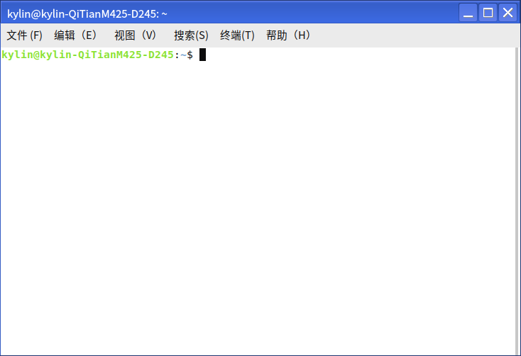
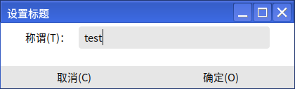
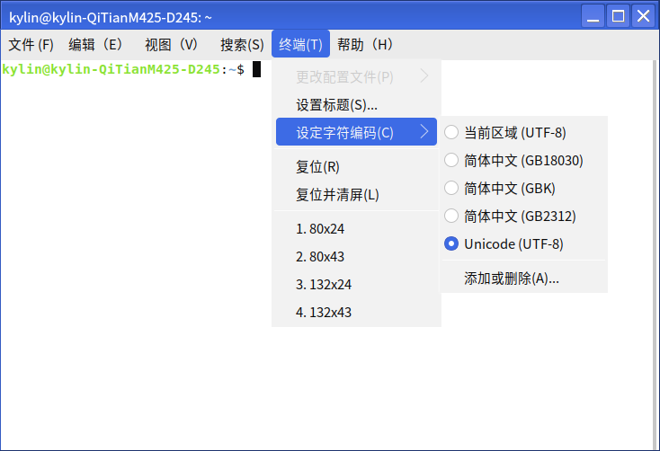
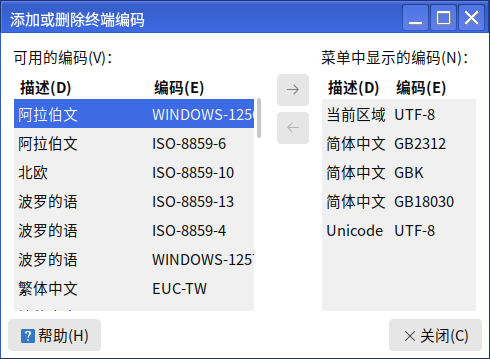
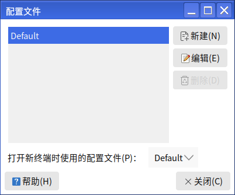
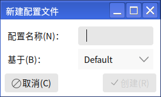

# Terminal
## Overview
Terminal provides a character system window under the graphical interface. 

Users can open the application via Start Menu > Terminal. 

The main interface is shown in the figure below.

 

## Basic Functions
-Character system

-Execute various commands and scripts

-Use apps/services that only run on the terminal

## Advanced Settings
### Single Setting
It only affects the current window, and it becomes invalid immediately after the window is closed.

- Window title

Click Terminal > Set Title on the menu bar to modify the name of the terminal window.

- Character Encoding

The character encoding is also called the character set code, which refers to the character encoding in the character set as an object in the specified set, so that the text can be displayed and transmitted in the computer.

Click Terminal > Set Character Encoding on the menu bar, users can adjust the encoding.

In "Add or Remove", users can see more encoding options.

- Resize the window

Click "View" on the menu bar to set the current window to full screen, zoom in and zoom out.

The zoom in/out here will zoom in/out with the text in the window.

### Configuration file

The settings in the configuration file are permanent and apply to all new windows.

The application comes with a Default configuration file. 

Users can modify the configuration by editing > Configuration File Preferences.

Users can also create a new configuration based on a configuration file by going to File > New Configuration File, or Edit > Configuration File.

 

## FAQ
### Scrolling is incomplete when there is too much output
This is due to a limit on the number of columns that can be rolled back.

Select Edit > Profile Preferences > Scroll tab and check "No limit" for "Rollback" so that you can roll back to the beginning of the full view.

 

## Appendix
### Shortcuts

| Shortcuts | Features|
| :------------ | :------------ |
| Ctrl+Alt+T | Open a new terminal window
| Ctrl+Shift+T | Open a new tab in a terminal window
| Ctrl+D| To close the current window/tab
| F11 | Fullscreen display/exit fullscreen |

More shortcuts can be viewed or modified via Edit > Keyboard Shortcuts.

