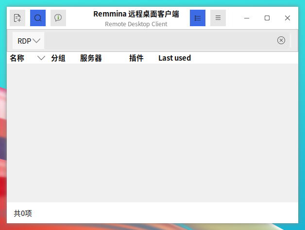
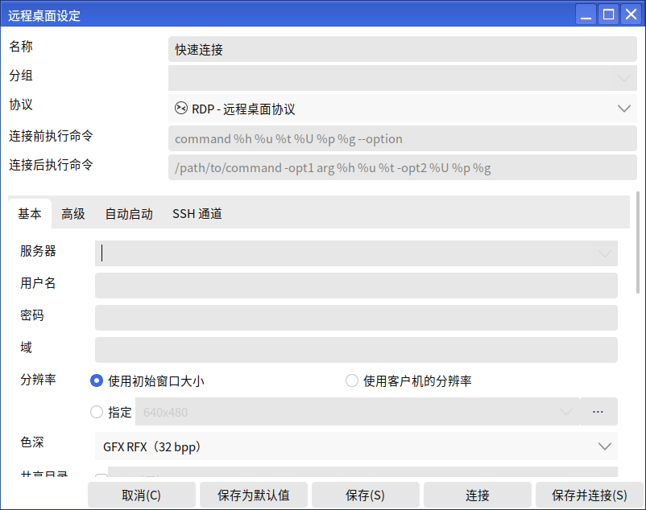
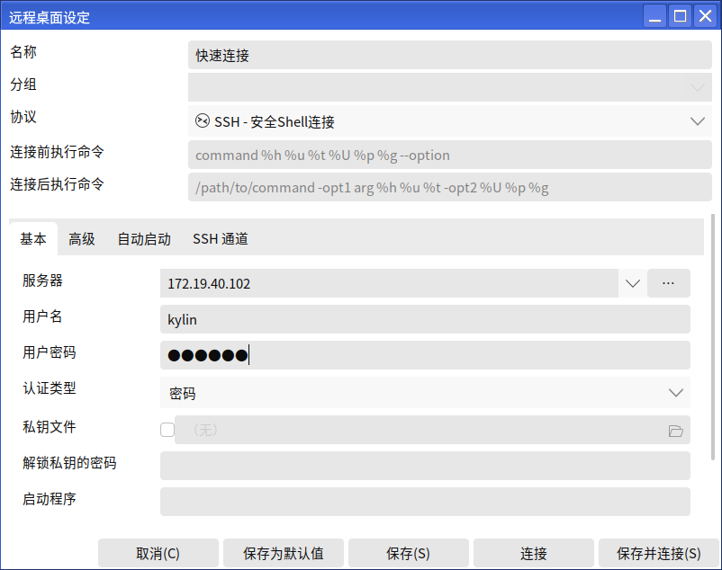
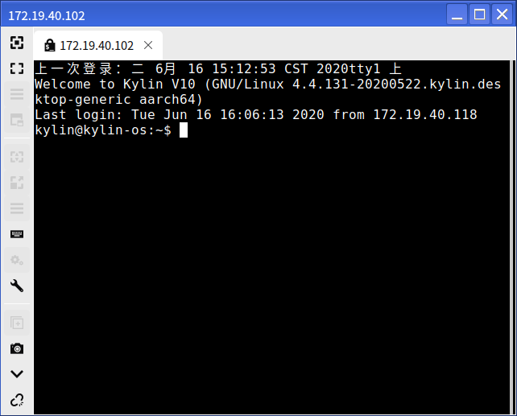
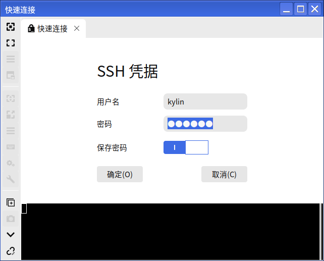
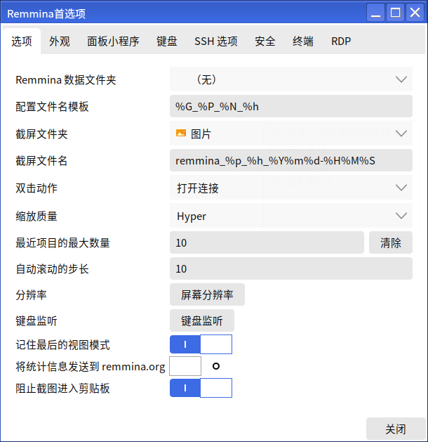
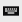

# Remmina
## Overview
The remote desktop client can connect to the computer via VNC, SSH, RDP remote protocols.

 

## Basic Functions
### New Remote Connection
Using the SSH protocol, connect to a 172.19.40.102 computer as an example.

1) Click on "", the Remote Desktop Settings screen will pop up.

2) Select the SSH protocol, and enter the target computer IP address in the "Server" box: 172.19.40.102," The "User Name" and "Password" are the name and password of the target computer.

When finished, click "Connect".

3) The interface on the connection is shown below.

4) Or select SSH directly on the main interface, enter the IP of the target computer, and fill in the information in the pop-up window.

#### first choice
Click "" and select "Preferences" to set the remote desktop client.

 

## Advanced Functions
In the connected window, some tools are provided.

As shown in the table below, it is a partial description.

|Icons | Descriptions | icons | Descriptions |
|:-----|:-----|:-----|:-----|
|| Full Screen |  | Capture all keyboard events |
|| Copy/Paste/Select All/Keyboard Monitor || Screenshots|
|| Minimize the window |  | Disconnect |

