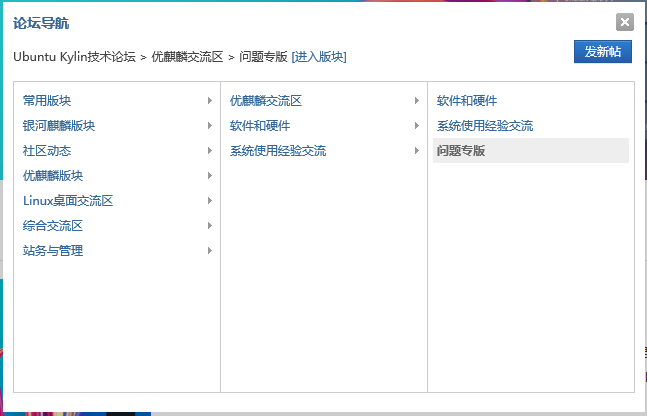
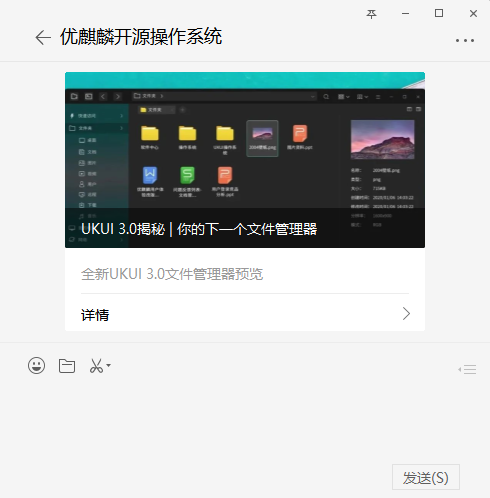
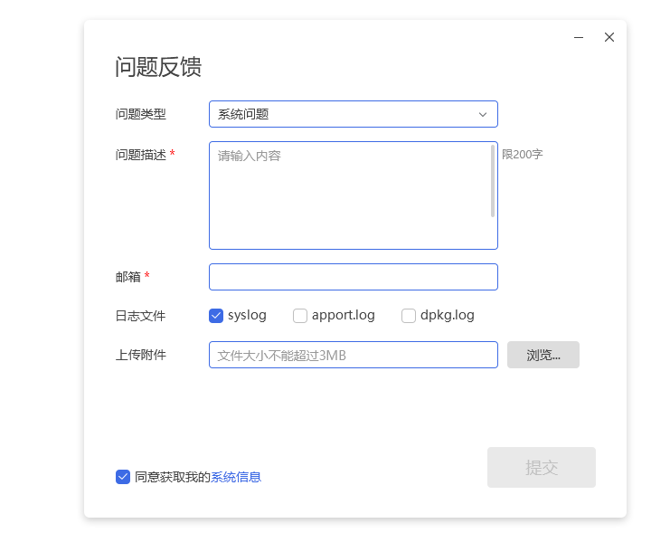
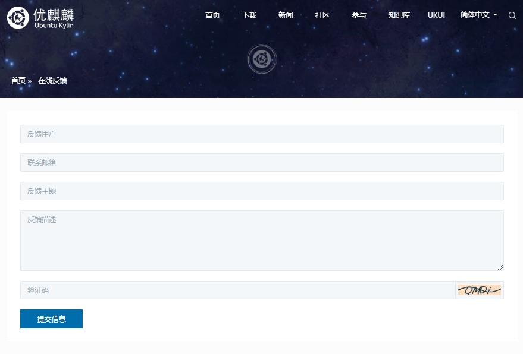

# 技术服务

UKUI是基于Linux和其他类似Unix发行版的可插入框架的轻量级桌面环境。 使用Qt开发，默认搭载在优麒麟开源操作系统中，为浏览，搜索和管理您的计算机提供了更简单，更愉快的体验。

## 官方渠道

为确保优麒麟用户在安装、运行及维护的过程中能够及时更新和反馈，现提供以下优麒麟官方渠道进行反馈建议和寻求帮助：

### 技术支持

**官方网址**：[www.ubuntukylin.com](http://www.ubuntukylin.com)

### Ubuntu Kylin论坛

您在使用过程中，如若遇到需要反馈的问题可以前往论坛发帖：[www.ubuntukylin.com/ukylin/forum.php](https://www.ubuntukylin.com/ukylin/forum.php)
* 注意：在论坛发帖子需先在论坛注册，并等待900分钟后才能进行。

从论坛导航窗口，选择需要反馈的问题常见板块，如优麒麟板块>优麒麟交流区>问题专版>点击“发新帖”即可。

### 微信公众号
Ubuntu_Kylin

微信公众号菜单分为：关于我们、社区、系统使用三部分：

#### （1）关于我们
在关于我们菜单中，可查看官方介绍、国际排名、发展历程等信息。
#### （2）社区
在社区菜单中，可查看社区新闻动态、社区活动以及直达论坛的链接。
#### （3）系统使用
在系统使用菜单中，可查看优麒麟开源操作系统的系统安装相关信息、视频教程，且能够通过Q&A直接与我们沟通您的建议、疑问和反馈。

##### 系统安装

##### 视频教程

优麒麟公众号提供的视频教程直接跳转到B站:

##### Q&A
Q&A菜单中包含安装启动、无线网卡、显卡、系统使用以及其他问题的问题反馈回帖，用户可根据标签对应寻找，若没有找到满意的答案，可在优麒麟微信公众号后台给我们留言。

### 微博
[优麒麟社区微博](https://weibo.com/goodkylin)

### 社区邮箱
contact@ubuntukylin.com

### 系统中的用户反馈程序

### 官网的在线反馈

### 优麒麟百科

用户可通过[**优麒麟百科**](https://ubuntukylin.github.io/)，搜索常见问题的解决方案。

## 服务保障

为使客户能够享受到周到、完美、技术专业、形象亲和的服务，为客户享有的服务提供有力保障，我们的**长期支持版本（LTS）**提供5年更新和维护，**短期支持版本**提供9个月的更新和维护。
