# Tools
## System Monitor Overview
System Monitor is a graphical system application tool that allows users to view processes, resources, file system, and dynamically monitor system. The main screen consists of a title bar, menu, and monitor display area.

The main screen consists of the title bar, menu, and monitoring display area. 

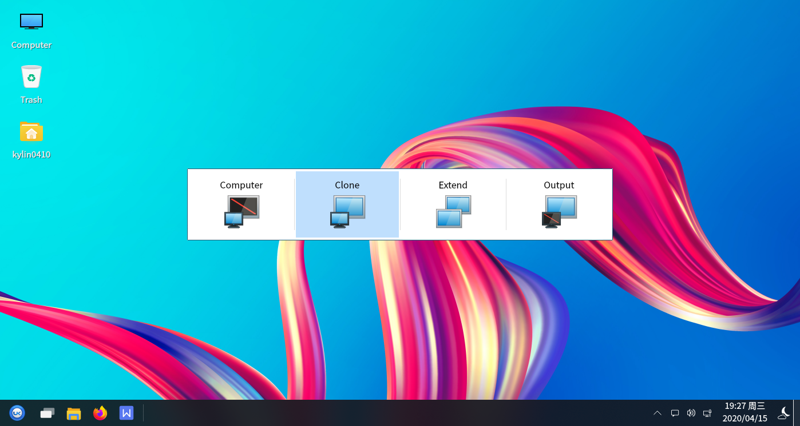

### Basic Functions
### Process
By clicking on "Processes", users can view information about the processes running on the current system.

The search box will show users the processes that match the keywords.

Click on the button in the lower right corner "", which corresponds to the "Active Processes", "My Processes" and " All Processes".

### Resources
By clicking "Resources" in the display area, users can dynamically view the resource information of the current system operation.

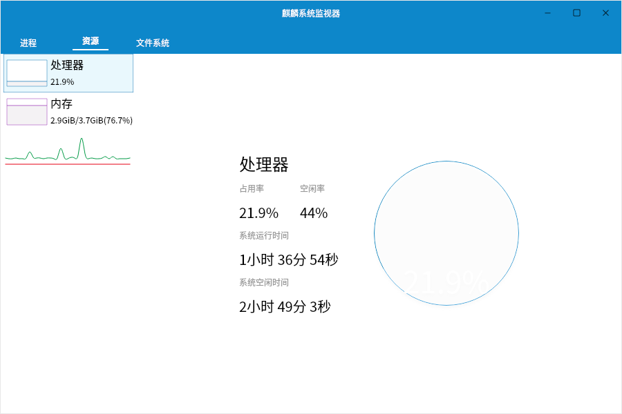

### File System
The File system information is shown in the following figure.

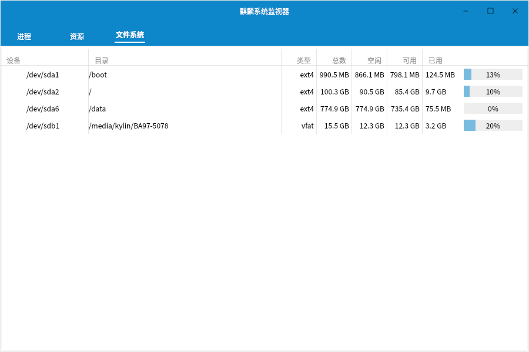

 

## Cheese Overview
Cheese is a system application software for taking photos and recording videos with the camera, which can add visual effects such as dizziness and bending.

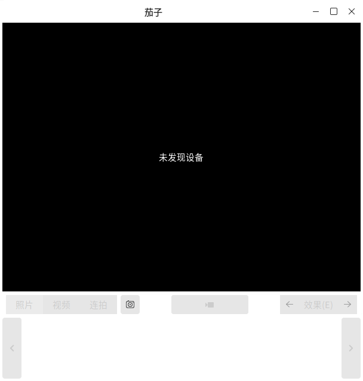

### Basic Functions
Icons and their functions are described:

|Icons	|Description|	Icons|	Description|
| :------------ | :------------ | :------------ | :------------ |
||	Photo, Video, Burst Mode Settings||		Camera

 

### Appendix
#### Shortcuts

|Options | Shortcuts| Actions
| :------------ | :------------ | :------------ |
| Full Screen (F) | F11| Putting the Cheese to Full Screen
|Exit (Q) | Ctrl+Q| Exit Cheese

 

## MATE Calculator Overview
MATE Calculator is a calculator tool software that provides four modes: basic, advanced, financial and programming.

### Basic Functions
### Attributes
Click "Calculator" > "Properties" to set the number format (automatic, fixed-point, scientific, engineering), angle unit (angle, radian, percent), word length (8, 16, 32, 64 digits), etc. as desired.

### Modalities
The Mode option sets the calculator to Basic, Advanced, Financial, and Programming modes.

- **Advanced mode**

Advanced mode allows for more complex calculations.

- **Financial mode**

The financial mode interface is shown in the figure below.

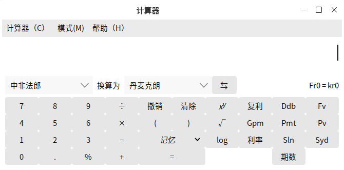

- **Programming mode**

The programming mode interface is shown in the following figure.

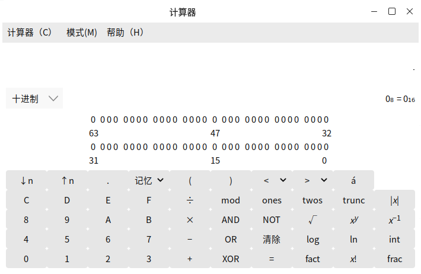

### Appendix
#### Shortcuts

|Options | Shortcuts | Actions
| :------------ | :------------ | :------------ |
|Copy (C) | Ctrl+C| Copy Calculations
|Paste (P) | Ctrl+V| Paste Current Copy
|Undo (U)| Ctrl+Z| Undo Current Calculation
|Redo (R) | Shift+Ctrl+Z| Recalculate
| Exit (Q) | Ctrl+Q | Exit MATE Calculator

 

## Screenshots Overview 
The screenshot tool can capture the entire screen, the current window, or select a region to capture, and can be set with time-lapse screenshots and related effects.

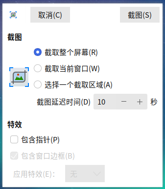

### Basic Functions
#### Capture the entire screen
Screenshot of the entire desktop, with a set delay (in seconds) before capture, effects: mouse cursor included.

#### Capture the current window
Take a screenshot of the currently opened window, and set the delay (in seconds) before capturing, effects: including mouse cursor, including window border.

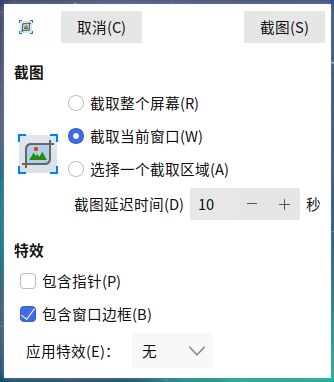

#### Select an area to cut.
Select part of the area to take a screenshot, no special effects can be set.

### Appendix
#### Shortcuts

|Options | Shortcuts|
| :------------ | :------------ |
| Capture the entire desktop | Prs |
| Ctrl + Prs | Capture the current window
| Shift + Prs | Shift + Prs

 

## Onboard Overview
Users can use the soft keyboard displayed on the screen to perform keyboard input functions. The main interface of the on-screen keyboard is shown in the following figure.

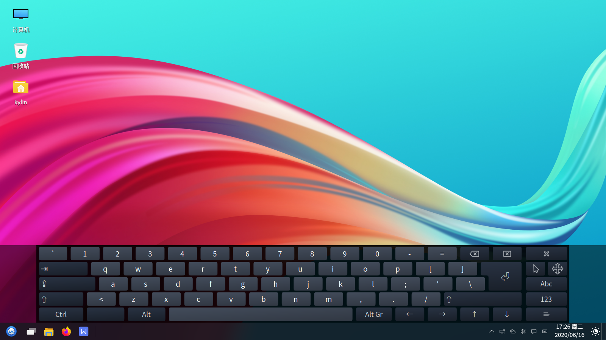

### Basic functions
Description of icons and their functions.

|Icons	|Description|	Icons|	Description
| :------------ | :------------ | :------------ |:------------ |
|| Capitalization On and Off|| Keyboard Capitalization and Common Symbols On (click) and Fixed (double click)
|| Display the drives and hardware connected to this computer (click to select Primary). (menu open, double-click to fix main menu) || Fixed Alt Key
|| Delete Action || Close Action
|| Enter || Hide the on-screen keyboard
|| Toggle Click Help menu || Move the on-screen keyboard
|| Master Keypad || Numeric Keypad and Snippets
|| Set fragments for quick input ||||

 

#### Toggle-click helper
Click on "" to toggle-click the helper.

Description of icons and their functions:

|Icons	|Description|	Icons|	Description
| :------------ | :------------ | :------------ |:------------ |
|| Middle-click || Right Click
|| Double-click || Drag & Click
||activate hover click||||

### Mobile on-screen keyboard
Users can move the onboard by clicking on "! ".

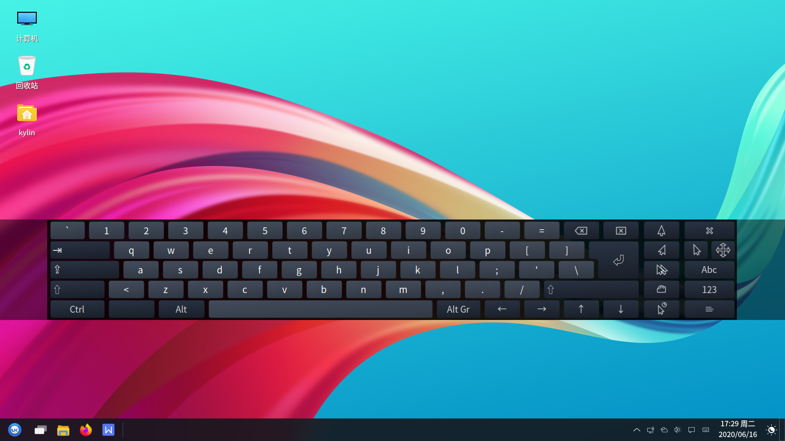

### Advanced functions
Click on "" > "! " for the onboard's general, window, layout, theme, etc. SETTING.

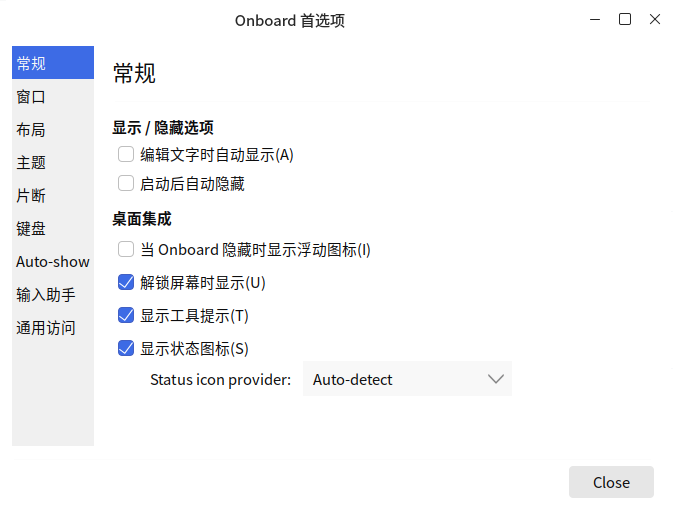

 

## Display Swhich Overview
Display Swhich is a port of Win keyboard shortcut, users can select presentation display mode by "Win + P".

Its main interface is shown in Fig. 1 and has four modes: computer, clone, extend, and output.

### Basic Function
The user can switch between four modes by holding down the "Win+P" on the keyboard.

#### Computer
The user can switch between four modes by holding down the "Win+P" on the keyboard.

**Application Scenario:**In the preparation phase of the meeting, what needs to be displayed in the computer needs to be taken out for a cursory examination, and when those who do not want to attend the meeting to see it, choose the computer only display, and all operations will only be displayed on the monitor, and the operations and contents of the computer will not be displayed on the projector.

#### Clone
If the user wants the computer and projector to be displayed at the same time, select Clone.

**Application Scenario:**The user needs the computer display to be synchronized with the projector display.

#### Extend
The extend mode identifies the computer monitor and projector screen as two monitors, allowing the user to have the computer and projector display different content when needed.

**Application Scenario:**Extend mode can be used when the user suddenly needs to use the computer to look up information during a meeting and does not want to interrupt the projector display, or when there is a temporary matter that needs to be handled urgently.

#### Output
The user wants to display only on the projector, select output.

**Application Scenario:**When the presenter leaves the computer, if someone accidentally touches the computer, the meeting may be interrupted. If the output mode is selected, the computer screen is completely blacked out, which is more power-saving than the copy and expand mode.

