# 小工具
## 系统监视器概述
系统监视器是一款可以查看进程、资源、文件系统的图形化系统应用工具，能动态地监视系统的使用情况，主界面由标题栏、菜单及监视显示区构成。

### 基本功能
#### 进 程
用户通过点击“进程”，即可查看当前系统所运行的进程信息。

搜索框可查询符合关键字的进程信息。

点击右下角的按钮“”，分别对应显示“活动的进程”、“我的进程”和“全部进程”。

#### 资 源
用户通过点击监视显示区的“资源”即可动态地查看当前系统运行时，所使用的资源信息。

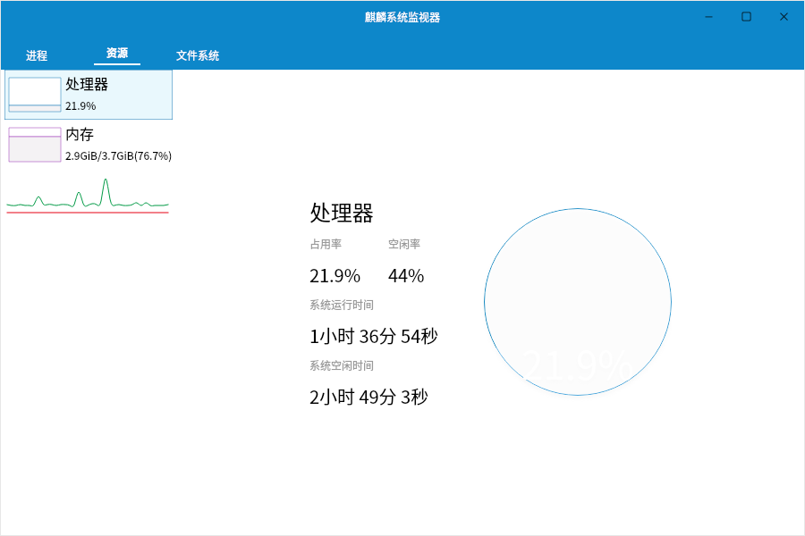

#### 文件系统
文件系统信息如下图所示。

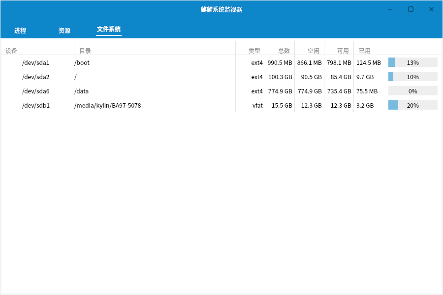

 

## 茄子摄像头概述
茄子摄像头是一款用摄像头拍照片和录制视频的系统应用软件，可添加眩晕、弯曲之类的视觉效果。

### 基本功能

图标及其功能介绍:

|图标	|图标功能说明|	图标|	图标功能说明
| :------------ | :------------ | :------------ | :------------ |
||	照片、视频、连拍模式设置||		摄像头

 

### 附 录
#### 快捷键

|选项	|快捷键|	操作内容
| :------------ | :------------ | :------------ |
|全屏（F）|F11|	将茄子摄像头投放到全屏
|退出（Q）|	Ctrl+Q|	退出茄子摄像头

 

## MATE计算器概述
MATE计算器是一款提供基本、高级、财务、编程四种模式的计算器工具软件。

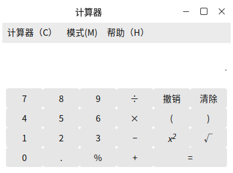

### 基本功能
#### 属 性
点击“计算器” > “属性”，可根据需求，对数字格式（自动、定点数、科学、工程）、角度单位（角度、弧度、百分度）、字长（8位、16位、32位、64位）等进行设置。

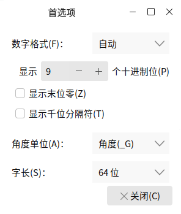

#### 模 式
模式选项可将计算器设置成基本模式、高级模式、财务模式以及编程模式。

- **高级模式**

高级模式可以进行更加复杂的计算。

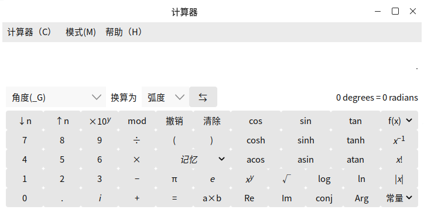

- **财务模式**

财务模式界面如下图所示。

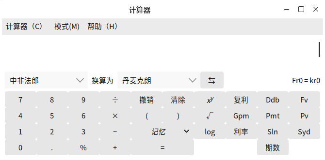

- **编程模式**

编程模式界面如下图所示。

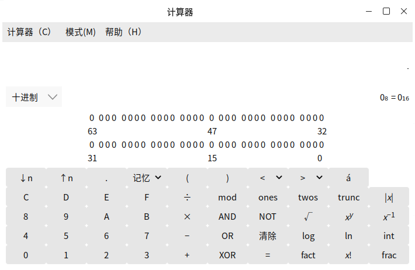

### 附 录
#### 快捷键

|选项	|快捷键	|操作内容
| :------------ | :------------ | :------------ |
|复制（C）|	Ctrl+C|	复制计算内容
|粘贴（P）|	Ctrl+V|	粘贴当前复制内容
|撤销（U）|	Ctrl+Z|	撤销当前计算
|重做（R）|	Shift+Ctrl+Z|	重新计算
|退出（Q）|	Ctrl+Q	|退出MATE计算器

 

## 截图概述
截图工具可以截取整个屏幕、当前窗口，或选择一个截取区域，能设置延时截图，及相关特效。

### 基本功能
#### 截取整个屏幕
对整个桌面截屏，可设置抓取前的延时（秒），特效：包含鼠标指针。

#### 截取当前窗口
对当前打开窗口进行窗口截图，可设置抓取前的延时（秒），特效：包含鼠标指针、包含窗口边框。

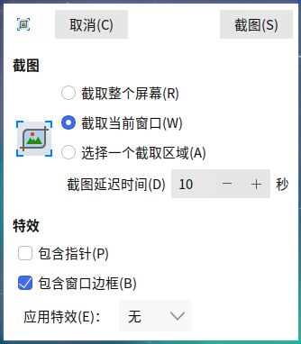

#### 选择一个截取区域
选取部分区域进行截图，不可设置特效。

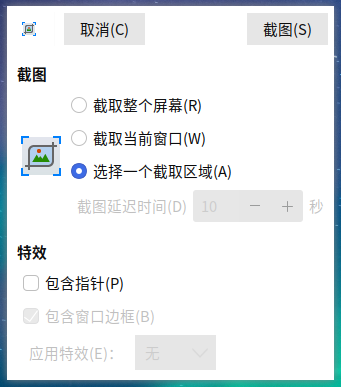

### 附 录
#### 快捷键

|选项	|快捷键|
| :------------ | :------------ |
| 抓取整个桌面 | PrintScreen |
| 抓取当前窗口 | Ctrl + PrintScreen |
| 选择一个截取区域 | Shift + PrintScreen |

 

## 屏幕键盘概述
屏幕键盘开启后，用户可以通过屏幕上显示的软键盘，实现键盘输入功能。屏幕键盘主界面如下图所示。

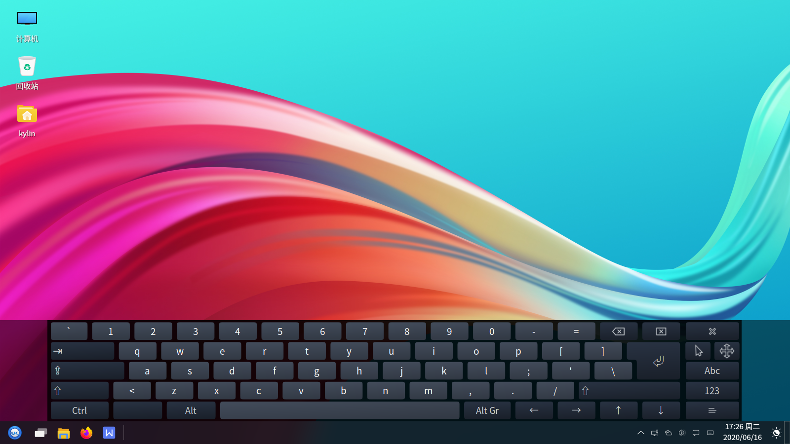

### 基本功能
图标及其功能介绍：

|图标	|图标功能说明	|图标	|图标功能说明
| :------------ | :------------ | :------------ |:------------ |
||	大写开启与关闭||键盘大写及常用符号开启（单击）与固定（双击）
||	显示连接到此计算机的驱动器和硬件（单击选择主菜单开启、双击固定主菜单）	||	固定Alt键
||	删除操作	||	关闭操作
||	回车	||	隐藏屏幕键盘
||	切换单击帮助程序	||	移动屏幕键盘
||	主键盘	||	数字键盘和片段
||	设置片段以便快捷输入||||

 

#### 切换单击帮助程序
点击“”图标，切换单击帮助程序。

图标及其功能介绍：

|图标|	图标功能说明| 	图标|	图标功能说明
| :------------ | :------------ | :------------ |:------------ |
||	中键单击	||	右击
||双击	||	拖拽点击
||激活悬停单击||||

#### 移动屏幕键盘
用户通过点击“”图标，移动屏幕键盘。

### 高级功能
点击“” > “”，可对屏幕键盘的常规、窗口、布局、主题等进行设置。

 

## 投影切换概述
投影切换是一款Windows徽标键键盘快捷方式的移植，用户通过“Windows徽标键+P”选择演示显示模式。

其主界面如下图所示，有四种模式：仅计算机、复制屏幕、扩展屏幕、仅投影仪显示。

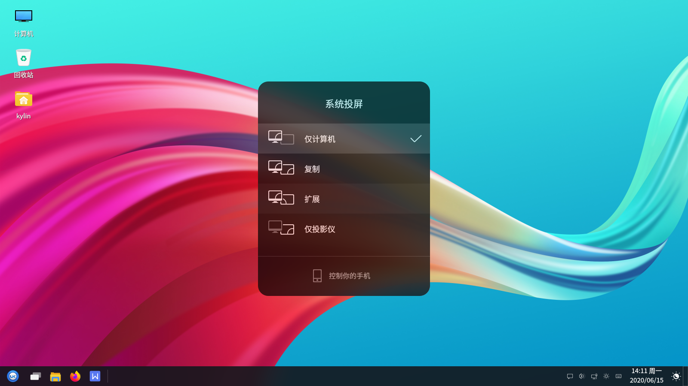

### 基本功能
用户通过按住键盘上的Win+P键可以进行四种模式的切换。

#### 仅计算机
用户若暂不需要投影，仅在计算机上显示，选择仅计算机。

**应用场景：**在会议的准备阶段，需要将电脑中需要显示的内容拿出来粗略检查，而不希望参加会议的人员看到时，选择仅计算机显示，一切操作将只会在电脑的电视屏上显示，投影仪上将不会显示电脑上的操作和内容。

#### 复制
用户若需要电脑与投影仪同时显示，选择复制。

**应用场景：**用户需要电脑显示屏与投影仪显示屏同步显示。

#### 扩展
扩展模式认定电脑显示器和投影仪屏幕为两个显示器，用户在需要的时候，可以让电脑和投影仪显示不同的内容。

**应用场景：**当用户在会议中突然需要使用电脑查资料，又不想中断投影仪显示的时候，或者有临时事情需要紧急处理的时候，便可使用扩展模式。

#### 仅投影仪
用户只想在投影仪上显示，选择仅投影仪。

**应用场景：**当主讲人离开电脑时，若有人不小心碰到了电脑，便可能导致会议中断，此时若选择仅投影仪模式，电脑屏幕处于完全黑屏的关闭状态，相对于复制和扩展模式会更省电；且投影仪上留下需要演讲的内容及相关操作。

