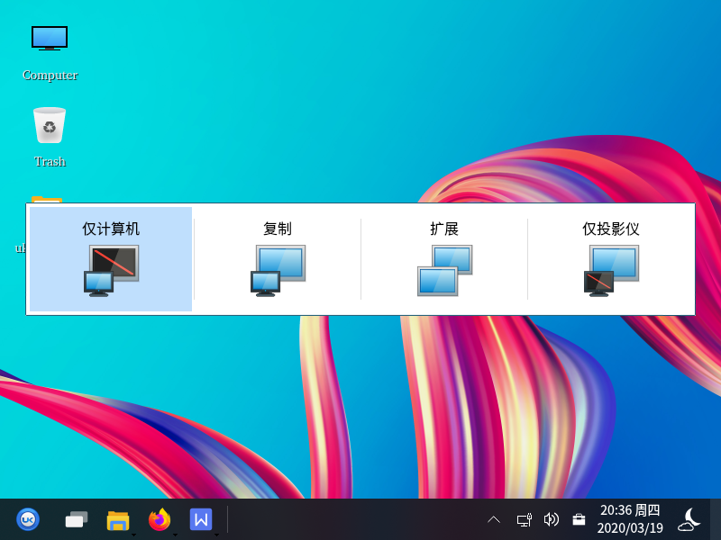

# 小工具
## 投影切换概述
投影切换是一款Windows徽标键键盘快捷方式的移植，用户通过“Windows徽标键+P”选择演示显示模式。
其主界面如图 1所示，有四种模式：仅计算机、复制屏幕、扩展屏幕、仅投影仪显示。

### 基本功能
用户通过按住键盘上的Win+P键可以进行四种模式的切换。
#### 仅计算机
用户若暂不需要投影，仅在计算机上显示，选择仅计算机。
应用场景：在会议的准备阶段，需要将电脑中需要显示的内容拿出来粗略检查，而不希望参加会议的人员看到时，选择仅计算机显示，一切操作将只会在电脑的电视屏上显示，投影仪上将不会显示电脑上的操作和内容。
#### 复制
用户若需要电脑与投影仪同时显示，选择复制。
应用场景：用户需要电脑显示屏与投影仪显示屏同步显示。
#### 扩展
扩展模式认定电脑显示器和投影仪屏幕为两个显示器，用户在需要的时候，可以让电脑和投影仪显示不同的内容。
应用场景：当用户在会议中突然需要使用电脑查资料，又不想中断投影仪显示的时候，或者有临时事情需要紧急处理的时候，便可使用扩展模式。
#### 仅投影仪
用户只想在投影仪上显示，选择仅投影仪。
应用场景：当主讲人离开电脑时，若有人不小心碰到了电脑，便可能导致会议中断，此时若选择仅投影仪模式，电脑屏幕处于完全黑屏的关闭状态，相对于复制和扩展模式会更省电；且投影仪上留下需要演讲的内容及相关操作。
