# Kylin Software Center 
## Overview
This manual includes the general structure of the Software Center, as well as detailed operating instructions for the individual functional modules.

Kylin Software Center is a graphical software management tool that helps users to manage software and edit software sources, with application search, safe download, online installation, one-click uninstallation, upgrade and other functional features.

Kylin Software Center provides users with a graphical interface to recommend commonly used and highly rated software, as well as software classification information and search, so that users can quickly find the software they need.

The Software Center provides software source display, delete and add features, and software source list display. The software display is also dynamically loaded according to the software source, the Win Sub interface shows the replacement of the user's commonly used software under windows, the download interface shows the user's download and installation progress information.

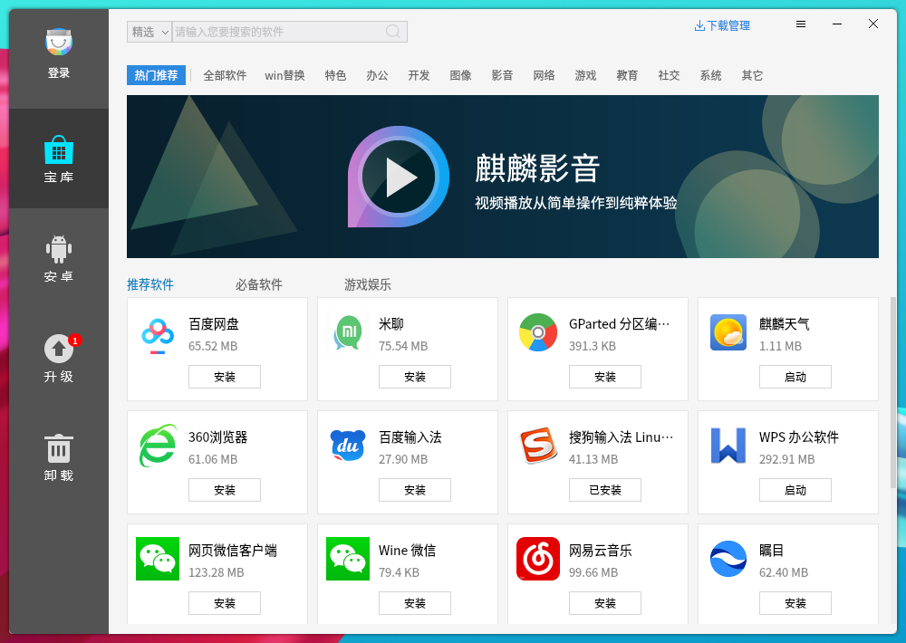

 

## Basic functions
### Main menu.
In the main interface, users can see the ad interface of the Software Center, search bar, software category bar, download management icon, recommended software.

#### Introduction.
1) Close the Software Center

Click the close icon in the top right "" to close the Software Center.

2) Minimizing the Software Center

Click on the "" minimize icon and the software store will minimize to the taskbar.

3) Search Application

The Software Center comes with a search function, select the search path in front of the search box, enter the keyword, press Enter or click on the magnifying glass icon in the search box to display the applications that contain the keyword.

4）Download, install/upgrade/uninstall/start application

Click on the application in the interface, the installation/upgrade/uninstall/boot buttons will appear according to the installation status of the application, or users can click on the software icon to enter the software details interface for other operations.

5) Search

Step1：Click the search box, select the search path.
A.global search: search all applications under the software source, the software found may have unavailable or other quality problems;
B.select search: search in the tested and filtered software, the default is select search
Step2：Enter the search content, users can find the software with usersr own keywords。
In Android, upgrade, uninstall interface search is under the current interface software search, other interfaces search keywords in all software, as shown in Fig. 2.

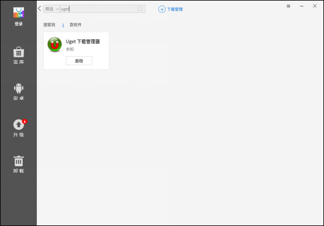

#### Treasure Trove
Click on the button on the left to enter the interface, the Software Center has classified the software, users can quickly find usersr own application in a certain category, as shown in Fig. 3.

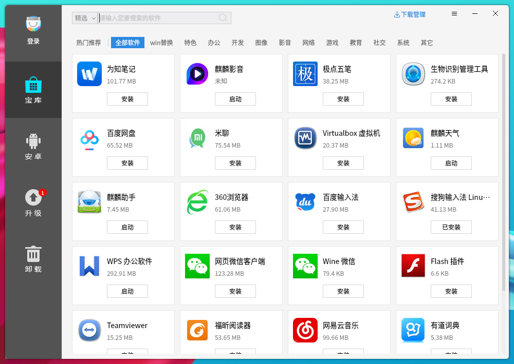

#### Upgrades
Click the upgrade button on the left to enter the upgrade interface, users can see which software can be upgraded, including the number of upgradeable software, as shown in Fig. 5.

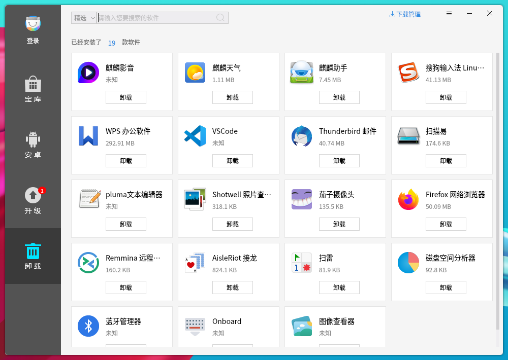

#### Unload
Click on the uninstall button on the left to see a list of software that the system has installed and can uninstall, and to show the number of installed software. As shown in Fig. 6.

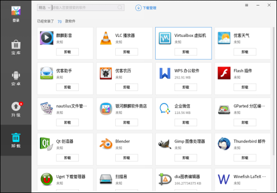

#### Win Sub
Click on the Treasure Win Sub button to see the recommended windows replacement software for users commonly used under Linux, as shown in the figure.

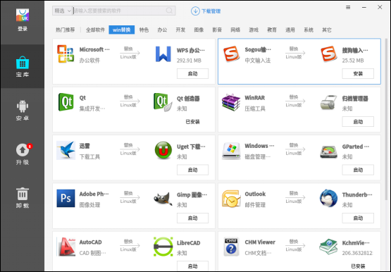

#### Download Management
Click the download management icon to see the download interface, as shown in Fig. 8.

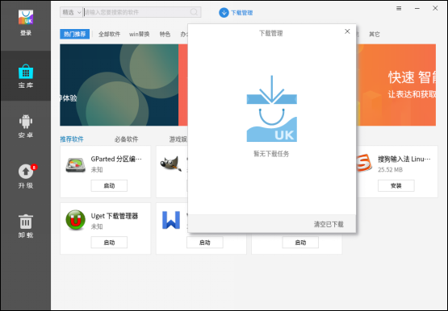

 

## Advanced features
### Setup interface
Click the Setup button to enter the setup interface, and users can edit the software source in the setup interface, as shown in Fig. 9.

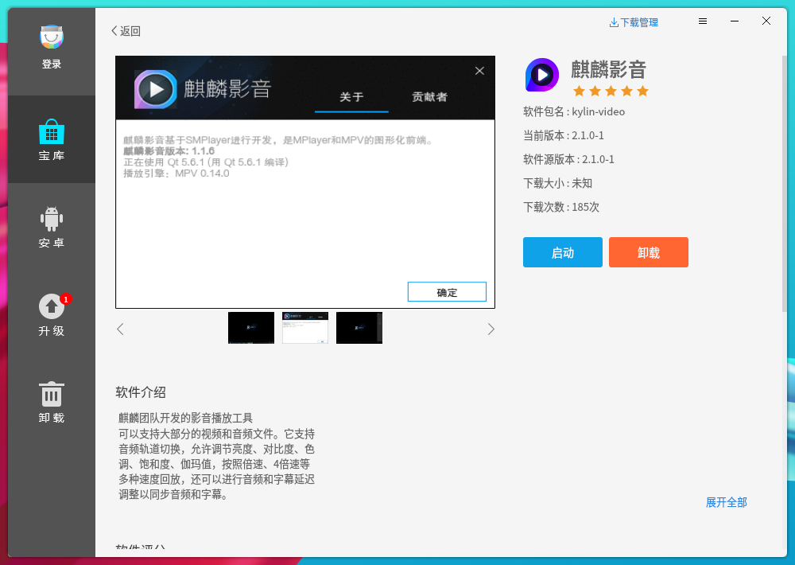

### Interfaces
Clicking on any of the software in any interface can enter the software details interface, as shown in Fig. 10.The software details interface displays the package name, current version, source version, software rating, download size, number of downloads, and software description, as well as multiple screenshots of the software, user ratings and comment sections, and all user comments.Click on the back and forth buttons of the picture to switch the picture.

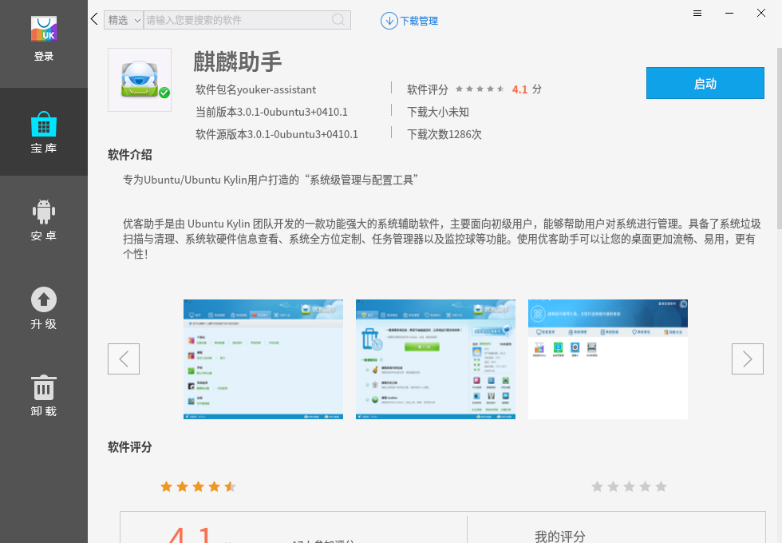

#### Comment interface
The user review interface is shown below, where users rate the software objectively according to their personal preferences.

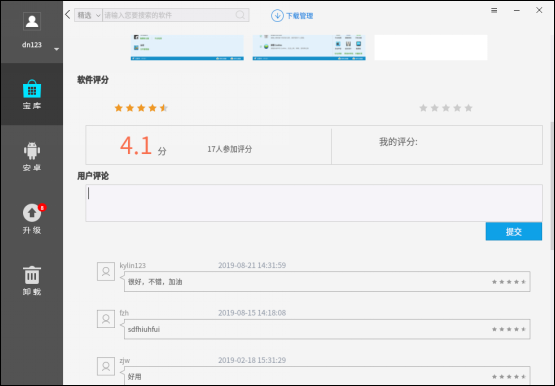

In the user review interface, it is also possible to rate the software and show all users' reviews of the software, review interface.

### Login interface
Software Center login module: 
(1)User can click the login button in the top left corner of the main interface, the login interface will pop up as shown in Fig. 13.;
(2)Users can choose the quick login or account registration for related operations, in the quick login interface, enter the corresponding registered user name and password;
(3)Users can also choose to remember the password and automatic login settings (automatic login function needs to be checked at the same time to remember the password to take effect);
(4)Users can click the upper right corner "" to close the login window.

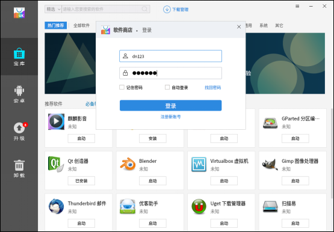

#### Registration interface
When registering an account in the account registration screen, fill in the user name, password and email address (if users are a developer, please check if users are a developer).

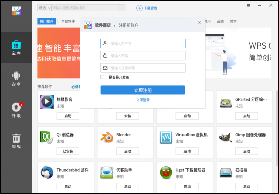

#### Change Password and Password Retrieval Interface
Click on the Change Password button in the settings or click on the Retrieve Password button in the login screen to go to the appropriate screen to retrieve or change usersr password as appropriate.

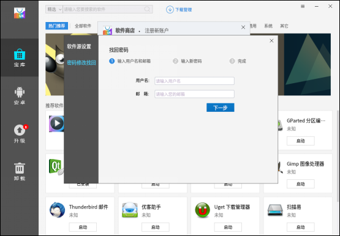
 

## FAQ
### Usage needs
Since the server IP is unknown before construction, so the client uses the domain name to access the server, there are two ways to resolve.

1) Do DNS resolution in the LAN routing, resolve the server IP to: service.ubuntukylin.com, all clients can access correctly.

2) Client machine in /etc/hosts to map the server IP to: service.ubuntukylin.com, the machine can access correctly.
