#  麒麟软件商店
## 概 述
本手册包括软件中心总体结构，以及个功能模块的详细操作说明。

麒麟软件商店是一款帮助用户管理软件和编辑软件源的图形化软件管理工具，具备应用搜索、安全下载、在线安装、一键卸载、升级等功能特性，通过软件详情、下载信息显示、软件评分、用户评论、软件分类和软件源编辑等功能，给用户提供轻松、友好、安全的软件管理体验。

软件商店通过图形界面，为用户推荐常用软件和高评分软件，同时可通过软件分类信息和搜索，方便用户快速查找到所需软件。

软件商店提供软件源显示、删除和增加功能以及软件源列表显示。软件的显示也是根据软件源来进行动态加载的，Win替换界面显示用户在windows下常用软件的替换，下载界面显示用户下载安装软件的进度信息。

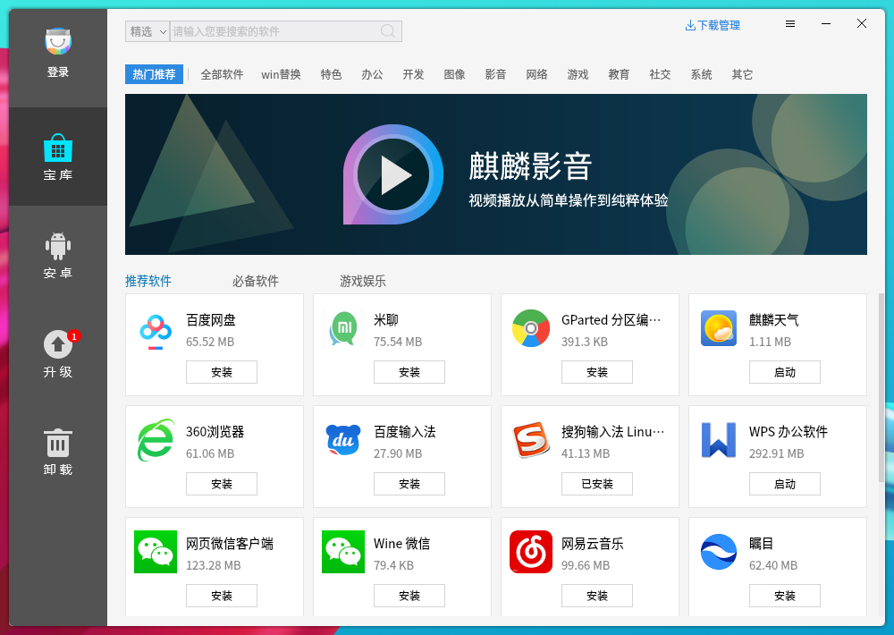

 

## 软件特色
麒麟软件商店同时提供麒麟安卓兼容软件的管理功能。麒麟安卓兼容环境Kydroid是麒麟团队专为“银河麒麟操作系统”打造的一款安卓兼容运行环境，用于解决用户的多样化应用需求。Kydroid 能够让用户在银河麒麟操作系统中安装和运行安卓系统的应用程序，比如安卓游戏、QQ、股票等。

麒麟安卓兼容环境具备以下特点：

- 原生性：使用完全原生模式实现，非虚拟机，非安卓模拟器。兼容环境直接使用硬件资源如显卡硬件加速等，效率极高；

- 高兼容性：支持绝大多数普通APP和部分大型游戏APP，如：QQ、微信、小游戏、网易云音乐、炒股软件、王者荣耀、天天爱消除等；

- 高融合性：与操作系统一体化，剪切板和消息通知互通，应用切换互通，任务栏互通，文件互通等，安卓App的各项使用体验与使用银河麒麟桌面应用无差别。

## 基本功能
### 主菜单
在主界面可以看到软件商店的广告界面、搜索栏、软件分类栏、下载管理图标、推荐软件。

#### 简 介
1）关闭软件商店

点击右上角“”关闭图标，关闭软件商店。

2）最小化软件商店

点击“”最小化图标，软件商店将最小到任务栏。

3）搜索应用

软件商店自带搜索功能，在搜索框前选择搜索路径，输入关键字，按下Enter键或点击搜索框的放大镜图标，显示包含关键字的应用。

4）下载安装/升级/卸载/启动应用

点击界面的应用，会根据应用安装情况出现安装/升级/卸载/启动等按钮进行操作，也可以点击软件图标进入软件详情界面进行其它操作。

5）搜索

点击搜索框，选择搜索路径（全局搜索：是在软件源下搜索全部应用软件，搜索到的软件可能会有不可用或者其他质量问题；精选搜索：是在测试筛选过的软件中进行搜索，默认为精选搜索），输入搜索内容，就可以找到带自己关键词的软件（在安卓、升级、卸载界面搜索是在当前界面软件下搜索，其他界面为在所有软件里面搜索关键词），如图2所示。

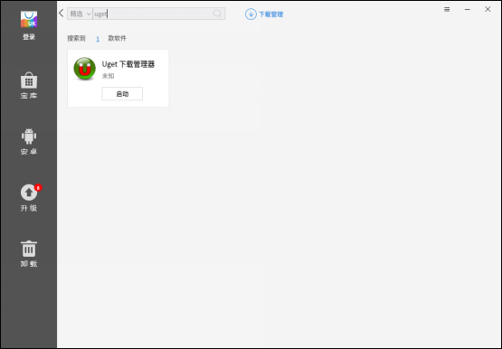

#### 宝 库
点击左边宝库按钮，进入宝库界面，软件商店对软件进行了分类，可以在某个分类快速找到自己的应用，如图3所示。

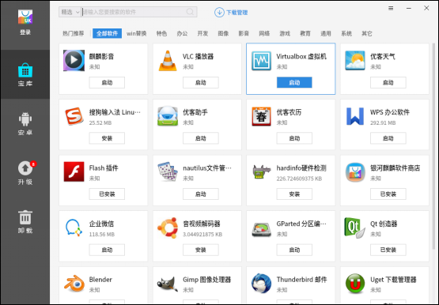

#### 安 卓
点击左侧安卓按钮，进入安卓软件界面，用户可在这里对安卓软件进行管理，包括安装、卸载、升级、启动、评分评论等，如下图4所示。

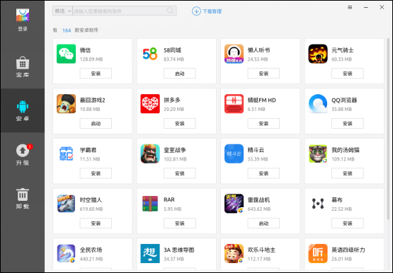

#### 升 级
点击左侧升级按钮，进入升级界面，可以看到有哪些软件可以升级，包括可升级软件数目，如图5所示。

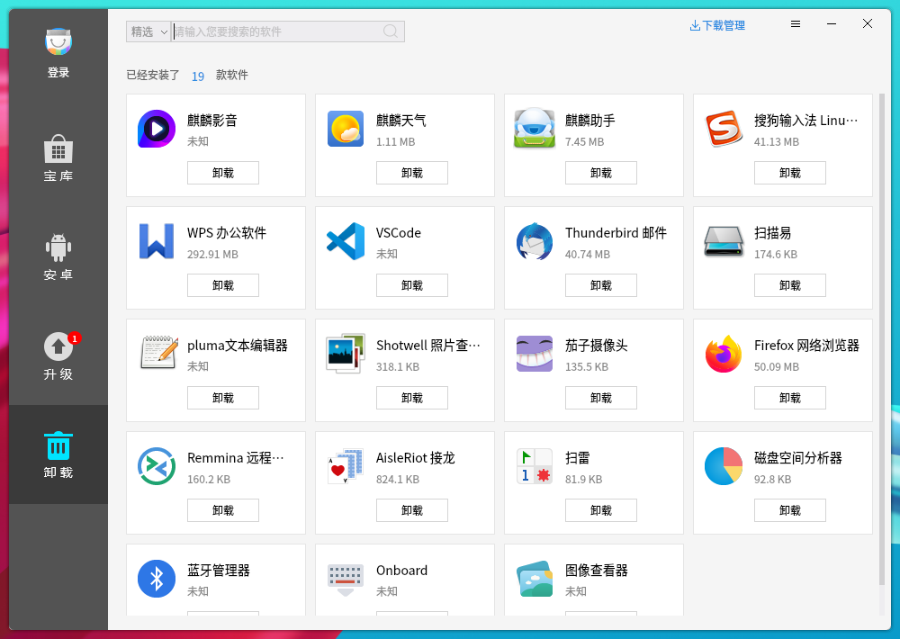

#### 卸 载
点击左侧卸载按钮，可以看到系统已经安装并能卸载的软件列表，并显示已安装软件数目。如图6所示。

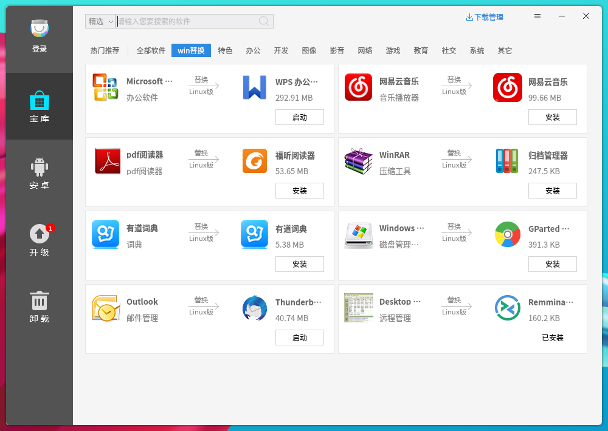

#### Win替换
点击宝库Win替换按钮，可以看到为用户推荐的在Linux下常用的windows替代软件，如图所示。

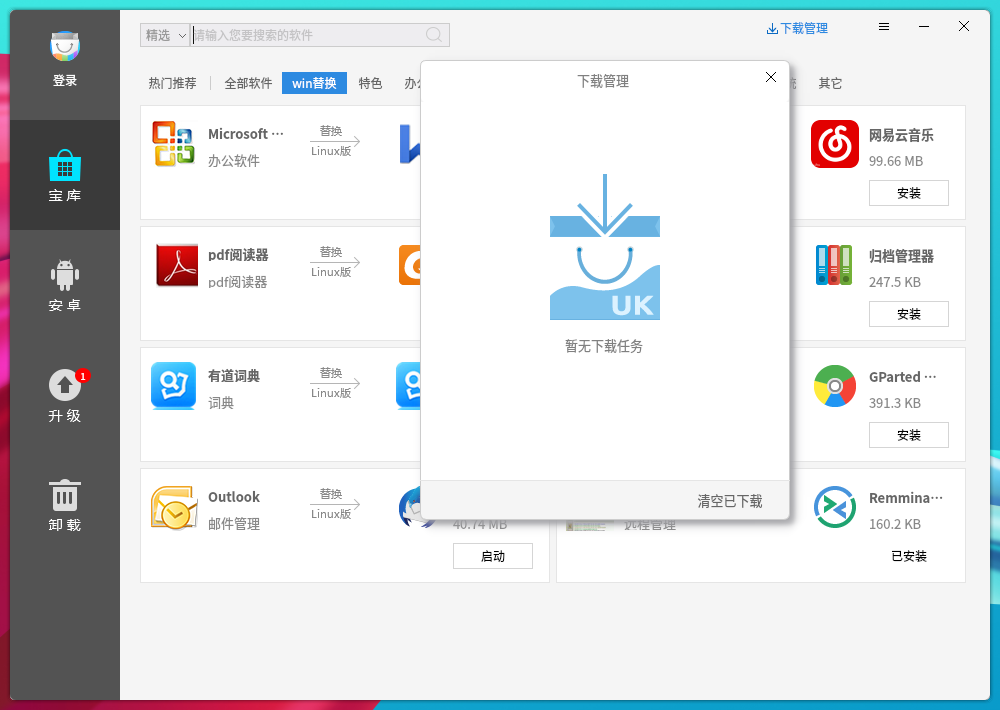

#### 下载管理
点击下载管理图标，可以看到下载界面，如图8所示。

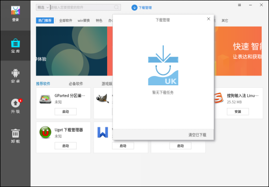

 

## 高级功能
### 设置界面
点击设置按钮，进入设置界面，在设置界面可以对软件源进行编辑，如图9所示。

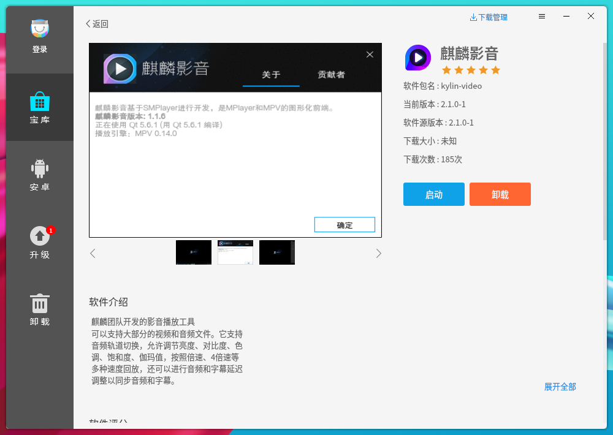

### 交互界面
点击任意界面的任一款软件可以进入软件详情界面，可以看到如图10所示，软件详情界面显示软件包名、当前版本、软件源版本、软件评分、下载大小、下载次数，以及软件介绍等，也包括多张软件截图显示、用户对软件评分和评论区以及所有用户评论显示。点击图片的前后按钮可以进行上一张下一张移动。

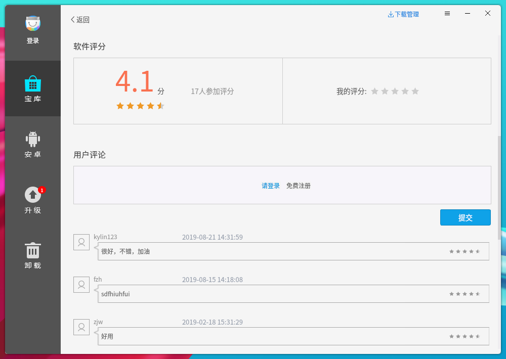

#### 翻译界面
在软件详情界面还可以对软件进行评分，满分为5颗星，软件评分较高的软件会排名靠前。可以对软件进行评论，并显示所有用户的评论。点击完善翻译，可以对软件进行翻译，提交翻译后经过管理员的评审，就能显示你修改的翻译了。

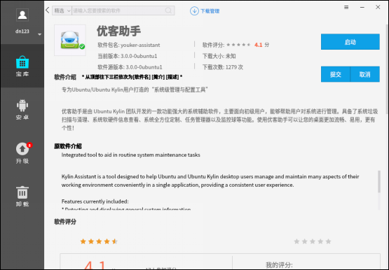

#### 评论界面
用户评论界面如下图所示，用户根据个人喜好客观的对软件进行评分。

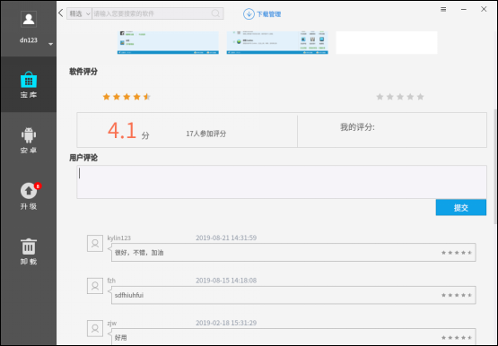

在用户评论界面，还可以对软件进行评价，并显示所有用户对软件的评价，评论界面。

### 登录界面
软件商店登录模块：点击主界面左上角登录按钮，便会弹出如下登录界面，用户可以选择快捷登录或账号注册进行相关操作，在快捷登录界面输入相应注册的用户名密码，还可以选择记住密码和自动登录设置（自动登录功能需要同时勾选记住密码才能生效），点击右上角号“”关闭登录窗口。

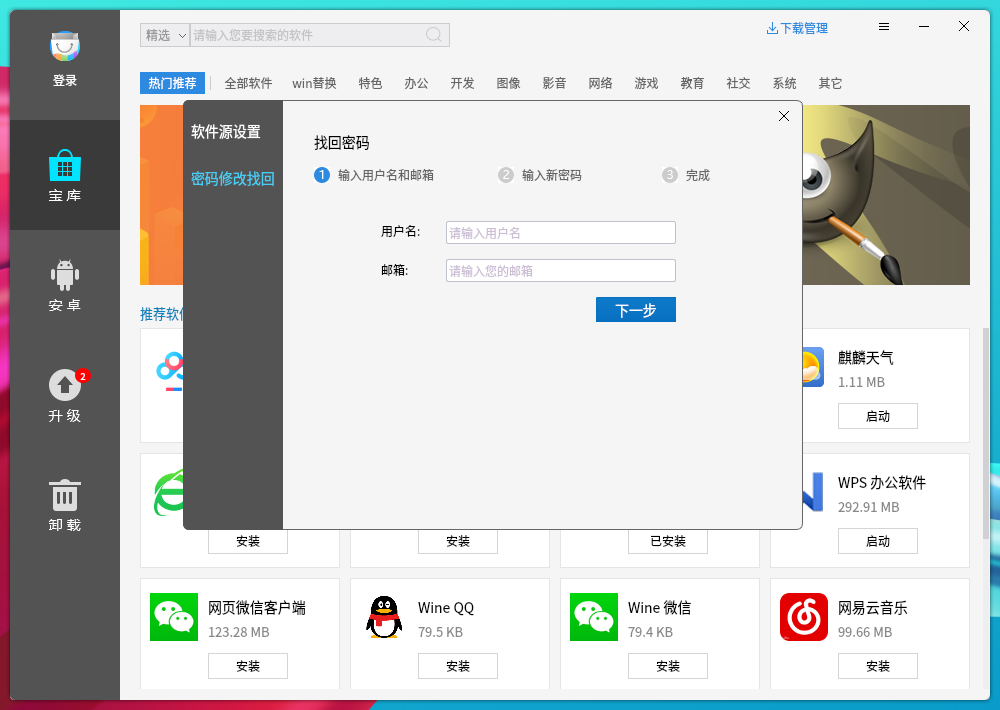

#### 注册界面
在账号注册界面注册账号时，填写用户名、密码和邮箱（如果是开发者，请在勾选是否为开发者）。

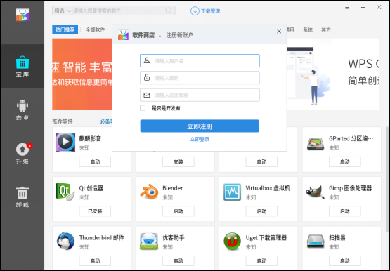

#### 修改密码与密码找回界面
点击设置中的密码修改找回按钮或点击登录界面的找回密码，跳转到相应界面，根据情况找回或者修改密码。

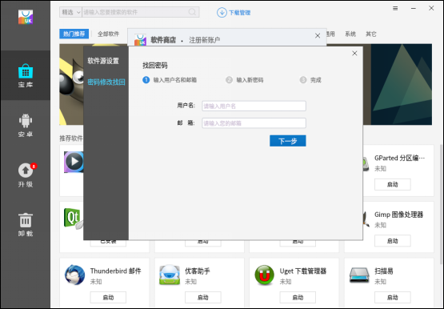
 

## 常见问题
### 使用需要事项
由于服务器IP搭建前是未知的，因此客户端采用域名形式访问服务器，有两种方法解析：

1）在局域网路由中做DNS解析，将服务器IP解析为：service.ubuntukylin.com，所有客户端即可正确访问。

2）客户端机器在 /etc/hosts 中将服务器IP映射为：service.ubuntukylin.com，该机器即可正确访问。
