# UKUI Control Center 
## Overview
The control center provides a user-friendly graphical user interface for managing common operating system configuration items. The control center boils down common configurations into two categories, system configuration and hardware configuration. The system configuration mainly contains the desktop environment and system level configuration items; the hardware configuration mainly contains the computer hardware and its related configuration items, the main interface is shown in Fig. 1.

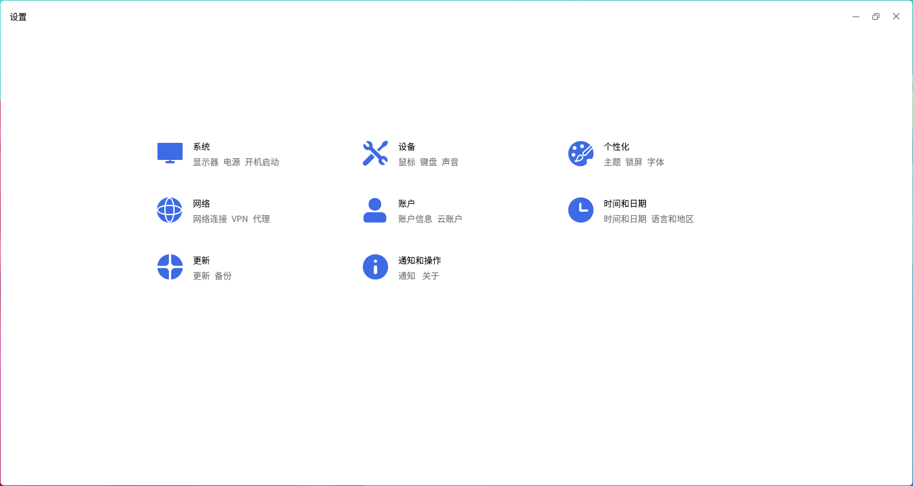

## System 
The system configuration settings provide four modules: monitor, default application, power, and power-on.
### Display
The display can be configured to display related settings, including modules such as display, screen zoom, screen brightness adjustment, etc., as shown in Fig. 2.

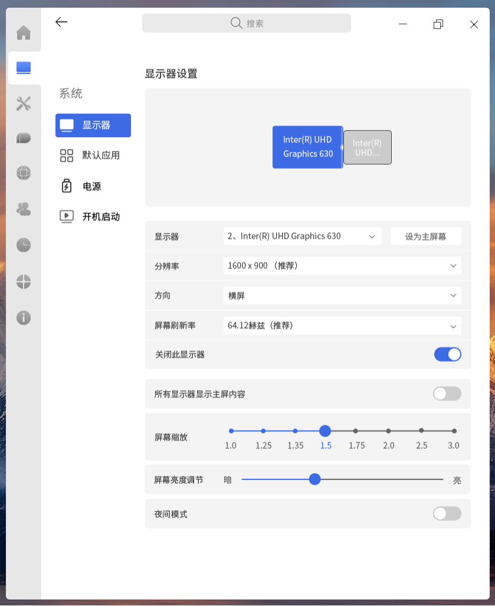

####  Monitor
The monitor settings can be selected for the current monitor, adjusting the screen resolution, orientation, screen refresh rate, etc., while the screen can be scaled and the brightness adjusted.
The upper colored rectangle represents the current screen, with the monitor name and interface name displayed in the middle.
The drop-down list on the right side of the monitor contains all the current monitors, and these are active. If users need to set the selected monitor as the main screen, then click "set as home screen" . And there is and only one home screen at the same time.
All configuration changes to resolution, refresh rate, etc. are for the currently active monitor.
Resolution: The drop-down list on the right contains a list of resolutions supported by the system and monitor.The resolution of the currently active monitor can be toggled by the drop-down list, and the change will take effect.
Orientation: The drop-down list on the right contains 4 options: arrow-up, 90°arrow-right,arrow-down,90°arrow-left, check to make the change real.
Refresh Rate:The drop-down list on the right contains the list of the current refresh rate supported by the monitor at the current resolution automatically and 59.9993Hz, checked to make the change real.
Turn off the monitor : This option is only effective when there are two or more monitors, and the opener on/off button is changed.
All monitors display the home screen image: this option needs to be changed only if there are multiple monitors and the change is true by turning on their on/off buttons.
#### Night mode
Turn on the night mode as shown in Fig. 3, the user can modify the time and set the monitor on drink off time to adjust the color temperature of the monitor.

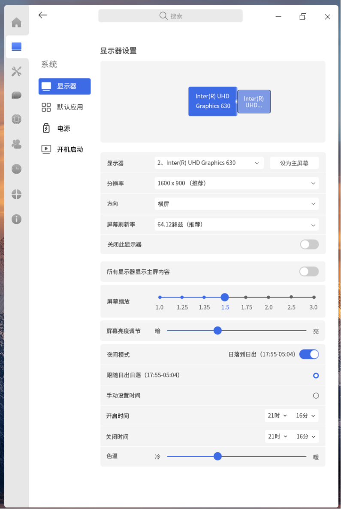

### Defaultapp
The default application provides configuration items for the system's default application, which can modify the default open application for six types of Browser, Mail, Image Viewer, Audio Player, Video Player, and Text Editor. The main interface is shown in Fig. 4.

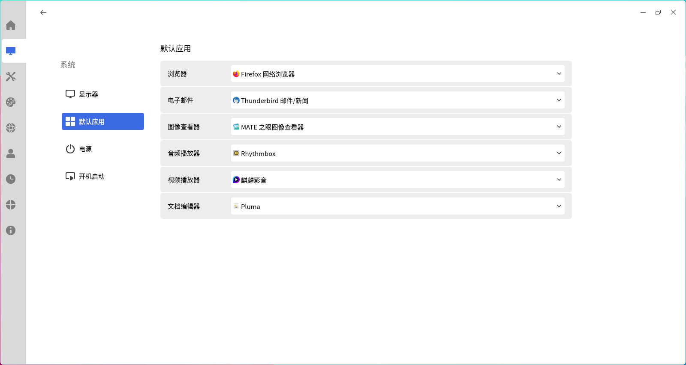

### Power
The Power management offers three power plans : Balance(suggest) mode, Saving Minimize performance mode, custom mode are provided for the user to choose. 
User-defined Power supply or Battery powered, and screen protection settings: 30 minutes for the computer to go to sleep, 30 minutes for the system to turn off the monitor.
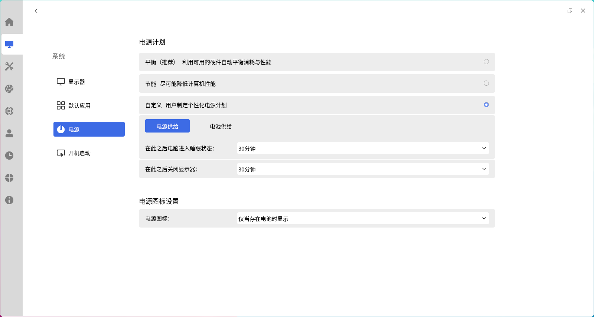

### Autoboot
Autoboot provides configuration management functions for the booting software, whose interface is shown in Fig.6.
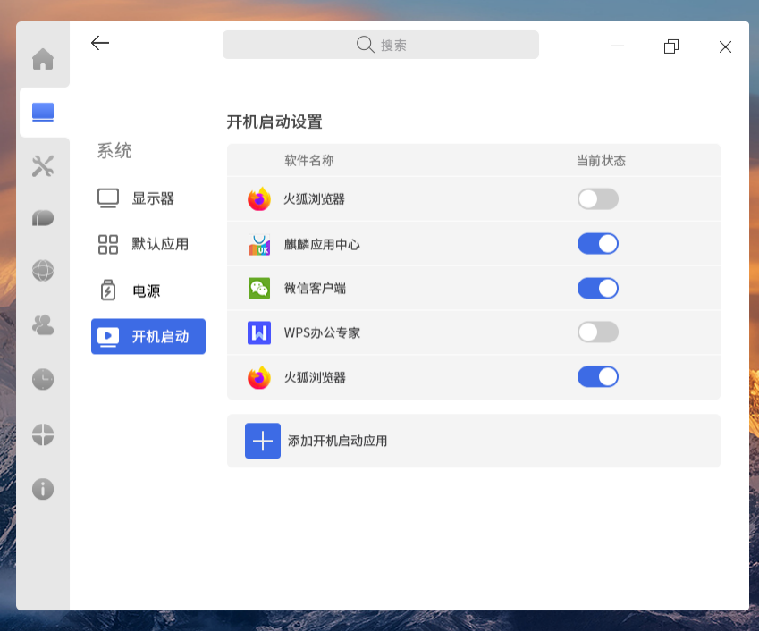

The list shows the boot software that already exists on the current system, the left side of the list is the software name; the right side of the list is the boot status of the corresponding software.
The switch button on the right side of the list represents the boot state of the software on the left side, open means the software starts with boot; otherwise it means the software does not start. Status can be switched by clicking the on/off button.
Click "+" to add the boot application button to bring up the add window, as shown in Fig. 7.

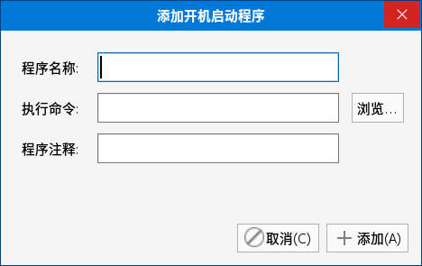

#### Add autoboot app
(1) Fill in the "Program name".
(2) fill in the "program exec", pay attention to ensure that the command is legal and valid or by clicking the "Open" button, in the pop-up file selection interface, select the file with the suffix "desktop" and the program will automatically parse and export the command data in the desktop file.
(4) Finally, by clicking the "Certain" button, a new start-up item is created and displayed in the list.
(5) The newly created startup item defaults to the boot-up state.

## Equipment
Device Setup provides seven setup modules for the printer, mouse, keyboard, shortcut keys, voice, Bluetooth, and touchpad, as shown in Fig. 8.

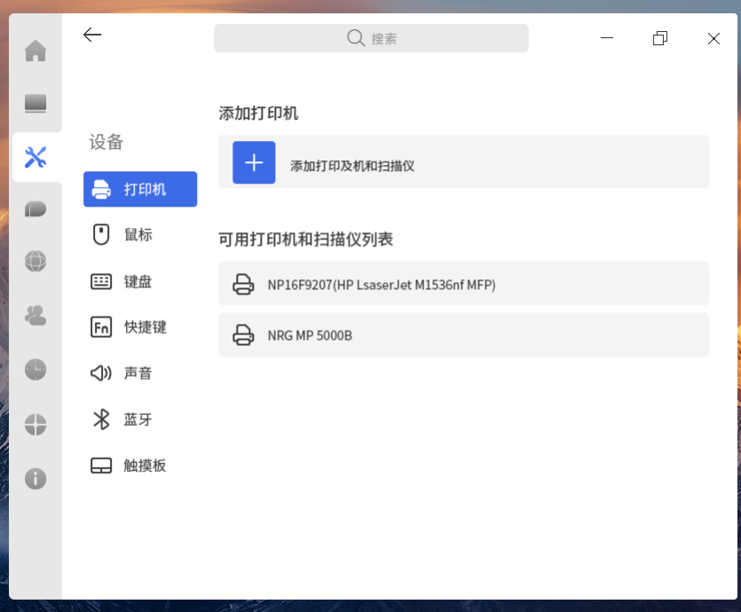

### Printer
Through The control center Devices > Printer, the user can add printers and scanners, and a list of available printers and scanners will be displayed below, as shown in Fig. 8.
### Mouse
The control center Devices > Mouse allows users to personalize the Mouse key settings, Pointer settings and cursor.

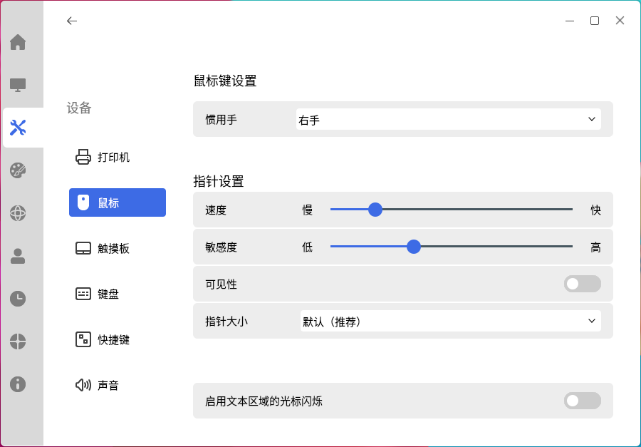

### Keyboard
The keyboard module in The control center device allows for general settings of the keyboard and the ability to adjust the keyboard layout  according to the keyboard language.

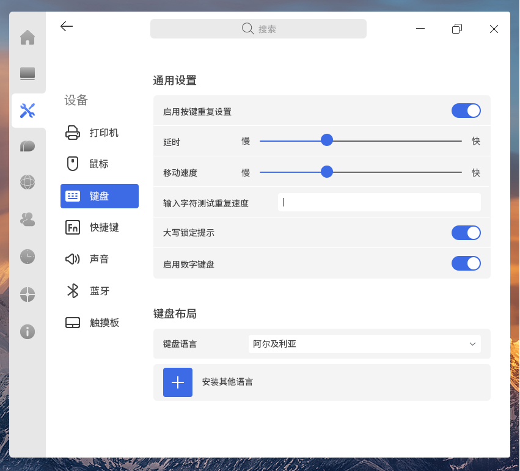

#### Keys settings
General Settings mainly sets the basic settings related to keyboard input, the interface is shown in Fig. 11.

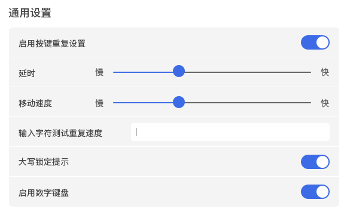

When you turn on the Enable Key Repeat setting and activate the Repeat Key function, the system will enter the behavior as a repeated uninterrupted keyboard input when a certain key is pressed and not released; when you turn it off, the system will enter the behavior as a keyboard input when a certain key is pressed and not released.
When the key repeat setting is enabled, the delay and speed options can be set.
Delay: The slider on the right side is used to set the interval between pressing a key and the system starting to receive keyboard input, near the "short" direction, the shorter the interval, the faster the system starts to receive keyboard input; and vice versa.
Speed: The slider on the right is used to set the interval between repetitive inputs after the button is pressed, near the "slow" direction, the longer the interval, the less the number of repetitive inputs in the same time; and vice versa.
Enter characters to test repetition speed: The text box below is used to test the effect of the settings. Left mouse click on the text box to get the input focus and press a button to see the effect in real time.

#### Keyboard Layout 
Set the keyboard layout of the current system, and the main interface is shown in Fig. 12.

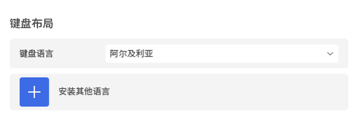

The keyboard language drop-down menu displays a list of installed keyboard layout, and up to 4 keyboard layout can be added.
Click "Install layouts" to add another language.
### Shortcut
Shortcut allow users to make changes to system shortcuts, and custom shortcuts can be added or removed. View all the shortcuts in the system via The control center Device > Shortcuts key, as shown in Fig. 13.

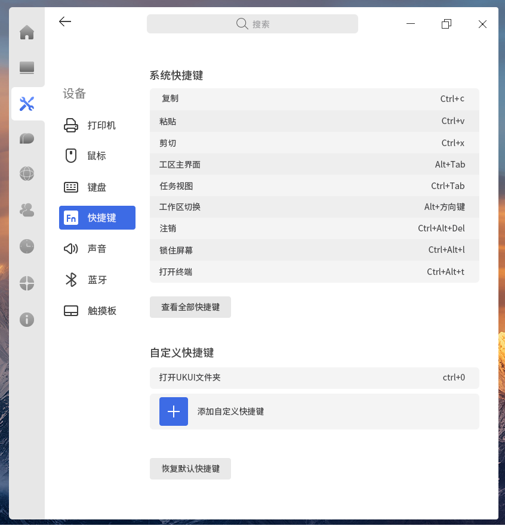

There are currently two categories of shortcuts: system shortcuts and custom shortcuts.
System Shortcut: Only hotkey key values can be modified.
Custom Shortcut: These are user shortcuts that can be added, deleted, or modified.
Click the "Add Custom Shortcut" button to bring up the Shortcut Add screen, as shown in Fig. 14.
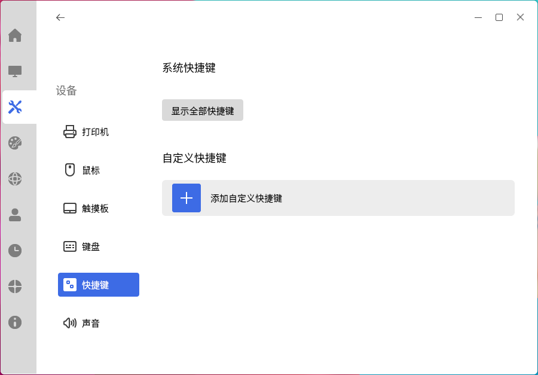

Fill in the shortcut name and shortcut exec, note that to ensure that the command is legal and valid, if it is occupied, it will be prompted at the bottom: this shortcut key has been occupied by "open terminal", please reset.
In this case, users need to reset it, and after clicking "Certain" if the shortcut is set legally, the shortcut will be added successfully and take effect immediately.
### Audio
Input, output, and system sound can be set via Control Center Devices > Sound, as shown in Fig. 15.

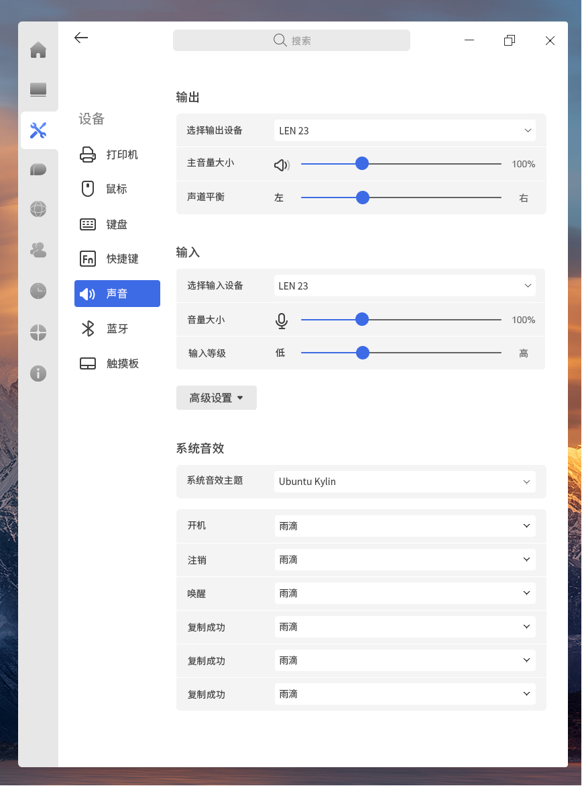

#### Output
The output provides the relevant configuration of the output device and the main interface is shown in Fig. 16.

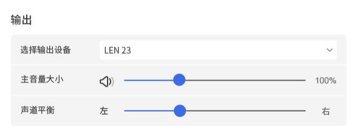

Select Output Device: The list below shows all available sound output devices for the current system, switch output devices by clicking the radio button.
Master Volume Size: Adjusts the master volume size of the output device.
Channel balance: users can set the channel for the selected output device, near "left" for the left channel and near "right" for the right channel.
#### Input
The input provides the relevant configuration of the input device and the main interface is shown in Fig. 17.

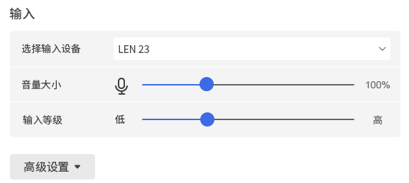

Select Input Device: The list below lists all the current input devices, select the input device by clicking the radio button.
Volume: users can configure the input volume size of the input settings.
Input level: users can configure the level of sound input device, near "low" direction is low level, near "high" direction is advanced.
#### System sound
System sound provides settings for system sound themes and personalized settings for the prompt tones for power on, log off, wake up, operation success, etc., as shown in Fig. 18.

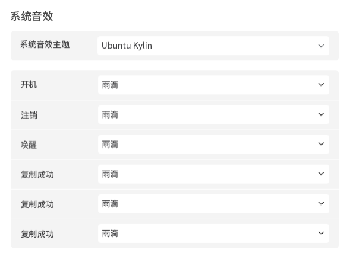

There is only one UbuntuKylin sound theme for the current system.
The initial sound effects provide four effects: bark, raindrops, glass, and sonar, which can be switched by clicking the corresponding option. 
### Bluetooth
The Bluetooth switch can be turned on via Control Center Devices > Bluetooth and a list of available Bluetooth devices will be displayed at the bottom.

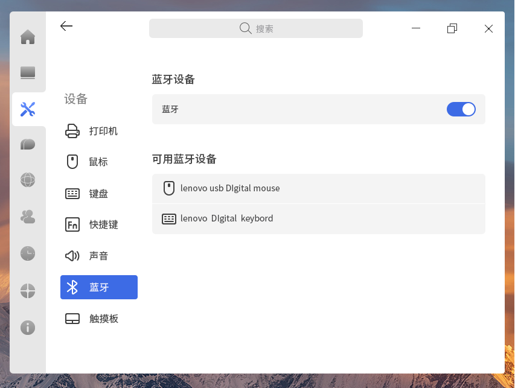

### Touchpad
Through The control center device > touchpad, the touchpad can be turned on and personalized according to the user's needs: Disable touchpad while typing, Enable the mouse clicks with touchpad, Scrolling(supports vertical boundary scrolling) , etc., as shown in Fig. 20.

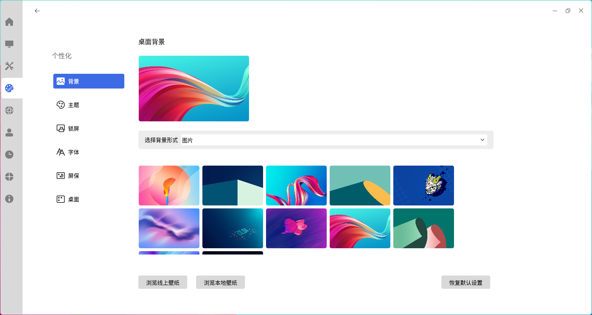

## Personalization
Personalization provides five modules for theme, background, screenlock, screensaver, and font settings.

### Theme
Theme include theme mode, icon theme, space theme, cursor theme, effect settings five panels.
#### Theme mode
The theme mode provides users with three themes to switch: system default, light color mode, dark color mode, according to user needs, check the corresponding theme mode, as shown in Fig. 22.

#### Icon Theme
Icon themes provide users with three themes to switch: default, classic, Graphic, according to user needs, check the corresponding icon theme, as shown in Fig. 23.

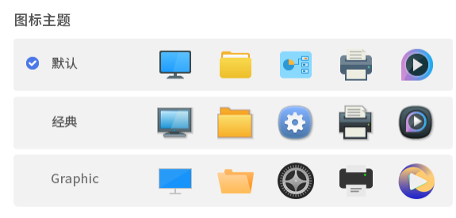

#### Space Theme
The space theme provides the user with a variety of colors, depending on the user's needs, just select the color of the space theme users want to set, as shown in Fig. 24.

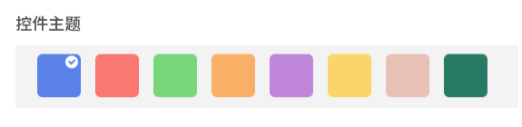

#### Cursor theme
The cursor theme provides two kinds of themes for users to choose: default and classic, according to the user's needs, select the cursor theme users want to set, as shown in Fig. 25.

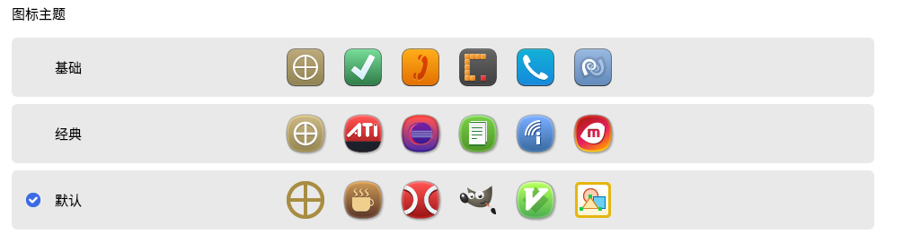

#### Effect Setting
As shown in Fig. 26, turn on the transparent effects switch, near "low" direction for low transparency, near "high" for high transparency.

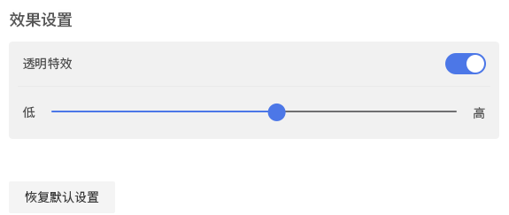

### Background
The background module targets desktop backgrounds and provides users with a choice of three background forms: solid color, image, and slideshow.
#### Solid color
Under Select Desktop Background > Select Background Form select: solid color. The color of the current desktop background will be distinguished by an obvious stroke, and after setting, users can adjust the three primary colors of the selected solid color background.

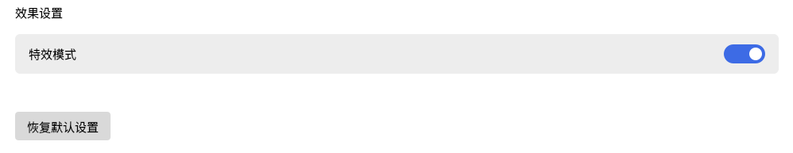

#### Picture
Under Select Desktop Background>Select Background Form select: image.

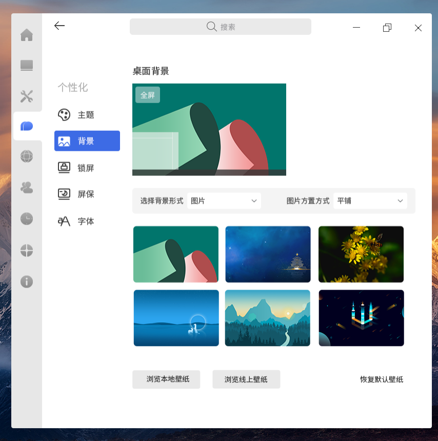

Browse the thumbnails in the background list, encounter the intention background directly click the thumbnail desktop background is set successfully, the current desktop background corresponding to the thumbnail will have an obvious stroke for differentiation.
Click on the drop-down list on the right side of the "image placement", there will be panning, zooming, centering, proportional enlargement, stretching, suitable for the width of the six image placement methods for configuration, select the placement method directly on the current desktop background effect.
Click "Browse Local Wallpaper" to bring up the file selection screen, as shown in Fig. 29

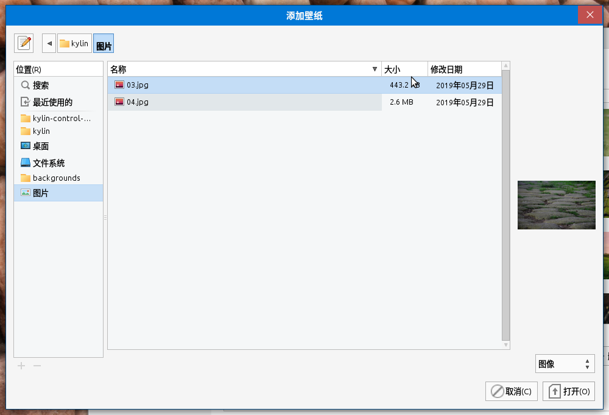

Use the left mouse button to select the desired wallpaper file, click the "Open" button, to add wallpaper will be selected as the current desktop background and added to the background list.
Clicking "Delete Wallpaper" will remove the current desktop background from the background list and the next wallpaper file will be set as a new desktop background.
#### Slides
Select Background Form:slideshow. Click on the drop-down list on the right side of the "image placement", there will be panning, zooming, centering, proportional enlargement, stretching, suitable for the width of the six image placement methods for configuration, select the placement method directly on the current desktop background effect.
Click "Picture Switching Frequency" to set the time interval for desktop background slideshows to be changed, and users can turn on the disorder switch to randomly play the pictures in the slideshow album.
Click the "Default Wallpapers" folder below, that is, every 30 minutes, users can switch a picture in the default wallpaper in the order of the picture, users can also customize the slideshow album, the desktop background slideshow switch.

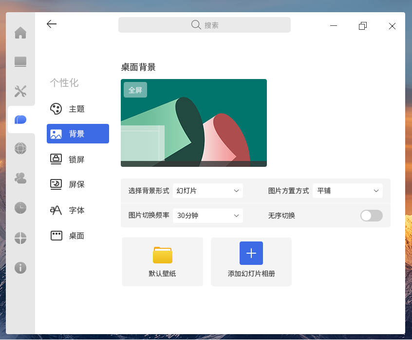

### Lock screen
The lock screen module for the lock screen interface provides users with two ways to switch between lock screen background custom background images: by browsing local images and browsing more online wallpapers.
Users can set the time required for the computer to turn on the lock screen by selecting the button that displays the lock screen background image on the login screen.

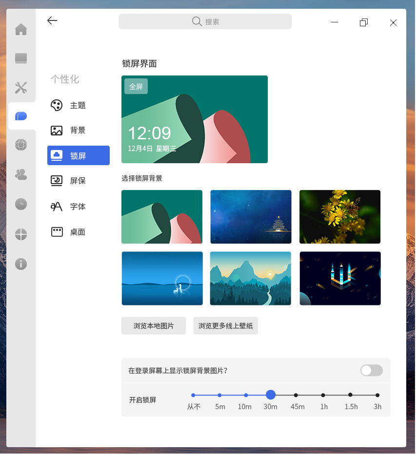

### screensaver
Screensaver module to be added.
### Font
The Font module provides configuration items for system fonts and font sizes, and the main interface is shown in Fig. 32. The user can set the font and its size and width according to the requirements, provide the corresponding font settings in the advanced settings, and preview the font below.
Click the "Reset to default" button to restore all font settings to the system default state.

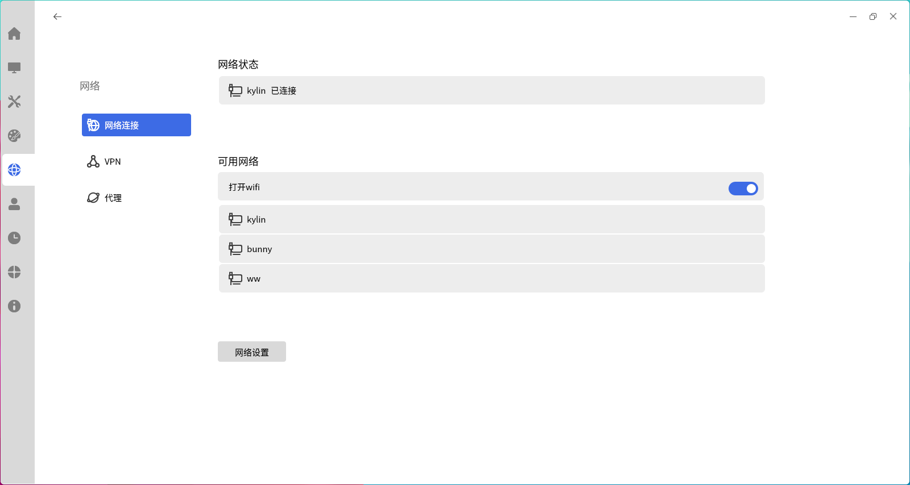

## Network
Network proxy is mainly to configure. network proxy related settings, divided into Netconnect, VPN, Proxy three modules, as shown in Fig. 33.

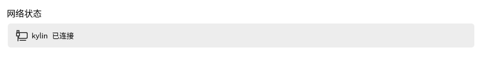

###  Netconnect
#### Netconnect status
The user can view the current network connection status through the network status panel in the network connection module, as shown in Fig. 34.

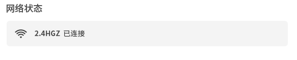

#### Available Networks
The currently available networks can be viewed within the list of available networks, as shown in Fig. 35.

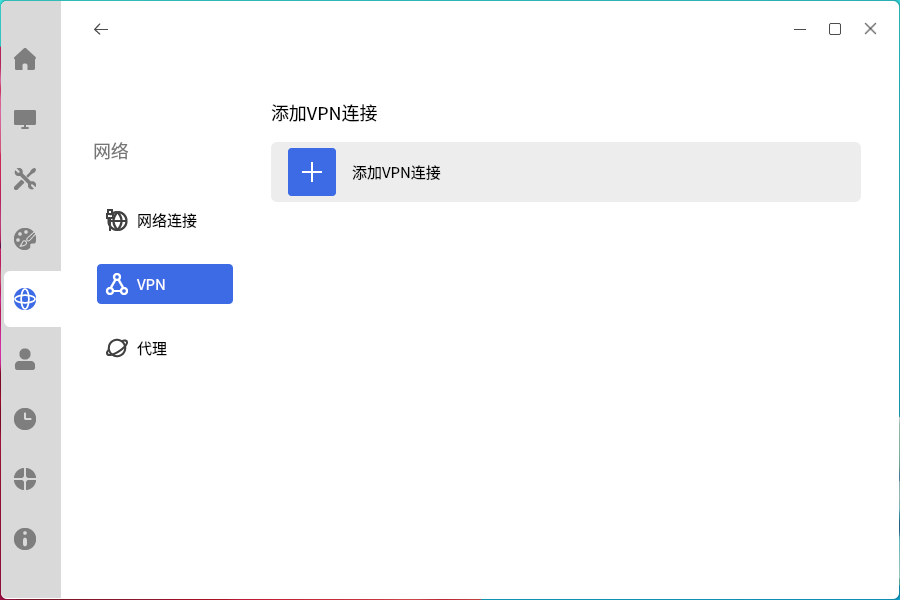

### VPN
In the VPN module, users can add a VPN connection by clicking "Add VPN Connect", editing the name, selecting the type, setting the server address, etc. The interface is shown in Fig. 36.

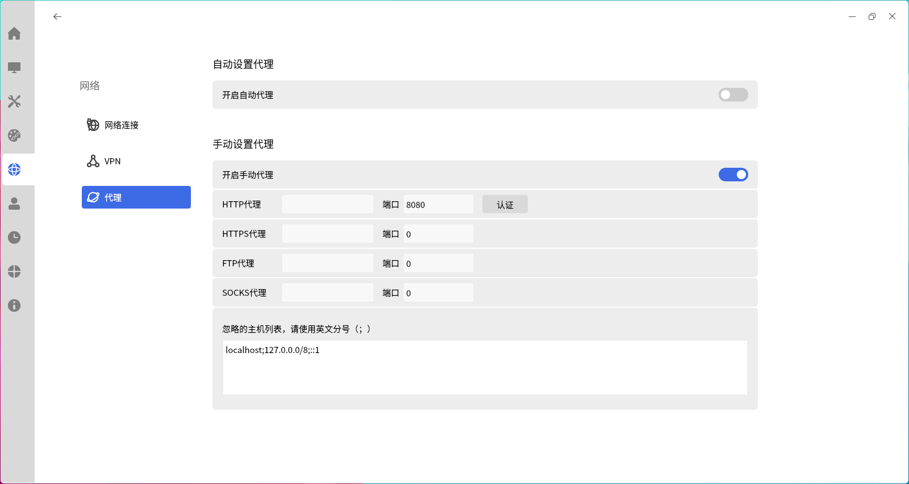

###  Proxy
The proxy module is usually divided into two modes that can be connected to the Internet automatically (i.e., auto proxy) and manual proxy, and only one of the two modes can exist at the same time, the network proxy setup interface is shown in Fig. 37.

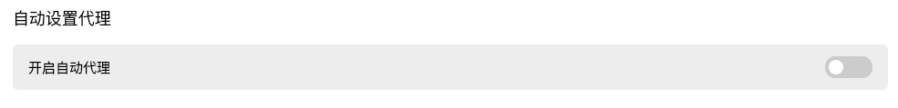

#### Auto Proxy
Select Auto Settings i.e. the current system does not set the proxy, directly access the Internet, click the switch button of Auto Settings proxy, as shown in Fig. 38.

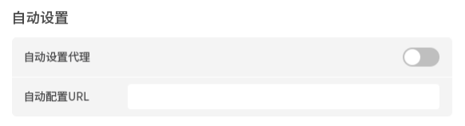

#### Manual Proxy
When there is a clear proxy agreement, such as Http proxy, Https proxy, Ftp proxy, Socks proxy, users can choose to configure. the proxy manually, the proxy server IP address and port number into the corresponding text box. In addition, the Http proxy can configure. proxy authentication here, thus eliminating the authentication window that pops up when accessing the network. Click the "Cetification" button to bring up the authentication interface, as shown in Fig. 39.

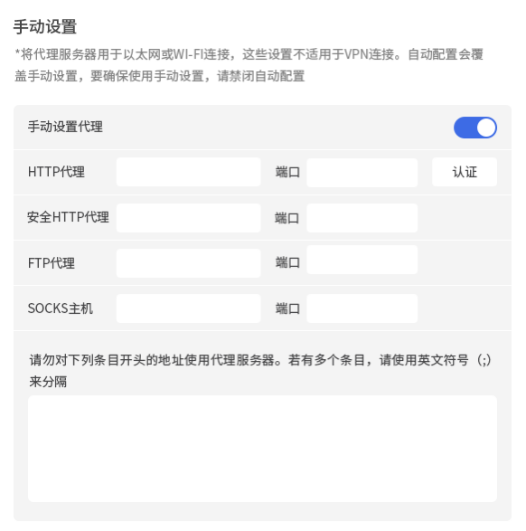

## Account
The account provides administrative configuration of system users, allowing administrators to create users, delete users, and modify user information, and the main interface is shown in Fig. 40.

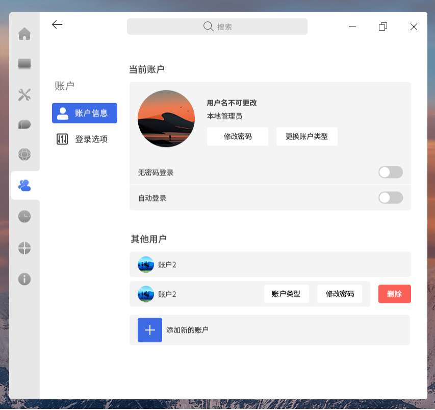

### Current User
#### Modify user avatar
Click on the user avatar to modify the user avatar, the picture can be selected from the local picture, the interface is shown in Fig. 41.

#### Change password
Users can change the password of their current account by clicking "Change pwd".

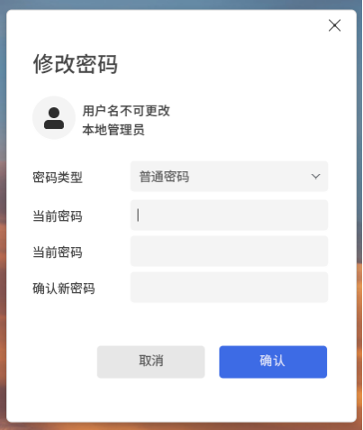

#### Change type
There are two types of system users, standard users and administrators. The difference is that administrators can temporarily enhance root privileges by entering their own password; standard users cannot enhance their privileges. Users can switch from regular user to administrator by clicking on "Change type".
Click the left mouse button to select the radio button, then click the Confirm button to update the user type of the current user. Note that the system needs to have at least one administrator user, so the last remaining administrator user cannot modify the user type to a standard user. And a standard user switching to an administrator needs to know the password of any system administrator to be allowed to switch.
The current user cannot delete himself/herself.

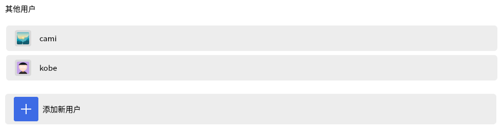

### Other users
In the Other Users section, users can edit other users' avatars and account types to match the current account settings, and add/delete operations to other users, as shown in Fig. 44.
Other users' account avatars show the default system avatar, click the account avatar area to bring up the system avatar list, click the avatar file in the list or click "Select face from local" in the pop-up list to select a custom avatar file, and the avatar in the avatar setting area is updated to the latest avatar.

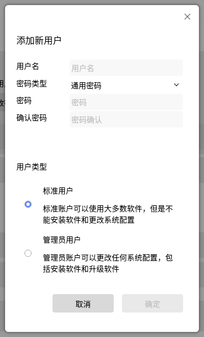

#### Add new user
Click "Add new user" to define the Username, Password, Account type, etc. as shown in Fig. 45.
Enter the new account name, select the password type, enter the password, confirm the password, click the user type radio button below to determine the type of the new user, click the "Confirm" button, the new user is created.

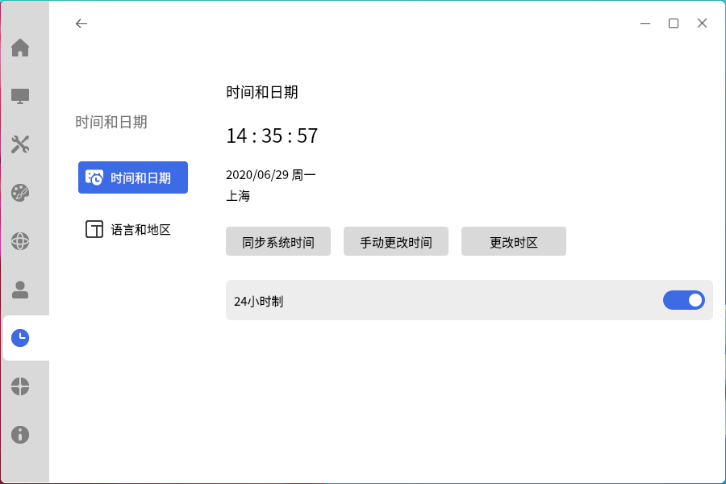

## Datetime 
Datetime settings provide two modules, date time and Area, as shown in Fig. 46.

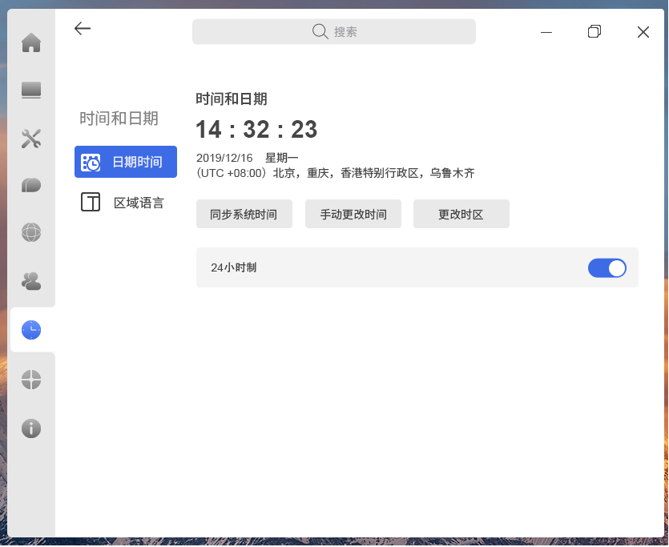

### Datetime 
In the Datetime, users can synchronize the system time, change the time manually, and change the time zone, set to 24-hour system or 12-hour system, as shown in Fig. 47.

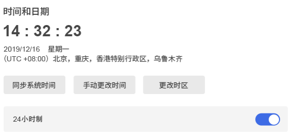

The current state of time and date synchronization is of two kinds, one is synchronized with network time, that is, synchronized with the NTP server time on the Internet, and the other is synchronized with the local computer's clock chip time.

#### Sync system time
After selecting "Sync System Time", the computer's time is synchronized with the network NTP server's time, in this state, it is no longer allowed to modify the time or date; after canceling "Syn System Time", the computer's time is synchronized with the local computer's clock chip, in this state, you can modify the time or date.

#### Change time
Click "Change time" to set the time(hours, minutes, seconds),year, month and day, as shown in Fig. 48.

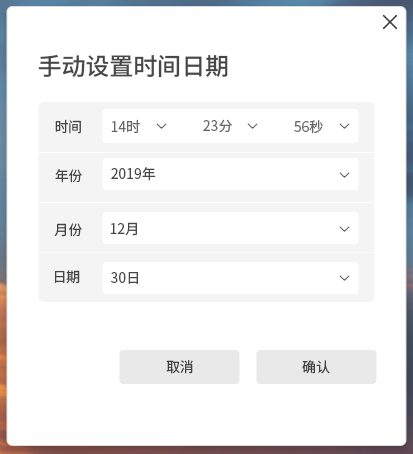

#### Change the time zone
Click on the drop-down list to the right of "Change Time Zone" to display a list of all time zones, the default for China is "(UTC +8:00) Beijing, Chongqing, Hong Kong SAR, Urumqi".

#### Time format
The time format is divided into 12 and 24 hours and is immediately effective by clicking the corresponding switch button on the right.

### Area
####  Current area
The current region can be set in the Area module with the default region being China, as shown in Fig. 49.

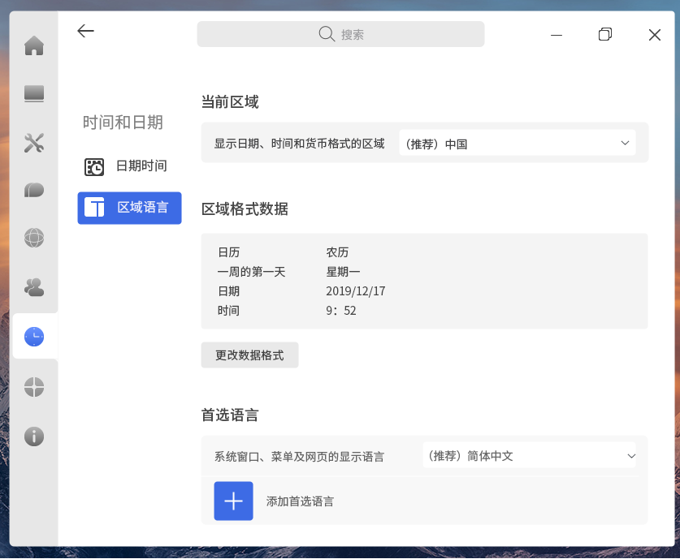

####  Format of area
Click "Change format of data", the pop-up window is shown in Fig.50, you can customize the calendar, first day of the week, date, time.

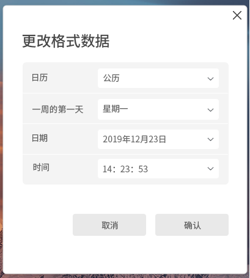

####  First language
The preferred recommended language for displaying system windows, menus and web pages is Simplified Chinese.
Users can add other area languages as an alternative to the system language by clicking "Add main language".

## Updates and backups
The Update and Backup settings provide two modules, Update and Backup, as shown in Fig. 51.

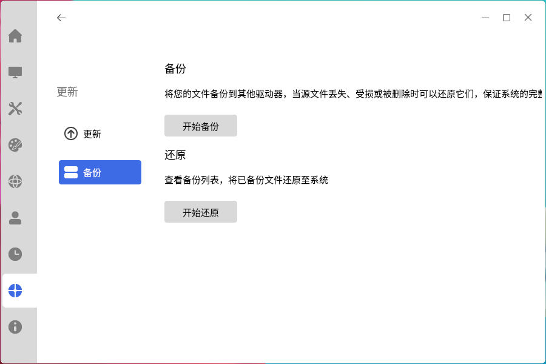

### Updated
View the latest system via system update detection, as shown in Fig. 51. Under update settings, users can set system update reminders, auto invite mutual package cache, auto download updates, smart image source, etc., as shown in Fig. 52.

### Backup 
Backup provides two panels for backup and recovery, as shown in Fig. 53, select "Begin Backup" to backup files to other drives, select "Start Restore" to view the list of backups and select the restore point where the system needs to be restored for recovery.

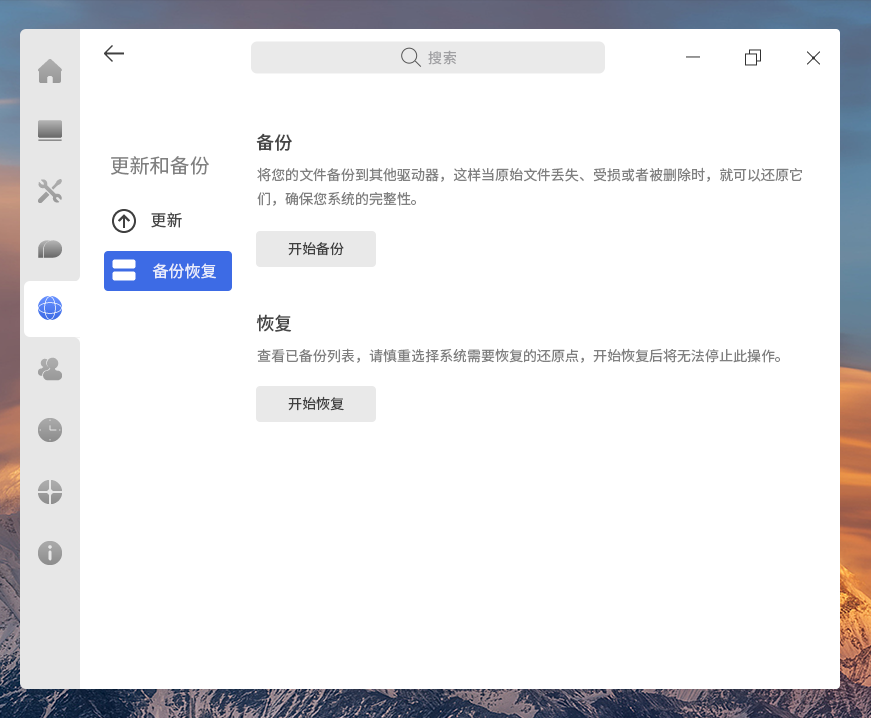

## Notifications and missions
Notifications and Tasks provides four modules: Notice, Multitasking, About Native OS, Experience Plan.
### Notice
Notice include two panels, Notification, Set Notification Source, as shown in Fig. 54.
#### Notification
Set to display notification messages in the Operations Center after the system version update, get notifications from applications and other senders, and display notifications on the lock screen interface.

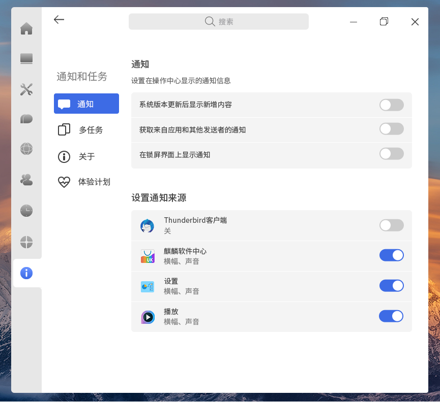

#### Set Notification Source
Take Kylin Software Center as an example, open the switch button to set Kylin Software Center as the notification source, the pop-up window as shown in Fig. 55, settings: allow notification, play the sound when the notification arrives, set the number of notifications seen in the notification center, select the notification type (displayed in the bottom right corner of the screen, displayed in the operation center).

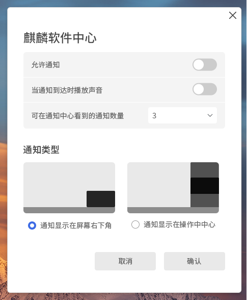

### Multitasking
In the multitasking module, by default, dragging the window to the edge or corner of the screen will automatically arrange and resize the window to fill the available space; by default, hovering over the taskbar, users can realistically preview the open window.

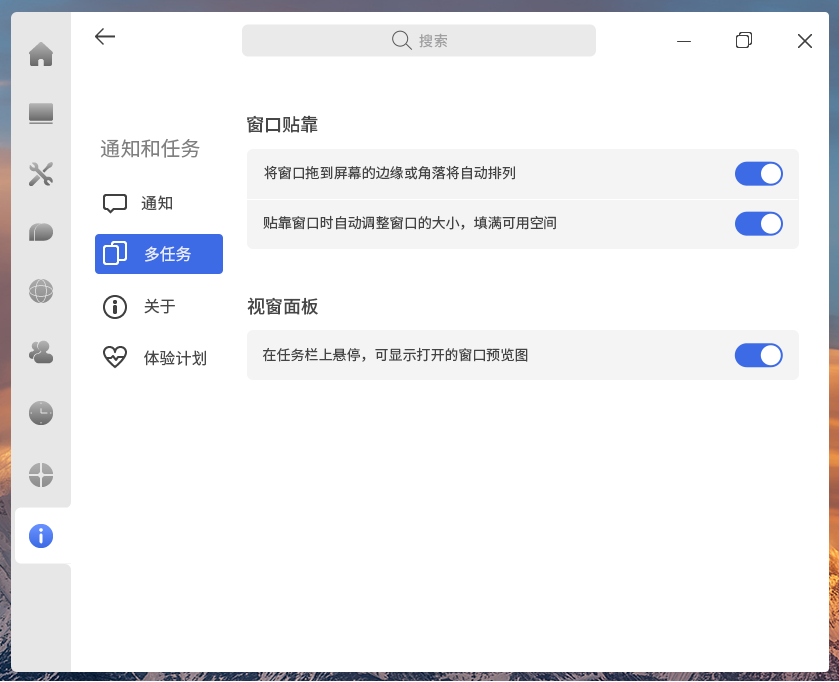

### About
In this section,users can find details about the version, version number, installation date information and equipment specification details of the local system.

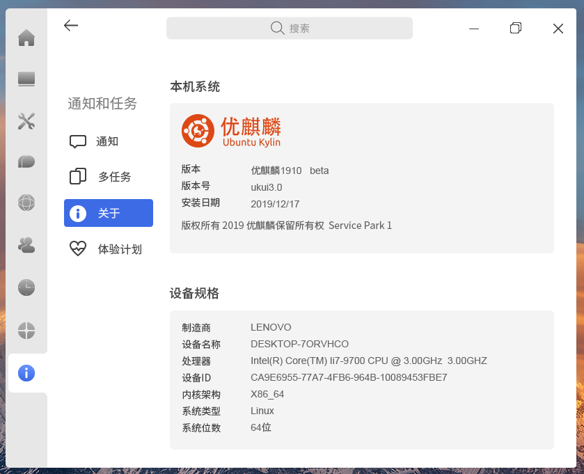

### The Experience Project
In the Experience Plan section, users can join the user experience plan and add user feedback, and the user experience plan protocol is shown in Fig. 59.

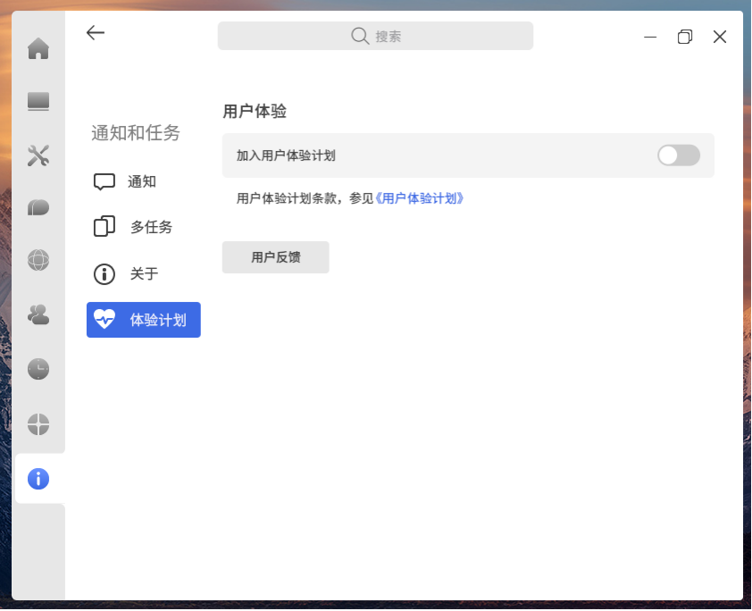

## Frequently Q&A
## Can't start? No response when I click the "Control Center" button on the "Start Menu"?
Press Ctrl+Alt+t on the keyboard to open the command line terminal, type ukui-control-center and then press Enter.
View error output.
## Can't change the configuration? After modifying the control state, the control immediately reverts to its pre-modification state?
It is highly likely that the reason for the above problems is due to a question of authority. Use the following methods to fix the problem.
Open the command line terminal by pressing Ctrl+Alt+t on the keyboard, enter “rm ~/.config/dconf/user” and press Enter to fix the problem.
Reconfiguration.