# 麒麟控制面板帮助手册
## 概述
控制面板提供了一个友好的图形用户界面，用于对操作系统常用配置项进行管理。控制面板将常用配置归结为两个分类，系统配置、硬件配置。系统配置主要包含了桌面环境以及系统层面的配置项；硬件配置主要包含了计算机硬件及其相关的配置项目，主界面如图 1所示

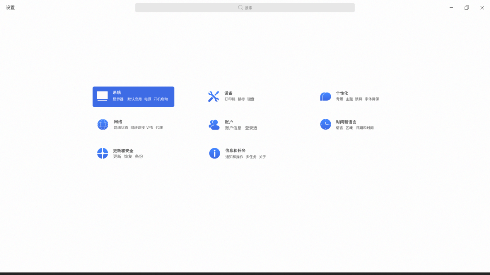

## 系统配置
系统配置设置提供了显示器、默认应用、电源、开机启动四个模块。
### 显示器
显示器可以配置显示相关的设置，包括显示器、屏幕缩放、屏幕亮度调节等模块，如图 2所示。

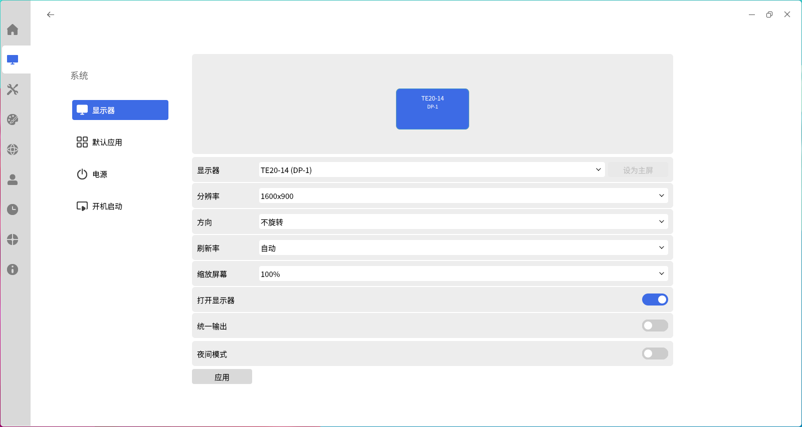

#### 显示器设置
显示器设置可以对当前显示器进行选择，调节屏幕分辨率、方向、屏幕刷新率等，同时可以对屏幕进行缩放以及亮度调节。
上方彩色矩形代表当前屏幕，中间显示了显示器名称及接口名。
显示器右侧的下拉列表包含了当前所有的显示器，并且下拉框显示的显示器为当前活动显示器，若需要将选中的显示器设为主屏幕，需在多显示器情况下，如果当前显示器不是主屏幕，则点击“设为主主屏”后当前显示器被设置为主屏幕。并且同一时间有且仅有一个主屏幕。
分辨率、刷新率等所有配置的修改都是针对当前活动显示器：
分辨率：右侧的下拉列表包含了系统及显示器支持的分辨率列表，可以通过下拉列表切换当前活动显示器的分辨率，选中即更改真实生效。
方向：右侧下拉列表包含普通、左、右、上下颠倒4个选项，选中即更改真实生效。
刷新率：右侧下拉列表包含当前显示器在当前分辨率下支持的刷新率列表，选中即更改真实生效。
关闭此显示器：该选项仅当存在两个及两个以上的显示器时，打开器开关按钮即更改真实生效。
所有显示器显示主屏幕图像：该选项需仅当存在多个显示器，打开其开关按钮即更改真实生效。
#### 夜间模式
打开夜间模式如图 3所示，用户可对时间进行修改，并设置显示器开启喝关闭时间，对显示器的色温进行调节。

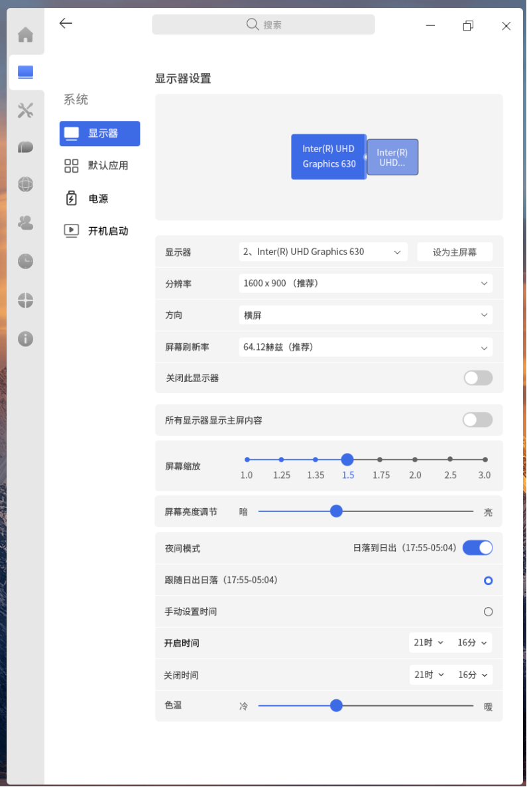

### 默认应用
默认应用提供了系统默认应用的配置项，可以修改浏览器、电子邮件、图像查看器、视频播放器、音频播放器、文本编辑器六种类型的默认打开应用。主界面如图 4所示：

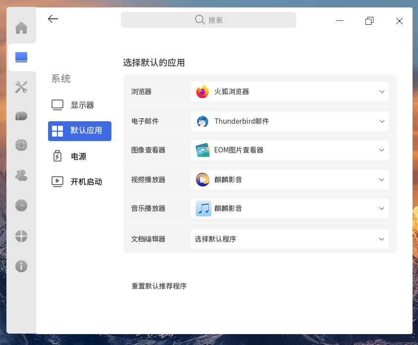

### 电源
电源可对电源管理器进行设置：提供平衡模式、节能模式、自定义模式给用户进行选择。用户自定义为电源供给或电池供给，并可对屏幕保护进行设置：30分钟电脑进入休眠状态、30分钟后管不显示器。

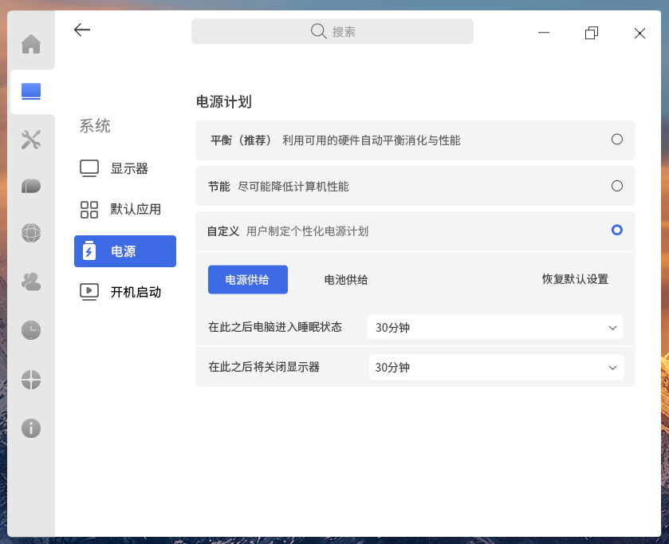

### 开机启动
开机启动提供对开机启动软件的配置管理功能，其界面如图 6所示。

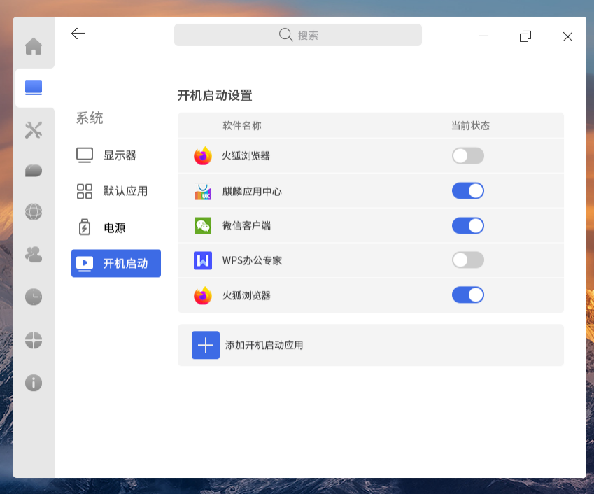

列表中显示了当前系统已存在的开机启动软件，列表左侧为软件名称；列表右侧为对应软件的开机启动状态。
列表右侧的勾选框代表了左侧软件的开机启动状态，勾选代表该软件随开机启动；否则代表开机不启动。可以通过点击勾选框来切换状态
鼠标左键点击选中列表中任意一款软件，所选软件所在行使用不同的背景色区分出选中状态。在选中状态下点击“属性”按钮查看所选软件的详细信息，应用类型、描述、位置、访问时间等等。
点击“添加”按钮弹出添加窗口，如图 7所示

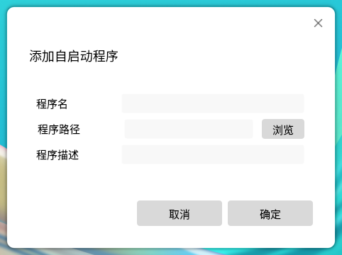

填写“程序名称”；填写“执行命令”，注意保证命令合法有效或者通过点击“浏览”按钮，在弹出文件选择界面，选择以desktop为后缀的文件，程序会自动解析并导出desktop文件中的命令数据；“程序注释”作为可选项，可填可不填。最后点击“添加”按钮，新的启动项即被创建并显示在列表中。新建的启动项默认为开机启动状态。
当列表中的软件存在选中状态时，“删除”按钮被点亮；当不存在选中状态时，鼠标左键点击选中期望被删除的软件，“删除”按钮被点亮。点击“删除”按钮选中软件将从开机启动软件列表中删除。
## 设备
设备设置提供了打印机、鼠标、键盘、快捷键、声音、蓝牙、触摸板七个设置模块，如图 8所示。

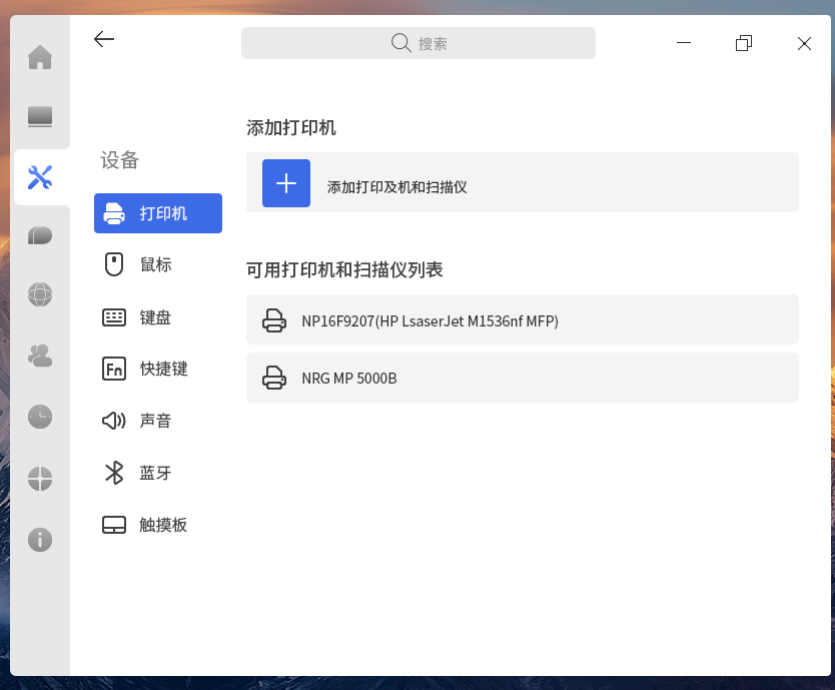

### 打印机
通过控制面板设备>打印机，用户可以添加打印机和投影仪，下方会显示可用打印机和扫描仪列表，如图 8所示。
### 鼠标
通过控制面板设备>鼠标，可对鼠标键、鼠标指针以及光标进行个性化设置。

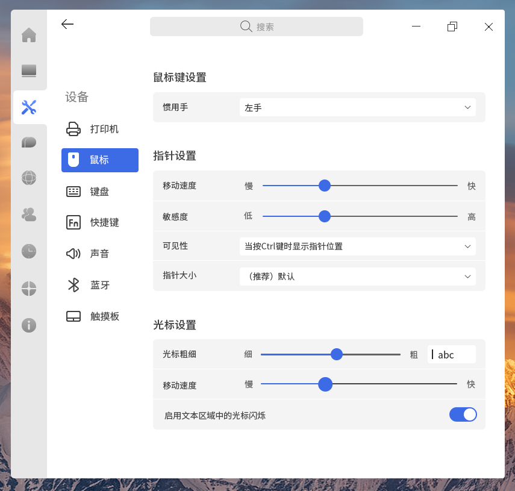

### 键盘
通过控制面板设备中键盘模块，可对键盘进行常规通用设置，并能够根据键盘语言调整键盘布局。

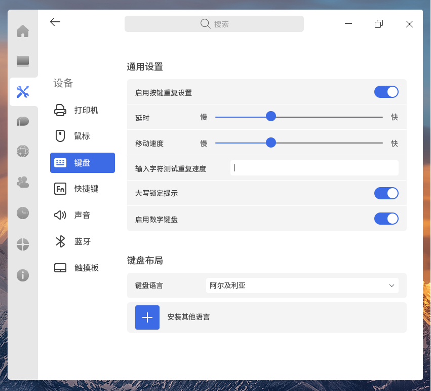

#### 通用设置
通用设置主要设置键盘输入相关基础设置，界面如图 11所示

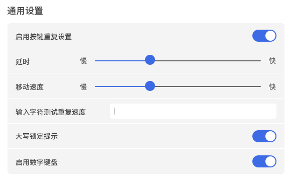

打开启用按键重复设置后激活重复按键功能，按下某个按键不放，系统会将该行为作为重复不间断的键盘输入；关闭后，按下某个按键不放，系统会将该行为作为一次键盘输入。
启用按键重复设置后，可对延时、速度两个选项进行设置。
延时：右侧的滑动条用来设置按下按键后到系统开始接收键盘输入之间的间隔，靠近“慢”的方向，间隔时间越短，系统更快的开始接收键盘输入；反之亦然。
速度：右侧的滑动条用来设置按下按键后，重复输入之间的间隔，靠近“慢”的方向，间隔越长，同样时间内重复输入的次数也越少；反之亦然。
输入字符来测试重复速度：下方的文本框用来测试设置后的效果，鼠标左键点击文本框使其获取输入焦点，按下某个按键实时查看效果。
#### 键盘布局
键盘布局是设置当前系统的键盘布局，主界面如图 12所示。

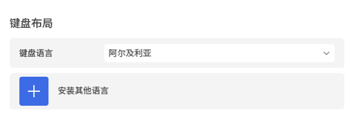

键盘语言的下拉菜单显示已安装的键盘布局列表，最多可以添加4个键盘布局。
点击“安装其他语言”，添加其他语言。
### 快捷键
快捷键允许用户对系统快捷键进行更改，而且可以添加或删除自定义快捷键。通过控制面板设备>快捷键，查看系统内全部快捷键，如图 13所示。

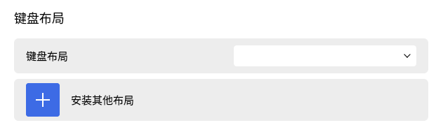

当前快捷键存在两种分类：系统快捷键和自定义快捷键。
系统快捷键：仅允许修改热键键值。
自定义快捷键：属于用户快捷键，可以添加、删除、修改。
点击“添加自定义快捷键”按钮，弹出快捷键添加界面，如图 14所示。
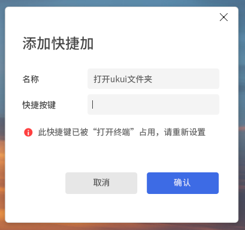

填写名称、快捷按键，注意为保证命令合法有效若被占用，便会在下方提示：此快捷键已被“打开终端”占用，请重新设置。
此时需重新设置，在快捷键设置合法的情况下点击“确认”后，添加快捷键成功并即刻真实生效。
### 声音
通过控制面板设备>声音，可对输入、输出和系统音效进行设置，如图 15所示。

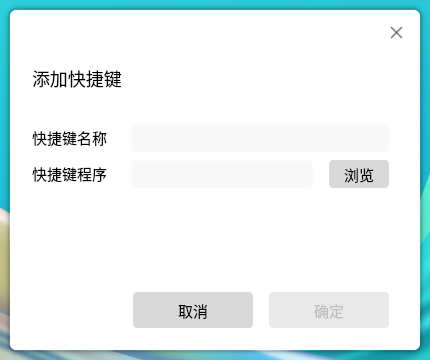

#### 输出
输出提供了输出设备的相关配置，主界面如图 16所示。

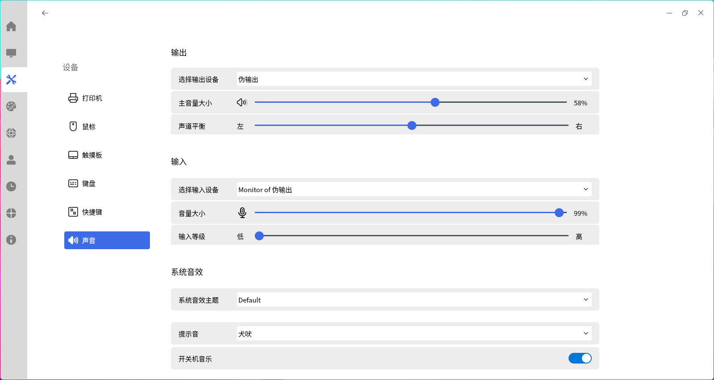

选择输出设备：下方列表显示了当前系统的所有可用声音输出设备，通过点击单选按钮来切换输出设备。
主音量大小：对输出设备的主音量大小进行调节。
声道平衡：可以对所选输出设备进行声道设置，靠近“左”方向为左声道，靠近“右”为右声道。
#### 输入
输入提供了输入设备的相关配置，主界面如图 17所示

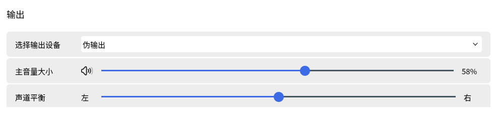

选择输入设备：下方列表列出了当前的所有输入设备，通过点击单选按钮来选择输入设备。
音量大小：可以配置输入设置的输入音量大小。
输入等级：可以配置声音输入设备的高低等级，靠近“低”方向为低级，靠近“高”为高级。
#### 系统音效
系统音效提供了对系统音效主题进行设置，对开机、注销、唤醒、操作成功等提示音进行个性化设置，如图 18所示。

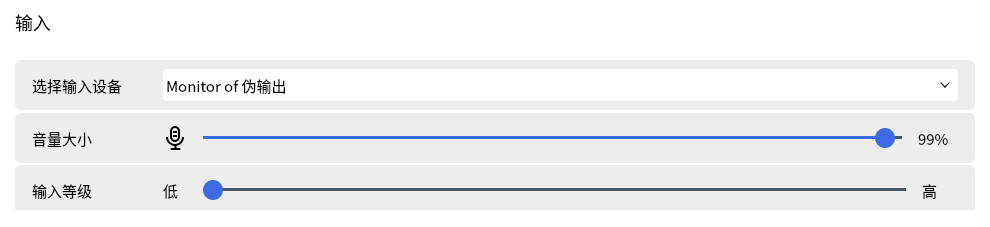

当前系统的音效主题仅有一种UbuntuKylin。
初始音效提供犬吠、雨滴、玻璃、声纳四种效果，点击对应选项进行切换。·
### 蓝牙
通过控制面板设备>蓝牙，可将蓝牙开关打开，下方便会显示可用的蓝牙设备列表。

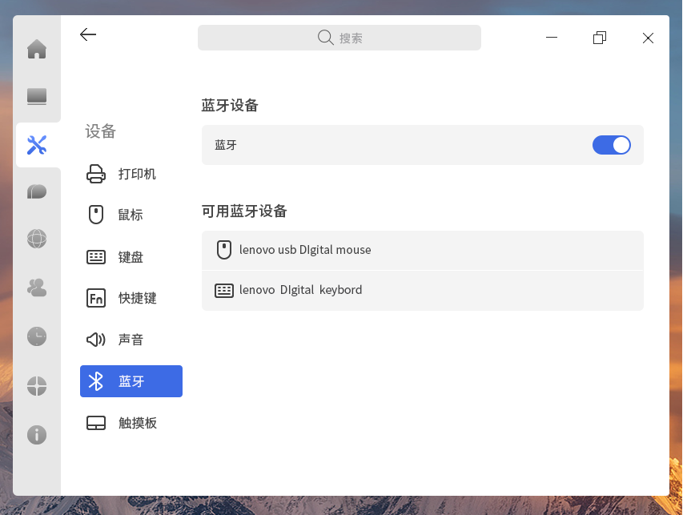

### 触摸板
通过控制面板设备>触摸板，开启触摸板，并可根据用户需求对触摸板进行个性化设置：打字时禁用触摸板、启用触摸板的鼠标点击功能、支持垂直边界滚动等，如图 20所示。

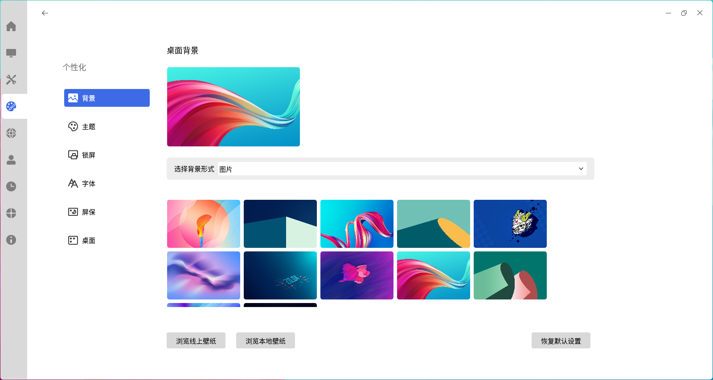

## 个性化
个性化设置提供了主题模式、图标主题、空间主题、光标主题、效果设置五个模块。

### 主题
主题包括主题模式、图标主题、空间主题、光标主题、效果设置五个板块。
#### 主题模式
主题模式提供给用户三种主题进行切换：系统默认、浅色模式、深色模式，根据用户需求，勾选对应主题模式即可，如图 22所示。

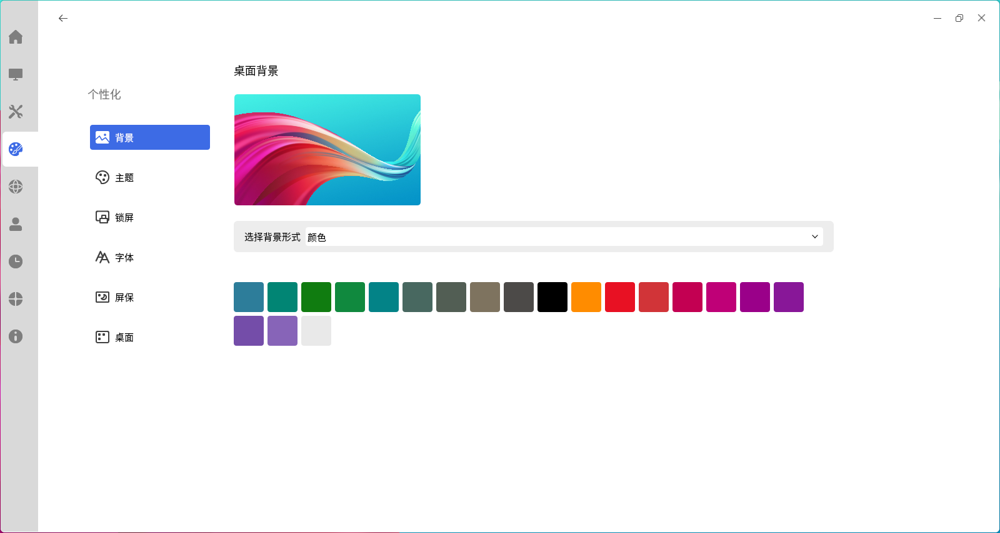

#### 图标主题
图标主题提供给用户三种主题进行切换：默认、经典、Graphic，根据用户需求，勾选对应图标主题即可，如图 23所示。

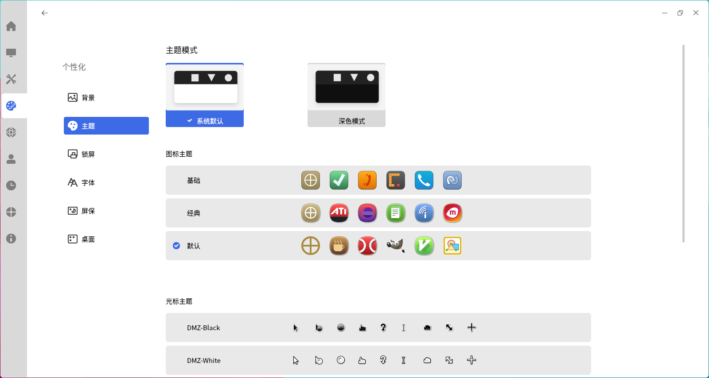

#### 控件主题
控件主题提供给用户多种颜色，根据用户需求，选中想要设置的控件主题颜色即可，如图 24所示。

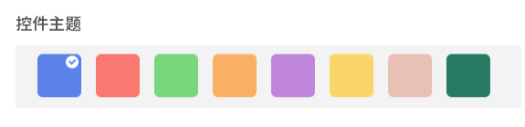

#### 光标主题
光标主题提供给用户两种主题进行谢欢：默认、经典，根据用户需求，选中想要设置的光标主题即可，如图 25所示。

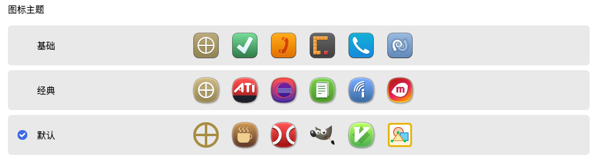

#### 效果设置
效果设置可供用户对桌面界面的透明特效进行设置，如图 26所示，打开透明特效开关，靠近“低”方向为低透明度，靠近“高”为高透明度。

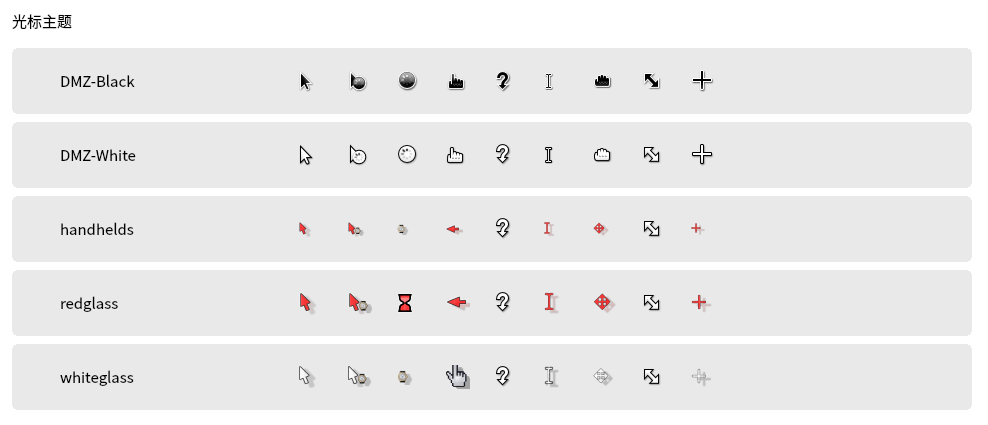

### 背景
背景模块针对桌面背景，为用户提供三种背景形式的选择：纯色、图片、幻灯片。
#### 纯色
在选择桌面背景>选择背景形式下选择：纯色。当前桌面背景对应的颜色会有明显的描边用于区分，设定后可以对选择的纯色背景颜色进行三原色调节。

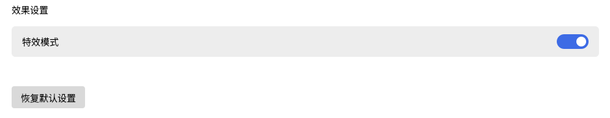

#### 图片
在选择桌面背景>选择背景形式下选择：图片。

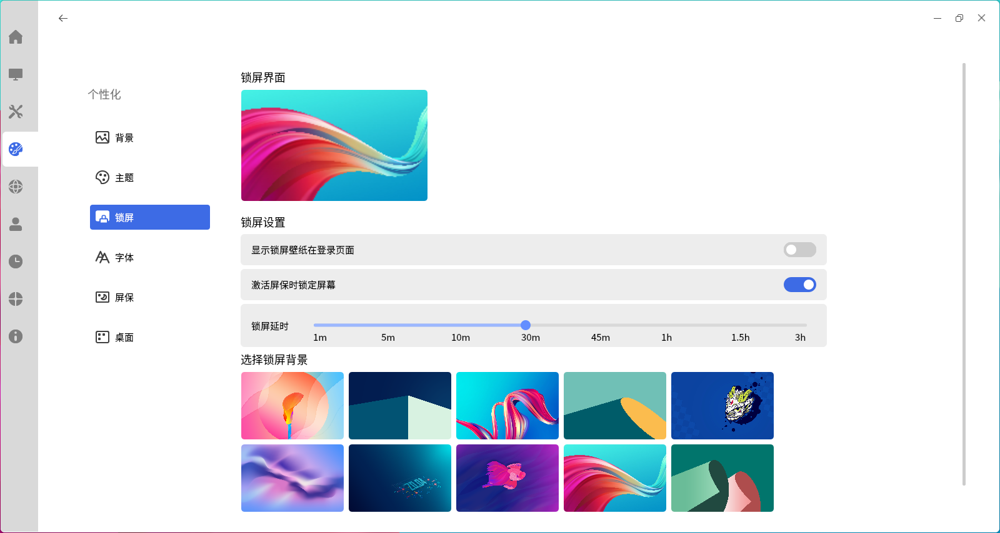

浏览背景列表中的缩略图，遇到意向背景后直接点击该缩略图桌面背景即设置成功，当前桌面背景对应的缩略图会有明显的描边用于区分。
点击“图片放置方式”右侧的下拉列表，会有平铺、缩放、居中、比例放大、伸展、适合宽度6个图片放置方式可供配置，选择放置方式后直接对当前桌面背景生效。
点击“浏览本地壁纸”弹出文件选择界面，如图 29所示

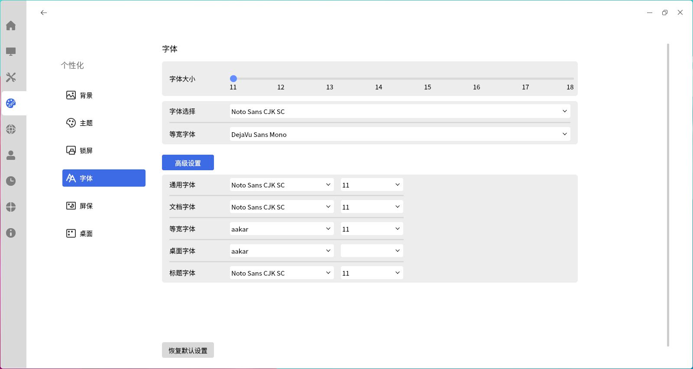

使用鼠标左键选中期望添加的壁纸文件后，点击“打开”按钮，待添加壁纸即会被选择为当前桌面背景并添加进背景列表中。
点击“删除壁纸”后当前桌面背景会从背景列表中删除，下一张壁纸文件会作为新的桌面背景被设置。
#### 幻灯片
在选择桌面背景>选择背景形式下选择：幻灯片。点击“图片放置方式”右侧的下拉列表，会有平铺、缩放、居中、比例放大、伸展、适合宽度6个图片放置方式可供配置，选择放置方式后直接对当前桌面背景生效。
点击“图片切换频率”可设置桌面背景幻灯片更换的时间间隔，用户可打开无序切换开关，即可随机播放幻灯片相册中的图片。
点击下方“默认壁纸”文件夹，即每30分钟按图片顺序切换一张默认壁纸中的图片，也可自定义幻灯片相册，实现桌面背景的幻灯片切换。

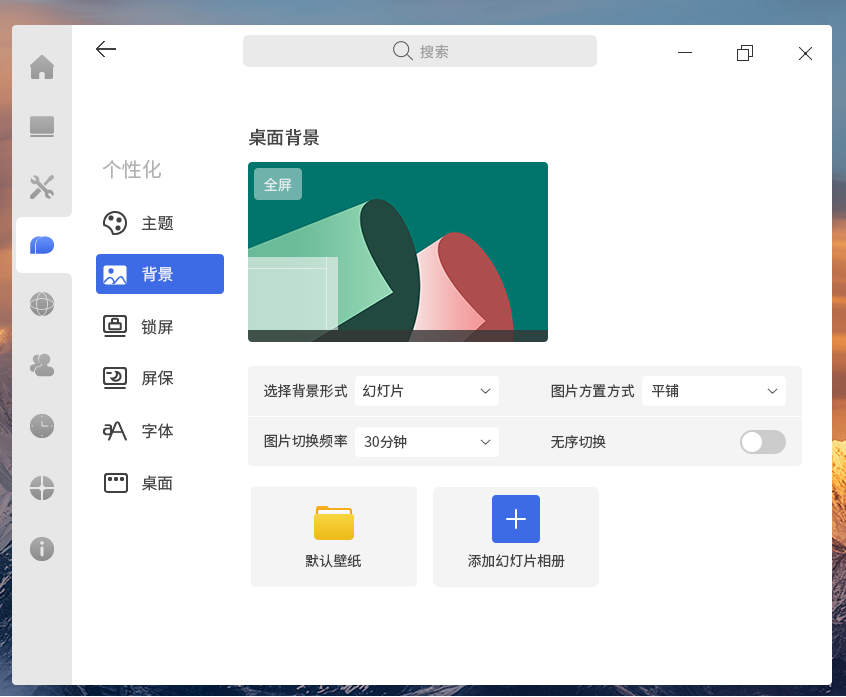

### 锁屏
锁屏模块针对锁屏界面，为用户提供锁屏背景自定义背景图片切换的两种途径：通过浏览本地图片和浏览更多线上壁纸。
选择在登陆屏幕上显示锁屏背景图片即打开对应开关按钮，且可对电脑开启锁屏所需要的时长进行设置。

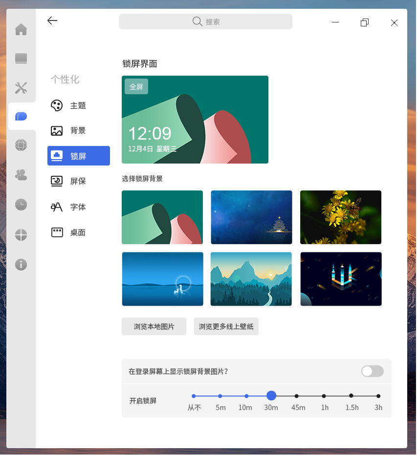

### 屏保
屏保模块待补充。
### 字体
字体模块提供了系统字体及字体大小的配置项，主界面如图 32所示。用户可根据需求对字体及其大小、等宽进行常规设置，在高级设置里提供相应字体的设置，并在下方能够对字体进行预览。
点击“恢复默认设置”按钮将所有字体设置还原为系统默认状态。

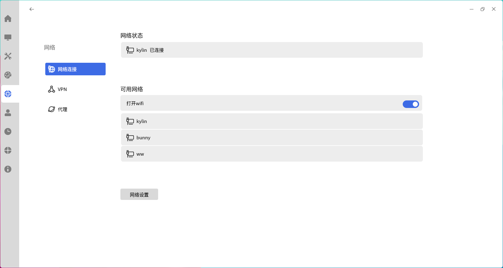

## 网络
网络代理主要是配置网络代理相关设置，分网络连接、VPN、代理三个模块，如图 33所示。

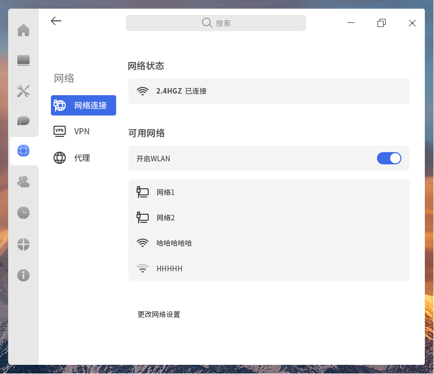

### 网络连接
#### 网络状态
用户可以通过网络连接模块中网络状态板块查看当前的网络连接状态，如图 34所示。

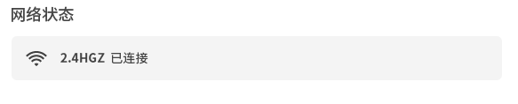

#### 可用网络
在可用网络列表内可查看当前可用的网络，如图 35所示。

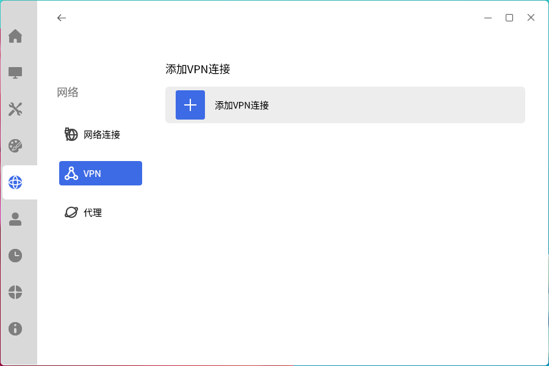

### VPN
在VPN模块中，可以添加VPN连接，点击下方“添加VPN连接”，编辑名称、选择类型、设置服务器地址等即可，界面如图 36所示。

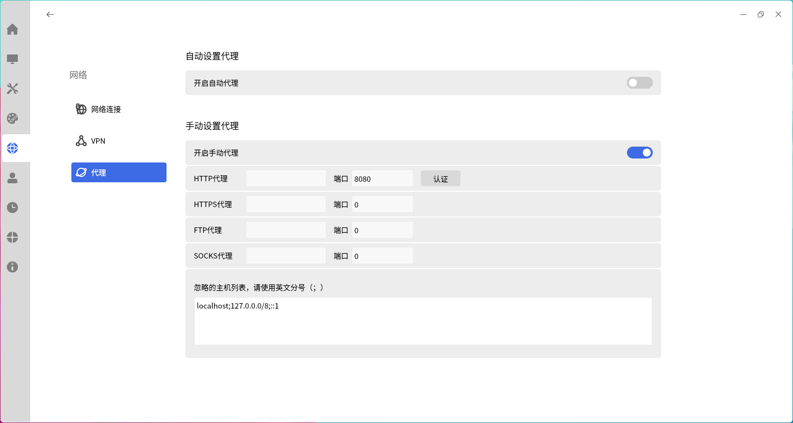

### 代理
代理模块通常分自动设置可连接到互联网（即无代理）和手动代理两种模式，且两种模式同时只能存在一种，网络代理设置界面如图 37所示。

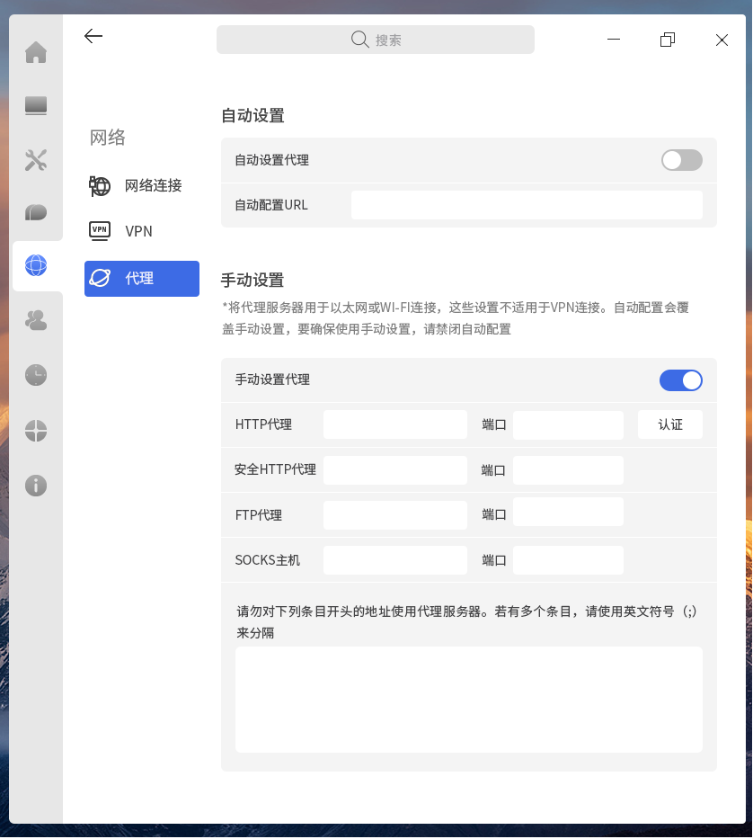

#### 自动设置
选择自动设置即当前系统不设置代理，直接访问互联网，点击自动设置代理的开关按钮即可，如图图 38所示。

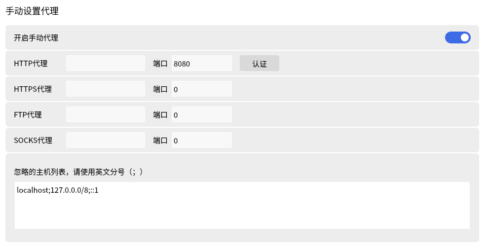

#### 手动设置
当有明确的代理协议情况下，比如需要使用Http代理、Https代理、Ftp代理、Socks代理时，可以选择手动配置代理，将代理服务器的IP地址和端口号填入对应文本框即可。另外Http代理可以将代理认证配置在这里从而免除了访问网络时弹出的认证窗口。点击“认证”按钮，弹出认证界面，如图 39所示。

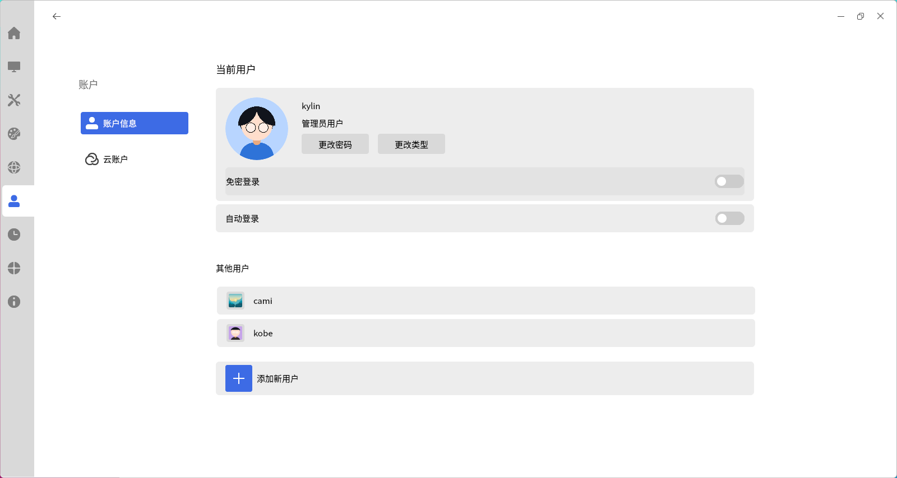

## 账户
账户提供了对系统用户的管理配置，允许管理员创建用户、删除用户、修改用户信息，主界面如图 40所示。

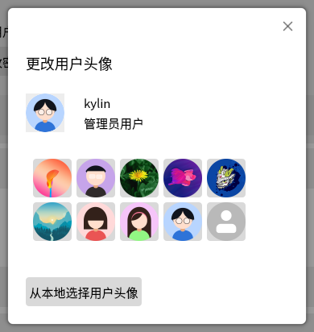

### 当前账户
#### 修改用户头像
点击用户头像即可对用户头像进行修改，图片可从本机图片中选择，界面如图 41所示。

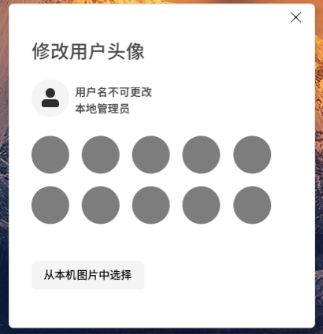

#### 修改密码
用户通过点击“修改密码”即可修改当前帐户的密码。

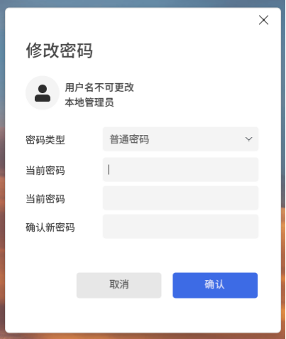

#### 更换账户类型
系统用户类型分两种，标准用户和管理员，区别在于管理员可以通过输入自己密码临时提升root权限；标准用户无法提升自己的权限。用户通过点击“更换账户类型”即可将普通用户切换为管理员：
直接单击鼠标左键选中单选按钮后，点击“确定”按钮更新当前用户的用户类型。注意，系统至少需要存在一个管理员用户，所以最后仅存的管理员用户无法修改用户类型至标准用户。而且标准用户切换至管理员需要知道系统任一管理员的密码才能被允许切换。
当前用户无法删除自己，所以“当前用户”的“删除用户”处于未点亮状态。

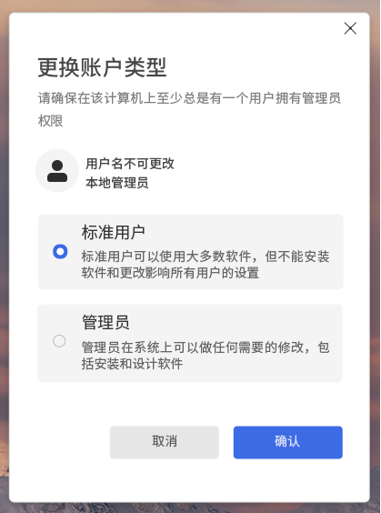

### 其他用户
在其他用户板块中，用户可对其他用户的头像、账户类型进行编辑与当前账户的设置一致，对其它用户进行添加、删除等操作，如图 44所示。
其他用户的账户头像显示系统默认头像，点击账户头像区域，点击头像后弹出系统头像列表，点击列表中的头像文件或者在弹出的头像列表中点击“浏览更多图片”选择自定义头像文件，头像设置区域的头像更新为最新头像。

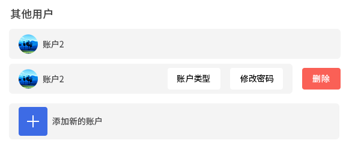

#### 添加新用户
点击“添加新的用户”，定义账户名称、密码、账户类型等如图 45所示。
分别分别输入新建账户名称、选择密码类型、输入密码、确认密码，点击下方用户类型单选按钮确定新建用户的类型，点击“确认”按钮，新用户被创建。

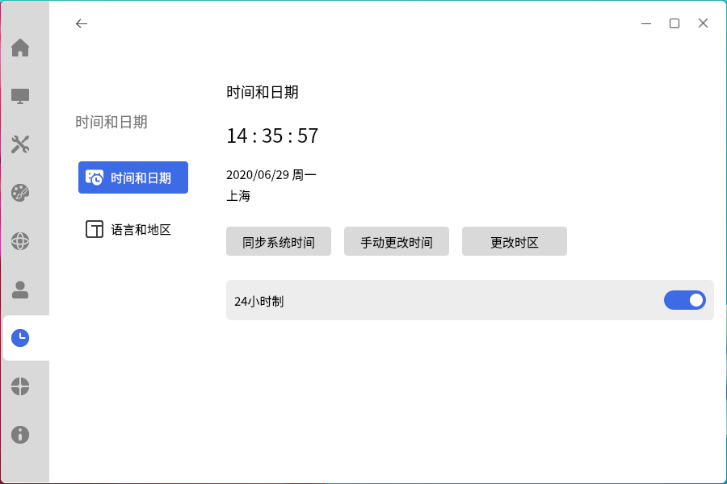

## 时间和日期
时间和日期设置提供了日期时间与区域语言两个模块，如图 46所示。

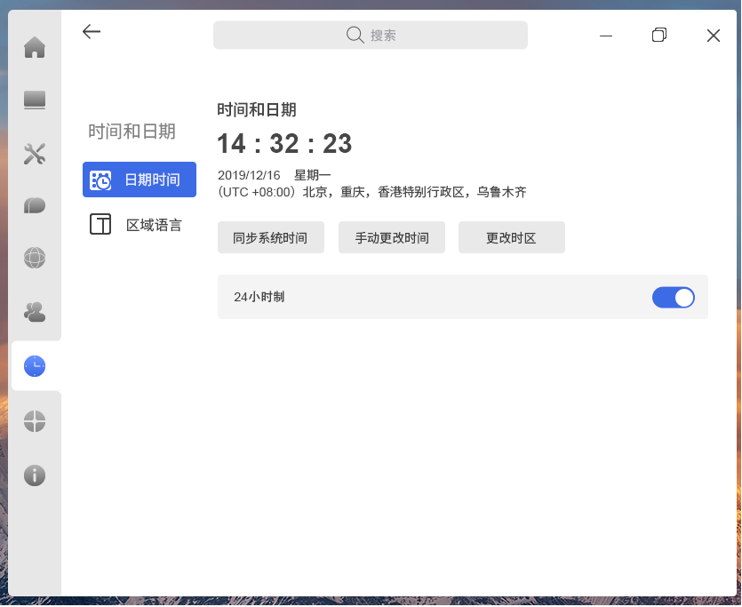

### 时间和日期
时间和日期板块中，可同步系统时间、手动更改时间、更改时区，设定为24小时制或12小时制，如图 47所示。

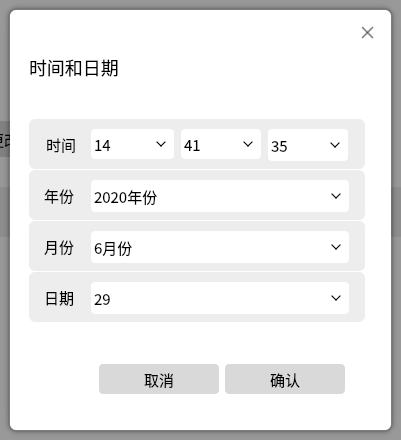

当前的时间和日期同步状态分两种，与网络时间同步，与互联网上的NTP服务器时间同步；与本地计算机的时钟芯片时间同步。
勾选“与网络时间同步”后，计算机的时间与网络NTP服务器时间同步，此状态下不再允许修改时间或日期；取消勾选“与网络时间同步”后，计算机的时间与本地计算机的时钟芯片同步，此状态下可以修改时间或日期。
点击“时区”右侧的下拉列表显示所有的时区列表，中国境内默认使用“（UTC +8：00）北京，重庆，香港特别行政区，乌鲁木齐”。
时间格式分12小时和24小时，点击“格式”右侧相应的单选按钮即可立即生效。
#### 手动更改时间
点击“手动更改时间”，对时间的时、分、秒、年份、月份、日期进行设置，如图 48所示。

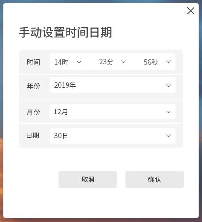

### 区域语言
在区域语言模块可对当前区域进行设置，如图 49所示。

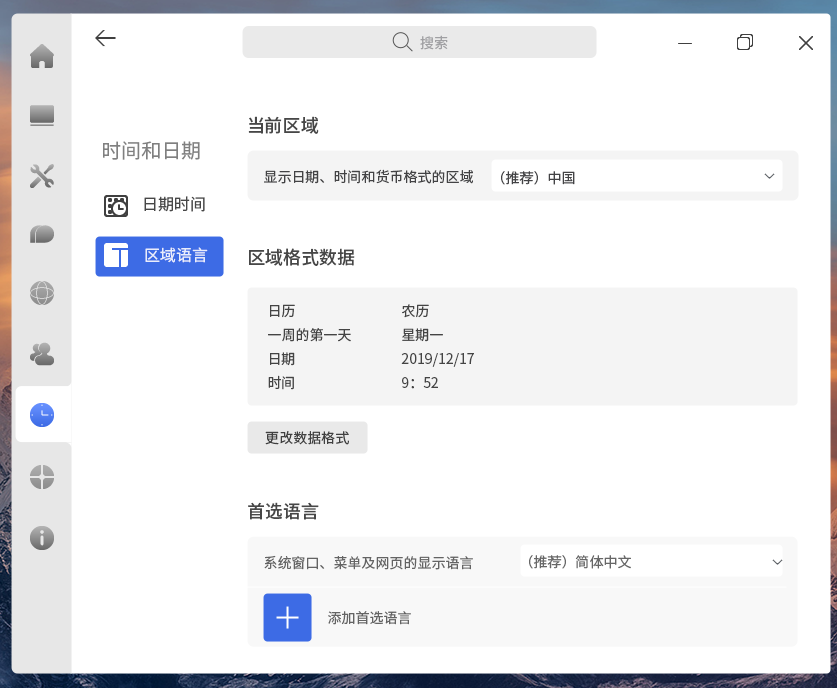

#### 更改数据格式
点击“更改数据格式”，弹窗如图 50所示，可对日历、一周显示格式、日期、时间自定义。

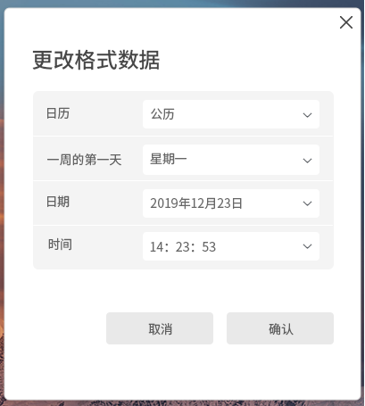

## 更新和备份
更新和备份设置提供了更新与备份两个模块，如图 51所示。

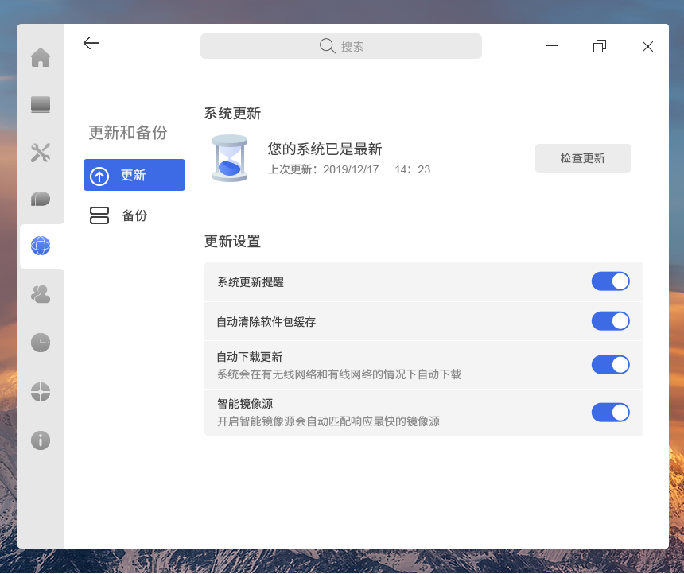

### 更新
通过系统更新检测查看最新系统，如图 51所示。在更新设置下可设置系统更新提醒、自动请相互软件包缓存、自动下载更新、智能镜像源等，如图 52所示。

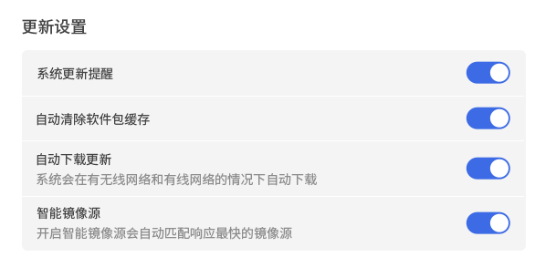

### 备份恢复
备份恢复提供备份和恢复两个板块，如图 53所示，选择“开始备份”将文件备份到其他驱动器，选择“开始恢复”查看已备份列表选择系统需要恢复的还原点进行恢复。

## 通知和任务
更新和备份设置提供了通知、多任务、关于本机操作系统、体验计划四个模块。
### 通知
通知包括通知、设置通知来源两个板块，如错误！未定义书签。所示。
#### 操作中心通知
设置在操作中心显示通知消息：系统版本更新后显示新增内容、获取来自应用和其他发送者的通知、在锁屏界面上显示通知。

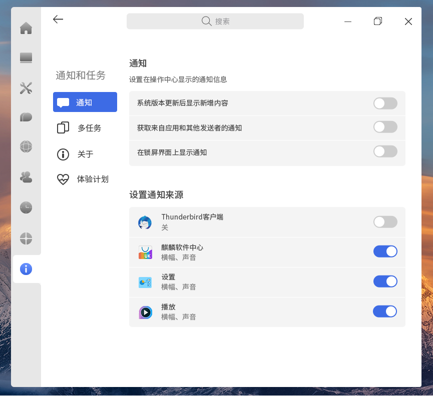

#### 设置通知来源
以麒麟软件中心为例，打开开关按钮设置麒麟软件中心为通知来源，弹窗如图 55所示，设置项：允许通知、当通知到达时播放声音，设置在通知中心看到的通知数量，选择通知类型（显示在屏幕右下角、显示在操作中心）。

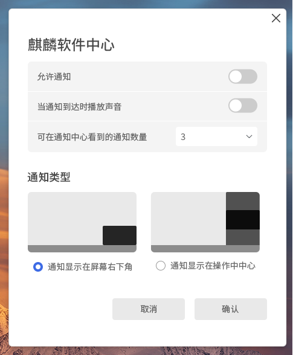

### 多任务
多任务模块中，默认将窗口拖到屏幕的边缘或角落将自动排列、贴靠窗口时自动调整窗口的大小，填满可用空间；默认在任务栏上悬停，可现实打开的窗口预览图。

### 关于
在关于模块中，可详细了解到本机系统的版本、版本号、安装日期信息和设备规格详情。

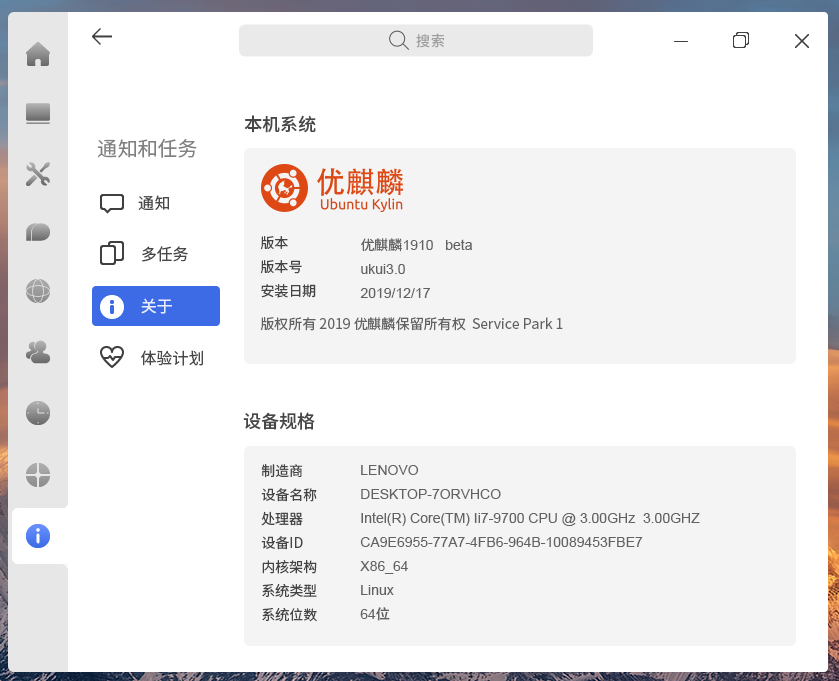

### 体验计划
在体验计划板块，用户可以加入用户体验计划，并添加用户反馈，用户体验计划协议如图 59所示。

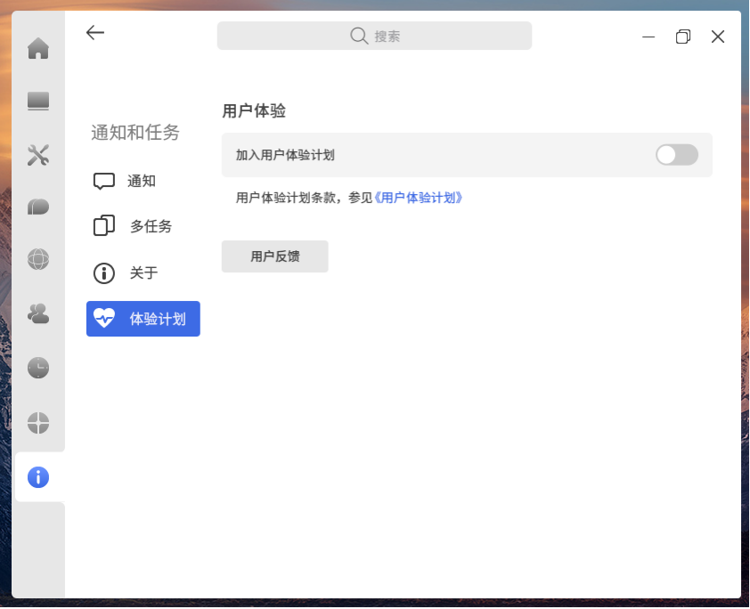

## 常见问题
## 无法启动？点击“开始菜单”上的“控制面板”按钮无反应？
在键盘上按下Ctrl+Alt+t组合键打开命令行终端，输入kylin-control-center后按下回车，如图所示

查看错误输出
## 无法修改配置？修改控件状态后，控件立刻还原到修改前状态？
出现上述问题的原因大概率是因为权限问题。使用如下方法修复问题。
在键盘上按下Ctrl+Alt+t组合键打开命令行终端，输入rm ~/.config/dconf/user后按下回车，即可修复问题。
重新修改配置
