# UKUI Desktop Environment
## Overview
Desktop Environment is the basis for the user's operation on the graphical interface, and provides multiple functions including taskbar, start menu, etc. The main interface is shown in Fig. 1.

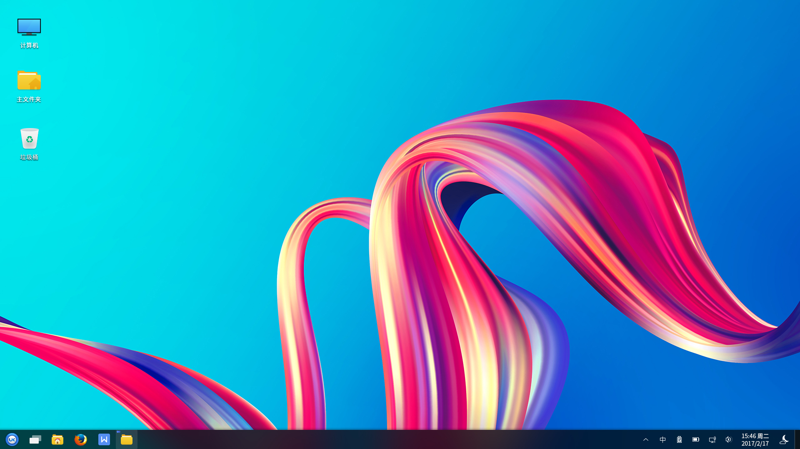
 

## Desktop
### Desktop’s Icons
The system places three icons Computer, Recycle Bin and Personal by default, and double click the left mouse button to open the page. The functions are shown in Table 1. 

| Icon |  Description	|
| :------------ | :------------ |
|  | Computer: Show the drives and hardwares connected to the machine|
|  | Recycle Bin: Show documents that have been diverted|
|  | Personal: Show personal home directory|
	

**
Table 1 Icon's Function Description
**

In addition, right-clicking "Computer" and selecting "Properties", it can show the current system version, kernel version, activation and other related informations, as shown in Fig. 2.

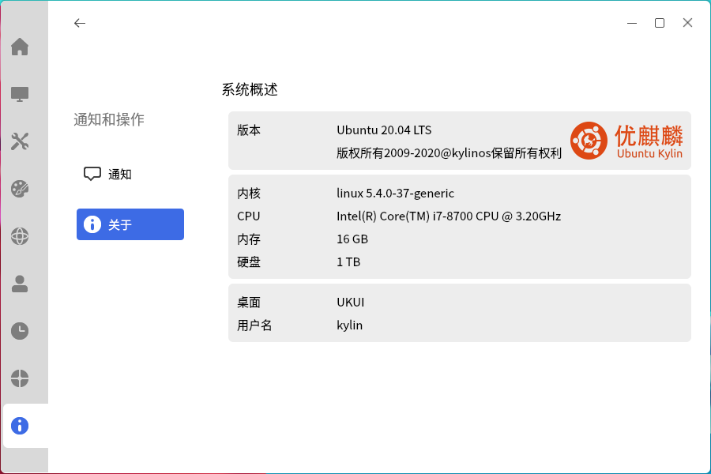

### Right-click Menu
Right-click on the desktop blank and a menu appears as shown in Fig. 3, providing the users with some shortcut features.

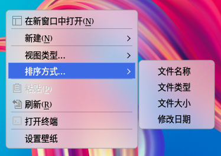

Some of the options are described in Table 2.

| Option | Description |
| :------------ | :------------ |
| New | Create new folders, text documents, WPS files |
| View type | Four view types are available: small icon, medium icon, large icon, super large icon |
| Arrangement | Multiple ways to arrange icons |

**
Table 2 Option's Function Description
**

 

## Taskbar
### Basic Function
Taskbar is located at the bottom and includes the Start Menu, Multi View Switch, File Browser, Firefox Web Browser, WPS, and Tray Menu, as shown in Fig. 4.

The individual components are shown in Table 3.

| Component | Decsription |
| :------------ | :------------ |
|| Start menu: Open the system menu to find applications and files |
|| Multi View Switch: Operate in multiple workspaces without interfering with each other |
|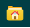| File Browser: Browse and manage documents in the system |
|| Firefox Web Browser: Provide a convenient and safe way to access the Internet |
|| WPS: Realize the most common functions of office software such as text, forms, presentations, and more |
|Window Display Area| The blank part in the middle of the horizontal bar. Display running programs, opened documents, and allow you to close the windows, top the windows, etc |
|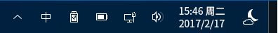| Tray Menu: Include settings for input method, voice, internet connection, date |
|Show Desktop| The button is on the far right. Minimize all windows on the desktop and return to the desktop; Clicking again will restore the windows |

**
Table 3 Component's Funtion Description
**

#### Multi View Switch
Click the icon "" on the taskbar to enter the interface shown in Fig. 5, and select the operation area that you need to work on at the moment in multiple work areas.

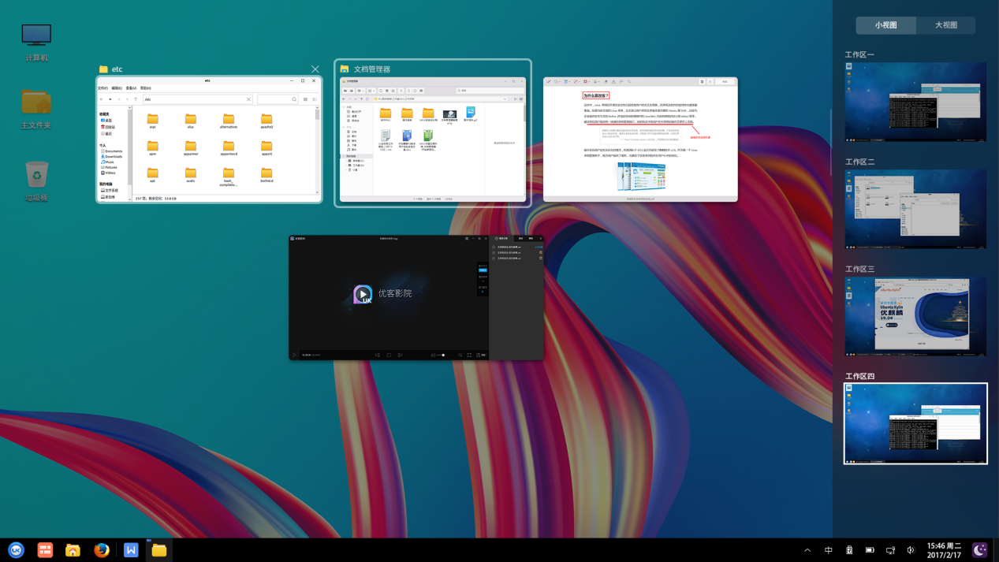

#### Preview Window
Users move the mouse over the app icon in the taskbar, and then a small preview window will be shown if this app has already been opened. The hover state is shown in Fig. 6. This window renders a hairy glass effect and the rest of the windows remain the default state.

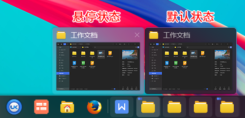

Users can preview the currently opened windows of that application in the form of a list by right-clicking on the app icon in the taskbar, as shown in Fig. 7.

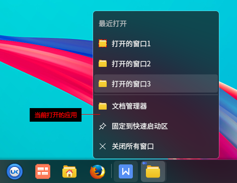

#### Sidebar
The sidebar is located at the right of the entire desktop. Click the icon "" in the taskbar tray menu to open the storage menu, and click the icon "" in Kylin Toolbox to pop up the sidebar as shown in Fig. 8. The sidebar consists of two parts: Notification Center and Clipboard.

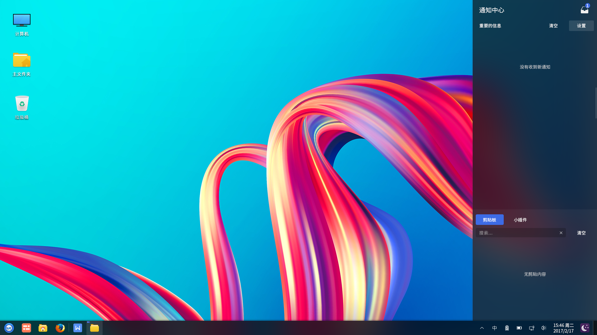

##### Notification Center
Notification center will display a list of recent important and newest informations, as shown in Fig. 9. Select "Clear" in the upper right corner to clear the list of informations; Select "Setting" in the upper right corner to go to the notification settings in the control center, and users can set which applications can show informations and the quantity of informations.

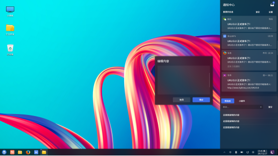

Workspace at right side can be set to fold by applications, as shown in Fig. 10.

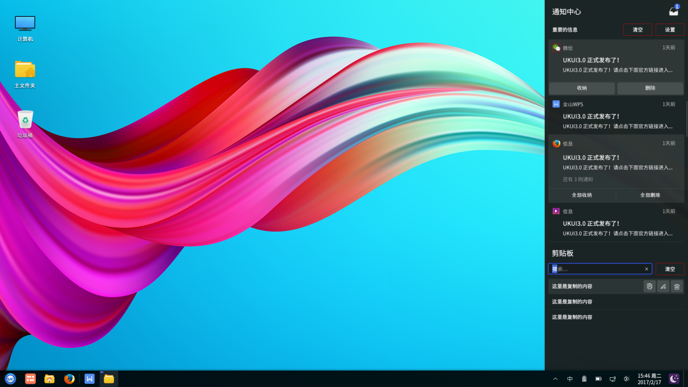

Icon "" at the top right corner of the sidebar can store unimportant informations, as shown in Fig. 11. When the messages are more than 999+, it will be shown as the form of  which means limitless.

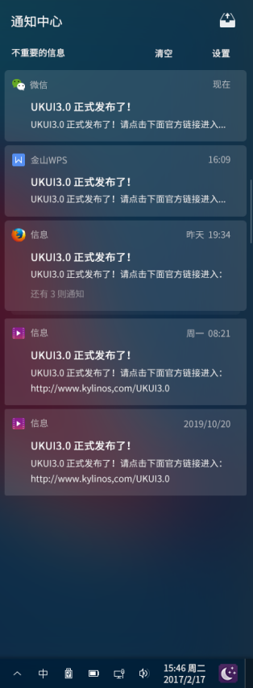

##### Clipboard
As Fig. 12, clipboard can save the contents those were recently selected to copy or cut, and  users can operate them by using the icons in Table 4.

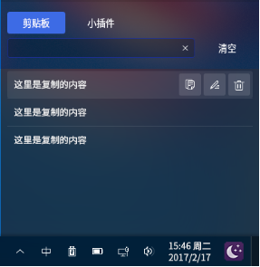

Clicking "", you can edit the the contents of the clipboard, as shown in Fig. 13.

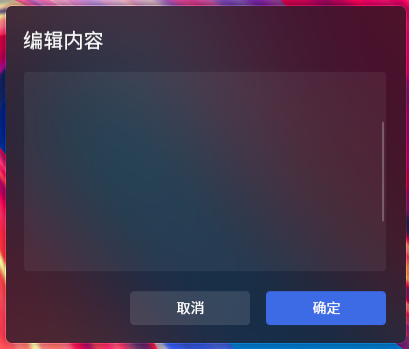

| Icon | Description | Icon | Description |
| :------------ | :------------ | :------------ | :------------ |
|  | Copy the content |  | Edit the content |
|  | Delete the content |  |  |	
	

**
Table 4 Clipboard Icon Description
**

The second label of the clipboard is the small plug-in that contains alarm clock, notebook, user feedback, as shown in Fig. 14.

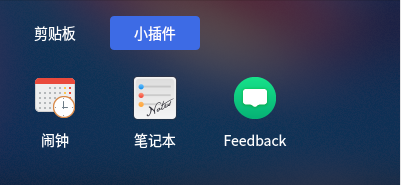

#### Tray Menu
##### Storage Menu
Click "" at the tray menu to open the storage menu. It contains Kylin Weather, Input Method, Kylin Toolbox, etc.

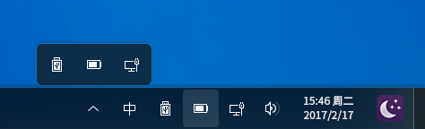

##### Input Method
Input method icons' description as shown in Table 5.

| Icon | Description | Icon | Description |
| :------------ | :------------ | :------------ | :------------ |
||	Chinese input ||	English input |
||	Duplex input ||	Five-Stroke input |
||	CapsLock ||	CapsLock release |
	

**
Table 5 Input Method's Icons Description
**

##### U Disk
When the U disk is inserted into the computer, it will be automatically read the data inside. Click "" to open the window as shown in Fig. 16. When you need to umount the U disk, please click the icon "".

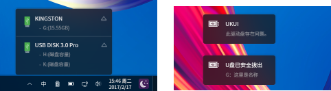

##### Power Supply
Click the icon "": 

When no power supply is detected, power manager is shown like Fig. 17.

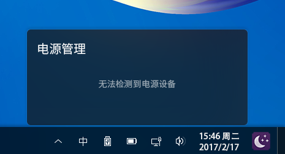

When power supply is detected, power manager is shown like Fig. 18.

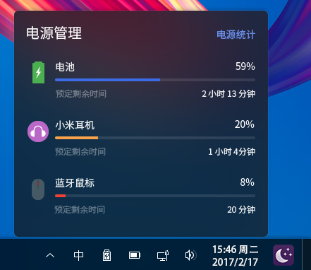

Users right-click the icon "" of power manager to open the power setting menu as shown in Fig. 19. It provides three setting options: show the power percentage of the power device, adjust screen brightness, and set power and sleep.

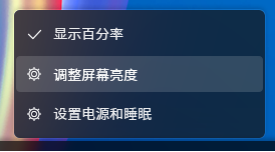

If the power manager pops up a"low battery" window as shown in Fig. 20, users can click to turn on the power save mode, and the power manager will set the machine to run in this mode immediately.

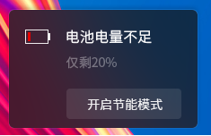

##### Network
Users can choose wired or wireless network connections by clicking the icon "" of network manager. As shown in Fig. 21.

| Icon | Description | Icon | Description |
| :------------ | :------------ | :------------ | :------------ |
|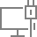|	Connected || Unconnected |
||	Connection limited ||	Locked |
||	Connecting ||	Wifi connected |
||	Wifi unconnected ||	Wificonnection limited |
||	Wifi locked ||	Wifi connecting |
	

**
Table 6 Network Connection's Icons Description
**

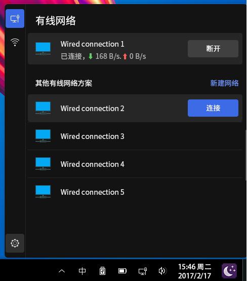

###### 1) Wired Network
In the wired network connection interface, click on the wired network plan to expand. Details of the network as shown in Fig. 22.

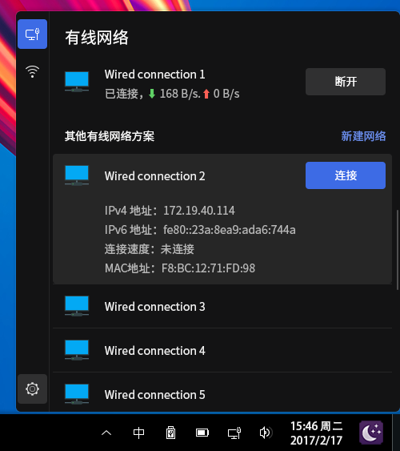

###### 2) Wireless Network
Click the switch button in the upper right corner to turn on the wireless network connection, and select the WiFi from the list of available wireless networks. Enter the password to access the Internet.

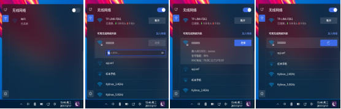

###### 3) Network Setting
Right-click the icon "" of network mnager to pop up the setting menu, as shown in Fig. 24.

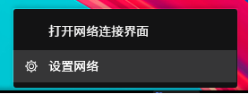

Click network setting to go to the setting window immediately, as shown in Fig. 25.

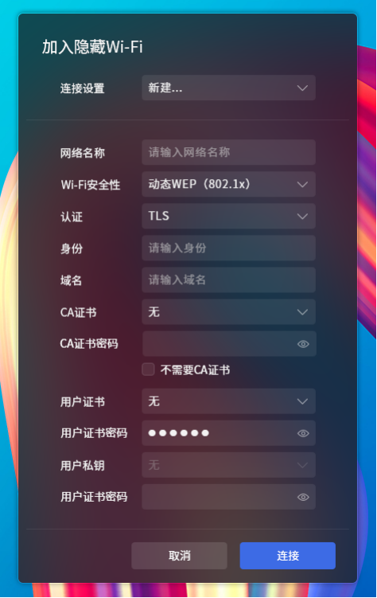

##### Volume
Click the icon "" to open the volume window, and there provides three modes.

###### 1) Mini Mode
As shown in 26, it only displays the volume of the speaker.

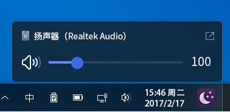

###### 2) According to Equipment
It contains input equipments and output equipments, as shown in Fig. 27.

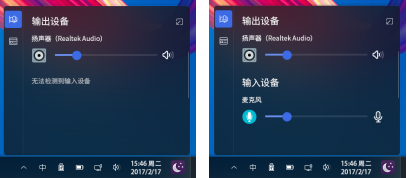

###### 3) According to Application
It contains system volume and other applications' volume, as shown in Fig. 28.

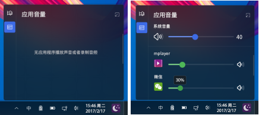

##### Calendar
Click the date&time on the taskbar to open the calendar window, as shown in Fig. 29. 

Users can view the day's informations by filtering the year, month, day. The date will be displayed in large letters, with the time, the week, the festival,and the lunar calendar. Taboos can be seen by checking.

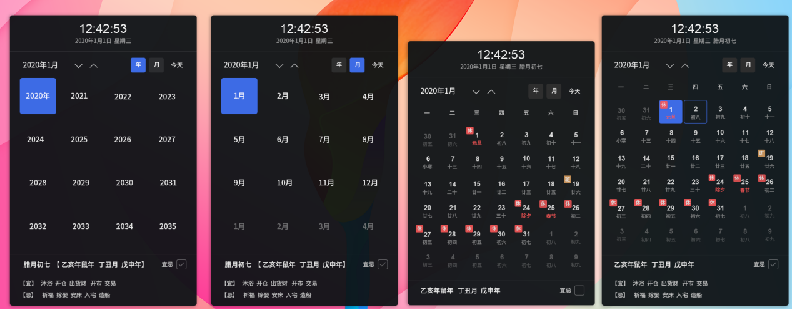

##### Night Mode
Click the icon "" on the Taskbar and then the system changes to the night mode.

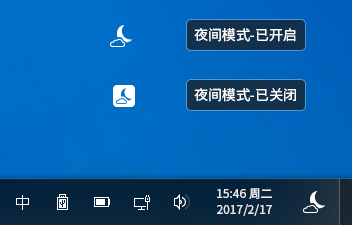

#### Advanced Setting
Right-click the Taskbar to open the menu as shown in Fig. 31.

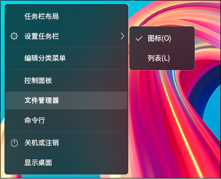

Users can set the layout of taskbar accroding to "Taskbar Settings", including set icons and lists, edit category menu, jump to control center, open files browser, open the terminal, etc.

 

##  Window
###  Window Manager
The functions provided as shown in Table 7.

| Function | Description |
| :--------| :----------|
| Title Bar | Show the title name of current window |
| Minimize/Maximize/Close | The three icon buttons at the right of the title bar correspond to minimize, maximize and close respectively |
| Side Sliding | Users can scroll up and down to view the page by the slider at the right of the window |
| Stack | Allow overlap among windows |
| Drag and Drop | Long press the left mouse button at the title bar to move the window to any position |
| Resize | Move the mouse to the corner of the window and long press the left button to resize the window |

**
Table 7 Window Manager's Functions
**

### Window Switch
There are three ways to switch windows:

* Click the window title on the Taskbar.

* Click the different window at the desktop.

* Use shortcut keys <Alt> + <Tab>.

 

## Start Menu
### Basic Function
Click the button to open the "Start Menu", as shown in Fig. 32. It provides sliding bar.

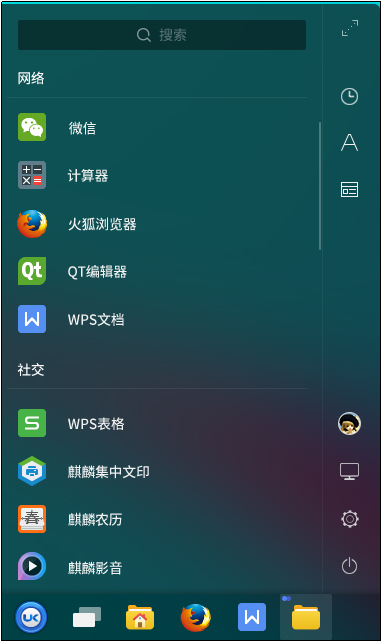

#### Category Menu at right side
When the mouse is over the right side of the start menu, it will appear a pre-expanded cue bar. Clicking to expand, and then three categories are showing at the right side by default: "Common Software", "Alphabetical Category", and "Functional category". As shown in Fig. 33.

* Common Software: List the softwares used recently.

* Alphabetical Category: List all softwares by first letter.

* Functional category: List all softwares by their functions.

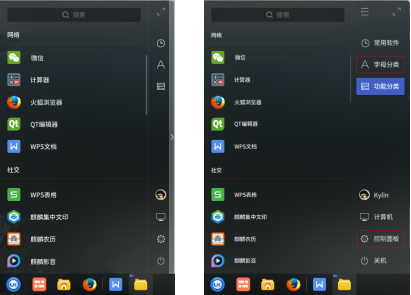

Users can click the button at top right corner to view fullscreen menu mode, as shown in Fig. 34.

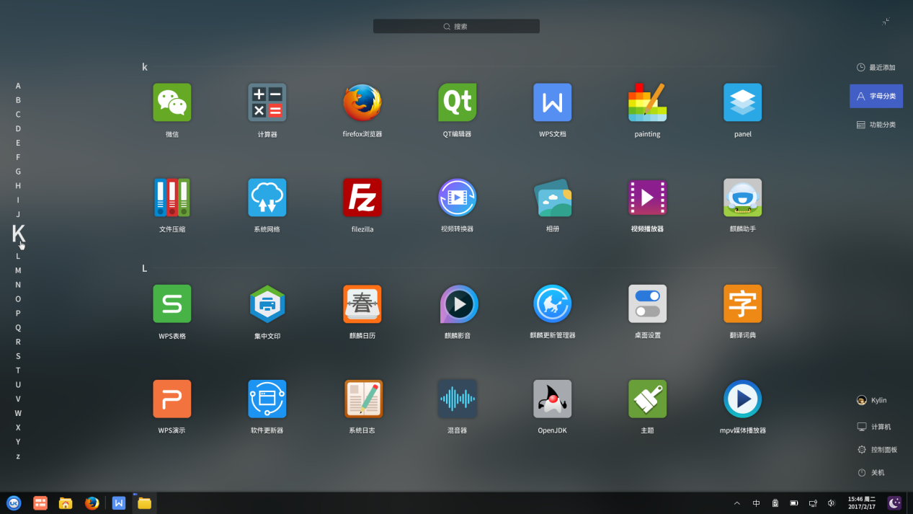

#### Function Button at right side
It provides User Avatar, Computer, Control Center and Shutdown four options.

##### User Avatar
Click "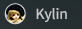" to view user's informations.

##### Computer
Click "" to open personal home folder

##### Control Center
Click "" to go to the control center.

##### Shutdown
###### Lock Screen
When users do not need to use the computer temporarily, the lock screen can be selected (without affecting the current running state of the system) to prevent misoperations. And input the password to re-enter the system. The system will automatically lock the screen after a period of idle time by default.

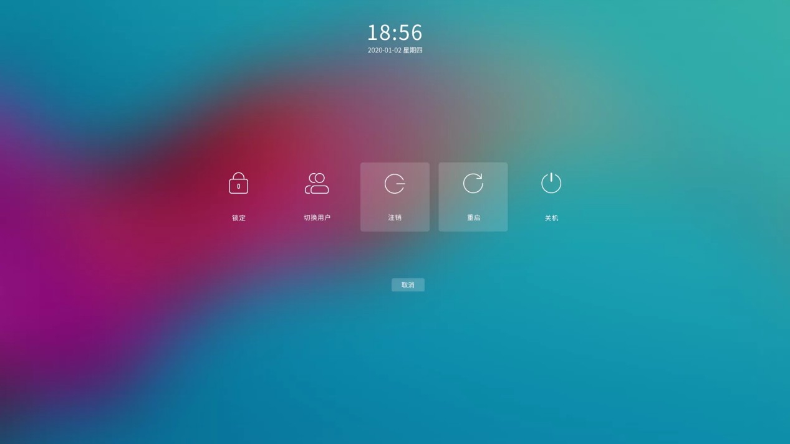

###### Switch Users & Log Out
When you want to select another user to log in uing the computer, you can select "Log out" or "Switch user". At this point, the system will close all running applications; Therefore, please save the current jobs before performing this action.

###### Shutdown & Reboot
There are two ways:

1)"Start Menu" > "Shutdown"

It will pop up a dialog box as shown in Fig. 36, and users can choose shutdown or reboot as needed.

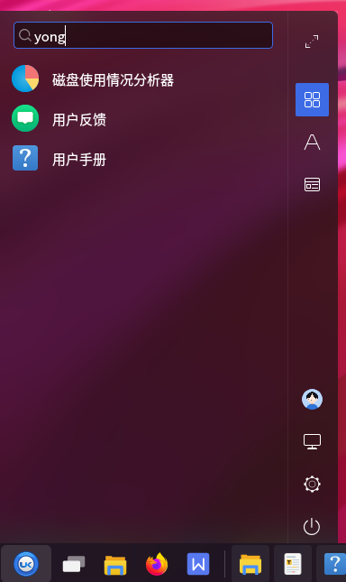

2)"Start Menu" > right side menu of the "Shutdown" button > "Shutdown"/"Reboot"

The system will shutdown or reboot immediately without poping up the dialog box.

### Advanced Setting

Right-clicking Start Menu, it provides lock screen, switch user, log out, reboot, and shutdown five shortcut options.

### Applications
Users can search apps in the search box by key words. As shown in Fig. 37, the result will show up automatically with the input.

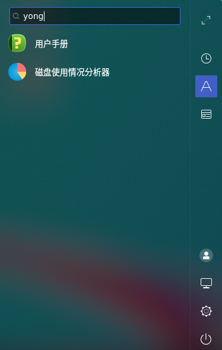

Right-clicking one app in the Start Menu, the right-click menu poping up is like Fig. 38.

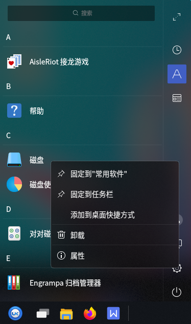

The options are described in Table 8.

| Option | Description |
| :------| :--------|
| Attach to "Common Software" |Add the selected software to the list of Common Software|
| Attach to Taskbar |Generate icon for the application on the Taskbar|
| Add to Desktop Shortcut |Generate shortcut icon for the application on the desktop|
| Uninstall |Remove the application|
| Attribute |Show the application's type, name, command and comment information|

**
Table 8 Options' Description
**

 

## FAQ
### Taskbar not showing?
（1）Open the terminal by <Ctrl + Alt + T>.

（2）Do "sudo mate-panel --reset" to restart the Taskbar.

（3）If it's still not effective, please do "reboot".

### Can’t login to the system after locking the screen?

（1）Switch to character terminal by <Ctrl + Alt + F1>.

（2）Input the user-name and passwd to login to the system.

（3）Do "sudo rm -rf ~/.Xauthority".

（4）Switch to graphical interface by <Ctrl + Alt + F7>, and input the passwd.

 

## Appendix 
### Shortcut Key

|Shortcut Key|Function|
| :------ | :-----
| F5 | Refresh the desktop |
| F1 | Open the user-guide|
| Alt + Tab | Switch the window |
| win | Open the Start Menu |
| Ctrl + Alt + L | Lock Screen |
| Ctrl + Alt + Delete | Log out |
| Ctrl + Alt + F1~6 | Switch to character terminal |
| Ctrl + Alt + F7 | Switch to graphical interface |
