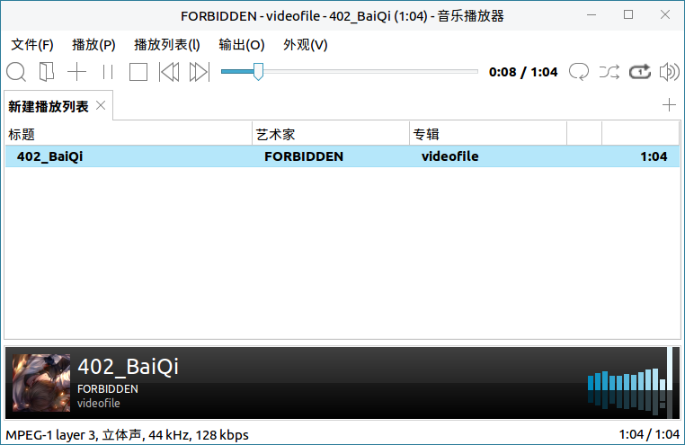
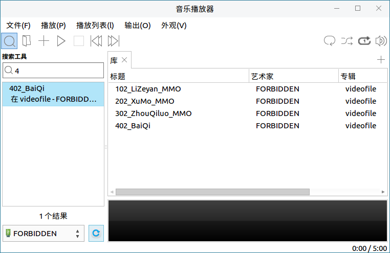
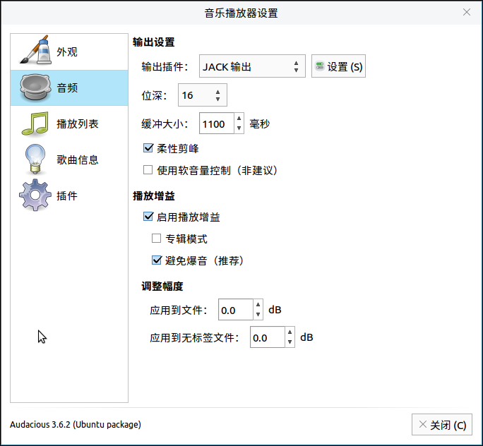
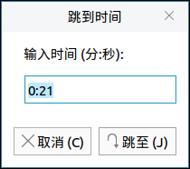

# 音乐播放器
## 概 述
音乐播放器支持多种音乐格式，提供便捷的音频体验。主界面简洁、直观，如图 1所示。

播放音乐时，界面如图 2所示。

 

## 基本功能
功能区如下图所示:

图标功能介绍：

| 图标 | 功能说明 | 图标 | 功能说明 |
|:------------|:------------|:------------|:------------|
|| 搜索 || 打开文件 |
|| 添加文件 || 播放/暂停 |
|| 停止 || 上一首 |
|| 下一首 || 循环播放 |
|| 随机播放 || 单曲循环 |
|| 音量调节 || 新建列表 |
|| 播放进度条 ||||

 

### 搜索工具
点击“”进入搜索界面，如图 4所示。

操作步骤：

1) 在左下角选择文件夹，如：桌面，如图 5所示。

2) 在搜索框中输入音乐的文件名，再点击“刷新”按钮，即可找到对应的音频文件，如图 6所示。

3）双击该文件，则添加至正在播放列表。

### 添加/打开文件
点击“”添加音乐文件，该音乐会添加到当前播放列表，等待播放。

点击“”打开音乐文件，该音乐将会覆盖“正在播放”列表中的所有内容，并立即播放。若当前不存在“正在播放”列表，则会新建一个。

### 新建列表
点击声音按钮下方的“”按钮，可创建新播放列表，如图 8所示。

 

## 高级功能
用户可通过菜单栏上的选项，对音乐播放器进行更详细的设置。此处对部分设置进行简要介绍。

### 文 件
#### 设 置
点击“文件” > “设置”，打开设置页面，如图 9所示。

- **外 观**

1）播放列表标签页

总是显示标签页：即使当前没有播放列表，也会显示一个空列表。

显示条目数量：显示当前列表中的文件数量。

显示关闭按钮：在列表名称旁边显示关闭按钮。

2）播放列表列：通过“可用列”和“显示列”间的左/右箭头，自定义播放器窗口中要显示的音频文件的信息。

3）杂项：设置按键盘的左/右方向键时，快退/快进的时长。

- **音 频**

音频设置是一些专业的设置，包括输出插件、位深、播放增益、调整幅度等，如图 11所示。

- **播放列表**

播放列表设置包括行为、兼容性、歌曲显示、高级四个部分，如图 12所示。

- **歌曲信息**

歌曲信息设置包括专辑封面个弹出信息两个部分，如图 13所示。

- **插件设置**

插件设置提供了一些详细设置项，如图 14所示。

### 播 放
#### 跳到时间
点击“播放” > “跳到时间”，可跳到指定的位置，如图 15所示。

#### 跳到歌曲
点击“播放” > “跳到歌曲”，可在弹窗中选择目标歌曲，如图 16所示。

#### 片段循环
1）在要重复播放的片段开始处，点击“播放” > "设置循环点A"。

2）在要重复播放的片段结束处，点击“播放” > "设置循环点B"。

3）音乐播放器会循环播放这一段内容。点击“播放” > “清除循环点”，取消片段循环。

### 播放列表
#### 排序/排序选中项
点击“播放列表” > “排序”/“排序选中项”，可按照一定规则进行排序。提供的可选规则如图 17所示。

#### 删 除
点击“播放列表” > “删除重复”，可按标题、文件名或文件路径删除重复项。

点击“播放列表” > “移除不存在文件的项”，可把列表中文件不存在的条目删除。

#### 播放列表管理器
点击“播放列表” > “播放列表管理器”，可以新建、移除和重命名播放列表，如图 18所示。

### 输 出
#### 均衡器
点击“输出” > “均衡器”，可自定义均衡器的各项数值，如图 19所示。

### 外 观
点击“外观”，可设置哪些部分需要在主界面中显示，如图 20所示。

 

## 附 录
### 快捷键

| 快捷键 | 功能 |
| :------------ | :------------ |
| Ctrl+O | 打开文件 |
| Shift+Ctrl+O | 添加文件 |
| Ctrl+Y | 搜索本地音乐库 |
| Ctrl+Q | 退出音乐播放器 |
| Ctrl+Enter | 从头播放 |
| Ctrl+， | 暂停 |
| Ctrl+. | 停止 |
| Alt+↑ | 播放上一首音乐 |
| Alt+↓ | 播放下一首音乐 |
| Ctrl+R | 列表循环 |
| Ctrl+G | 单曲循环 |
| Ctrl+S | 随机播放 |
| Ctrl+N | 禁止自动播放下一首 |
| Ctrl+M | 在这首后停止 |
| Ctrl+I | 查看歌曲信息 |
| Ctrl+K | 跳到指定时间 |
| Ctrl+J | 跳到指定歌曲 |
| Ctrl+1 | 设置循环点A |
| Ctrl+2 | 设置循环点B |
| Ctrl+3 | 清除循环点 |
| Shift+Enter | 恢复播放 |
| Ctrl+T | 新建一个播放列表 |
| F2 | 重命名当前播放列表 |
| Ctrl+W | 移除当前播放列表 |
| Ctrl+P | 管理播放列表 |
| Shift+Ctrl++	| 调高音量 |
| Ctrl+- | 调低音量 |
| Ctrl+E | 设置均衡器参数 |
| Shift+Ctrl+M | 选择是否显示菜单 |
| Shift+Ctrl+I | 选择是否显示信息区域 |
| Shift+Ctrl+S | 选择是否显示状态栏 |
| Shift+Ctrl+R | 选择是否显示剩余时间 |

