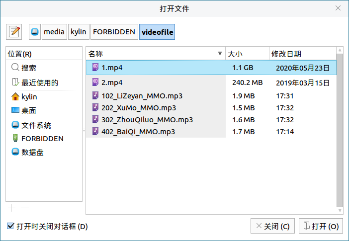

# 音乐播放器帮助手册
## 1.概 述
音乐播放器是一款播放的音频软件，支持播放多种音乐格式，具有音乐回放、音乐导入、显示歌词等功能，旨在为用户的休闲娱乐提供便捷的音频体验。主界面简洁、美观，由标题栏（最小化、最大化及关闭）、菜单、播放功能控制区、信息区域、虚拟效果信息栏及状态栏组成，如图1所示。

 

播放音乐时的音乐播放器如图2所示。

 

## 2.基本功能
基本功能图标及其功能介绍；

 

|图 标|	图标功能说明	|图 标|	图标功能说明
| :------------ | :------------ | :------------ | :------------ |
||	搜索工具||		打开文件
||	添加文件||		播放/暂停
||	停止	||	上一首
||	下一首	||	循环播放
||	随机播放	||	单曲循环
||	音量调节	||	新建列表（播放列表区）
||	播放进度条||||

##### 表1基本功能图标及其功能介绍
 

### 2.1.搜索工具
用户可以通过点击“”图标进入搜索工具界面，如图4所示。

 

操作步骤：
1) 选择文件夹，如：选择桌面，如图5所示。

 

2) 在搜索框中输入需要导入到音乐播放器中的音乐，如：搜索桌面文件“优麒麟”，如图6所示。

 

3) 在点击“刷新”按钮（图标“”），刷新即可找到对应的音乐库音频文件，如图7所示。

 

### 2.2.打开/添加文件
用户可以通过点击“”图标/“”图标，打开和添加需要导入到音乐播放器中的文件，如图8所示。

 

### 2.3.新建列表
用户可以通过点击播放列表区中的“”图标，新建播放列表，如图9所示。

 

## 3.高级功能
用户可以通过菜单的文件、播放、播放列表、输出以及外观选项，对音乐播放器进行相关操作。
高级功能图标及其功能介绍：

 

|图 标	|图标功能说明|	图 标|	图标功能说明
| :------------ | :------------ | :------------ | :------------ |
||	打开文件（O）||		添加文件（A）
||	搜索库（L）	||	设置...（S）
||	退出（Q）	||	播放（P）
||	暂停（e）	||	停止（S）
||	上一首（v）	||	下一首（N）
||	歌曲信息...（I）	||	跳到时间...（T）
||	跳到歌曲...（J）	||	播放/继续（P）
||	排序（S）	||	排序选中项（I）
||	删除重复（D）	||	移除不存在文件的响（v）
||	新建（N）	||	重命名（a）...
	||移除播放列表（v）	||	导入...（I）
||	播放列表管理器（M）...	||	调高音量（U）
	||调低音量（D）	||	均衡器（E）

##### 表2高级功能图标及其功能介绍
 

### 3.1.文 件
用户可以通过点击：菜单>文件，进入到文件选项，对文件进行打开、添加和搜索库等操作。

 

#### 3.1.1.设 置
用户可以通过点击：菜单>文件>设置，进入到设置选项，对文件的外观、音频、播放列表、歌曲信息以及插件进行自定义设置，如图12所示。

 

##### ●外 观
外观设置主要是对界面进行设置，包括播放列表标签页、播放列表列及杂项三个部分。
播放列表标签页可以设置成三种模式：总是显示标签页、显示条目数量以及显示关闭按钮，如图13所示。

 

播放列表列可以根据用户的需求，对播放列表的信息列进行个性化设置（将可用列添加到显示列当中），可用列有：序号、年份、专辑艺术家、音轨、流派、文件路径、文件名、自定标题以及比率，且可选择是否显示列头，如图14所示。

 

杂项主要包括两个部分：箭头键排序（秒）和歌曲改变时滚动，如图15所示。

 

##### ●音 频
音频设置包括输出设置、播放增益以及调整幅度三个部分，如图16所示。

 

输出设置可以对输出插件、位深（16、24、64、浮点）、缓冲大小等进行设置，如图17所示。

 

|输出插件|	设 置
| :------------ | :------------ |
|PulseAudio输出|	无
|ALSA输出|	PCM设备，混音设备，混音单元
|SDL输出	|无
|FileWriter插件|	输出文件格式（WAV，MP3，Vorbis，FLAC），保存路径，文件生成来源，文件名前加上音轨号
|JACK输出	|自动连接到输出端口

##### 表3输出插件
 

 

 

 

##### ●播放列表
播放列表设置包括行为、兼容性、歌曲显示、高级四个部分，如图21所示。

 

##### ●歌曲信息
歌曲信息设置包括专辑封面个弹出信息两个部分，如图22所示。

 

##### ●插件设置
插件设置包含一般设置、音效设置、虚拟效果设置、输入设置、播放列表设置以及传输设置六部分，如图23所示。

 

#### 3.1.2.退 出
用户可以通过“退出”选项或点击关闭键退出软件。

### 3.2.播放
用户可以通过点击：菜单>播放，进入到播放选项，对文件进行播放、暂停、上一首等操作，如图24所示。

 

#### 3.2.1.跳到时间
用户可以通过点击：菜单>播放>跳到时间，对音频的播放时间节点进行设置，如图25所示。

 

#### 3.2.2.跳到歌曲
用户可以通过点击：菜单>播放>跳到歌曲，通过过滤器对音频进行选择，如图26所示。

 

### 3.3.播放列表
用户可以通过点击：菜单>播放列表，进入到播放列表选项，对播放列表进行排序、自检、重命名等操作，如图27所示。

 

#### 3.3.1.排 序
用户可以通过点击：菜单>播放>排序，对播放列表按照一定规则排序，如图28所示。

 

#### 3.3.2.排序选中项
用户可以通过点击：菜单>播放>排序选中项，对播放列表中选中的音频按照一定规则排序，如图29所示。

 

#### 3.3.3.删除重复
用户可以通过点击：菜单>播放>删除重复，对播放列表中重复的音频按照一定规则做删除操作，如图30所示。

 

#### 3.3.4.播放列表管理器
用户可以通过点击：菜单>播放列表>播放列表管理器，对播放列表进行新建、移除以及重命名管理，如图31所示。

 

 

#### 3.3.5.队列管理器
用户可以通过点击：菜单>播放列表>队列管理器，对队列进行操作，如图33所示。

 

### 3.4.输 出
用户可以通过点击：菜单>输出，进入到输出选项，进行调高音量、调低音量操作，并对均衡器、音效进行设置，如图34所示。

 

#### 3.4.1.均衡器
用户可以通过点击：菜单>输出>均衡器，对均衡器进行设置，如图35所示。

 

#### 3.4.2.音 效
用户可以通过点击：菜单>输出>音效，对音效进行设置，如图36所示。

 

### 3.5.外 观
用户可以通过点击：菜单>外观，进入到外观选项，对音乐播放器外观进行设置，如图37所示。

 

## 4.常见问题
（待补充）
## 5.附 录
### 5.1.快捷键

|选 项|	快捷键	|操作内容
| :------------ | :------------ | :------------ |
|打开文件（O）...|	Ctrl+O	|选择音频源文件并打开
|添加文件（A）	|Shift+Ctrl+O|	选择添加音频源文件
|搜索库（L）|	Ctrl+Y	|搜索本地音乐库
|退出（Q）	|Ctrl+Q|	退出音乐播放器
|播放（P）|Ctrl+回车	|播放音乐
|暂停（e）	|Ctrl+，|	暂停播放
|停止（S）	|Ctrl+.	|停止播放
|上一首（v）|	Alt+上	|播放上一首音乐
|下一首（N）|	Alt+下	|播放下一首音乐
|循环播放（R）|	Ctrl+R	|循环播放音乐
|单曲循环（G）|	Ctrl+G	|单曲循环播放音乐
|随机（h）|	Ctrl+S	|随机播放音乐
|禁止自动播放下一首（o）	|Ctrl+N	|禁止自动播放下一首
|在这首歌后停止	|Ctrl+M	|在这首后停止
|歌曲信息...（I）|	Ctrl+I	|查看歌曲信息
|跳到时间...（T）|	Ctrl+K	|跳到指定时间点
|跳到歌曲...（J）|	Ctrl+J	|跳到指定歌曲
|设置循环点A	|Ctrl+1	|设置一个循环点
|设置循环点B|	Ctrl+2	|设置另一个循环点
|清除循环点（C）	|Ctrl+3|	清除循环点
|播放/继续（P）	|Shift+回车	|播放或者从此刻继续播放
|新建（N）	|Ctrl+T	|新建一个播放列表
|重命名（a）...	|F2	|对当前播放列表进行重命名
|移除播放列表（v）|	Ctrl+W	|移除播放列表
|播放列表管理器（M）...	|Ctrl+P	|管理播放列表
|队列管理器（Q）...|	Ctrl+U|	管理队列
|调高音量（U）	|Shift+Ctrl++	|调高音量
|调低音量（D）	|Ctrl+-	|调低音量
|均衡器（E）|	Ctrl+	|设置均衡器参数
|显示菜单（M）|	Shift+Ctrl+M	|选择是否显示菜单
|显示信息区域（n）|	Shift+Ctrl+I	|选择是否显示信息区域
|显示状态栏（S）|	Shift+Ctrl+S	|选择是否显示状态栏
|显示剩余时间（R）|	Shift+Ctrl+R|	选择是否显示剩余时间（默认为已播放时间）

 
