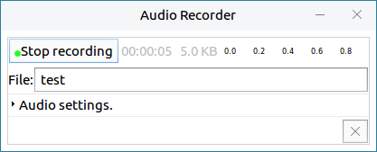
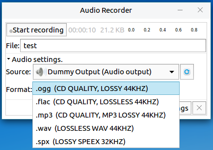
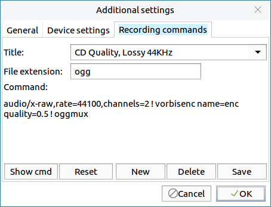

# Audio Recorder
## Overview
Record audio, and set audio source, recording file format, etc..

 

## Basic Function
### Recording
Input the file name at the "File" box, and click "Start recording", as shown in Fig 2.

The recording files are saved in "Audio" folder at the user's home directory.

 

## Advanced Function
Click the fold menu of Audio settings to set the following items.

### Source

### Format
There provides various of recording file formats to be selected.

### Additional settings

- **General** : Modify the saving location, icon displaying, and auto-start.
  

- **Device setting** : Set audio source and recording device.
 

- **Recording commands** : Modify the recording command and set file's default format, etc..
  

