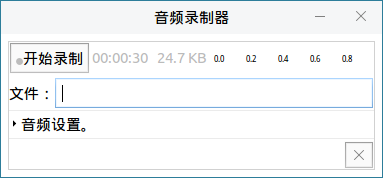
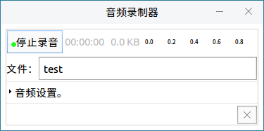
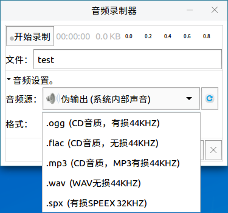
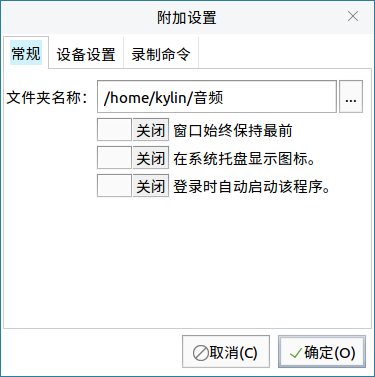
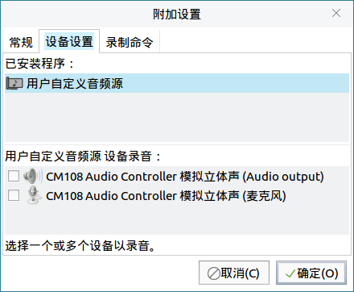
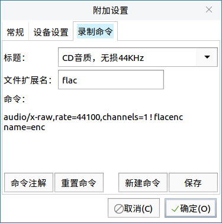

# 音频录制器

## 1  概述
录制音频，设置音频源、录音文件格式等。用户可通过 **开始菜单 > 所有程序 > 音频录制器** 打开该软件。

 

## 2  基本功能
在 **文件** 输入框内输入文件名，点击 **开始录制** 即可开始录音，如下图所示。录制的文件默认保存在用户主目录下的 **音频** 文件夹中。

 

## 3  高级设置
点开音频设置的折叠菜单，可对以下项进行设置。

### 3.1  音频源设置

- **麦克风** 结尾 —— 以麦克风作为音频源。

- **Audio output** 结尾 —— 以电脑内部正在播放的声音为音频源。

 

 

### 3.2  录音文件格式
软件提供了多种录音文件的格式可选。

 
 

### 3.3   附加设置

- **常规** ：修改文件保存位置，托盘显示，登录自启动。
  

 

- **设备设置** ：设置音频源。
 

 

- **录制命令** ：调整录制命令，设置默认文件格式等。
  

 

## 4  常见问题
