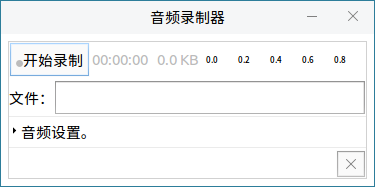

# 音频录制器
## 概 述
录制音频，设置音频源、录音文件格式等。

 

## 基本功能
### 录 音
在“文件”输入框内输入文件名，点击“开始录制”即可开始录音，如图 2所示。录制的文件默认保存在用户主目录下的“音频”文件夹中。

 

## 高级功能
点开音频设置的折叠菜单，可对以下项进行设置。

### 音频源设置

 

### 录音文件格式
软件提供了多种录音文件的格式可选。

 

### 附加设置

- **常规** ：修改文件保存位置，托盘显示，登录自启动。
  

- **设备设置** ：设置音频源。
 

- **录制命令** ：调整录制命令，设置默认文件格式等。
  

 

