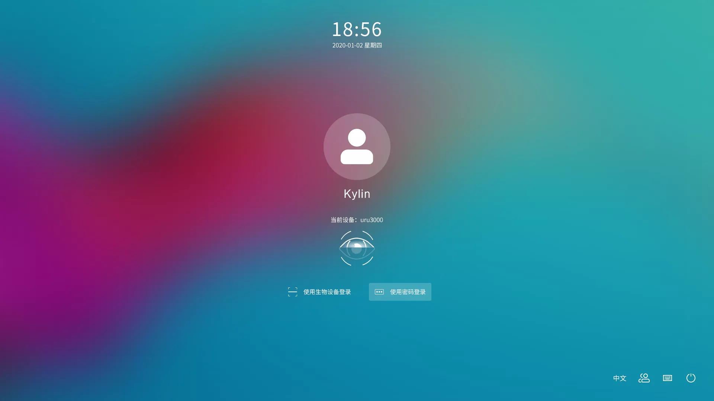
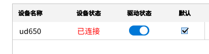
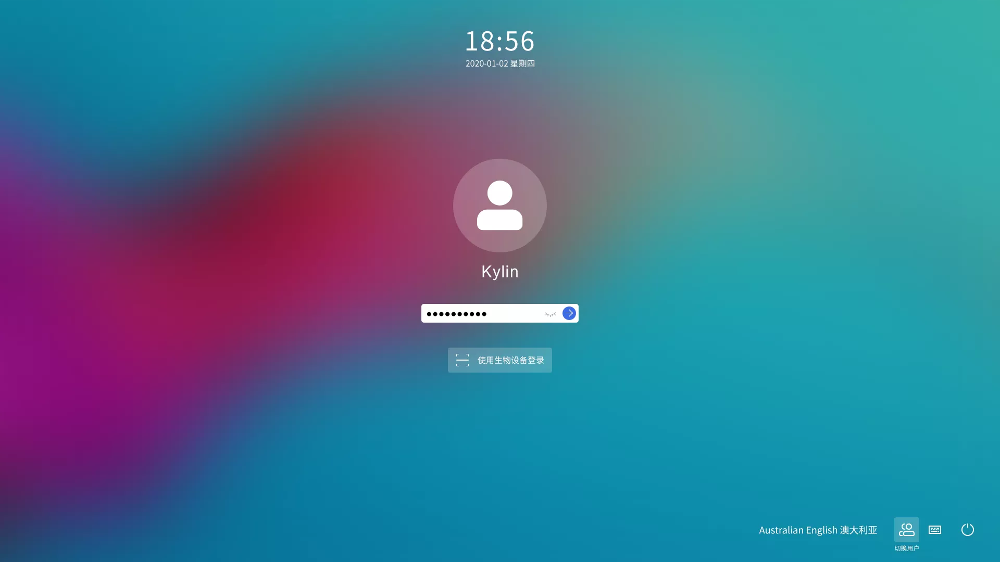
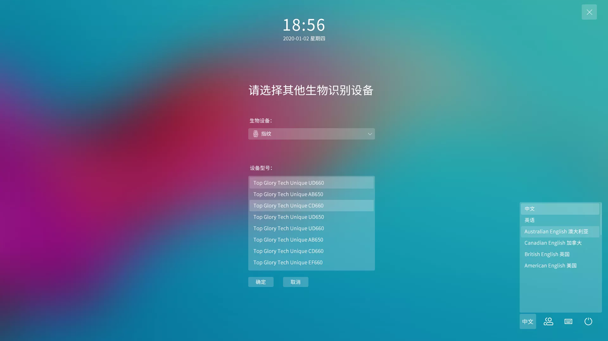
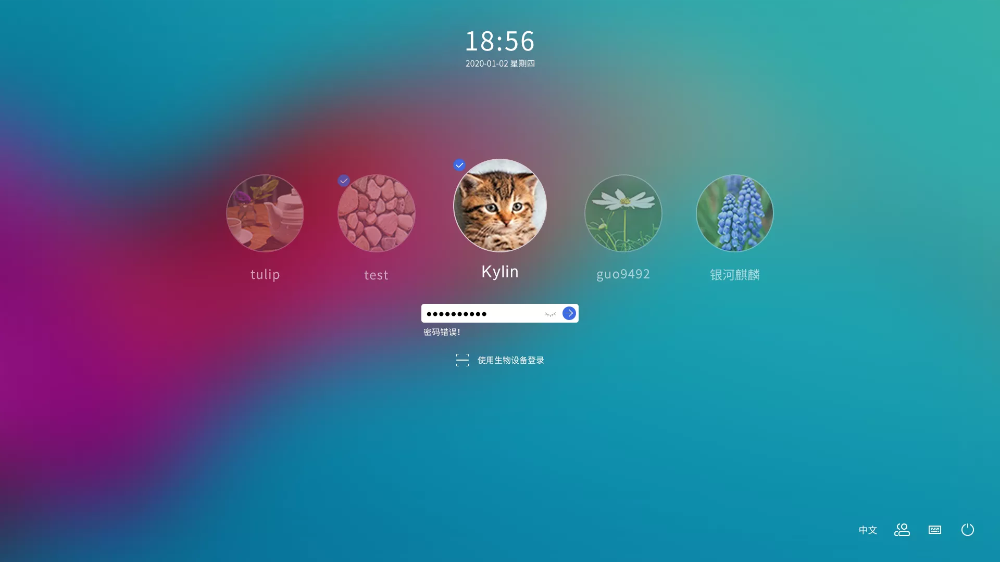
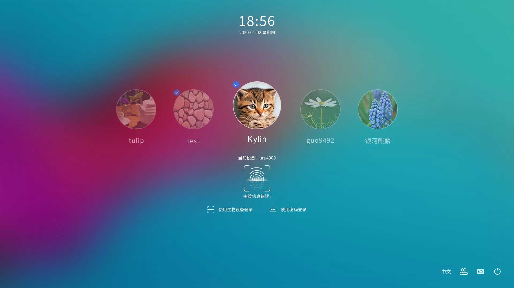
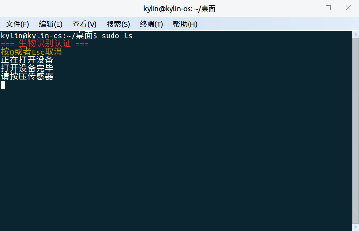

# 生物识别管理工具帮助手册

## 1.概 述
生物特征认证比传统的口令密码更为方便、安全，它不需要记住复杂的密码，每个人的指纹具有与其他人不同的唯一性和在一定时期内不变的稳定性，不易伪造和假冒，利用指纹认证技术进行身份认定，具备安全、可靠、准确的特点。生物特征认证可以支持登录，锁屏，
以及授权认证。
想要默认使用生物认证，则需要满足4个条件。
1.确认设备是已连接状态。
2.系统组件使用生物特征进行认证开关状态为打开。
3.设置连接设备为默认设备。
4.使用该设备的用户录入了指纹。

生物识别管理工具指纹认证时的解锁界面如图2所示。

## 2.基本功能
### 2.1.生物识别管理工具
生物识别管理工具是由麒麟团队开发的一款用于管理生物识别的辅助软件。主要功能
括生物识别认证管理、生物识别服务管理、生物识别设备驱动管理以及生物识别特征的管理等功能。
如图3，在管理工具主界面上方，分别显示了主界面，指纹，指静脉，虹膜和声纹。代表管理工具有五个页面。

#### 2.1.1.主界面
主界面上方，“系统组件使用生物特征进行认证”是开启生物特征的开关，只有打开这个开关，才能够使用生物认证。

主界面左侧显示了生物特征的类型，右侧显示的是该类型所对应的驱动设备，显示内容包括设备名称、设备状态是否已连接、驱动状态，以及是否为默认设备。当想要使用某种生物特征设备时，需要先连接上该设备，然后将该设备设置为默认设备，这样就可以使用该设备进行生物特征认证了，如下图所示。

#### 2.1.2.指静脉页面
指静脉，指纹，虹膜和声纹的页面在这里是类似的，这里主要以指静脉页面作为例子介绍，其它的几种生物特征类型基本也和这里一致。指静脉页面截图如图6所示。左侧显示的是指纹驱动，右侧上半部分显示的是该驱动所对应的信息。包括设备简称，验证类型，总线类型等等。右侧中间显示的是这静脉列表，包括指静脉的名称和序列号。
右侧下半部分分别录入，验证，搜索，删除，清空按钮，将在下一小节进行介绍。

	
#### 2.1.3.指静脉的录入及其它操作
##### ●录入
在指静脉页面点击录入，可以进行指静脉的录入，点击录入之后，就会出现图7所示页面，需要输入密码进行验证，在输入密码验证成功之后，就开始录入指静脉了，录入界面如图8所示，之后按照弹出的窗口上面的文字信息，进行指静脉录入即可。在录入成功之后，就可以在指静脉列表里看到对应的指静脉。

##### ●验证
选中需要验证的指静脉，然后点击验证，皆可以进行指纹的验证，验证完成后会提示是否验证 成功。

##### ●搜索
点击搜索，然后录入指静脉，可以快速的检索到当前验证的指静脉所对应的序列号和特征名称。

##### ●删除和清空
选中需要删除的指静脉，然后点击删除，在进行授权操作成功之后，就可以删除所选中的指静脉了。清空操作不需要选择指静脉，点击清空并进行授权成功之后，就会清空当前用户所对应的所有指静脉了。
### 2.2.登录
登录应用提供了进入桌面的图形化界面，需要用户输入用户的密码进行登录，在登录成功以后，就可以启动桌面环境，进入桌面了。使用密码登录的界面如图11所示。
当然，在开启生物特征认证之后，也可以使用验证生物特征进行认证。登录使用生物认证需要满足三个条件：1.生物识别管理工具里的系统组件使用生物特征进行认证开关状态为打开。2.连接了设备，且将设备设置成为了默认设备。3.登录用户为所使用的设备录入了生物特征。当不满足上述所有条件时，只能使用密码认证，且不能切换到生物认证。
登录界面使用生物特征认证的界面如图12所示。

当插入的生物特征设备数目为2个或2个以上是，会显示其它设备按钮，点击该按钮可以选择其它设备，其它设备界面如下图所示。

### 2.3.锁屏
在系统进入空闲时，如果控制面板设置了显示锁屏。则会在系统进入空闲时启动锁屏程序，需要用户输入密码解锁后才能进入桌面。锁屏和登录的界面和操作基本类似，下面是锁屏时的截图，分别为输入密码解锁和使用生物认证解锁。

### 2.4.授权
当使用需要验证用户身份的程序时，会弹出一个授权窗口，需要输入密码.认证通过以后就可以使用需要特权的程序。授权界面如图16所示。在满足使用生物特征的条件下，也可以使用生物特征进行认证。界面图如图17所示。按照界面上的提示进行操作即可。

### 2.5.sudo命令
当满足使用生物特征进行认证的条件时，sudo命令也可以使用生物特征进行认证，按照文字提示进行生物特征的验证即可。

## 3.常见问题
### 3.1.锁屏卡住无法输入密码时怎么办？
（1）通过Ctrl + Alt + F1切换到字符终端。
（2）输入锁屏时所在的用户的用户名和密码
（3）执行命令“killall ukui-screensaver-dialog”。
（4）通过Ctrl + Alt + F7切回图形界面,如果登录了多个用户，也可能是Ctrl + Alt + F8等。

