# Kylin Box-manager
## Overview
Kylin Box-manager is developed by Kylin-Security-Team with a simple interface, and it aims to provide users with convenient and safe personal file protection.

Click "Start Menu" > "All App" > "box-manager" to open this app, as shown in Fig 1.

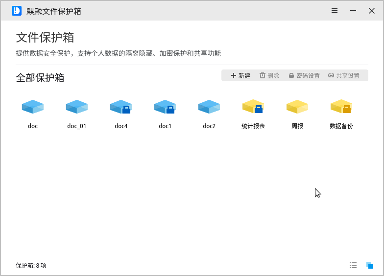

Kylin Box-manager can realize the security protection and sharing of user's private data by the combination of isolation and hiding, encryption protection and sharing authorization. The features as shown below:

- Newly created personal directories (i.e. BOX, BOX directories) are visible only to the user himself and not to other users.

- Users can authorize other users to access private box with read-only or read-write permission, and access the box shared by other users.

- Users can set encryption for private box. Therefor other users need to have sharing authorization and password authentication to access encrypted box.

- Encrypted box needs to be used after mounting. The mounted box cannot be deleted or renamed; Password setting and sharing setting are not allowed, either. If the changes above are necessary, the box should be umount first. As shown below:

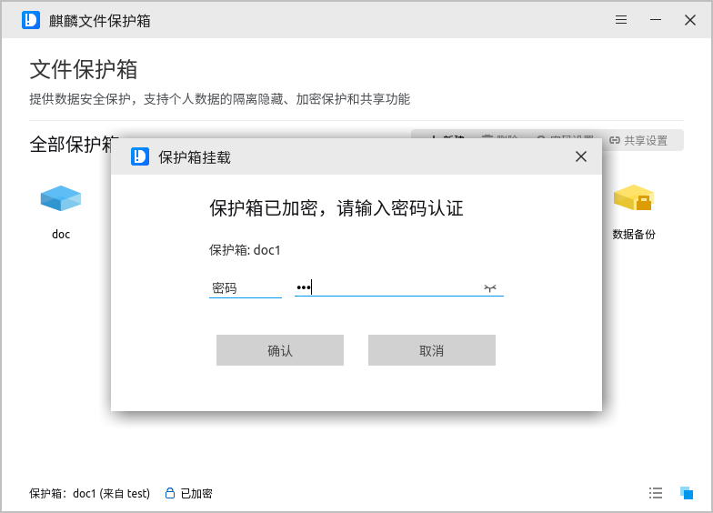

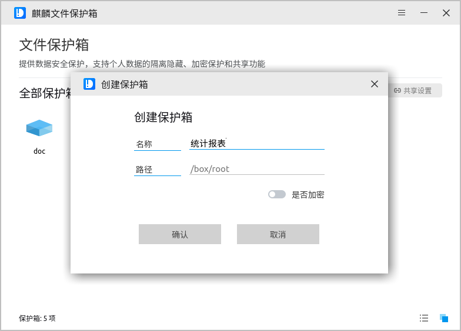

Different icons mean different states of the box directory，as shown below:

| Icon | Decription |
|:-----|:-----|
|| General box directory |
|| Encrypted box directory |
|| Encrypted box directory (Mount state) |
|| Box directory shared |
|| Encrypted and sharing box directory |
|| Encrypted and sharing box directory (Mount state) |
|| Box directory shared by other users |
|| Encrypted box directory shared by other users |
|| Encrypted box directory shared by other users (Mount state) |

 

## Basic Function
Kylin Box-manager provides box creation, rename, delete, encryption and share settings, etc., and two ways to view - icon, list. Users can operate them by using function buttons and right-click menu.

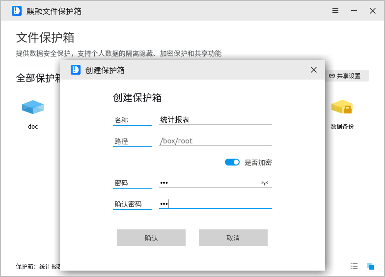

The boxes created by different user are located at "/box/[UserName]/", and users can access this directory by double-clicking the corresponding icon on the tool interface. The operations for the files and directories in the box are the same way as in general - terminal and caja are both allowed.

### New
Click "New" button to create a new private box. Input the name of the box and click "Yes", as shown in Fig 6:

If users want to encrypt at the same time, please open the encrypt switch and input the password, as shown below:

### Delete
Click "Delete" button to delete the box directory that users don't need anymore. Select "Yes" in the pop-up window, as shown in Fig 8.

### Rename
Right click the box directory choosing "Rename", and input the new name. If the box is encrypted: 

- Password verification is required.

- Mount state is not allowed. 

As shown below:

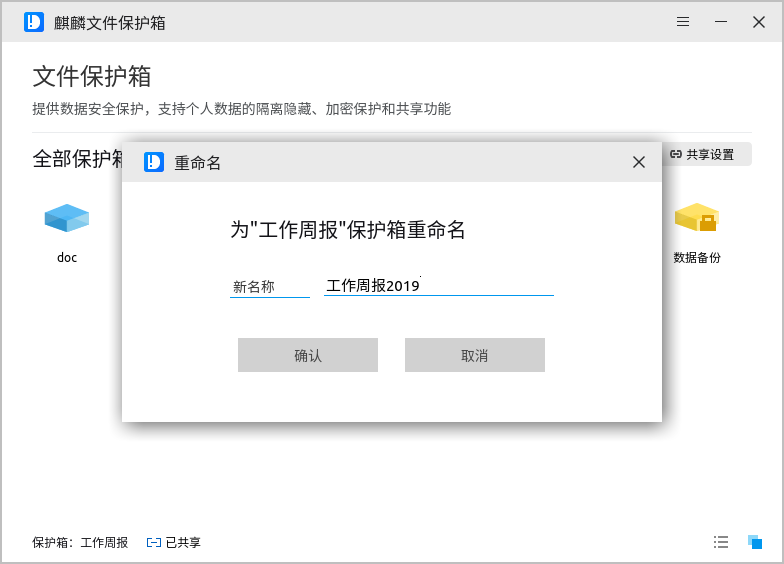

### Set Password
For unencrypted box directories, users can click "Set Password" button to encrypt them, as shown below: 

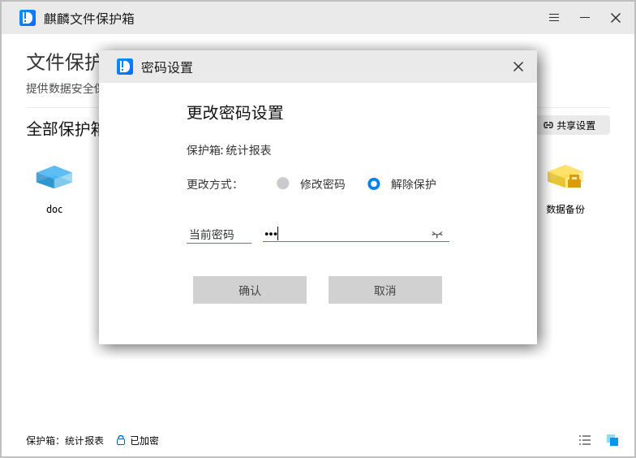

For encrypted box directory, it can change password or removal protection. If the box is mounted, you should umount it first.

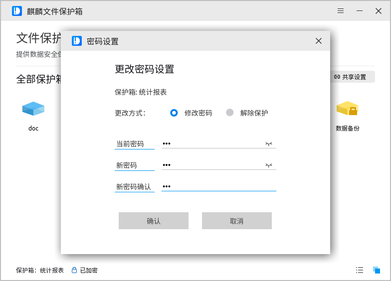

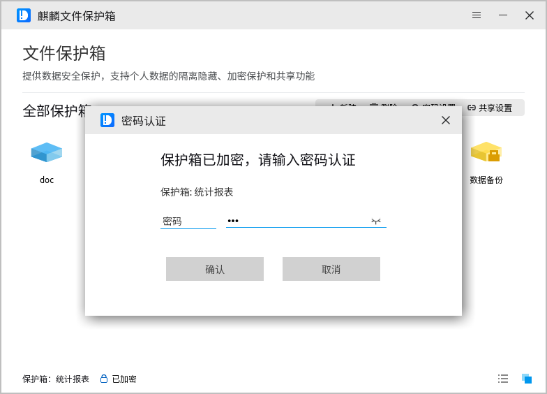

### Share Settings
If it's necessary to share the private box to others, you can choose the box and click "Share settings" button to set permissions for associated users in the share settings window. And then click "Apply" to make it effective. If the box is mounted, you should umount it first. As shown below:

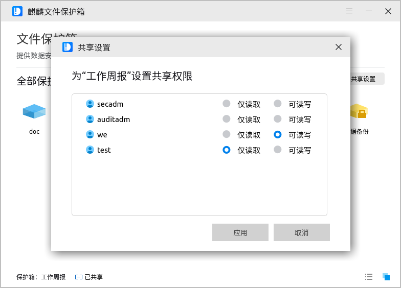

For encrypted boxes, password authentication is required.

### View Switching
It provides two types of views: Icon and List. And the default is icon view.

- Icon view: When the cursor hovers over the box, it will show the detailed path.

- List view: It supports to show the detailed informations of the box, and it can filter display by encryption, sharing and creator.

To change the viewing type, click the function button at the bottom right of the window.

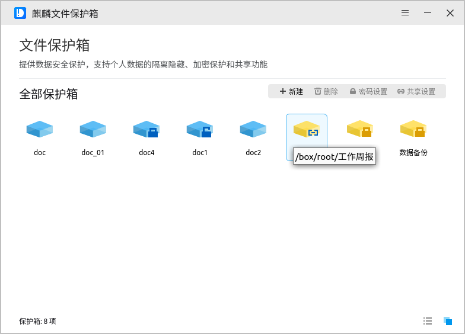

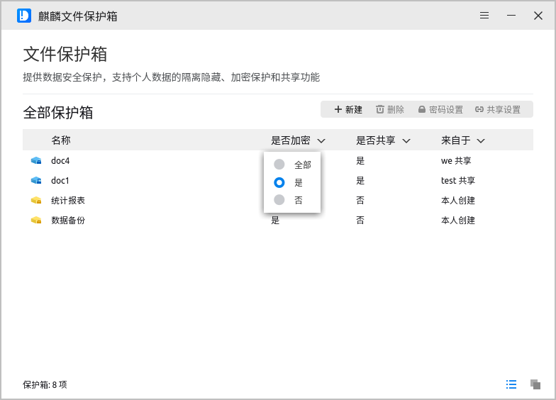
