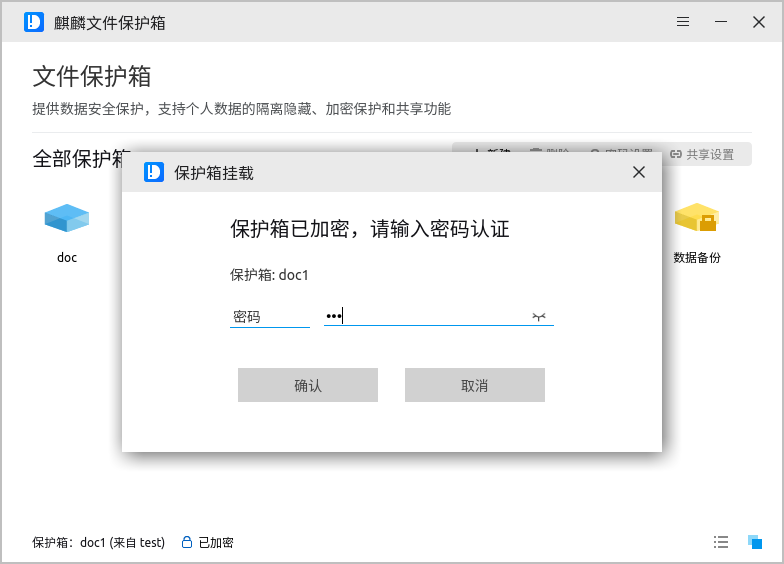
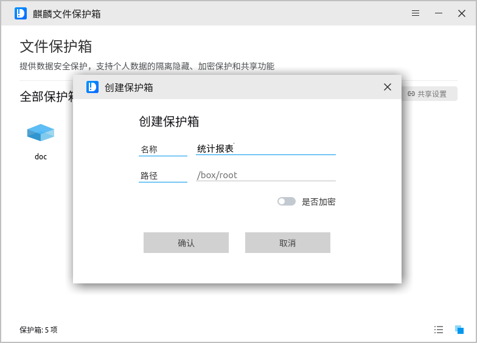
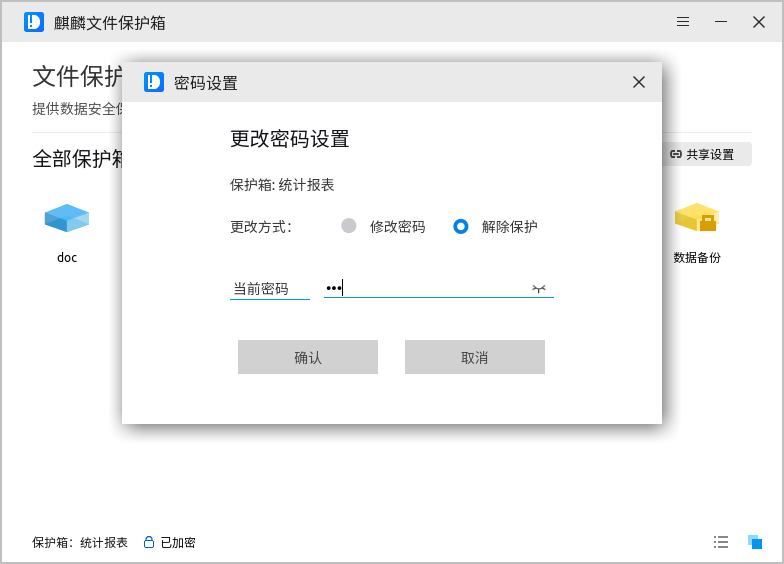

# 麒麟文件保护箱
## 概 述
麒麟文件保护箱由麒麟安全团队开发，界面简洁，为用户提供便捷、安全的个人文件保护。

点击 “开始菜单” > “所有程序” > “麒麟文件保护箱” 打开软件，主界面如图 1所示。

麒麟文件保护箱通过隔离隐藏、加密保护和共享授权结合的方式，实现用户私有数据的安全保护与共享。文件保护箱具有如下特性：

- 新创建的个人目录（保护箱、保护箱目录，或BOX、BOX目录）仅对用户自己可见，对其他用户不可见；

- 用户可以授权其他用户以只读或读写权限访问私有的BOX，也可访问其他用户共享的BOX；

- 用户可对私有BOX进行加密设置，其他用户访问加密BOX，除了需要具备共享授权，还要进行密码认证，通过验证才能访问BOX中的数据；

- 加密BOX需挂载后使用，已挂载的BOX不可删除或重命名，不可进行密码设置、共享设置。如需进行上述变更操作，需先卸载该BOX。具体如下。

不同的图标表示BOX目录的不同状态，具体说明如下：

|图 标|说 明|
|:-----|:-----|
||普通BOX目录|
||加密BOX目录|
||加密BOX目录（挂载状态）|
||已共享BOX目录|
||加密并共享的BOX目录|
||加密并共享的BOX目录（挂载状态）|
||其他用户共享的BOX目录|
||其他用户共享的加密BOX目录|
||其他用户共享的加密BOX目录（挂载状态）|

 

## 基本功能
麒麟文件保护箱提供了保护箱的创建、重命名、删除、密码与共享设置等功能，并支持图标、列表两种方式查看保护箱，用户可以通过功能按钮和右键菜单进行有关操作。

不同用户创建的保护箱位于对应的 “/box/[用户名]/” 目录下，用户可以通过保护箱管理工具界面，双击对应图标，访问该BOX目录。保护箱中的文件、目录的操作方法与普通文件、目录一致，都可以通过命令行终端或文件管理器进行。

### 新 建
用户可以点击“新建”按钮创建新的私有BOX，输入新建BOX名称，然后点击确认，如图 6所示。

如果用户希望创建BOX目录同时进行加密操作，仅需打开“是否加密”开关，然后输入并确认密码，如图 7所示。

### 删 除
用户选中不再需要的BOX目录，点击“删除”按钮，在警示弹窗中确认以完成相关操作。

### 重命名
右键点击需要改名的BOX目录，选择右键菜单中的“重命名”项，输入新名称并确认。加密BOX需要验证密码才可重命名；挂载状态的加密BOX不能重命名，需卸载后继续操作。

### 密码设置
对于未加密的BOX目录，用户可以点击“密码设置”按钮，对选中的BOX目录进行加密保护，输入并确认密码后，点击确认，如图 10所示。

已经加密的BOX目录，可以修改密码或解除保护。用户选中加密BOX，点击“密码设置”，即可修改原有设置。如果该BOX处于挂载状态，需要先卸载，再进行后续操作。

### 共享设置
如果用户需要将私有BOX目录共享给其他用户，选中待共享BOX后，点击“共享设置”按钮，在共享设置窗口中为相关用户设置权限，然后点击“应用”按钮即可生效；设置、修改、取消共享设置的操作步骤相同。如果修改共享设置前BOX处于挂载状态，需要先卸载。

对已加密BOX目录进行共享设置，需要密码验证。

### 视图切换
管理工具支持以图标、列表两种视图方式显示保护箱目录，默认为图标视图。图标视图下，光标悬停在BOX上，可以显示详细路径；列表视图支持查看BOX的详细信息，可以根据加密、共享情况以及创建人进行筛选显示。

如需切换查看方式，点击窗口右下方的功能按钮即可。

