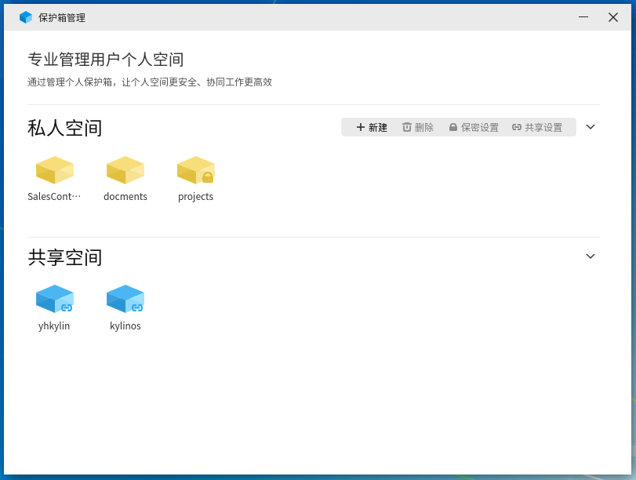
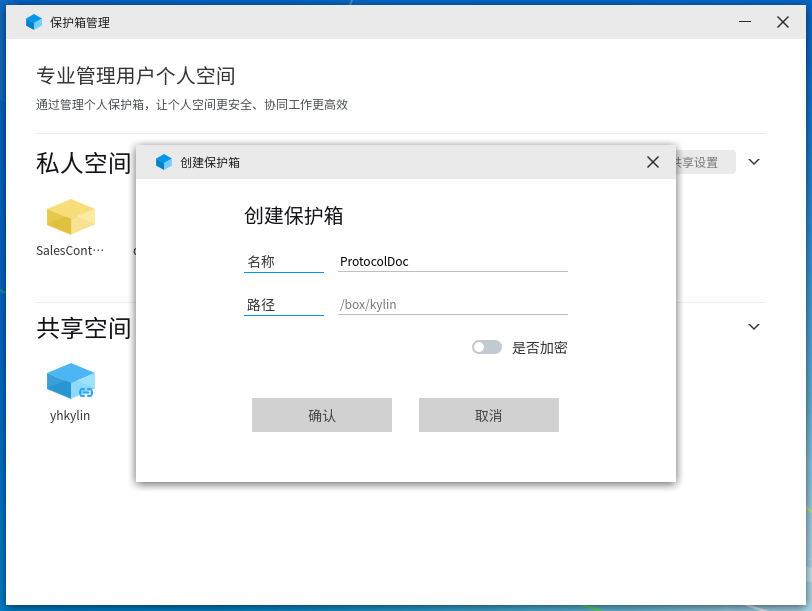
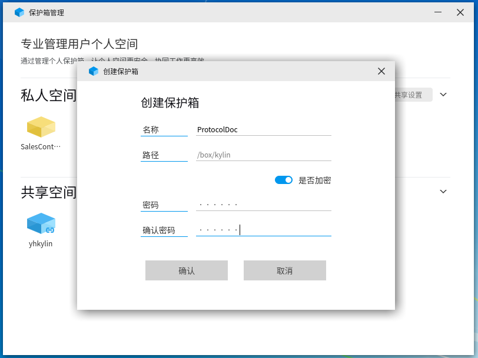
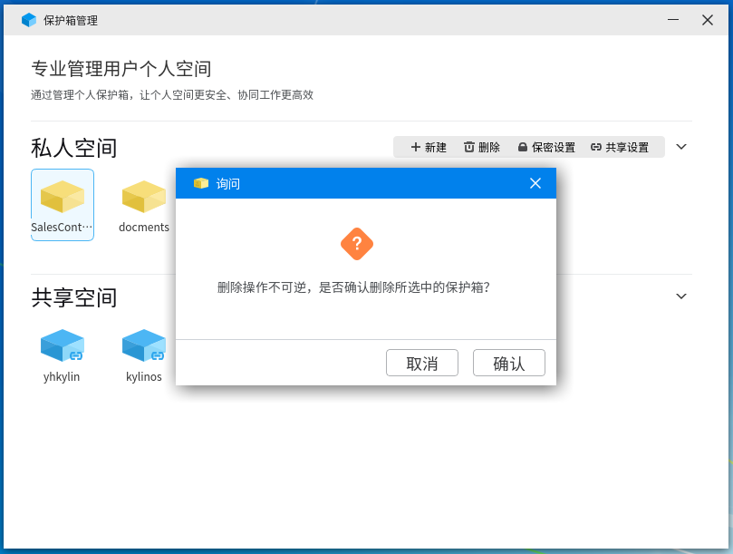
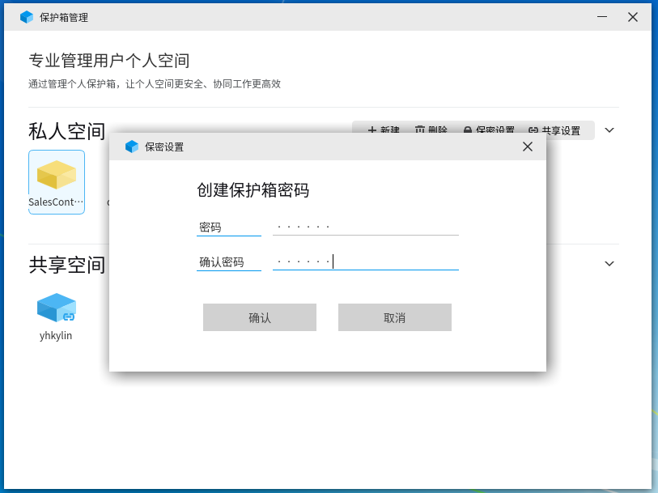
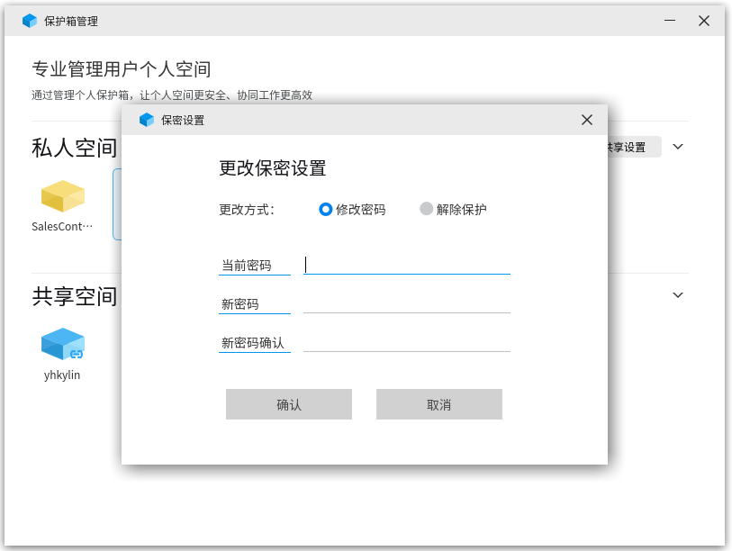
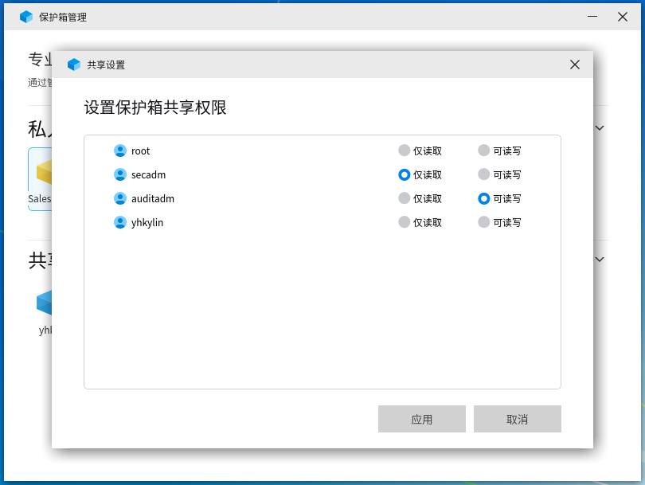

# 麒麟个人空间管理工具
## 概 述
麒麟个人空间管理工具是由麒麟安全团队开发的一款用户文件保护箱程序，界面简单明了，旨在为用户提供快捷、便利、安全的个人文件保护。

麒麟个人空间管理工具位置：菜单 > 所有软件 > 麒麟安全管理工具

软件打开后，如下图所示：

麒麟个人空间管理主要实现目录的私有保护、加密和共享。

新创建的个人目录仅对用户自己可见，用户对box进行加密后，需要密码认证通过后，方可访问。用户可以通过共享读或者共享读写的方式将自己的目录共享给其他用户。

麒麟个人空间管理工具可以直观的展示用户个人的box目录状态，同时可以查看到其他用户共享的目录，box图标实例说明如下：

:用户普通个人目录

:已加密个人目录

:已共享个人目录

:已加密并共享个人目录

:其他用户共享目录

## 基本功能
### 新 建
用户可以通过新建按钮创建个人新的box目录，目录创建位置为"/box/用户名称/"，用户仅需输入想要创建的box名称，然后点击确认即可，如下图所示：

同时，如果用户希望对目录进行加密操作，仅需打开是否加密开关，然后输入并确认密码即可，如下图所示：

### 删 除
当用户不需要该box目录了，只需点击选中需删除目录后，点击删除按钮来删除box目录，如下图所示：

### 保密设置
对于未加密的box目录，用户可以通过保密设置功能对选中的box目录进行加密操作，输入并确认密码后，点击确定即可，如下图所示:

已经加密的box目录，用户选中后点击保密设置，则可以对box目录进行修改密码操作，如下图所示:

### 共享设置
当用户需要将自己的box目录共享给其他用户使用时，用户可以选中需共享的目录，然后点击共享设置，然后在共享设置页面中对所需共享的用户设定其拥有的权限即可。如下图所示：

