# 光盘刻录器

## 概 述
本手册包括光盘刻录器的功能介绍，以及部分功能模块的详细介绍。

光盘刻录器是一款用于帮助用户刻录光盘的工具，包括数据刻录和镜像刻录两种方式。为用户提供了刻录光盘、擦除光盘、检查光盘完整性等功能。

光盘刻录器通过图形界面，直观的显示光盘刻录器为用户提供的功能，方便用户使用。

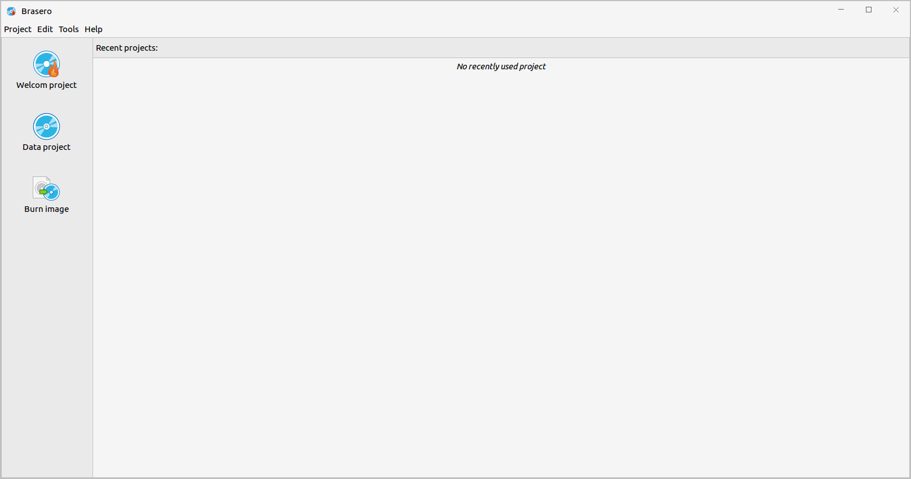
 

## 基本功能
主界面介绍：

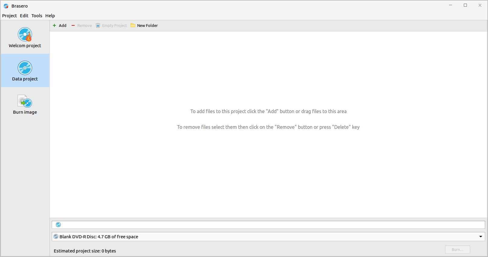

### 欢迎界面
在欢迎界面的顶部有项目、编辑、工具和帮助；左侧一栏有欢迎界面、数据刻录和镜像刻录三个选项；在主界面的用户可以看到最近项目。欢迎界面如图1所示。

1）项目

显示项目菜单栏。

2）编辑

显示编辑菜单栏。

3）工具

显示工具菜单栏。

4）帮助

显示帮助菜单栏。

5）右上角的最小化图标

将光盘刻录器最小化到任务栏。

6）右上角的最大化图标

将光盘刻录器的界面最大化成屏幕的大小。

7）窗口最大化是右上角的缩小图标

将最大化的光盘刻录器恢复原来大小。

8）欢迎界面

点击欢迎界面，如果在主界面点击欢迎界面不会有任何变化。如果在数据刻录或镜像刻录的界面点击欢迎界面，则会显示欢迎界面。

9）数据刻录

显示数据刻录界面。

10）镜像刻录

显示镜像刻录界面。

### 数据刻录
数据刻录界面添加、删除、清空项目、新建文件夹、项目、编辑、工具、帮助等按钮。在加入文件时，如果未插入CD/DVD盘片时，会出现提示语。

界面会显示你加入的文件名称、大小、描述以及空间。在界面的下方会显示光盘类型、光盘的大小、估算项目的大小以及刻录按钮；如果要生成镜像文件，则显示的是生成的镜像文件而不是光盘的大小。

数据刻录界面如图3所示：

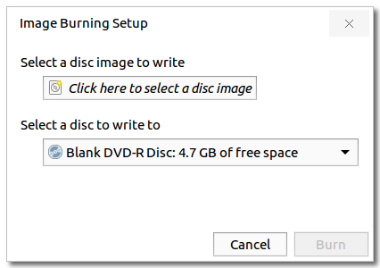

1）添加

点击添加，进入选择文件界面，在项目中添加要刻录的文件。选择文件界面如图4所示：

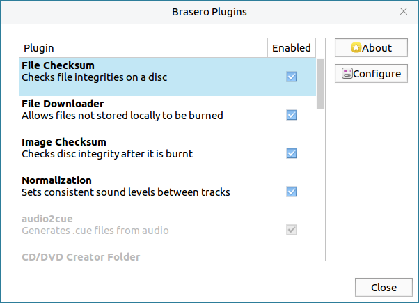

点击取消，即取消添加文件，退出选择文件界面。

2）删除

删除在项目中选中的文件。

3）清空项目

清空项目中添加的所有文件。

4）新文件夹

即在项目中添加一个新的文件夹。

5）导入

将光盘中的文件导入到项目中。

6）点击刻录

进入光盘刻录设置界面。光盘刻录设置界面如图5所示：

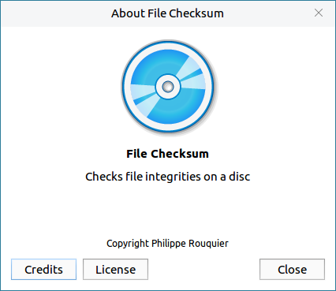

- 光盘刻录设置界面可以进行刻录速度选择、选项的勾选以及临时文件的选择。

- 选项中的“直接刻录镜像文件而不保存到光盘”，勾选该选项可以提高刻录的速度。

- 勾选“不关闭盘片以下次能追加刻录另外的文件”选项，可以在本次刻录结束后，下次刻录另外的文件能从上次结束的地方追加刻录。

- 使用“Burn-Proof”，勾选该选项可以降低失败的风险。

- 勾选“刻录前先模拟”选项，会在刻录前模拟刻录；如果刻录失败则不会真正刻入光盘，减少光盘存储空间的消耗。

点击光盘刻录设置界面的刻录，进行刻录，显示刻录进度界面。如图6所示：

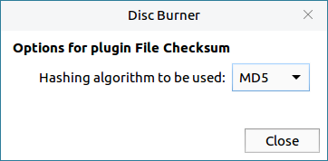

刻录成功结束后，显示数据刻录成功界面。如图7所示：

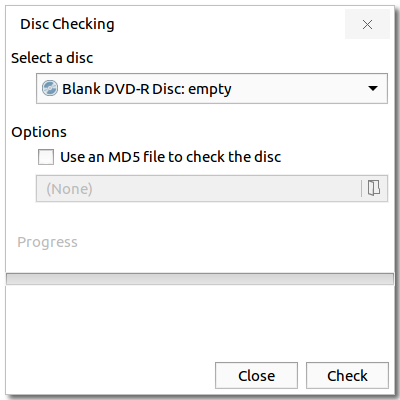

### 镜像刻录
镜像刻录界面显示镜像刻录设置界面。镜像刻录设置界面如图8所示：

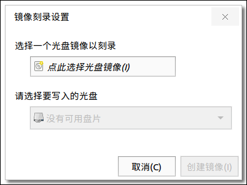

#### 使用步骤简介
- 1）勾选点击选择光盘镜像

进入文件选择界面，选择要刻录的文件（选择的文件必须是镜像文件）。文件选择界面如图9所示：

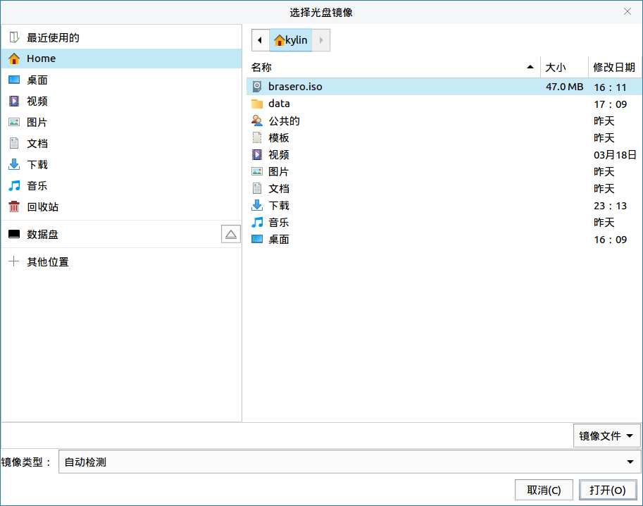

点击打开，即选择了要刻录的光盘镜像。

点击取消，即取消选择文件，退出选择光盘镜像界面。

- 2）点击要选入的盘片

选择一个要进行刻录操作的盘片（系统识别到了盘片后会自动显示在盘片选择区）。

- 3）点击刻录

在步骤一和步骤二的基础上，点击刻录，开始刻录镜像。镜像刻录进度界面如图10所示：

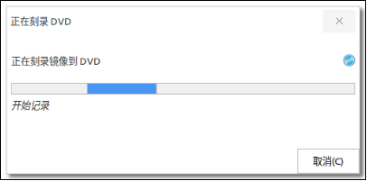

刻录成功结束后，显示刻录成功界面。镜像刻录成功界面如图11所示：

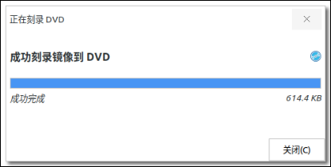

若点击取消，即取消镜像刻录，退出镜像刻录界面。

 

## 高级功能
菜单栏界面只在欢迎界面和数据刻录界面可用，镜像界面虽然有显示，但不能进行具体操作。

### 项目菜单栏
项目菜单栏中有新建项目、打开、最近项目、保存、另存为、刻录、退出。

1）新建项目

当鼠标放在新建项目时，会显示子菜单，有新建数据刻录项目和刻录镜像。

点击新建数据刻录项目，即进行数据刻录，显示数据刻录界面；点击刻录镜像，即进行镜像刻录，显示镜像刻录界面。

2）打开

打开一个镜像，进行镜像刻录，显示镜像刻录界面。

3）最近项目

鼠标放在最近项目时，会显示子菜单，子菜单中显示最近项目。

4）保存

保存该项目。

5）另存为

将项目存放到一个新的位置，也可以更改项目的名称。

6）刻录

进行数据刻录操作。

7）退出

退出光盘刻录器。

### 编辑菜单栏
编辑菜单栏有添加文件、删除文件、清空项目、新文件夹、导入光盘和插件。编辑菜单栏的所有操作都是针对数据刻录。

1）添加文件

在数据刻录项目中添加文件。

2）删除文件

在数据刻录项目中删除选中的文件。

3）清空项目

清空数据项目中添加的文件。

4）新文件夹

在数据刻录项目中创建一个新文件夹。

5）光盘导入

允许将光盘中的数据导入到数据刻录项目中。

6）插件

进行插件的设置和选择，显示插件界面。插件界面如图12所示：

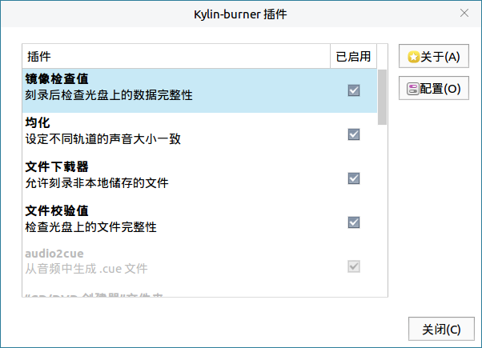

点击“关于”，显示关于该插件的信息界面，如图13所示：

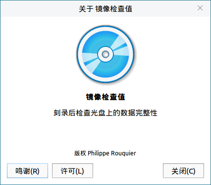

点击“配置”，进入插件的配置界面。如图14所示：

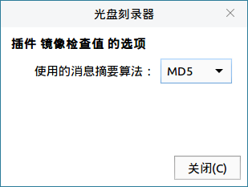

### 工具菜单栏

1）擦 除

擦除操作只有可读可写的光盘可一进行此操作。

点击擦除，进入光盘擦除界面。擦除界面如图15所示：

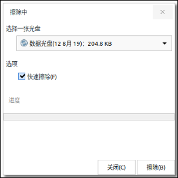

擦除过程界面如图16所示：

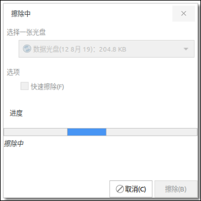

擦除成功后，会显示擦除成功界面。如图17所示：

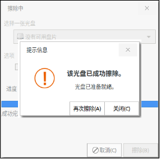

点击关闭，关闭擦除界面。

2）检查完整性

点击检查完整性，进入检查完整性界面。如图18所示：

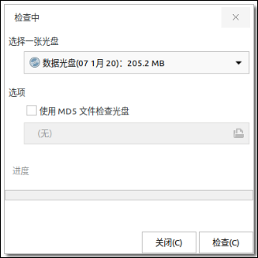

点击检查，检查光盘的完整性。

检查结束，会显示提示信息界面。如图19所示：

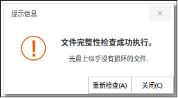
 

## 常见问题
### 使用注意事项
1）镜像刻录时需要先将要刻录的文件生成.iso后缀的镜像文件。

本手册提供一种生成镜像文件的方法：先点击数据刻录，添加要生成镜像文件的源文件，在没有放入光盘前，点击刻录，即可生成.iso后缀的镜像文件。

2）擦除光盘功能只可以用于可读可写的光盘，只读光盘不能进行擦除操作。

 

## 附 录
### 快捷键

|选项	|快捷键
| :------------ | :------------ | 
|打开（O）...	|Ctrl+O|
|保存（S）	|Ctrl+S|
|退出（Q）	|Ctrl+Q	|

