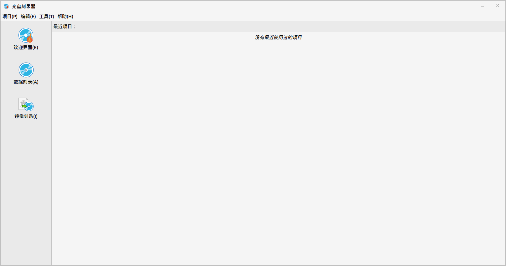
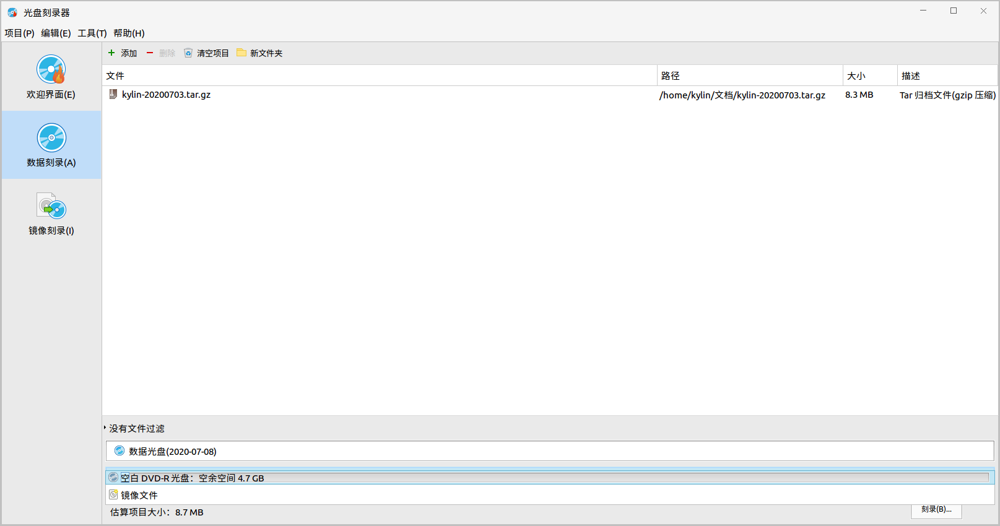
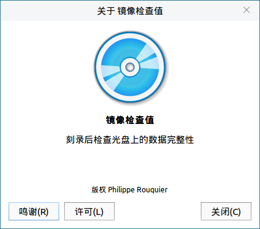
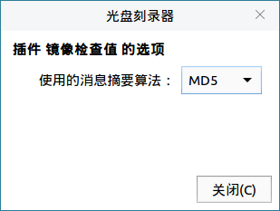
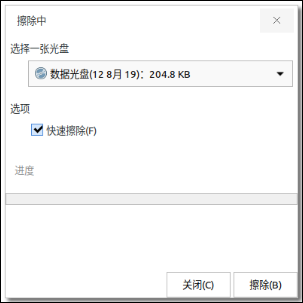

# 光盘刻录器
## 概 述
光盘刻录器是一款用于刻录光盘的工具，包括数据刻录和镜像刻录两种方式。提供了刻录光盘、擦除光盘、检查光盘完整性等功能。

主界面如图 1所示。

 

## 基本功能
主界面菜单栏有项目、编辑、工具和帮助四个选项；左侧栏有欢迎界面、数据刻录和镜像刻录三个选项。用户可以在主界面看到最近项目。

### 数据刻录
数据刻录界面提供四个按钮：添加，删除，清空项目，新文件夹。

界面会显示添加的文件名称、路径、大小和描述；下方会显示光盘类型、光盘大小、估算项目大小；如果要生成镜像文件，则显示的是生成的镜像文件。

数据刻录界面如图 2所示：

1）添加

点击“添加”，进入选择文件界面，在项目中添加要刻录的文件。

2）删除

删除选中的文件。

3）清空项目

清空项目中的所有文件。

4）新文件夹

在项目中新建一个文件夹。

点击“刻录”，进入光盘刻录设置界面，如图 3所示。

- 可以选择刻录速度。

- 勾选“直接刻录镜像文件而不保存到光盘”可以提高刻录速度。

- 勾选“不关闭盘片以下次能追加刻录另外的文件”选项，则在本次刻录结束后，下次刻录另外的文件能从上次结束的地方追加。

- 勾选“Burn-Proof”可以降低失败风险。

### 镜像刻录
镜像刻录主界面如图 4所示。

- 1）选择镜像文件

进入文件选择界面，选择要刻录的镜像文件。

- 2）选择光盘

系统识别到了盘片后，会自动显示在选择列表中。

- 3）刻录

点击“刻录”，开始刻录镜像。镜像刻录进度界面如图 5所示：

 

## 高级功能
### 插 件
点击“编辑” > “插件”，可进行插件的设置和选择，如图 6所示。

点击“关于”，显示该插件的信息。

点击“配置”，进入插件的配置界面。

### 擦 除
点击“工具” > “擦除”，界面如图 9所示，只有可读可写的光盘可以进行此操作。

### 工具 -> 检查完整性
点击“工具” > “检查完整性”，界面如图 10所示，检查结束，会显示提示信息界面。

 

## 常见问题
### 使用注意事项
1）镜像刻录只能刻录.iso后缀的文件。

2）擦除光盘功能只可以用于可读可写的光盘，只读光盘不能进行擦除操作。

 

## 附 录
### 快捷键

| 快捷键 | 功能 |
| :------------ | :------------ | 
| Ctrl + O | 打开 |
| Ctrl + S | 保存 |	
| Ctrl + Q | 退出 |

