# Burner 
## Overview
This manual includes an introduction to the functions of the disc recorder, as well as a detailed description of some of the function modules.

Burner is a tool to assist users burning discs, including both data burning and mirror burning.Provides users with the ability to burn discs, erase discs, check disc integrity, etc.

The burner displays the features offered by the disc burner through a graphical interface that is intuitive and user-friendly.

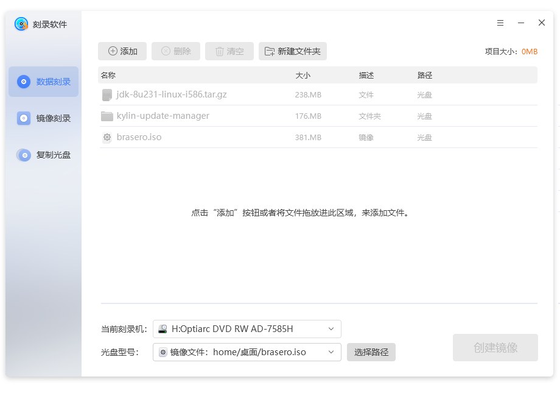

## Basic Functions
Basic function icons and their functions.

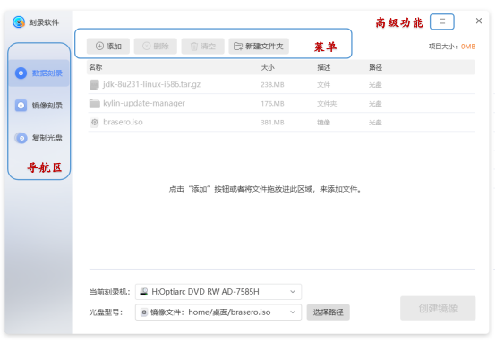

### Main Interface
Users can see Add, Delete, Empty and New folders at the top of the main interface.

In the left column of the interface there are three options: Data burning, image burning, and copy disc.

Users in the main interface can see recent projects.

#### Use Steps
###### 1) Minimize
Click the Minimize icon in the top right corner to minimize the disc burner to the taskbar.

###### 2) Maximize
Click the maximize icon in the top right corner to maximize the disc burner's interface to the screen size.

###### 3) Shrink The Window
Clicking on the Window Maximize is the top-right shrink icon to restore the maximized disc burner to its original size.

###### 4) Data Burning
Click on the data burning interface and add files by clicking the "Add" button or dragging and dropping files into this area when there is no content on the disc;If there is content on the disc, import the content directly from the disc, but users cannot edit it.

###### 5) Mirror Burning
Click on Mirror Burn to display the Mirror Burn screen.

###### 6) Copy The Disc
Click Copy Disc to display the Copy Disc screen.

### Data Burning
The data burning interface is operated by the Add, Delete, Empty, New Folder buttons.

When adding a file, a prompt will appear if a CD/DVD disc is not inserted.The interface displays the name, size, description, and space of the file users are joining.

At the bottom of the interface, the disc type, disc size, estimated project size, and burn button are displayed, and if an image file is to be generated, the generated image file is displayed instead of the disc size.

The data burning interface is shown in figure below.

###### 1) Add
Click "Add" to add the file users want to burn to the project.

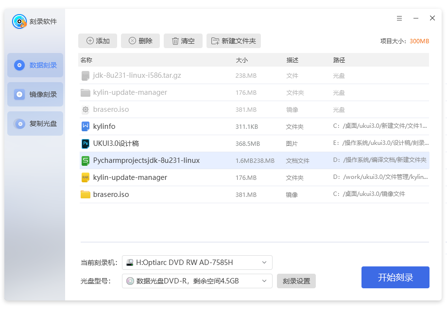

###### 2) Delete
Click "Delete" to delete the file selected in the project.

###### 3) Empty
Click "Empty" to empty all files in the interface.

###### 4) New Folder
Click "New Folder" to add a new folder to the project.

The disc burning setup screen is shown in figure below.

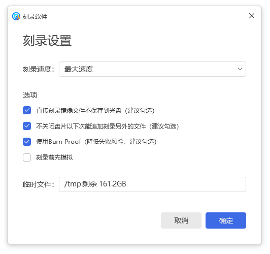

The CD burning settings screen allows users to select the burning speed, check the options and select temporary files.

Option to burn an image file directly without saving it to a disc, check this option to increase the speed of burning.

If users check the option not to close the disc, users can add another file to the disc next time, so users can add another file from the last one after the current one is finished.

Using Burn-Proof, checking this option reduces the risk of failure.

Checking the Simulate before burning option will simulate burning before burning, and if it fails it will not actually burn into the disc, reducing the disc storage space consumption.

Click Burn in the Disc Burn Settings screen to burn and display the Burn Progress screen.

After the successful burning is completed, the data burning success screen is displayed. 

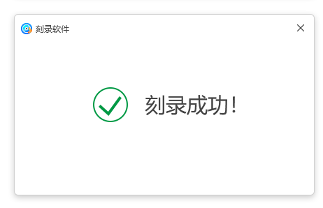

### Mirror Burning
The mirror burning interface is shown in figure below.

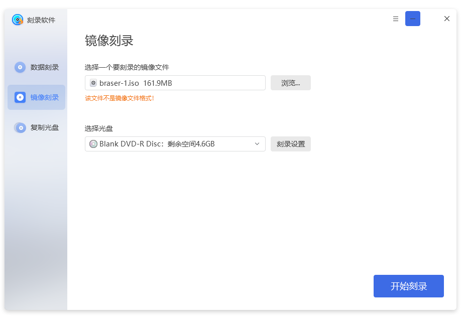
#### Use Steps
######  1) Select the disc mirror
Click "Browse" and select the disc image users want to burn.
###### 2) Click on the disc to be selected
Select a disc to burn.(It is automatically displayed in the disc selection area when the system recognizes the disc).
######  3) Click to start burning
On the basis of steps one and two, click "Start Burn" to start burning mirrors. The Mirror Burn Progress interface is shown in figure below.

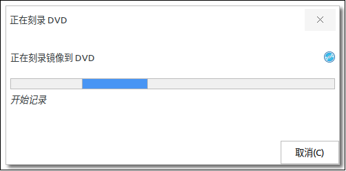

When the burning is complete, the Burn Success screen is displayed. The mirror burning success screen is shown in figure below.

###### 4) Close
Click "Close" and users're done burning mirror.

### Copy CD
The replication CD-ROM interface is shown below.

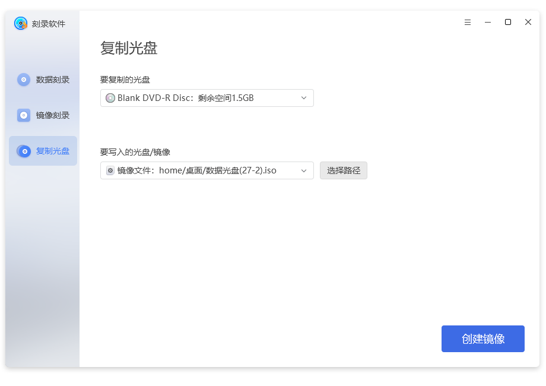

#### Use Steps
###### 1) Select the disc mirror
Click Browse and select the disc mirror users want to copy.

###### 2) Click on the disc to be selected.
Select a disc to burn.(It is automatically displayed in the disc selection area when the system recognizes the disc).

######  3) Click to create a mirror
On the basis of steps one and two, click Create Mirror to start copying.The CD-ROM progress copying interface is shown in figure below.

When the burning is complete, the Burn Success screen is displayed. The mirror burning success screen is shown in figure below.

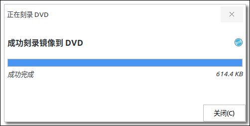

###### 4) Click Close and copy is done!
## Advanced Function
In the main screen, click on the "" icon to access the Advanced Function Options of the disc burner.

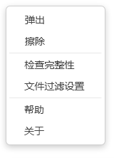

### Popup Option
The user can eject the selected disk by ejecting it through the pop-up option in the Advanced Function Option.
### Erase Option
The user performs an erase operation on the selected disc through the Erase option in the Advanced Function Option.

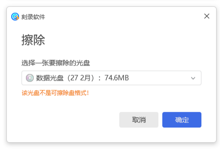

### Check Integrity Option
The user accesses the Check Integrity screen through the Check Integrity option in the Advanced Function Option. 

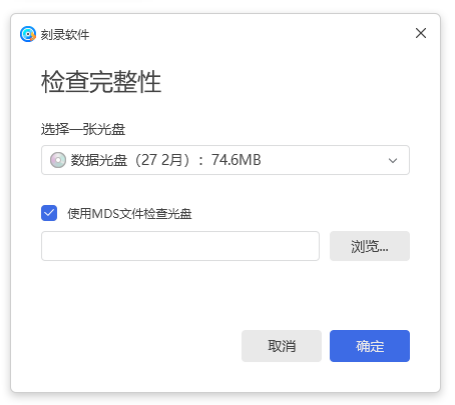

### File Filtering Settings
The user accesses the file filtering interface through the file filtering settings option in the Advanced Function Option. 

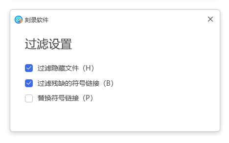

Users can also access the file filtering interface by clicking "View File Filter".

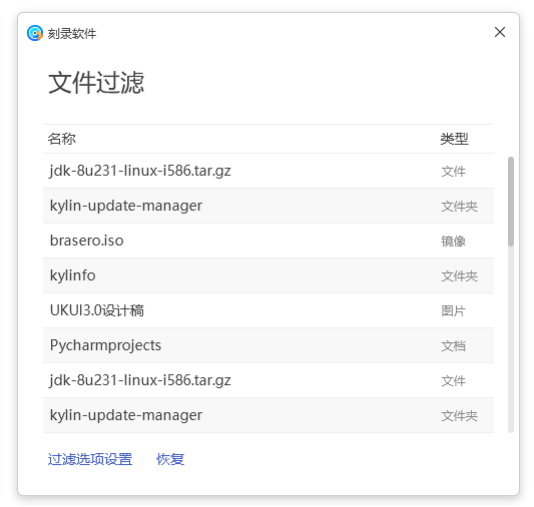

### Help
### About
## FAQ
### What do users need to be aware of when using it?

1)Image burning requirexs the file to be burned first to generate an image file with the .iso suffix.This manual provides a method for generating mirror files: 

First click Burn data, add the source file that users want to generate the image file, before users put the CD, click Burn to generate the image file with .iso suffix.

2)Erase CD, this function can only be used for readable and writable CD, read-only CD cannot be erased.

## Appendix
### Shortcut key

|Options|Shortcut key|Operational content|
| :------------ | :------------ | :------------ |
|Open（O）...|Ctrl+O|Open Item
|Save（S）|Ctrl+S|Save Item

