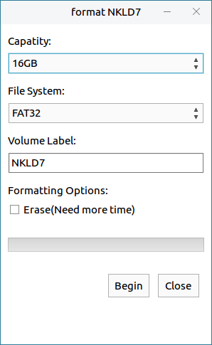
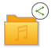

# Caja
## Overview
Caja(files browser) can view files and folders on the system by category, and supports the general opearations for files and folders. The main interface as shown in Fig 1.

## Basic Points
### File Name
1) The maximum length of filename is 255 characters, usually composed by letters, numbers, ".(dot)", "\_(underline)", "-".

2) Filename can't include "/"; Because "/" means root directory or the separator in a path.

### Path
1) Quote filename directly when the file is in current directory; And use file in other directory by specifying its directory.

2) Absolute path is certain. Start from root directory, for example: "/home/kylin/test".

3) Relative path depends on working directory. Start from the current directory, for example: "kylin/test".

4) Each directory has file "." means current location and file ".." means previous location.

5) When locate at /etc, it can be expressed as "../home/kylin/test".

### File Type
Supported types as shown below:

| Type | Description |
| :------------ | :------------ |
| Normal file | Including text files, data files, executable binary program, etc. |
| Directory file | Regarded as special files, and consist hierarchical tree structure of the system |
| Device file | Recognize devices and drivers, and enable the kernel to communicate with hardware devices |
| Symbolic link | Store the path to a system file; When call the symbolic link, the system will access the path saved in it automatically |

 

## Window Composition
It can be divided into five parts: menu bar, toolbar and address bar, sidebar, window area and status bar.

### Menu Bar
Function description:

| Option | Description |
| :------------ | :------------ |
| File  | New Tab, New Window, Create Document, Close |
| Edit  | Operations for files, including Select Items Matching, Send to desktop Shortcut, etc. |
| View  | Set the way of window displaying, including Arrange Items, Icons/List, etc. |
| Tool  | Connect to Server, Clear History, etc. |

 

### Toolbar and Address Bar
Function description:

| Icon | Description |
| :------------ | :------------ |
|  | ① Tunrn to previous visited location; ② View back history |
| | ① Turn to next visited location; ② View forward history |
|  | Back to the previous directory |
|  | Text box address bar. Support not only local files and directories, but also shared paths in the LAN and FTP addresses |
|   | Search box |
|   | Set view method to "Icons"/"List" |

 

### Sidebar
Sidebar lists the directories by the form of tree's hierarchy. External mobile devices and remote shared devices are also shown here.

It can be set shown or not in "View" menu.

### Window Area
It lists the sub directories and files of the current directory. Clicking one directory in the sidebar, the contents of it will be shown here.

### Status Bar
1) When enter one directory, it shows the file quantity.

2）When select one folder, it shows the file quantity in this folder.

3) When select one file, it shows the type and size of this file.

It can be set shown or not in "View" menu.

 

## Basic Function
### View Files and Folders
View and manage local files, local storage devices (such as external hard disk), file server, and files in network sharing. 

View any file's contents by double clicking (or open it by the default application). Right clicking can choose to open it in a new tab / new window.

#### Sort Mode
The options for arranging files depend on the view mode currently used. Users can change it by "Icons" or "List" button on the toolbar.

When using "List", click "Name", "Size", "Type", "Date Modified" above the files to sort them.

Sort ways introduction:

- By Name: Alphabetical file name.

- By Size: Sort by the amount of disk space occupied by the file; From minimum to maximum by default.

- By Type: Merge similar files together and sort by name.

- By Date Modified: Sort by the last time to modify files; From the oldest to newest by default.

#### View Mode
The system shows all files and directories through "Icons" mode by default.

- Icons: The form is "Big icon + File name".

- List: The form is "Small icon + File name + File informations"

- Click "View" > "Visible Columns" to select the shown informations, and users can sort files by them.
 

### Files and Folders General Operations
1) Copy

* Way 1：Select file and right click > "Copy" > right click at destination > "Paste"

* Way 2: Select file, Ctrl + C > Destination, Ctrl+V

* Way 3: Drag file from original location to the destination.

In way 3, if the two locations are both on a same hard disk, the file will be moved (press Ctrl to copy); If drag from U disk to the system, the file will be copied (because they are two different devices).

2) Move

* Way 1: Select file and right click > "Cut" > right click at destination > "Paste"

* Way 2: Select file, Ctrl+X > Destination, Ctrl+V

3) Delete

Move to trash:

* Way 1: Select file and right click > "Move to Trash"

* Way 2: Select file, Delete

* Way 3: Drage to Trash on the desktop

If the deleted files are on a removable device, and eject this device without emptying trash, those files will be seen in the trash when re-insert the device to the current system.

Permanently delete:

* Way 1: Delete in trash

* Way 2: Select file, Shift + Delete

4) Rename

* Way 1: Select file and right click > "Rename"

* Way 2: Select file, F2

Press Ctrl + Z to revoke rename.

### Format and Eject
Right click the insert device on the sidebar, and the menu as shown in Fig 4.
 

* **Eject**: To unmount mobile device. Click  near the device can also eject the device. 

* **Format**: The default format is FAT32, and users can change it to Ext2/3/4 or NTFS. It's needed to unmount the device first.
 

### Browse Network
Share files in LAN. Take "Music" folder for example:

1) Right click Music and select "Sharing Options", the popup as shown in Fig 6. Users can set the details.
   

2) After "Create Share", the folder icon changes to .

3) Open caja on another system in this LAN, and click "Browse Network" to find the host name of sharing file. The sharing file will be seen after opening. Double click this file, and the popup as shown in Fig 7.
 

4) After accessing, the contents in the folder can be seen and this host is shown on the sidebar.
 

5) To cancel sharing, right click the folder and uncheck "Share this folder" in the "Sharing Options".

 

## Advanced Function
Click "Edit" > "Preferences" to enter the setting interface.
 

 

## Appdenix
### Shortcut Key

| Shortcut | Function |
| :------------ | :------------ |
| Ctrl + C  | Copy |
| Ctrl + X  | Cut |
| Ctrl + V  | Paste |
| Delete  | Delete |
| Shift + Delete  | Permanently Delete |
| Ctrl + Z  | Revoke |
| Ctrl + A  | Select All |
| F2  | Rename |

 

### Wildcard Description

| Wildcard | Description |
| :------------ | :------------ |
| * | Match 0 or multiple charaters |
| ? | Match any charater |
| [abl A-F] | Match any charater listed in the square brackets. This example represents any charater in a, b, l and captial letter from A to F |

