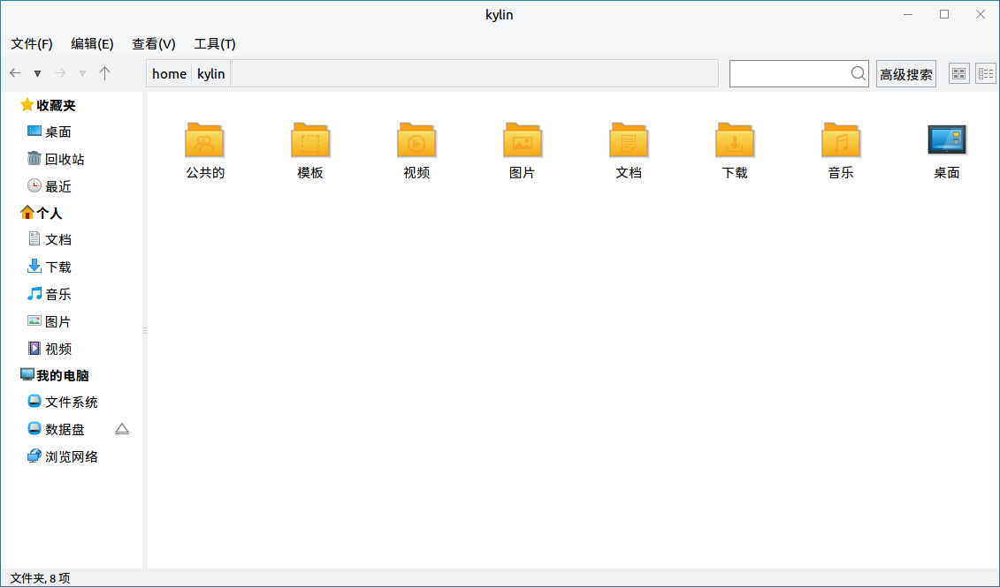
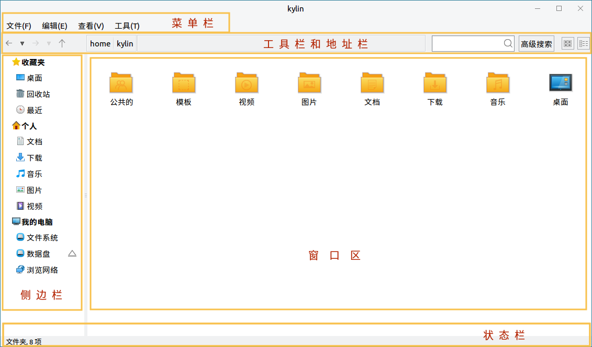
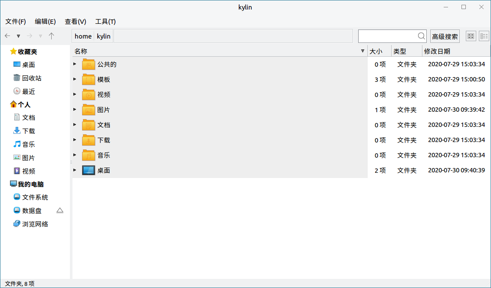
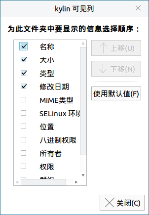
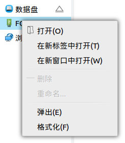
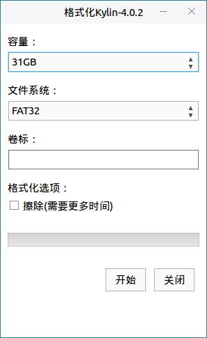
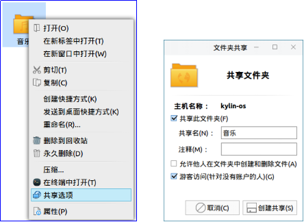
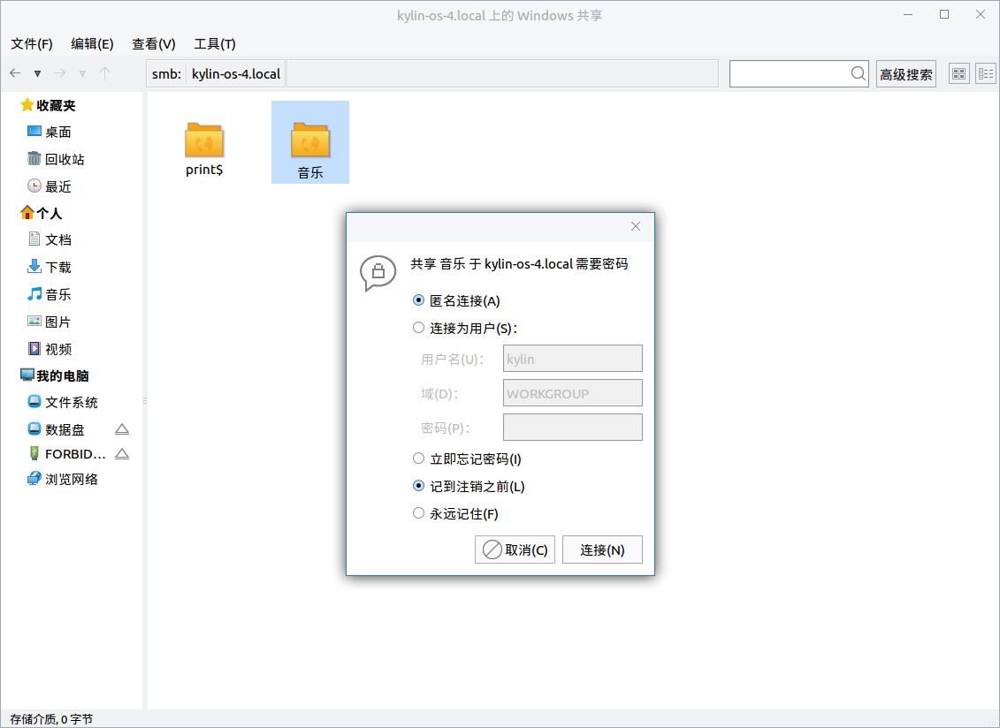
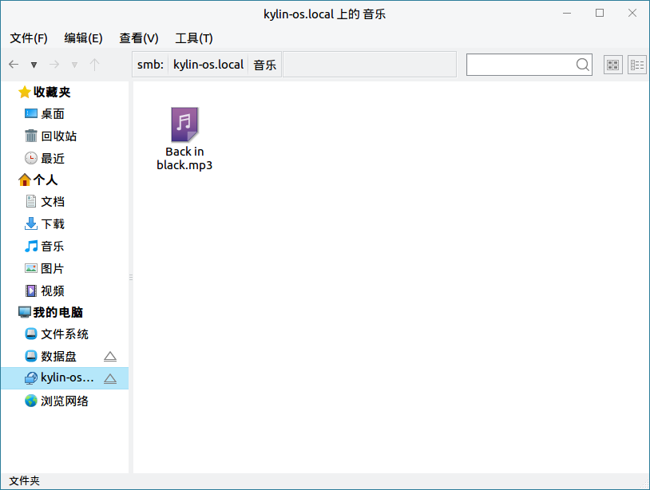
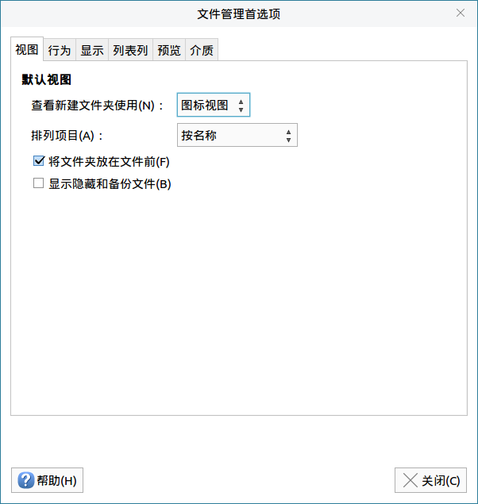

# 文件浏览器
## 概 述
文件浏览器可以分类查看系统上的文件和文件夹，支持文件和文件夹的常用操作，其主界面如图 1所示。

## 基本要点
### 文件名
1）系统文件名长度最大可以为255个字符，通常是由字母、数字 、“.(点号)”、“_(下划线)” 和“-(减号)”组成的。

2）文件名不能含有“/”符号；因为“/”在操作系统目录树中，表示根目录或路径中的分隔符号。

### 路 径
1）使用当前目录下的文件时，可以直接引用文件名；如果要使用其他目录下的文件，就必须指定该文件所在的目录。

2）绝对路径是一定的，从根目录开始，比如“/home/kylin/test”。

3）每个目录下都有代表当前目录的“.”文件，和代表当前目录上一级目录的“..”文件。

4）相对路径是随着用户工作目录改变的：位于/home目录下时，test文件的相对路径为“kylin/test”；位于/etc目录下时，test文件的相对路径为“../home/kylin/test”。

### 文件类型
系统支持如下的文件类型：

| 文件类型  | 说明  |
| :------------ | :------------ |
| 普通文件  | 包括文本文件、数据文件、可执行的二进制程序等  |
| 目录文件（目录）  | 系统把目录看成是一种特殊的文件，利用它构成文件系统的分层树型结构  |
| 设备文件（字符设备文件/块设备文件） | 系统用它来识别各个设备驱动器，内核使用它们与硬件设备通信  |
| 符号链接 | 存放的数据是文件系统中通向某个文件的路径；当调用符号链接文件时，系统将自动访问保存在文件中的路径|

 

## 窗口组成
文件浏览器窗口可划分为菜单栏、工具栏和地址栏、侧边栏、窗口区和状态栏五个部分，示意如图所示。

### 菜单栏
菜单选项的功能简要说明如下：

| 菜单选项  | 说明  |
| :------------ | :------------ |
| 文件  | 新建窗口，新建标签页，新建文件/文件夹，关闭窗口  |
| 编辑  | 对文件的操作，包括选择匹配项目、创建快捷方式等  |
| 查看  | 设置窗口的显示方式，包括文件排列方式、图标/列表显示等  |
| 工具  | 连接ftp服务器、共享网络，显示/清除历史访问位置  |

 

### 工具栏和地址栏
工具栏上图标对应的功能如下：

| 图标  | 说明  |
| :------------ | :------------ |
|  | ① 转到上一个访问过的位置；② 查看后退历史  |
| | ① 转到下一个访问过的位置；② 查看前进历史  |
|  | 回到上一级目录  |
|  | 文本框式地址栏，不仅可以输入本机的文件或目录路径，还可以输入一个局域网中共享的文件路径，或是一个ftp地址  |
|   | 搜索栏，搜索用户所需要的文件  |
|   | 设置文件查看方式为 “图标视图” / “列表视图”  |

 

### 侧边栏
侧边栏列出了树状的目录层次结构，提供对操作系统中不同类型文件夹目录的浏览。外接的移动设备、远程连接的共享设备也会在此处显示。

可在菜单栏中的“查看”，选择是否显示侧边栏。

### 窗口区
窗口区列出了当前目录节点下的子目录、文件。在侧边栏列表中单击一个目录，其中的内容应就会在此处显示。

### 状态栏
1）进入某个目录时，显示当前位置下的文件个数。

2）选中某个文件夹时，显示该文件夹中的文件个数。

3）选中某个文件时，显示该文件的类型和大小。

可在菜单栏中的“查看”，选择是否显示状态栏。

 

## 基本功能
### 查看文件和文件夹
用户可以使用文件浏览器查看和管理本机文件、本地存储设备（如外置硬盘）、文件服务器和网络共享上的文件。

在文件浏览器中，双击任何文件夹，可以查看其内容（使用文件的默认应用程序打开它）；也可以右键单击一个文件夹，在新标签页或新窗口中打开它。

#### 排序方式
浏览时，用户可以用不同的方式文件进行排序。排列文件的方式取决于当前使用的文件夹视图方式，用户可以单击工具栏上的“列表视图”或“图标视图”图标按钮来更改。

当选择列表查看方式时，再点击文件上方的“名称” 、“大小”、“类型”和“修改日期”，就可以对文件进行排序。

各种文件排序方式介绍如下：

- 按名称排序：按文件名以字母顺序排列。

- 按大小排序：按文件大小（文件占用的磁盘空间）排序；默认情况下会从最小到最大排列。

- 按类型排序：按文件类型以字母顺序排列；会将同类文件归并到一起，然后按名称排序。

- 按修改日期排序：按上次更改文件的日期和时间排序；默认情况下会从最旧到最新排列。

#### 视图模式
默认情况下，系统以图标形式显示出所有的文件和目录。

- 在图标视图中，文件浏览器中的文件将以“大图标+文件名”的形式显示。

- 在列表视图中，文件浏览器中的文件将以“小图标+文件名+文件信息”的形式显示。

- 点击菜单栏中的“查看”，选择“可见列”并选择想要显示的属性列，然后就可以按照这些属性列来排列文件。
 

### 文件和文件夹常用操作
1）复 制

* 方式1：选中文件，右键单击 > “复制” > 目标位置，右键单击 > “粘贴”

* 方式2：选中文件，Ctrl+C > 目标位置，Ctrl+V

* 方式3：从项目所在文件夹窗口拖动至目的文件夹窗口

在方式3中，如果两个文件夹都在计算机的同一硬盘设备上，项目将被移动；如果是从U盘拖拽到系统文件夹中，项目将被复制（因为这是从一个设备拖拽到另一个设备）。要在同一设备上进行拖动复制，需要在拖动同时按住Ctrl键。

2）移 动

* 方式1：选中文件，右键单击 > “剪切” > 目标位置，右键单击 > “粘贴”

* 方式2：选中文件，Ctrl+X > 目标位置，Ctrl+V

3）删 除

删除至回收站：

* 方式1：选中，右键单击 > “删除到回收站”

* 方式2：选中，Delete

* 方式3：选中，拖入桌面上的“回收站”

若删除的文件为可移动设备上的，在未进行清空回收站的情况下弹出设备，可移动设备上已删除的文件在其他操作系统上可能看不到，但这些文件仍然存在；当设备重新插入删除该文件所用的系统时，将能在回收站中看到。

永久删除：

* 方式1：在“回收站”中再删除

* 方式2：选中，Shift+Delete

4）重命名

* 方式1：选中，右键单击 > “重命名”

* 方式2：选中，F2

若要撤销重命名，按Ctrl+Z即可恢复。

### 格式化和卸载设备
在侧边栏中，对接入系统的设备，右键单击，出现菜单如图 5所示。
 

其中：

* **弹出**：卸载移动设备；点击设备右侧的“”按钮可弹出。

* **格式化** ：系统默认格式化为FAT32文件系统，用户可自行更改为Ext2/3/4或NTFS格式；要使用该功能，需要先卸载设备。
 

### 访问网络
用于在局域网中共享文件。以共享“音乐”文件夹为例：

1）右键单击“音乐”，选择“共享选项”，弹出对话框，如图 7所示。用户可对共享的文件夹信息、权限进行设置。
   

2）点击“创建共享”后，文件夹图标会变为“”，表示已属于共享文件。

3）在同一局域网中的另一个系统中，打开文件浏览器，选择“浏览网络”，找到共享文件的主机名。打开后，可看到被共享的文件。双击该文件，弹出连接提示框，如图 8所示。
 

4）连接后，可看到共享文件内的内容，在侧边栏也会显示接入的主机。
 

5）如果想不再共享该文件夹，可再次右键单击文件夹，在“共享选项”中，取消共享的勾选。

 

## 高级功能
点击菜单栏上的“编辑” > “首选项”，即可进入设置界面。
 

可设置的内容包含了多个方面，每个标签页对应的功能简要说明如下：

| 标签页  | 说明  |
| :------------ | :------------ |
| 视图  | 设置文件视图模式、排列方式、是否显示隐藏文件  |
| 行为  | 单击/双击打开项目、打开可执行文本文件是执行/查看、右键菜单是否显示永久删除  |
| 显示  | 设置图标显示信息的内容与日期格式  |
| 列表列  | 设置在列表视图中，显示的列信息  |
| 预览  | 关于显示与文件数量统计的设置  |
| 介质  | 设置对外接设备（包括CD、DVD等）的操作处理  |

 

## 附录
### 快捷键

| 快捷键 | 功能 |
| :------------ | :------------ |
| Ctrl + C | 复制 |
| Ctrl + X | 剪切 |
| Ctrl + V | 粘贴 |
| Delete | 删除 |
| Shift + Delete | 永久删除  |
| Ctrl + Z | 撤销 |
| Ctrl + A | 全选 |
| F2 | 重命名 |

 

### 通配符说明

| 通配符 | 说明 |
| :------------ | :------------ |
| 星号（*） |	匹配零个或多个字符 |
| 问号（?） |	匹配任何一个字符 |
| [abl A-F] | 匹配任何一个列举在方括号中的字符，示例中表示a、b、l或任何一个从A到F的大写字符 |

 

### 系统部分目录简要介绍
1）/bin：存放普通用户可以使用的命令文件。

2）/boot：包含内核和其它系统程序启动时使用的文件。

3）/dev：设备文件所在目录。在操作系统中设备以文件形式管理，可按照操作文件的方式对设备进行操作。

4）/etc：系统的配置文件。

5）/home：用户主目录的位置，保存用户文件，包括了配置文件、文档等。

6）/lib：包含许多由/bin中的程序使用的共享库文件。

7）/opt：存放可选择安装的文件和程序，主要是第三方开发者用于安装他们的软件包。

8）/root：系统管理员（root或超级用户）的主目录。

9）/usr：包括与系统用户直接相关的文件和目录，一些主要的应用程序也保存在该目录下。

10）/var：包含一些经常改变的文件。如假脱机（spool）目录、文件日志目录、锁文件和临时文件等。
