# Claws Mail
## Overview
Claws mail is a network application based on GTK, and it has high speed and configurability. The main interface as shown in Fig 1.
 
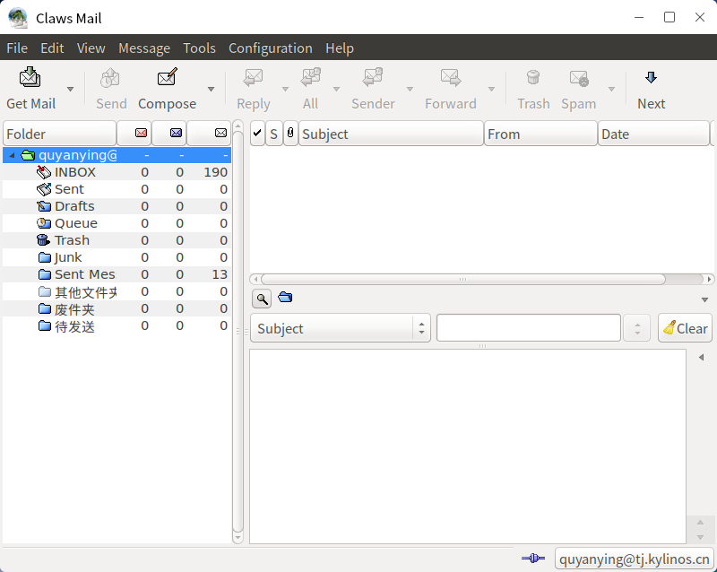
 

## Steps Introduction
1) After opening application, click "Forward".

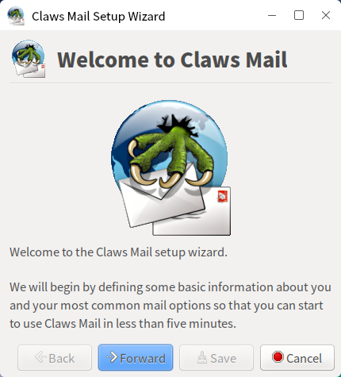

2) Input personal informations.
 
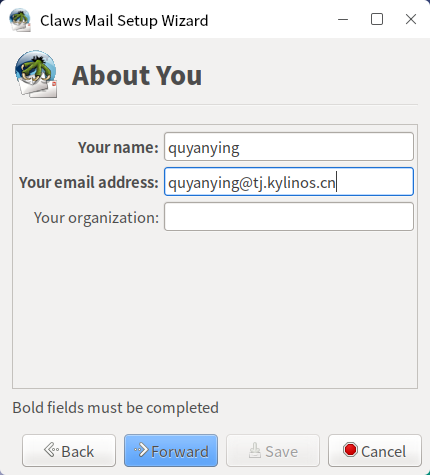

3) Receiving/Sending mail server and personal account settings. Users can get the server information from web mail.

\* The username and password settings in Fig 4 are e-mail's address and password.

\* If the mailbox uses POP protocol, fill in pop address directly in "Server address".
 
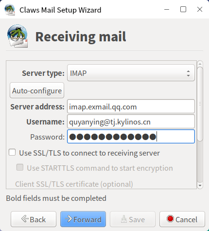

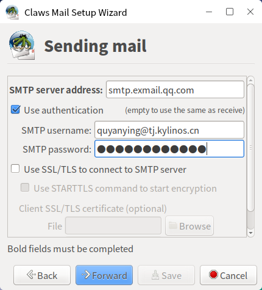

4) After setting, click "Save" to enter the mailbox.

 

## Basic Function
Icon and function:

| Icon | Function | Icon | Function |
| :------------ | :------------ | :------------ | :------------ |
|| Receive mail from all accounts || Compose email |
|| Quote and reply || Reply to all |
|| Reply to sender|| Forward message |
|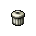| Move message to trash || Go to next unread message|

 

## Advanced Function
### Search 
* Search key words in current message

Clicking "Edit" > "Find in current message" and inputting the key words at the popup's text box, as shown in Fig 6, it will highlight the key words in the currently opened message.
 
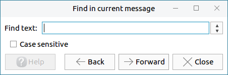

* Search folder

Click "Edit" > "Search folder", and the popup provides various of search options, such as From, To, Subject, Body.

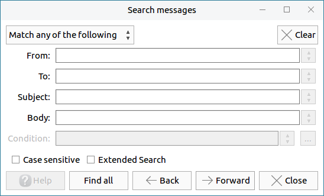

If "Extended Search" is checked, users can click the "…" at the right side of "Condition" and add search rules by customization in the popup. 

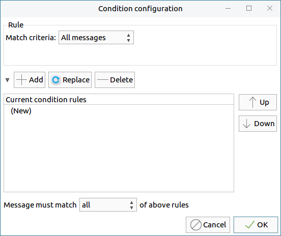 

* Quick search

Click "Edit" > "Quick search", and the interface as shown in Fig 9.
 
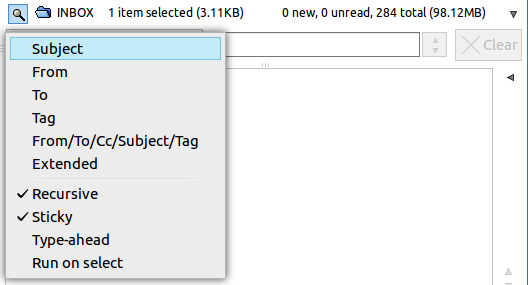

### View Options
The View on the menu bar provides multiple setting options to users, which can make claws-mail is more in line with preferences. As shown in Fig 10.

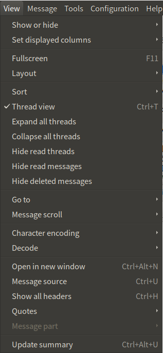

### Account Settings
* "Configuration" > "Preferences for current account" : Modify current account preferences.
 
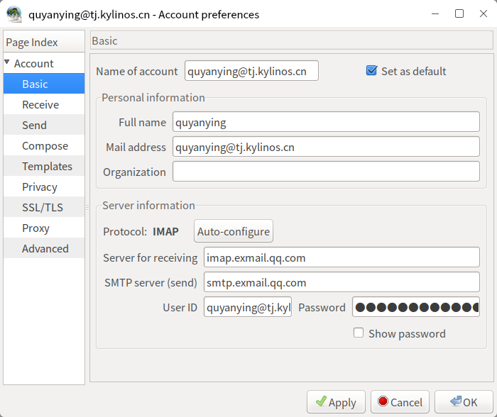

* "Configuration" > "Create new account" : Add a new account to claws-mail

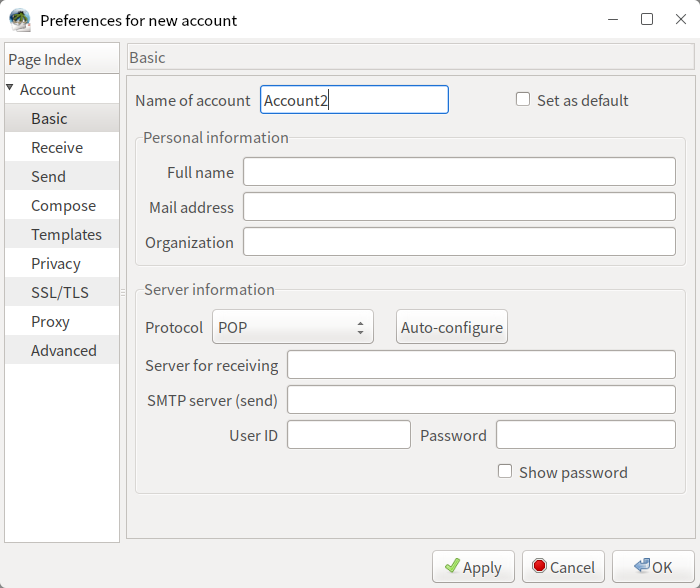

* "Configuration" > "Edit accounts" : Set default account, new/edit/delete/copy a selected account and adjust the accounts order.

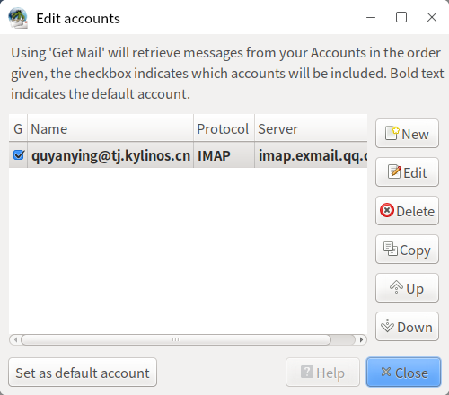

* "Configuration" > "Preferences" : Provide all options here to be set, including mail handing, compose, message view, display, etc..

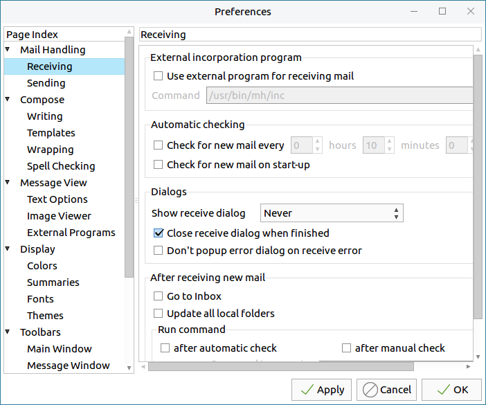
 

## Appendix
### Shortcut Key

| Shortcut | Function |
| :------- | :------- |
| Shift + D | Empty all trash folders |
| Ctrl + S | Save email as… |
| Y | Save part as… |
| Ctrl + P | Print |
| Ctrl + W | Offline mode|
| Ctrl + Q | Quit |
| Ctrl + F | Find in current message |
| Shift + Ctrl + F | Search folder |
| / | Quick search |
| F11 | Fullscreen |
| Ctrl + M | Compose an email message |
| Ctrl + R | Reply |
| Ctrl + Alt + F | Forward |
| Ctrl + D | Move to trash |

