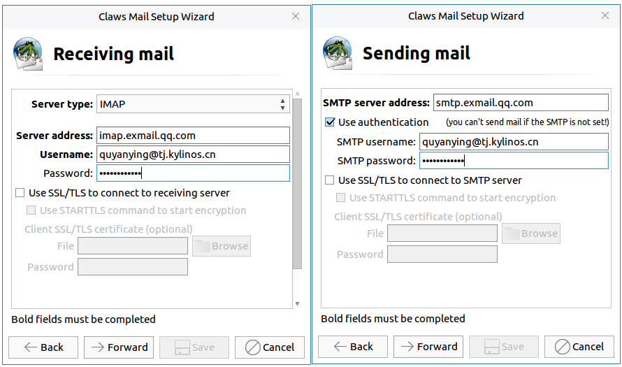

# Claws Mail
## Overview
Claws mail is a network application based on GTK, and it has high speed and configurability. The main interface as shown in Fig 1.
 

 

## Basic Function

### Steps Introduction
1) After opening application, click "Forward".

2) Input personal informations.
 

3) Receiving/Sending mail server and personal account settings. Users can get the server information from web mail.

\* The username and password settings in Fig 4 are both e-mail's address and password.

\* If the mailbox uses POP protocol, fill in pop address directly in "Server address".
 

4) After setting, click "Save" to enter the mailbox.

### Icon and function

| Icon | Function | Icon | Function |
| :------------ | :------------ | :------------ | :------------ |
|| Receive mail from all accounts || Send queued message |
|| Compose email |/| Quote and reply | 
|| Reply to all ||| Forward message |
|| Move message to trash | | View spam |    
|| Go to next unread message|||

 

## Advanced Function
### Search 
* Search key words in current message

Clicking Edit > Find in current message and inputting the key words at the popup's text box, as shown in Fig 6, it will highlight the key words in the currently opened message.
 

* Search folder

Click Edit > Search folder, and the popup provides various of search options, such as From, To, Subject, Body.

If "Extended Search" is checked, users can add search rules by customization. 

 

* Quick search

Click Edit > Quick search, and the interface as shown below.
 

### View Options
The View on the menu bar provides multiple setting options to users, which can make claws-mail is more in line with preferences. As shown in Fig 10.

### Account Settings
* Configuration > Preferences for current account : Modify current account preferences.
 

* Configuration > Create new account : Add a new account to claws-mail

* Configuration > Edit accounts : Set default account, new/edit/delete/copy a selected account and adjust the accounts order.

* Configuration > Preferences : Provide all options here to be set, including mail handing, compose, message view, display, etc..

 

## Appendix
### Shortcut Key

| Shortcut | Function |
| :------- | :------- |
| Shift + D | Empty all trash folders |
| Ctrl + S | Save email as… |
| Y | Save part as… |
| Ctrl + P | Print |
| Ctrl + W | Offline mode|
| Ctrl + Q | Quit |
| Ctrl + F | Find in current message |
| Shift + Ctrl + F | Search folder |
| / | Quick search |
| F11 | Fullscreen |
| Ctrl + M | Compose an email message |
| Ctrl + R | Reply |
| Ctrl + Alt + F | Forward |
| Ctrl + D | Move to trash |

