# 邮件客户端
## 概 述
邮件客户端是一款基于GTK的轻量级网络应用软件，它速度快、可配置性强。主界面如图 1所示。
 
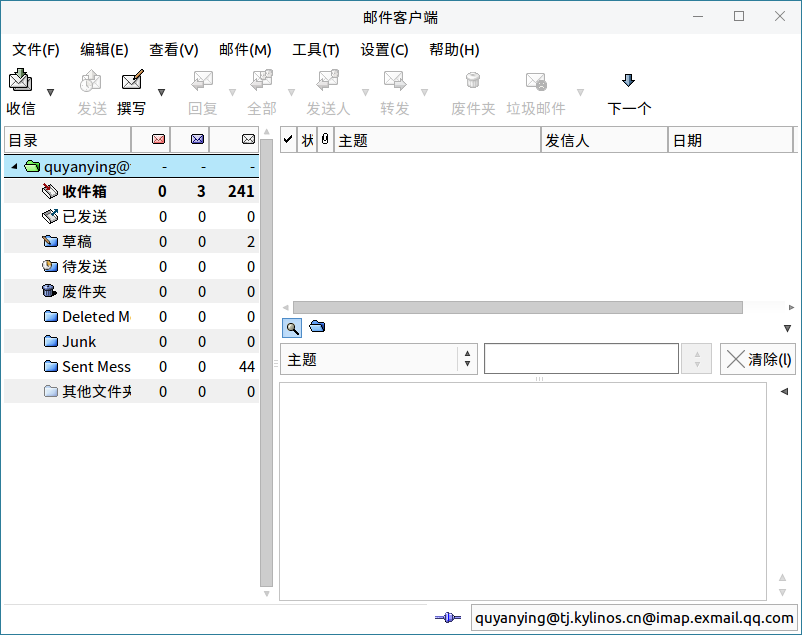
 

## 基本功能
### 配置步骤简介
1）打开应用后，点击“前进”按钮。

2）输入个人信息。

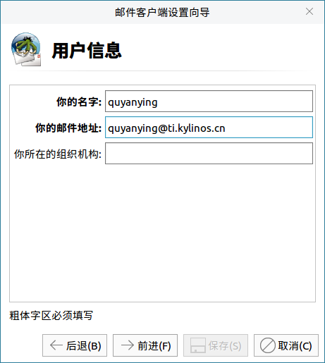

3）收、发件服务器及个人账户设置（可在对应的网页邮箱找到相关信息）。

\* 图 4配置中的用户名和密码均为邮箱地址和邮箱密码；

\* 若邮箱使用的是 POP 协议，在“服务器地址”处直接填写 POP 地址即可。

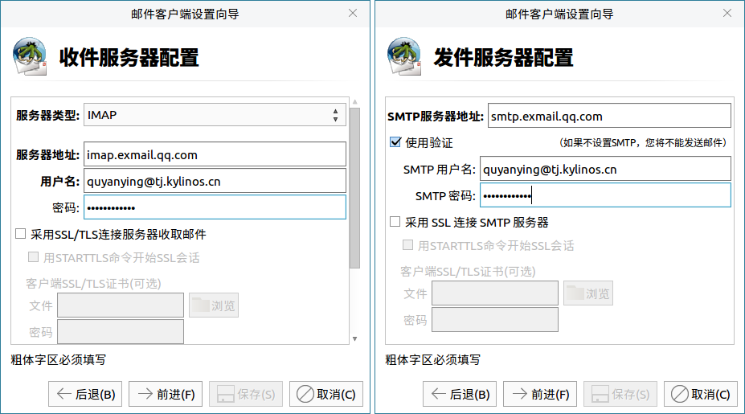

4）设置完成后，点击“保存”，即可进入邮箱。

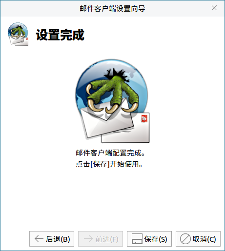

### 图标功能介绍

| 图标 |功能说明 | 图标 | 功能说明 |
| :------------ | :------------ | :------------ | :------------ |
||接收所有账号的邮件 ||写邮件 |
||引用原文并回复 ||回复给所有人 |
||回复给发件人 || 转发邮件 |
||将邮件移到废件夹 ||转到下一封未读邮件|

 

## 高级功能
### 查 找
* 在当前邮件中查找

点击 “编辑” > “在当前邮件中查找”，并在弹窗中输入关键字，如图 6所示。当前邮件中符合关键字的内容将会高亮显示。

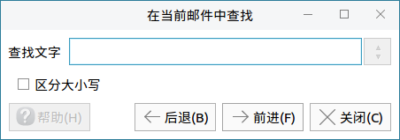

* 在目录中搜索

点击 “编辑” > “在目录中搜索”，弹出的窗口提供了多个搜索条件，如图 7所示。

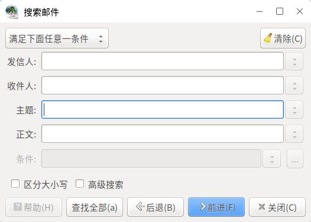

如果勾选了“高级搜索”，用户可以在新的弹窗中自定义更多的搜索条件。

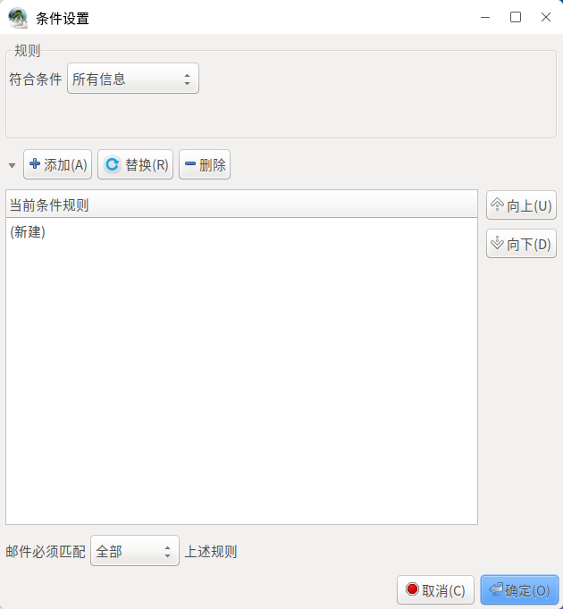

* 快速搜索

点击 “编辑” > “快速搜索”，界面如图 9所示。

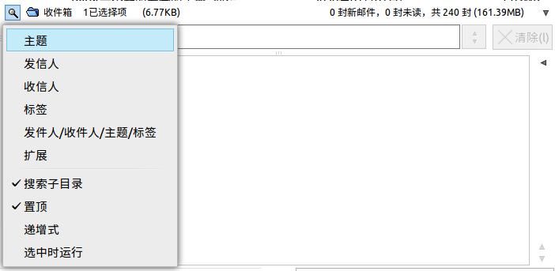

### 查 看
菜单栏上的“查看”提供多个设置项，用户可让邮件客户端更符合个人的使用偏好。如图 10所示。

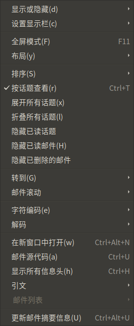

### 账号设置
* “设置” > “目前账号的偏好设置”：修改当前用户的设置。

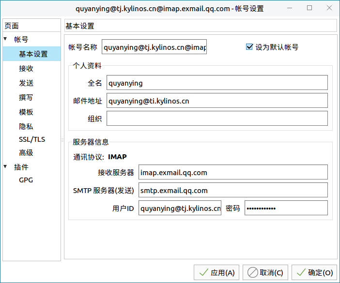

* “设置” > “创建新账号”：在邮件客户端中添加新的账号。

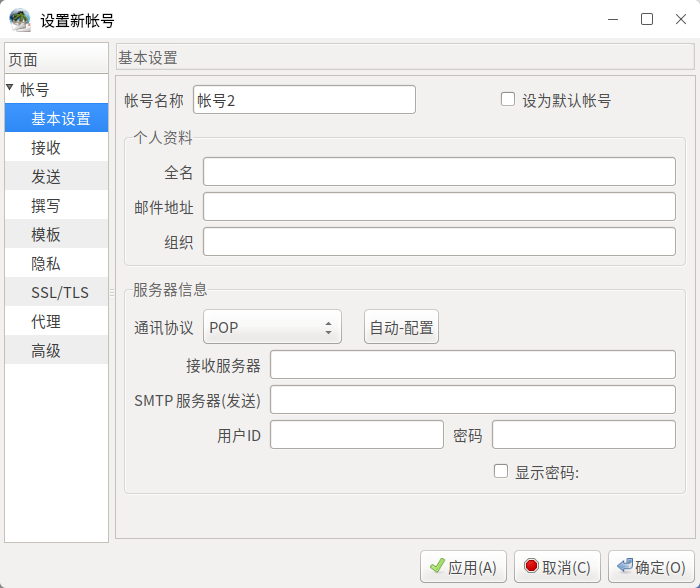
 
* “设置” > “编辑账号设置”：设置默认账号，新建/编辑/删除/复制某个选中的账号，调整账号顺序。

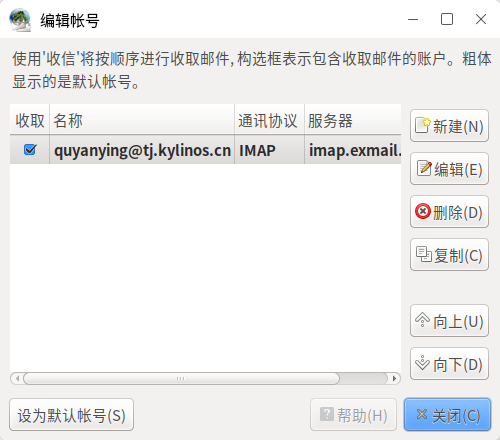

* “设置” > “偏好设置”：提供所有的设置项，包括邮件处理、邮件视图、显示等。

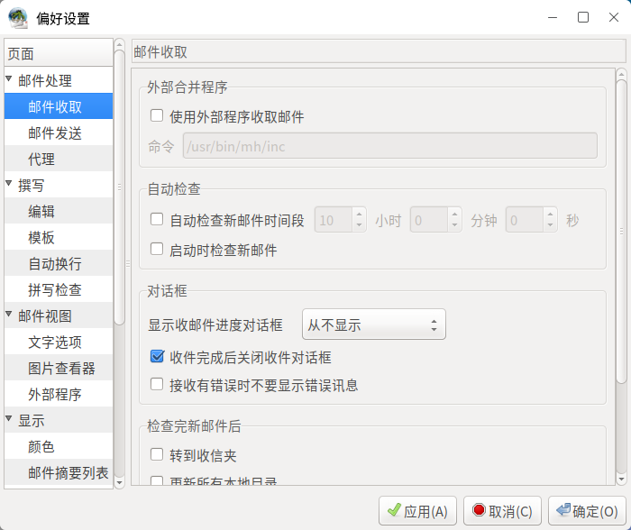

## 附 录
### 快捷键

| 快捷键 | 功能 |
|:------------ | :------------ |
| Shift + D| 清空所有废件夹|    
| Ctrl + S| 另存电子邮件|    
| Y | 另存部分邮件|
| Ctrl + P| 打印|
| Ctrl + W| 离线模式| 
| Ctrl + Q| 退出|
| Ctrl + F| 在当前邮件中查找|
| Shift + Ctrl + F| 在目录中搜索|    
| / | 快速搜索|
| F11 | 全屏模式|
| Ctrl + M| 创建新邮件|
| Ctrl + R| 回复|
| Ctrl + Alt + F | 转发|
| Ctrl + D | 移动到废件夹|

