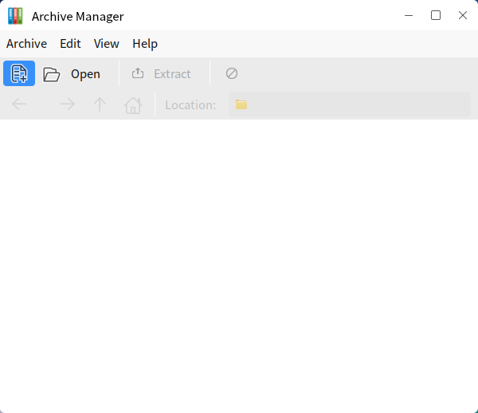
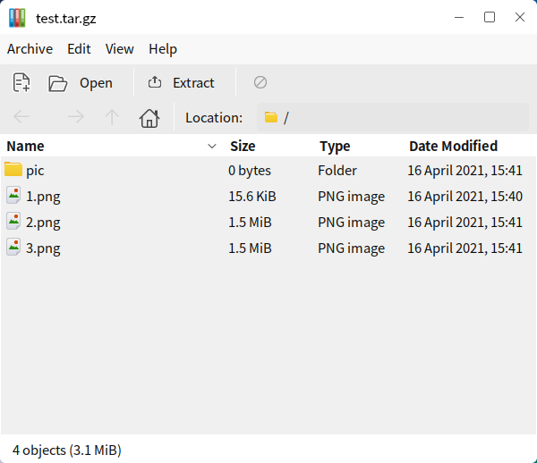
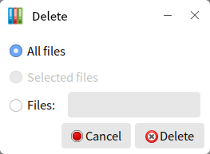

# Engrampa
## Overview
Compressed files and uncompressed files, users can open the application through "Start Menu > Archive Manager", the main interface is shown in the figure below.
 

 

## Basic Functions
### Create a new archive
#### Create directly
1) Right-click the file/folder to be compressed and select "Compress...".
 

2) In the dialog box shown in the figure below, enter the name of the compressed file, and select the compressed format and save location.
 

3) After clicking "Create", a compressed file is generated.

#### Create via Archive Manager
1) On the main interface, click "Archive > New".

2) In the new dialog box that pops up, enter the name of the archive file and select a save location, as shown below.
 

The default compression format is tar.gz, and the user can select the compression format in the file format folding box or the all archive files drop-down box, as shown in the following figure.
   

3) After creating, users can use the icon on the toolbar to add content to the archive file, or directly drag and drop the file to the window. If no file is added, the archive file will not be generated.

* : Add files.
* : Add a folder.

### View Archived Files
* Method 1: Right-click on "archive file > Open with Archive Manager"

* Method 2: Double-click the archive file

Users can see the file name, size, type, and modification date, as shown in the following figure.

At this time, double-click 1.png to view the picture; double-click the pics folder, it will enter the directory and display the contents of the folder.

### Edit Archive Files
#### Add to
After opening the archive file, you can add a new file/folder for the archive file according to the method of adding a new archive.

#### Delete
1) Delete a single file:

* Method 1: Right-click the target file> Delete

* Method 2: Select File> Delete

* Method 3: Delete > select "File", specify the file name> Delete

As shown in the figure below: In the archive file, all files named 1.png will be deleted.
 

2) Delete all documents:

* Method 1:  Select all files, right-click > Delete

* Method 2:  Delete > Select "All Files" > Delete
 

#### Rename

Right-click the target file > "Rename"

#### Copy, Cut, Paste

Right-click on the target file > "Copy"/"Cut" > Go to the target location in the archive file and right-click > "Paste"

The paste prompt dialog box will pop up, as shown below. 

After confirmation, the copy/cut operation is completed.
 

### Extracting archived documents
#### Decompress directly
1) Right-click the target archive file.

2) Select to unzip it here.

#### Decompressing through the archive manager
1) After opening the archive file, click "Unzip" on the toolbar; or right-click the archive file and select "Unzip to...".

2) The pop-up dialog box will appear as shown below. After you specify the location of the archive file, click "Unzip".
 

3) If the archive is protected by a password, the user will next be asked to enter the password.
 

 

## Advanced Functions
### Create encrypted archives
When creating a new archive, users can set a password for the archive file in the "Other options" section.

Note: Not all compression formats support encryption.
 

### Extract the specified file
When extracting archive files, at the bottom of the decompression dialog box, users can specify the files to be decompressed.
 
![Fig. 13 Extract the specified file] (image/13.png)

After the file name is specified, all files with that name in the archive file will be extracted; if it is in a subdirectory in the archive file, the extracted file will also contain the file directory.

 

## Appendix
### Shortcuts

| Shortcut key | Function |
| :------------ | :------------ |
| Ctrl+C | Copy |
| Ctrl+X | Cut |
| Ctrl+V | Paste |
| Delete | Delete |
| Ctrl+A | Select all |
| F2 | Rename |

