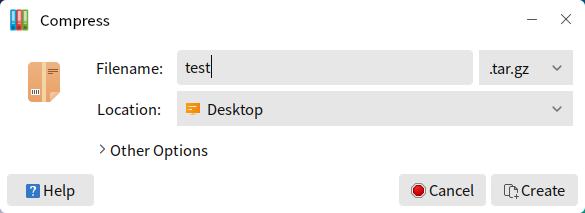
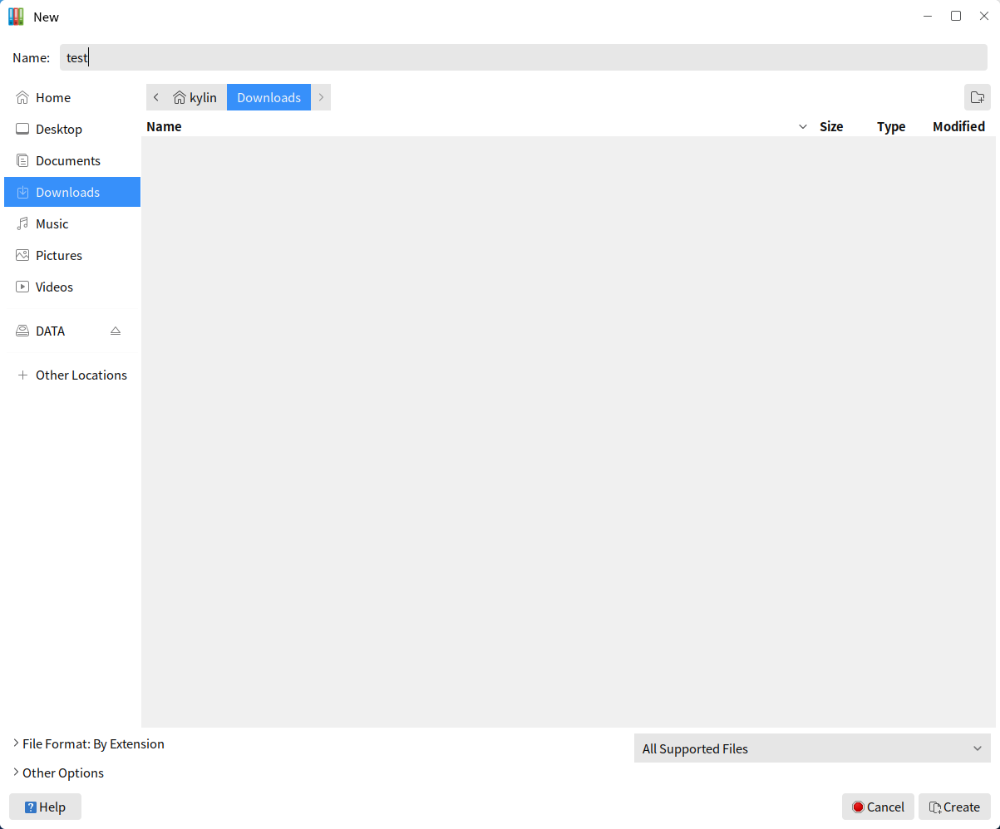
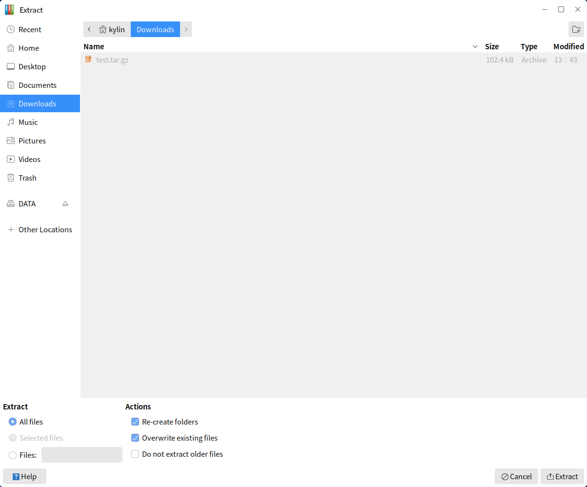
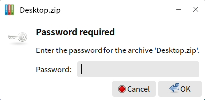
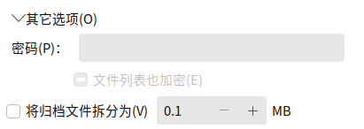

# Engrampa Archive Manager
## Overview
Compress and unzip files. The main interface as shown in Fig 1.
 

 

## Basic Function
### Create New Archive
#### Create Directly
1) Right click the selected files or folders, choosing "Compress".
 

2) Enter the name of archive file, and select the compress format, location.
 

3) Click "Create".

#### Through Engrampa 
1) Click "Archive" > "New" at the main interface.

2) Enter the name of archive file and select the location in the pop up window, as shown in Fig 4.
 

The default format is "tar.gz". Users can change it in the "File Format" fold box or "All Archive" combobox, as shown below.
   

3) After clicking "Create", users can add contents to the archive file through the icon on the tool bar, or dragging files to the window directly. (Only can be added once.)

The archive file won't be generated without any file added.

* : Add files.

* : Add a folder.

### View Archive
* Way 1: Right click archive file > "Open With Engrampa Archive Manager"

* Way 2: Double click archive file

Name, size, type, date modified will be shown, as Fig 6.

Double click 1.png to see the picture; Double click pics folder to enter it and show the contents.

### Edit Archive
#### Delete
1) Delete single file:

* Way 1: Right click file > "Delete"

* Way 2: Select file > Delete

* Way 3: Delete > select "Files" and specify file name > "Delete"

As shown in Fig 7: All the files named 1.png will be deleted.
 

2) Delete all files:

* Way 1: Select all files and right click > Delete

* Way 2: Delete > select "All Files" > "Delete"
 

#### Rename
Right click file > "Rename"

#### Copy, Cut, Paste
Right click file > "Copy"/"Cut" > go to the destination in archive file and right click > "Paste"

It will pop up a paste prompt box. Click "Paste" after ensuring.
 

### Extract Archive
#### Unzip directly
1) Right click archive file.

2) Select "Extract Here".

#### Unzip through Engrampa
1) Click "Extract" on the tool bar after openning archive file; Or right click archive file > select "Extract To…".

2) The popup as shown in Fig 10. After choosing location, click "Extract".
 

3) If it's an encrypted archive, password will be required.
 

 

## Advanced Function
### Create Encrypted Archive
When creating, "Other Options" provides function to set the password for this archive file.

Tips: Not all the compress formats supports encryption.
 

### Extract Specified Files
Users can specify files to be extracted at the bottom of the extract window.
 

All the file with this name in the archive will be extracted; If the file is under the sub directory, the extracted file will include this directory also. 

 

## Appdenix 
### Shortcut Key

| Shortcut | Function |
| :------------ | :------------ |
| Ctrl + C  | Copy |
| Ctrl + X  | Cut |
| Ctrl + V  | Paste |
| Delete  | Delete |
| Ctrl + A  | Select all |
| F2  | Rename |

