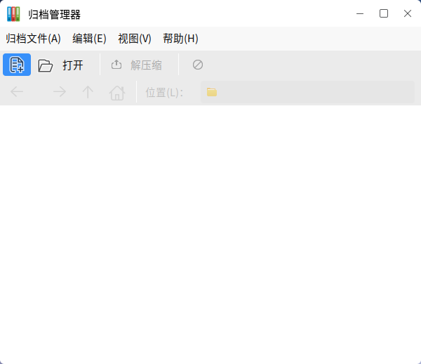
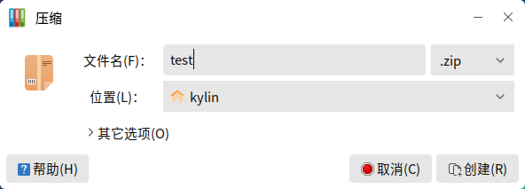
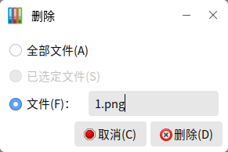

# 归档管理器
## 1  概述

压缩文件和解压文件，用户可通过 **开始菜单** > **附件** > **归档管理器** 打开应用，主界面如下图所示。
 

 

## 2  创建新归档
### 2.1  直接创建

（1）右键单击要压缩的文件/文件夹，选择 **压缩…** 。
 

 

（2）在如下图所示的对话框中，输入压缩文件的名称，并选择压缩的格式和保存的位置。
 

 

（3）点击 **创建** 后，即生成压缩文件。

### 2.2  通过归档管理器创建

（1）在主界面上点击 **归档文件** > **新建** 。

（2）在弹出的新建对话框中，输入归档文件名称，并选择保存位置。如下图所示。
 

 

默认压缩格式为tar.gz，用户可在**文件格式**折叠框 或 **全部归档文件**下拉框中选择压缩格式，如下图所示。
   

 

（3）点击 **创建** 后，可通过工具栏上的图标，往归档文件里添加内容，或者直接拖拽文件到窗口。若未添加文件，则归档文件不会生成。

*  ：添加文件。
*  ：添加文件夹。

## 3  查看归档文件

* **方法1：归档文件右键单击 > 使用归档管理器打开**

* **方法2：双击归档文件**

可以看到文件的名称，大小，类型，修改日期，如下图所示。

 

此时，双击1.png，可以查看图片；双击pics文件夹，会进入该目录，显示文件夹中的内容。

## 4  编辑归档文件
### 4.1  添加

打开归档文件后，可按照2.2节中的添加方式，为该归档文件添加新文件/文件夹。

### 4.2  删除

（1）删除单个文件：

* **方式1：右键单击目标文件 > 删除**

* **方式2：选中文件 > Delete**

* **方式3：Delete > 选择“文件”，指定文件名 > 删除**

如下图所示：归档文件中，所有名为1.png的文件，都将被删除。
 

 

（2）删除全部文件：

* **方式1：选中所有文件，右键单击 > 删除**

* **方式2：Delete > 选择“全部文件” > 删除**
 

 

### 4.3  重命名

右键单击目标文件 > “重命名”

### 4.4  复制、剪切、粘贴

右键单击目标文件 > “复制”/“剪切” > 进入归档文件中的目标位置，右键单击 > “粘贴”

此时会弹出粘贴提示对话框，如下图所示。确认后，复制/剪切操作完成。
 

 

## 5  提取归档文件
### 5.1  直接解压

（1）右键单击目标归档文件。

（2）选择 **解压缩到此处** 。

### 5.2  通过归档管理器解压

（1）打开归档文件后，点击工具栏上的 **解压缩** ；或者右键单击归档文件，选择 **解压缩到…** 。

（2）弹出对话框如下图所示。用户指定解压文件的位置后，点击 **解压缩** 。
 

 

（3）如果归档受密码保护，则接下来将要求用户输入密码。
 

 

## 6  高级选项
### 6.1  创建加密归档

创建一个新归档时，在 **其他选项** 中，可以为归档文件设置密码。

> 不是所有压缩格式都支持加密，可以使用密码保护的类型：7z、jar、zip。
 

 

### 6.2  提取指定文件

提取归档文件时，在解压对话框底部，可以指定要解压的文件。
 

 

指定文件名后，归档文件中所有为该名字的文件都会被提取出来；若是在归档文件中的子目录里，提取的文件也会包含文件目录。

## 7  常见问题

### 附录 快捷键

| 快捷键  | 功能  |
| :------------ | :------------ |
| Ctrl+C  | 复制  |
| Ctrl+X  | 剪切  |
| Ctrl+V  | 粘贴  |
| Delete  | 删除  |
| Ctrl+A  | 全选  |
| F2  | 重命名  |

 
