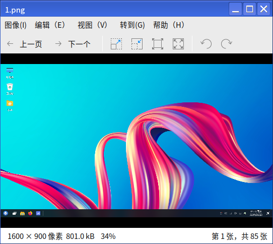
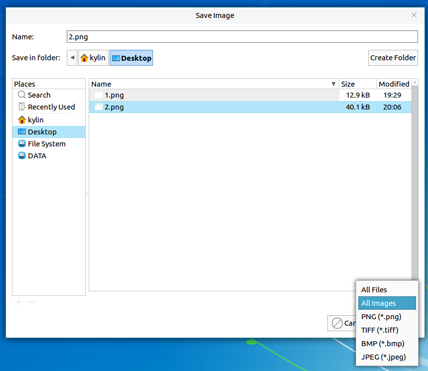
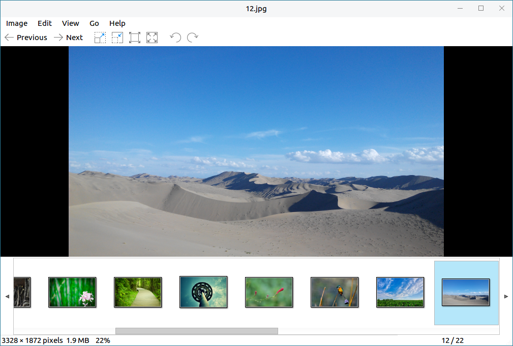
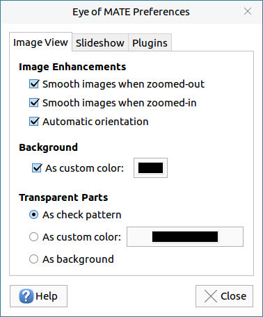
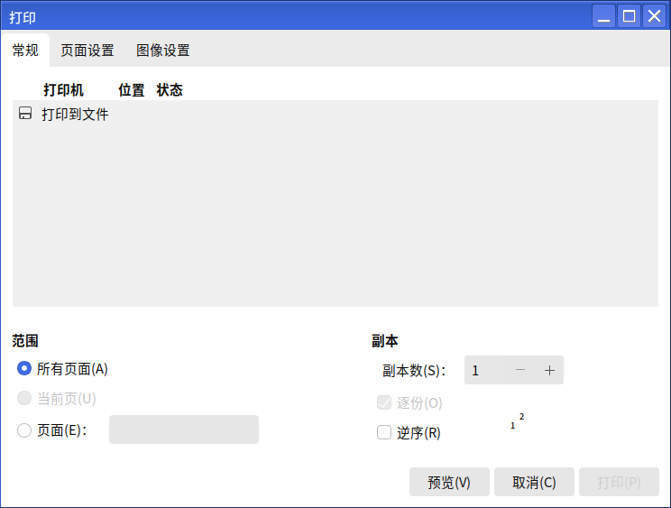
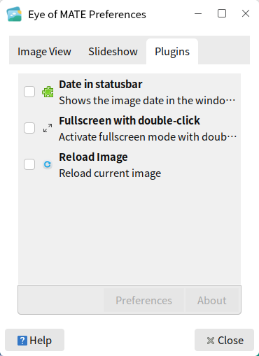

# Eyes of Mate Image Viewer
## Overview
EOM is an images view tool, and it supports various of picture's formats, as well as enlarge/slideshow/fullscreen, etc.. The main interface as shown in Fig 1.

 

## Basic Function
Icons and Function:

| Icon | Function | Icon | Function |
| :------------ | :------------ | :------------ | :------------ |
|| Previous || Next |
|| Enlarge || Shrink |
|| Show as normal size || Fit to the window |
|| Rotate 90 degrees to the left ||Rotate 90 degrees to the right

 

Click "Image" > "Open" to open the selected images. If more than one images are opened at a time, users can click "Previous"/"Next" to view them. The select window as shown in Fig 2.

 

## Advanced Function
The options on the menu bar provide some other operations for images.

### Change format 
Clicking "Image" > "Save As", users can change the currently opened image's format. As shown in Fig 3.

### Image collection
When an image is opened and click "View" > "Image Collection", all images in this path will show up.

### Preferences
Click "Edit" > "Preferences" to enter the setting interface of EOM.

 

## Appendix
### Shortcut Key

| Shortcut | Function |
| :------------ | :------------ |
| Ctrl + O | Open image |
| Ctrl + S | Save image |
| Shift + Ctrl + S | Save as… |
| Ctrl + P | Print |
| Ctrl + W | Close |
| Ctrl + R | Rotate 90 degrees clockwise |
| Shift + Ctrl + R | Rotate 90 degrees counterclockwise |
| F11 | Fullscreen |
| F5 | Slideshow |
| Ctrl + + | Enlarge image |
| Ctrl + - | Shrink image |
| Ctrl+0 | Normal size |
| F | Fit the window |
| Alt + Home | First image |
| Alt + End | Last image |

