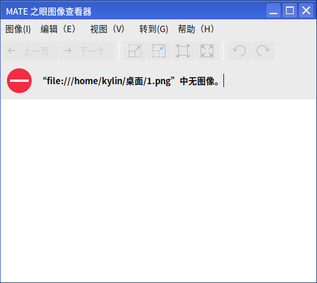

# 图像查看器
## 概 述
图像查看器是一款用来查看图像的软件，能打开多种格式的图片,支持放大、幻灯显示图片、全屏、缩略图等。主界面分为标题栏（最小化、最大化、关闭）、菜单栏、工具栏、状态栏四个部分，如图1所示。

 

## 基本功能
主界面介绍：

图标及其功能介绍:

|图 标	|图标功能说明	|图 标|	图标功能说明
| :------------ | :------------ | :------------ | :------------ |
||	上一张	||	下一张
||	放大图片||		缩小图片
||	以正常大小显示图片	||	使图像适合窗口
||	将图片逆时针旋转90度	||	将图片顺时针旋转90度

 

## 高级功能
用户可以通过菜单的图像、编辑、查看、转到、帮助选项，对图片查看器进行相关操作。

图标及其功能介绍:

|图 标|	图标功能说明	|图 标	|图标功能说明
| :------------ | :------------ | :------------ | :------------ |
||	打开图像	||	保存
||	另存为		||打印
||	属性	||	关闭
||	撤销	||	复制
||	水平翻转	||	垂直翻转
||	顺时针旋转	||	逆时针旋转
||	移至回收站	||	首选项
||	第一个图像	||	最后一个图像
||	进入用户手册	||	关于图像查看器

 

### 图 像
用户可以通过点击：菜单 > 图像，进入到图像选项，对图像进行打开、另存为、打印等操作，如图5所示。

#### 打 开
用户可以通过点击：菜单 > 图像 > 打开，选择需要查看的图像即可，如图6所示。

打开方式如图7所示：

#### 打 印
用户可以通过点击：菜单 > 图像 > 打印，可以对图像进行打印设置，如图8所示。

#### 属 性
用户可以通过点击：菜单 > 图像 > 属性，可以查看图像属性，如图9所示。

### 编 辑
用户可以通过点击：菜单 > 编辑，进入到编辑选项，对图像进行复制、翻转、旋转等操作。

#### 工具栏
用户可以通过点击：菜单 > 图像 > 打开，选择需要查看的图像即可，如图10所示。

#### 首选项
用户可以通过点击：菜单 > 编辑 > 首选项，可根据用户需求自行定义图像效果、设置幻灯片播放及活动插件，如图11所示。

### 查 看
用户可以通过点击：菜单 > 查看，进入到查看选项，针对图像查看器界面的工具栏、状态栏及图集是否显示进行设定，同时可以对查看图片进行全屏、幻灯片、放大缩小等操作，如图12所示。

#### 图 集
用户可以通过点击：菜单 > 查看 > 图集，如图13所示。

### 转 到
用户可以通过点击：菜单 > 转到，进入到查看选项，该选项旨在对浏览图片，进行上一张、下一张、第一张、最后一张及随机浏览进行操作，如图14所示。

### 帮 助
用户可以通过点击：菜单 > 帮助，进入到帮助选项，如图15所示。

#### 内 容
用户可以通过点击：菜单 > 帮助 > 内容，跳转到用户手册。

#### 关 于
用户可以通过点击：菜单 > 帮助 > 关于，查看图像查看器的信息，如图17所示。

 

## 常见问题
### 在图像查看器的图像下拉菜单中显示历史打开的图片无法显示
若显示图17所示问题，说明该历史图片已不在当前路径下，如需查看需要在新的路径下打开。

 

## 附 录
### 快捷键

|选项	|快捷键|	操作内容
| :------------ | :------------ | :------------ | 
|打开（O）...|	Ctrl+O	|选择图像并打开
|保存（S）	|Ctrl+S	|保存图像
|另存为	|Shift+Ctrl+S|	将图像另存为
|打印（P）...|	Ctrl+P	|打印图像
|设为桌面背景（D）|	Ctrl+F8|	将当前图像设置为桌面背景
|属性（R）|	Alt+回车|	查看图像属性
|关闭（C）|	Ctrl+W|	关闭图像查看器
|撤销	|Ctrl+Z|	撤销操作
|复制（C）|	Ctrl+C	|复制图像
|顺时针旋转（R）|	Ctrl+R	|对当前图像做顺时针旋转操作
|逆时针旋转（L）|	Shift+Ctrl+R|	对当前图像做逆时针旋转操作
|全屏（F）	|F11|	全屏查看图像
|放大（Z）	|Ctrl++	|放大当前图像
|缩小（O）	|Ctrl+-	|缩小当前图像
|正常大小（N）|	Ctrl+0	|以正常大小显示图片
|最佳长度（B）|	F	|使图像适合窗口
|上一个图像（P）|	Alt+左	|查看上一个图像
|下一个图像（N）|	Alt+右	|查看下一个图像
|第一个图像（F）|	Alt+Home|	跳转到第一个图像
|最后一个图像（L）|	Alt+End	|跳转到最后一个图像
|随机图像（R）	|Ctrl+M	|随机浏览图像
