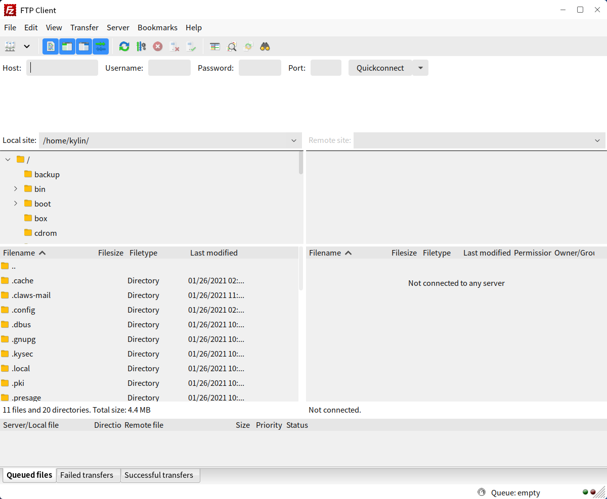
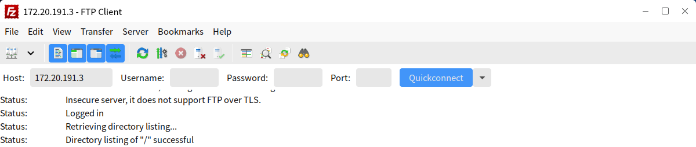
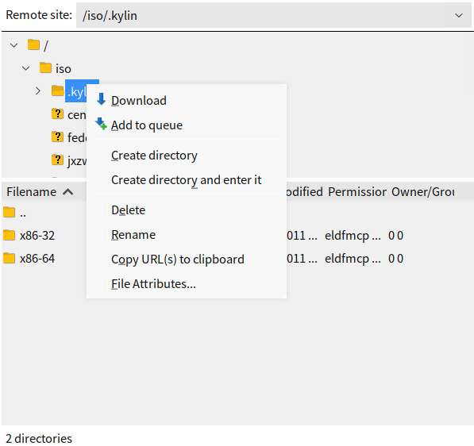
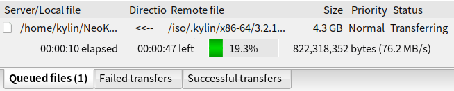

# Filezilla
## Overview
Connect to ftp server, and download/upload files. The main interface as shown in Fig 1.

 

## Basic Function
### Connect to FTP
1) Input the informations of the FTP server

IP address, user name, password, as shown in Fig 2.

### View and download

The right side part is the remote window, showing the directories and files on the FTP server. Right-click menu as shown in Fig 3.

### Upload

The left side part is the local window, and right-click menu as shown in Fig 4.

### Transfer records

It shows at the bottom of the interface.

 

## Appendix
### Shortcut Key

| Shortcut | Function|
| :------------ | :------------: |
| Ctrl+S | Open site manager
| Ctrl+T | Add new tab
| Ctrl+W | Close the current tab
| Ctrl+E | Show the editing files
| Ctrl+Q | Quit
| F5 | Refresh log
| Ctrl+I | Filename filters
| Ctrl+O | Directory comparison
| Ctrl+Y | Synchronized browsing
| Ctrl+P | Process queue
| Ctrl+U | Preserve timestamps of transferred files
| Ctrl+M | Manual transfer
| Ctrl+R | Reconnect
| Ctrl+D | Disconnect
| F3 | Search the remote files
| Ctrl+B | Add bookmark
| Shift+Ctrl+B | Manage bookmarks
