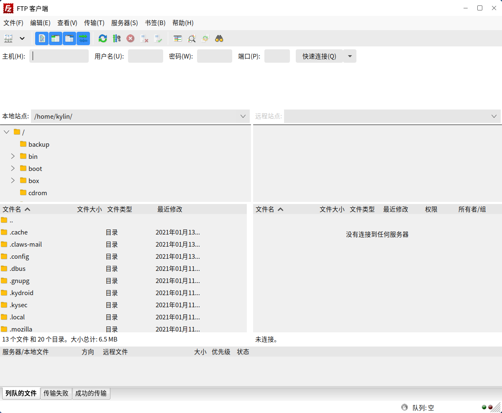
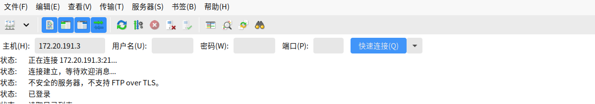
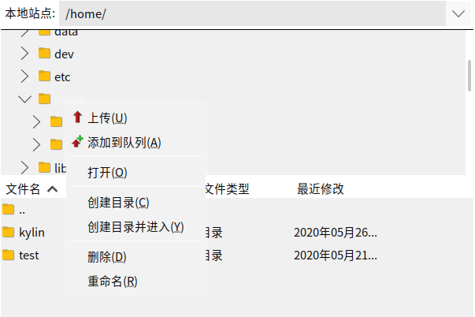
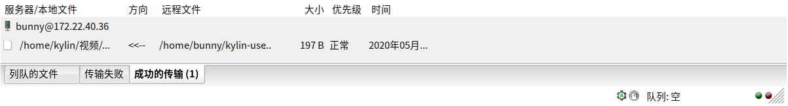
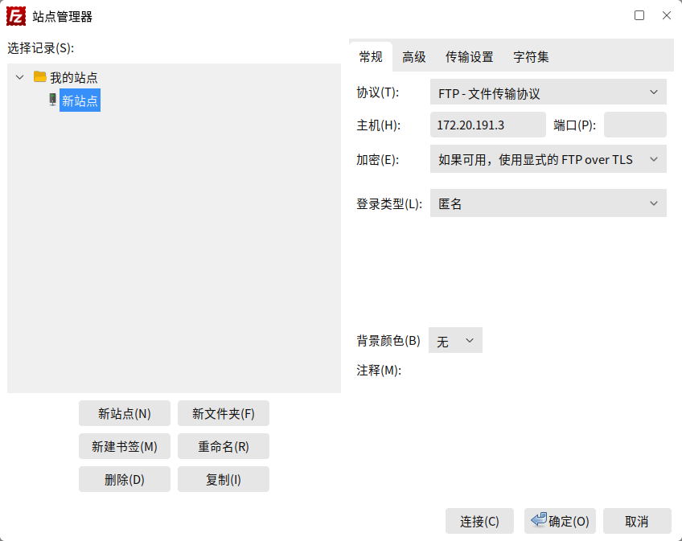
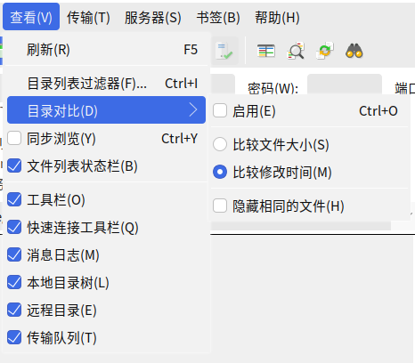
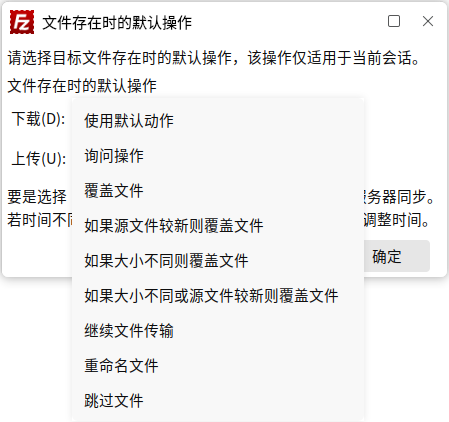
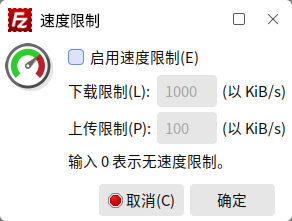
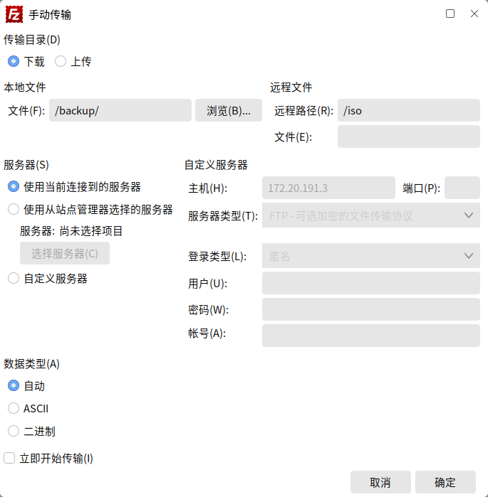
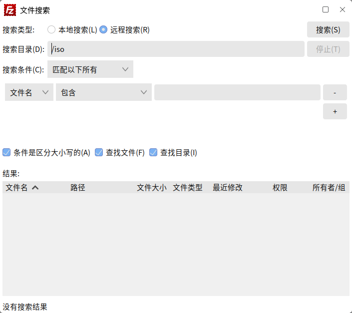

# FTP客户端
## 概 述
FTP客户端是一款网络应用软件，可连接到FTP服务器上，进行目录、文件的上传和下载，主界面如图1所示。

 

## 基本功能
### 连接服务器

在顶部输入 FTP 服务器的地址，以及登录的用户名、密码和端口，连接到服务器。

### 查看远程目录并下载

右半部的窗口（远程目录窗口）能看到服务器上的目录和文件详情。右键单击，可选择文件下载等操作。

### 查看本地窗口并上传

左半部（本地目录窗口）是本机的目录和文件详情。右键单击，可选择文件上传等操作。

### 查看传输任务

传输的状态及进度,会在底部窗口显示并记录。

 

## 高级功能
### 站点管理
点击“文件” > “添加当前连接到站点管理器”，可保存当前连接的信息，便于下次快速连接。

左键单击工具栏上的“”图标，可打开站点管理器；右键单击可查看站点列表，选择后可连接到该站点。

### 导入&导出
点击“文件” > “导入”/“导出”，可从文件中导入设定，或是把站点管理记录、设置等导出。

### 清除个人信息
点击“编辑” > “清除个人信息”，可选择要删除哪些分类。

### 界面布局显示
点击“查看”，可通过勾选，选择在主界面上显示的区块，并提供了列表过滤、目录比较功能，如图9所示。

### 对已存在文件的默认操作
点击“传输” > “对已存在文件的默认操作”，如图10所示，可对上传/下载中出现重复文件时的处理方式进行设置。

### 速度限制
点击“传输” > “速度限制”，可启用和配置，如图11所示。

### 手动传输
点击“传输” > “手动传输”，界面如图12所示，可指定某个文件的上传/下载。

### 搜索远程文件
点击“服务器” > “搜索远程文件”，如图13所示，可搜索服务器上满足搜索条件的文件。

 

## 附录
### 快捷键

| 快捷键 | 功能
| :------------ | :------------: |
|Ctrl + S| 打开站点管理器
|Ctrl + T| 添加新标签
|Ctrl + W| 关闭当前标签
|Ctrl + E| 显示正在被编辑的文件
|Ctrl + Q| 退出FTP客户端
|F5| 刷新消息日志
|Ctrl + I| 打开文件名过滤器
|Ctrl + O| 启用目录比较
|Ctrl + Y| 开启同步浏览
|Ctrl + P| 处理队列
|Ctrl + U| 保留传输文件的时间戳
|Ctrl + M| 手动进行传输
|Ctrl + R| 重新连接当前服务器
|Ctrl + D| 断开当前服务器
|F3|搜索远程文件
|Ctrl + B| 添加书签
|Shift + Ctrl + B| 管理书签
