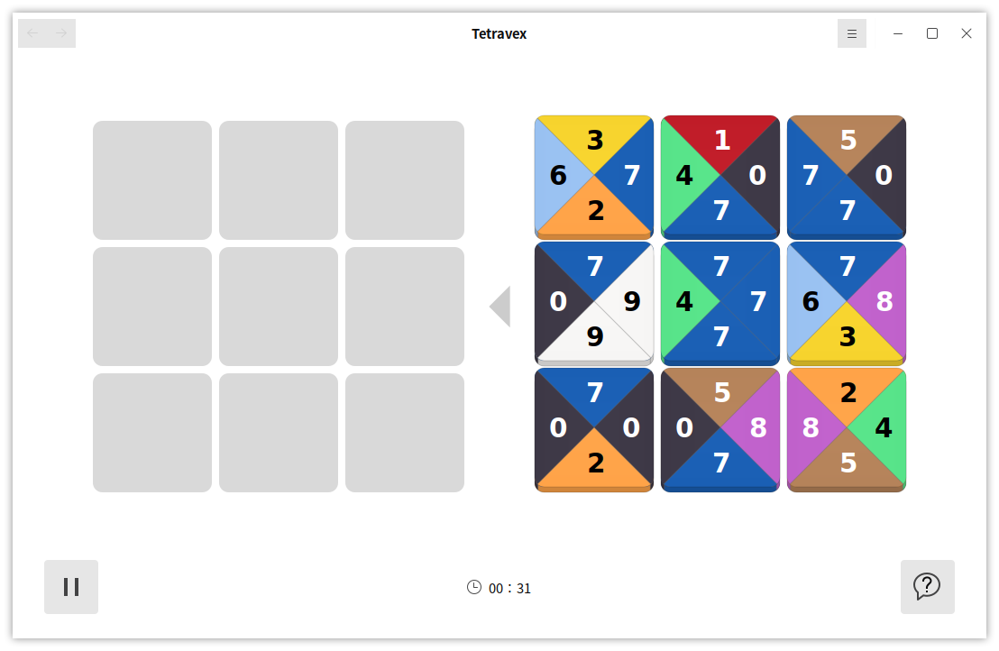
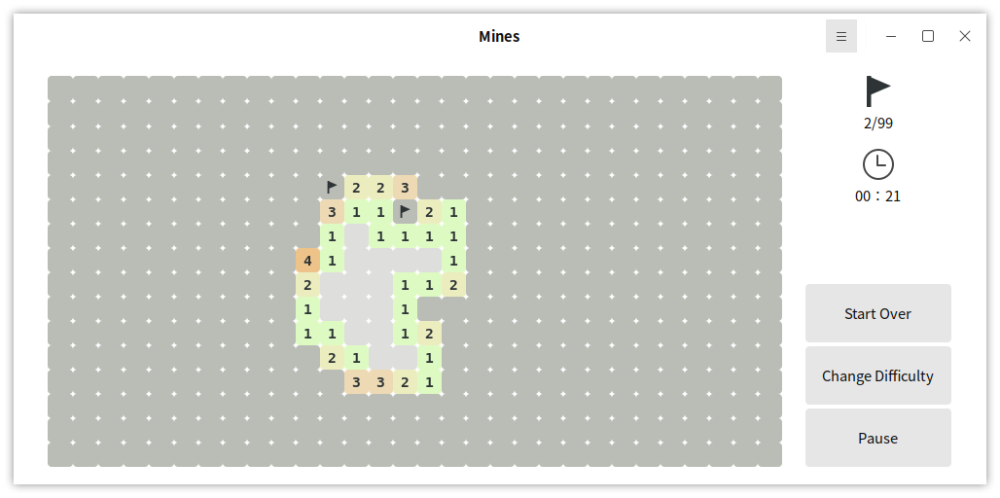
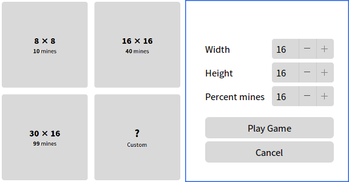
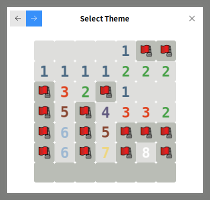

# Game
## Tetravex

**Rules**: Move the blocks from right side to left side, and the nearby number must be the same.

Click the icon on the upper left corner and select "Size", it can change the quantity of the blocks.

 

## Mines

**Rules**: The number means the quantity of mines around; Left click to open block, and right click to mark block. The aim is that find all the mines.

The size can be set when opening game, as shown in Fig 4.

Click the icon on the upper left corner can set whether to show warnings, use question flags or not, and the appearance.

 

## Iagno

**Rules**：

1) Here are 4 crossed pieces, and the black goes first.

2) Between the newly dropped piece and the existing pieces of the same color, all pieces of the opponent should be turned over (horizontal, vertical, oblique); All blocks must be opponent's pieces, no spaces.

3) Each move has to flip at least one piece of the opponent.

4) If one side doesn't have a legal move, this round will be abstained and the opponent will continue to play until he has a legal move.

5) The game lasts until the board is full or both sides have no legal moves.

6) The player with more pieces wins; If one side turns over all the opponent' pieces, he also wins.

The difficulty can be set when opening game, as shown in Fig 7.

Click the icon on the upper left corner can set whether to open the sound, and the style of the pieces.

