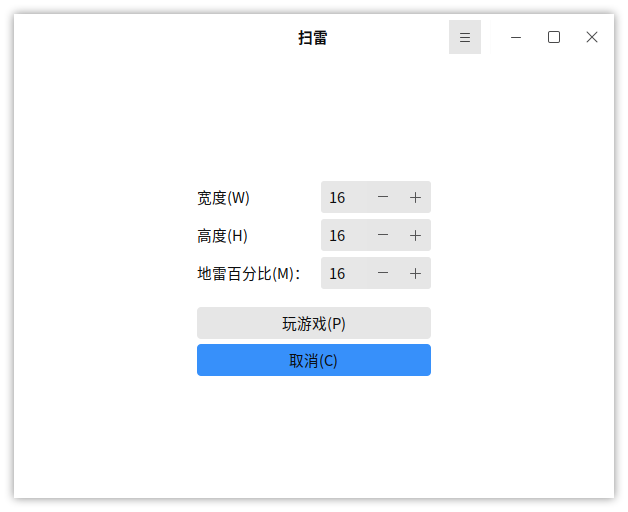

# 游 戏
## 四 邻

**规则**：把右侧的方块移至左侧，使相邻的两个方块数字相同。

点击左上角的图标，选择“大小”，可设置游戏方块的数量。

 
 

## 扫 雷

**规则**：数字表示周围一圈8个方格中，存在的地雷数量；左键点开方格，右键标记方格为地雷。找出所有地雷即为成功。

打开时可以选择游戏的规格，图 3为“30×16 99个雷”；也可以自定义。

点击左上角的图标，可设置是否显示警告和使用问号旗标，以及游戏外观主题。

 
 

## 黑白棋

**规则**：

1）棋盘上交叉放好了四颗棋子，黑棋先行。

2）新落下的棋子与棋盘上已有的同色棋子间，对方被夹住的所有棋子都要翻转过来（横，竖，斜）；夹住的位置上必须全部是对手的棋子，不能有空格。

3）每一步棋至少能翻转对手一颗棋子。

4）如果一方没有合法棋步，则该轮弃权，由对手继续落子，直到自己有合法棋步。

5）棋局持续直到棋盘填满，或双方都无合法棋步可下。

6）最后棋子数目多的一方获胜；如果吃光对方棋子，也判胜。

打开游戏时可选择游戏难度，如图 7所示。

点击左上角的图标，可设置是否有声音，以及棋子的样式主题。

