# 分区编辑器帮助手册

## 1.概 述
根据用户使用习惯，增加了用户分区的创建和使用支持，在系统安装时用户可以选择创建数据分区，系统文件管理器将会以数据盘的形式展现，相当于Windows系统的C/D/E盘，可以更好的适应用户使用习惯的切换。
分区编辑器是一款系统应用软件，用户可以对本机所有存储设备(比如本地硬盘、移动硬盘、U 盘等)进行查看和编辑(新建分区、删除分区、格式化等相关磁盘操作)。主界面由标题栏（最小化、最大化、关闭）、菜单、分区功能控制区以及磁盘信息区构成，如图1所示。

 

 

## 2.基本功能
磁盘分区中的彩色条显示各个分区大小，对应下面列表中的分区名称；列表区展示了各个分区的详细信息，比如分区名称、挂载点等，如图2所示。
基本功能图标及其功能介绍：

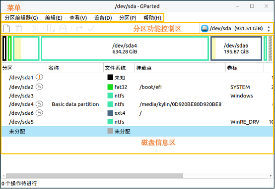
 

|图标|	图标功能说明|	图标|	图标功能说明
| :------------ | :------------ | :------------ | :------------ |
|	|在选定的未分配空间内建立一个新的分区|	|	删除选定分区
|	|调整大小/移动选定分区||		将选定分区复制到剪切板
|	|从剪切板粘贴分区||		撤销上次操作
|	|应用全部操作	||	当前设备信息

##### 表 1 基本功能图标及其功能介绍
 

## 3.高级功能
用户可以通过菜单的分区编辑器、编辑、查看、设备、分区、帮助选项，对分区编辑器进行相关操作，如图3所示。
高级功能图标及其功能介绍：

  

|图标	|图标功能说明	|图标	|图标功能说明
| :------------ | :------------ | :------------ | :------------ |
||	刷新设备||		当前设备信息
||	退出	||	撤销上次操作
||	清除全部操作	||	应用全部操作
||	新建分区	||	删除分区
||	更改大小/移动	||	复制
||	粘贴	||	格式化为（ntfs、linux-swap等）
||	信息	||	进入用户手册
||	关于分区编辑器	||	||

##### 表 2 高级功能图标及其功能介绍
 

#### 3.1.分区编辑器
用户可以通过点击：菜单>分区编辑器，如图4所示。

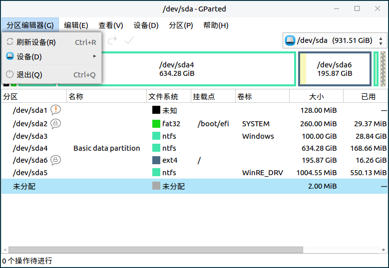
 

#### 3.1.1.刷新设备
用户可以通过点击：菜单>分区编辑器>刷新设备，对当前磁盘信息刷新，如图5所示。

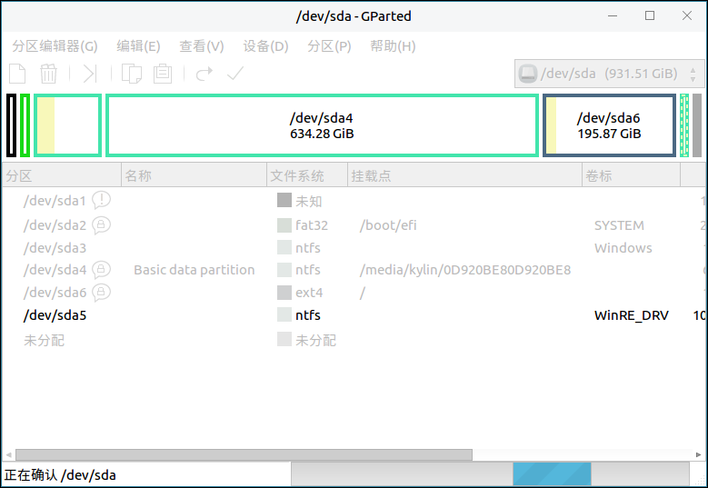
 

#### 3.1.2.查看设备
用户可以通过点击：菜单>分区编辑器>设备，查看当前设备信息，如图6所示。

 

### 3.2.编 辑
用户可以通过点击：菜单>编辑，如图7所示。

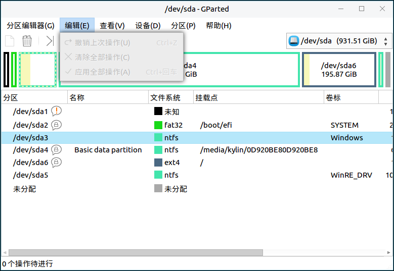
 

### 3.3.查 看
用户可以通过点击：菜单>查看，可以查看设备信息、待执行操作以及文件系统支持信息表，如图8所示。

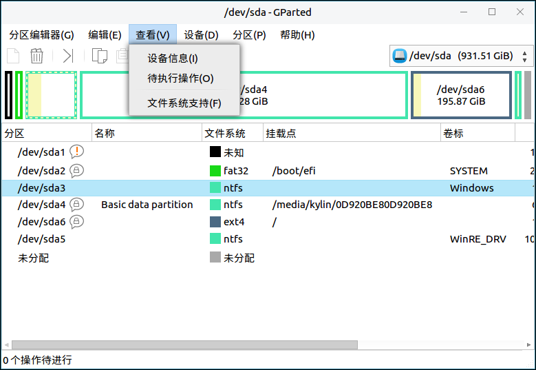
 

#### 3.3.1.设备信息&待执行操作
用户可以通过点击：菜单>查看>设备信息&待执行操作，可以查看设备信息、待执行操作，如图9所示。

 

#### 3.3.2.文件系统支持
用户可以通过点击：菜单>查看>文件系统支持，可以文件系统支持信息表，此操作需作为超级用户，如图10所示。

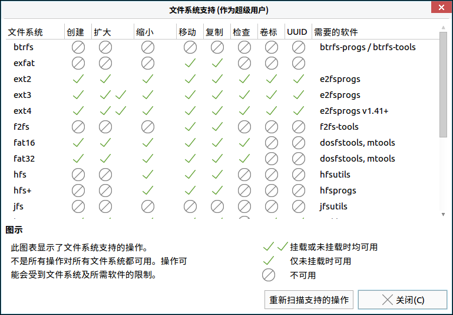
 

### 3.4.设 备
用户可以通过点击：菜单>设备，创建分区表，如图11所示。

 

 

### 3.5.分 区
用户可以通过点击：菜单>分区，对磁盘进行删除、更改大小/移动、渎职、格式化等操作，如图13所示。

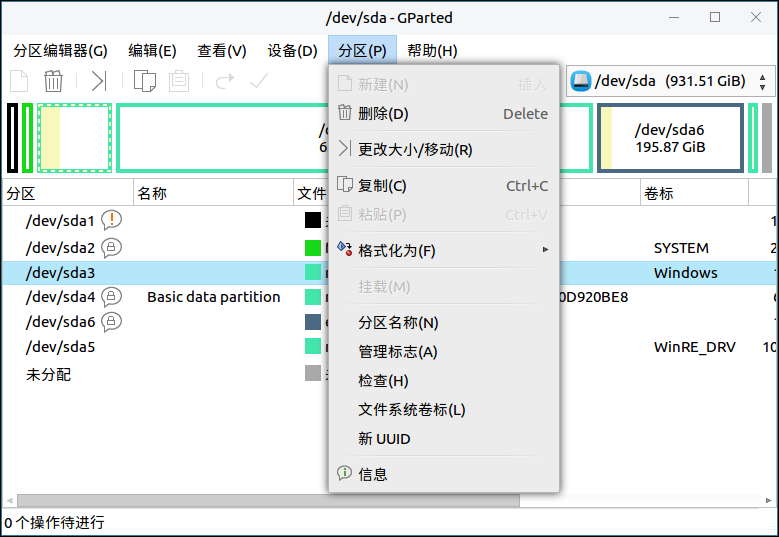
 

#### 3.5.1.更改大小&移动
用户可以通过点击：菜单>分区>更改大小&移动，如图14所示。

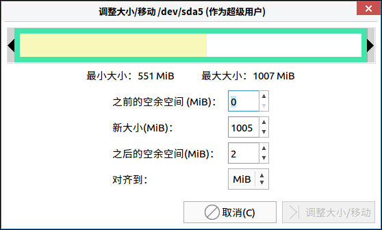
 

#### 3.5.2.格式化
用户可以通过点击：菜单>分区>格式化，如图15所示。

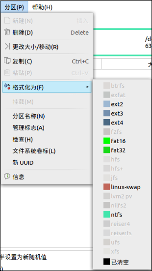
 

#### 3.5.3.分区名称
用户可以通过点击：菜单>分区>分区名称，如修改“/dev/sda5”分区的名称，如图16所示。

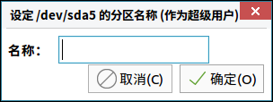
 

#### 3.5.4.管理标志
用户可以通过点击：菜单>分区>管理标志，如管理“/dev/sda5”的标志，如图17所示。

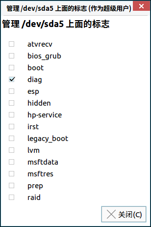
 

#### 3.5.5.检查分区
用户可以通过点击：菜单>分区>检查，如检查“/dev/sda5”分区，如图18所示。

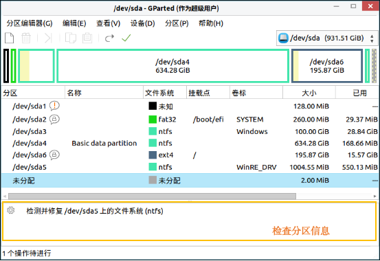
 

#### 3.5.6.文件系统卷标
用户可以通过点击：菜单>分区>文件系统卷标，可以修改文件系统卷标，如图19所示为“/dev/sda5”分区卷标信息。

 

#### 3.5.7.新UUID
用户可以通过点击：菜单>分区>新UUID，需要注意的是更改UUID可能会验证windows产品激活密，如图20所示。

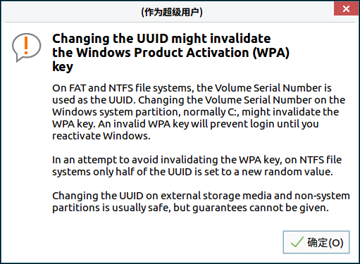
 

提示信息：
在FAT和NTFS文件系统上，卷序列号用作UUID。 更改Windows系统分区（通常为C :）上的卷序列号可能会使WPA密钥无效。无效的WPA密钥将阻止登录，直到您重新激活Windows。
为了避免使WPA密钥无效，在NTFS文件系统上，只有一半的UUID设置为新的随机值。
通常，更改外部存储介质和非系统分区上的UUID是安全的，但不能保证。
#### 3.5.8.信 息
用户可以通过点击：菜单>分区>信息，显示当前分区信息，如图21所示为显示的未分配分区的信息。

 

### 3.6.帮 助
用户可以通过点击：菜单>帮助，如图22所示。

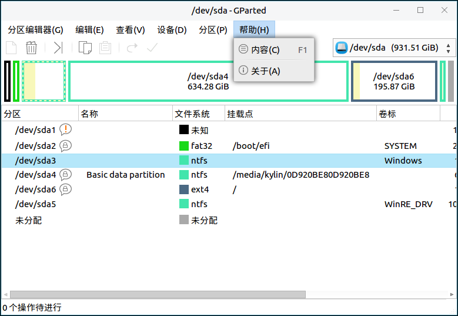
 

#### 3.6.1.内 容
用户可以通过点击：菜单>帮助>内容，跳转到用户手册，如图23所示。

 

#### 3.6.2.关 于
用户可以通过点击：菜单>帮助>关于，查看分区编辑器的信息，如图24所示。

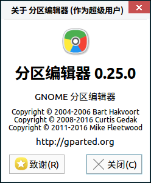
 

## 4.常见问题
### 4.1.使用分区编辑器需要注意什么问题？
用户在打开分区编辑器前，需要先进行授权进入，授权密码为登录系统时的用户密码，授权后等待加载进入主界面，如图所示。

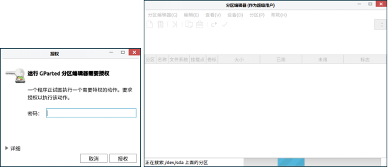
 

## 5.附录
### 5.1.快捷键

|选项	|快捷键
| :------------ | :------------ |
|刷新设备（R）..|.	Ctrl+R
|退出（Q）|	Ctrl+Q
|撤销上次操作（U）|	Ctrl+Z
|应用全部操作（A）|	Ctrl+回车
|删除（D）|	Delete
|复制（C）|	Ctrl+C
|粘贴（P）|	Ctrl+V
|内容（C）|	F1

 
