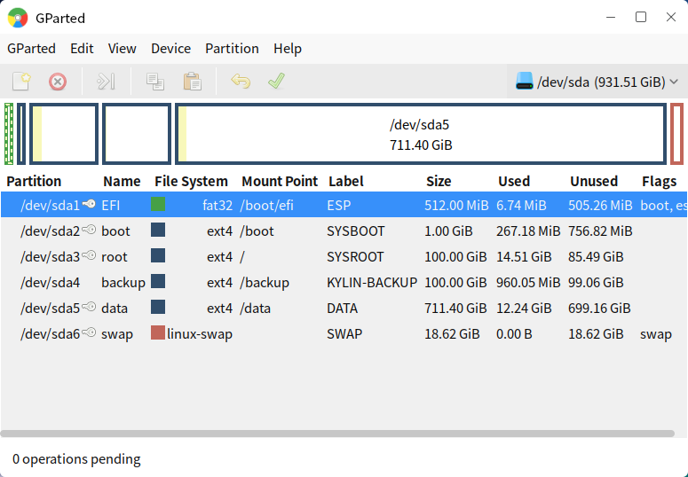
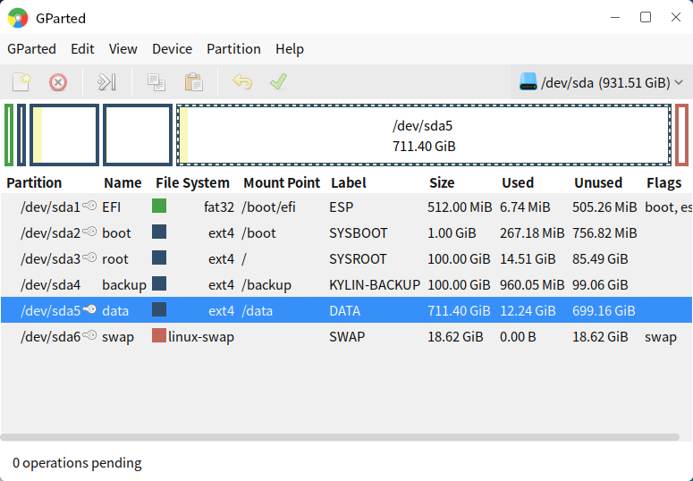
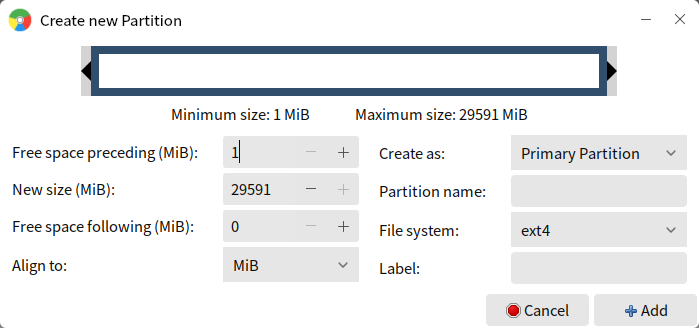
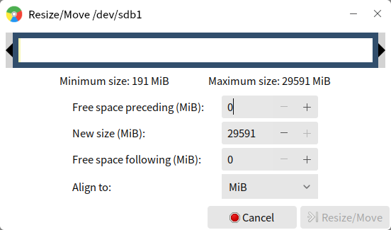
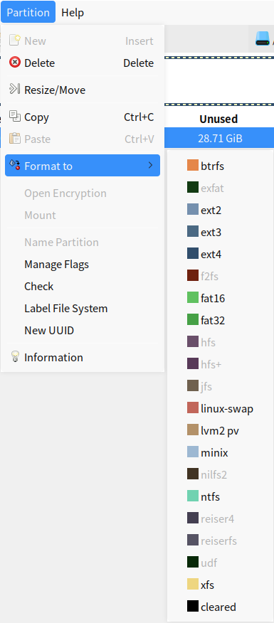
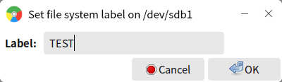
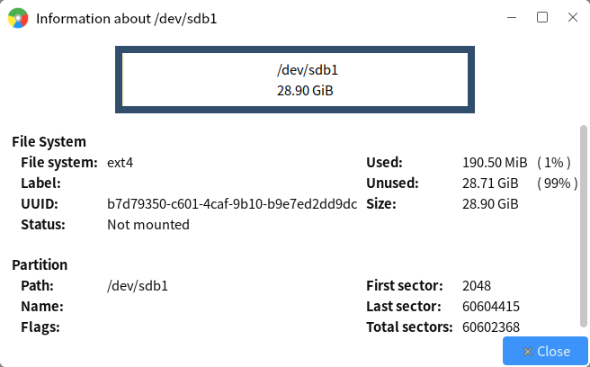
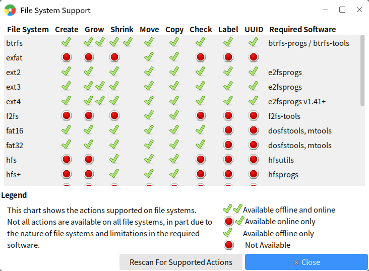

# GParted
## Overview
GParted provides to view and edit all local storage devices. The main interface as shown in Fig 1.

 

## Basic Function
The colorbar's length corresponds to partition's size. The list area shows the details of each partition, including mount point, size, etc..

Click a colorbar will mark the corresponding partition in list area. And click a partition will circle the corresponding colorbar. As shown in Fig 2.

Click "Partition" on the menu bar or right click a partition at list area, as shown in Fig 3.

### New Partition
Select unallocated space of a device to create a new partition, as shown in Fig 4. Users can set the size, format, label, etc..

### Resize
Drag on the colorbar or input size in the "New size" text box, as shown in Fig 5.

### Format
Click "Format To", as shown in Fig 6, and select one from the list.

### Flags and Label
"Manage Flags" as shown in Fig 7.

Label means the name of this partition. For example, rename /dev/sdb1 as "TEST".

### Information
The information interface as shown in Fig 9.

 

## Advance Function
### Refresh Devices
Click "GParted" > "Refresh Devices".

If hard disks or partitions changed, it needs to refresh. For example, insert a U disk. 

### Edit
Click "Edit" to undo last operation in the list, clear all/apply all the operations waiting to excute.

### View
Click "View" to set whether show the "Device Information", "Pending Opreations" on the main interface, and view the file system support list, as shown in Fig 10.

### Partition Table
Click "Device" to create new partition table in a device, as shown in Fig 11.

 

## Appdenix
### Shortcut Key

| Shortcut | Function |
| :------------ | :------------ |
| Ctrl + R | Refresh device |
| Ctrl + Q | Quit |
| Ctrl + Z | Revoke previous operation |
| Ctrl + Enter | Apply all operations |
| Delete | Delete |
| Ctrl + C | Copy |
| Ctrl + X | Cut |
| Ctrl + V | Paste |	

