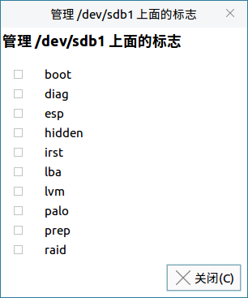
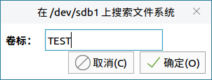

# 分区编辑器
## 概 述
分区编辑器提供了对本机所有存储设备(比如移动硬盘、U 盘)进行查看和编辑的功能。主界面如图 1所示。

 

## 基本功能
磁盘分区中的色彩条表示分区大小；列表区展示了各个分区的详细信息，包含挂载点、大小等。

点击色彩条会在列表区中标记出该分区，点击列表区的分区也会在色彩条上显示。如图 2所示

图标及其功能：

|图标|	图标功能说明|	图标|	图标功能说明
| :------------ | :------------ | :------------ | :------------ |
||在选定的未分配空间内建立一个新的分区|	|	删除选定分区
||调整大小/移动选定分区||将选定分区复制到剪切板
||从剪切板粘贴分区||撤销上次操作
||应用全部操作	||	当前设备信息

 

点击菜单栏上的“分区”，或者在列表区右键单击，出现的菜单如图 3所示。

### 创建新分区
在设备上的未分配区域上选择“新建”，如图 4所示，用户可设置新分区的相关信息。

### 更改分区大小
在窗口中拖拽色彩条，或是输入新的大小，即可调整，如图 5所示。

### 格式化
如图 6所示，分区编辑器提供了多种格式可选。

### 标志和卷标
管理标志如图 7-a所示。

卷标代表着分区的名字，通过“文件系统”选项，用户可对分区重命名。

### 信 息
关于分区的详细信息，如图 8所示。

 

## 高级功能
### 刷新设备
“分区编辑器” > “刷新设备”

如果硬盘设备或分区发生了变化，比如插入了U盘，就需要刷新设备，才能在分区编辑器中查看到新插入的U盘。

### 编 辑
点击“编辑”，可撤销上次操作，清除/应用全部待执行的操作。

### 查 看
点击“查看”，可设置是否在主界面上显示“设备信息”，“待执行操作”。

还可以查看文件系统支持列表，如图 9所示。

### 分区表
点击“设备”，可在硬件设备上创建新分区表。

 

## 附 录
### 快捷键

| 快捷键 | 功 能 |
| :------------ | :------------ |
|Ctrl + R | 刷新设备|
|Ctrl + Q | 退出|
|Ctrl + Z | 撤销上次操作|
|Ctrl + Enter | 应用全部操作|
|Delete | 删除|
|Ctrl + C | 复制|
|Ctrl + V | 粘贴|

