# 分区编辑器
## 概 述
根据用户使用习惯，增加了用户分区的创建和使用支持，在系统安装时用户可以选择创建数据分区，系统文件管理器将会以数据盘的形式展现，相当于Windows系统的C/D/E盘，可以更好的适应用户使用习惯的切换。

分区编辑器是一款系统应用软件，用户可以对本机所有存储设备(比如本地硬盘、移动硬盘、U 盘等)进行查看和编辑(新建分区、删除分区、格式化等相关磁盘操作)。主界面由标题栏（最小化、最大化、关闭）、菜单、分区功能控制区以及磁盘信息区构成，如图1所示。

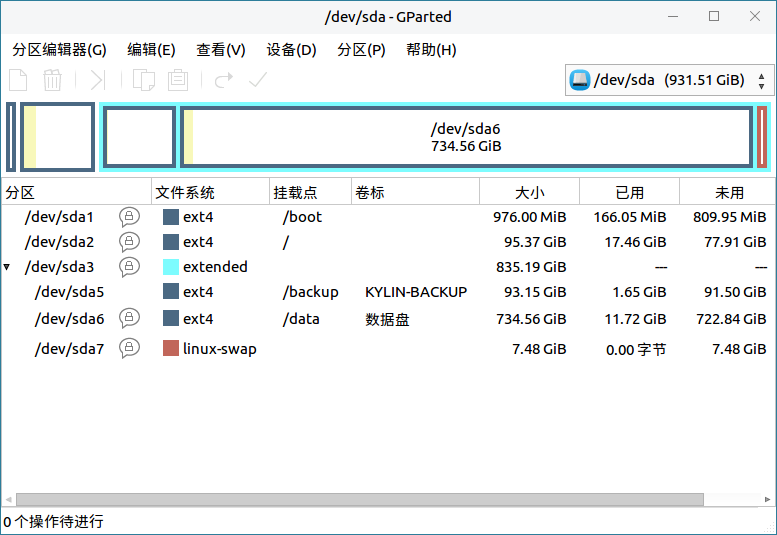
 

## 基本功能
磁盘分区中的彩色条显示各个分区大小，对应下面列表中的分区名称；列表区展示了各个分区的详细信息，比如分区名称、挂载点等，如图2所示。

主界面介绍：

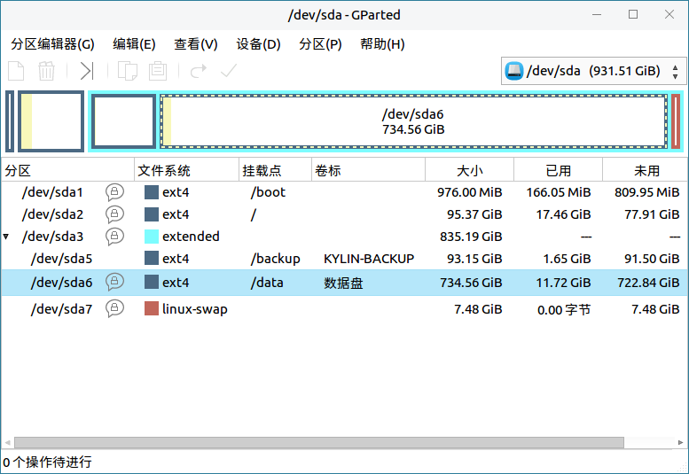

图标及其功能介绍：

|图标|	图标功能说明|	图标|	图标功能说明
| :------------ | :------------ | :------------ | :------------ |
||在选定的未分配空间内建立一个新的分区|	|	删除选定分区
||调整大小/移动选定分区||将选定分区复制到剪切板
||从剪切板粘贴分区||撤销上次操作
||应用全部操作	||	当前设备信息

 

## 高级功能
用户可以通过菜单的分区编辑器、编辑、查看、设备、分区、帮助选项，对分区编辑器进行相关操作。
 
图标及其功能介绍：

|图标	|图标功能说明	|图标	|图标功能说明
| :------------ | :------------ | :------------ | :------------ |
||	刷新设备||		当前设备信息
||	退出	||	撤销上次操作
||	清除全部操作	||	应用全部操作
||	新建分区	||	删除分区
||	更改大小/移动	||	复制
||	粘贴	||	格式化为（ntfs、linux-swap等）
||	信息	||	进入用户手册
||	关于分区编辑器	||	||

 

### 分区编辑器
用户可以通过点击：菜单 > 分区编辑器，如图3所示。

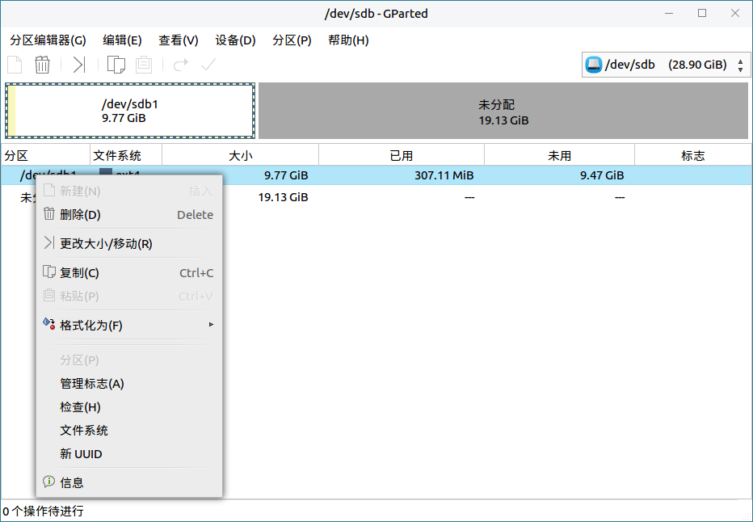

#### 刷新设备
用户可以通过点击：菜单 > 分区编辑器 > 刷新设备，对当前磁盘信息刷新，如图4所示。

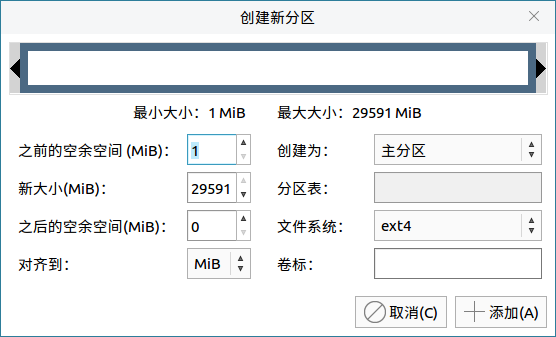

#### 查看设备
用户可以通过点击：菜单 > 分区编辑器 > 设备，查看当前设备信息，如图5所示。

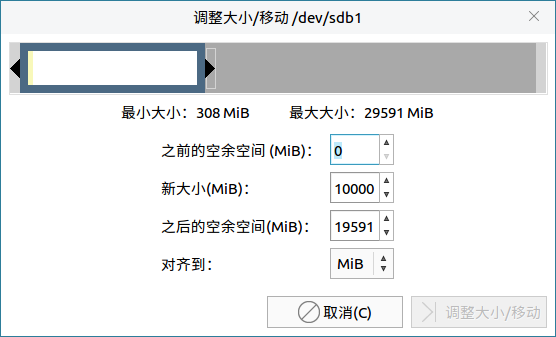

### 编 辑
用户可以通过点击：菜单 > 编辑，如图6所示。

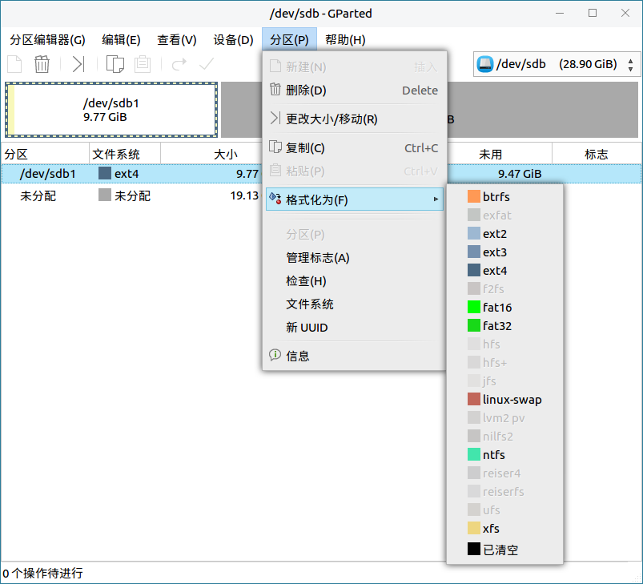

### 查 看
用户可以通过点击：菜单 > 查看，可以查看设备信息、待执行操作以及文件系统支持信息表，如图7所示。

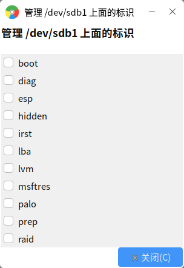

#### 设备信息&待执行操作
用户可以通过点击：菜单 > 查看 > 设备信息&待执行操作，可以查看设备信息、待执行操作，如图8所示。

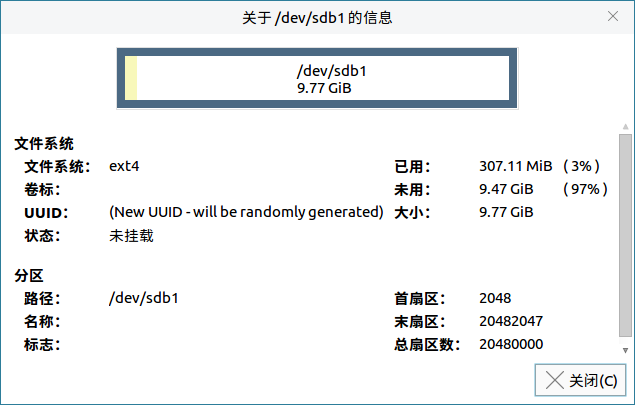

#### 文件系统支持
用户可以通过点击：菜单 > 查看 > 文件系统支持，可以文件系统支持信息表，此操作需作为超级用户，如图9所示。

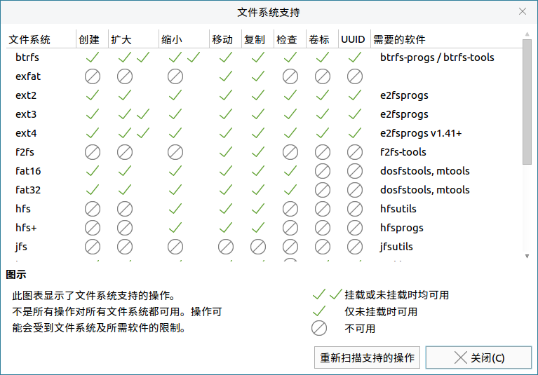

### 设 备
用户可以通过点击：菜单 > 设备，创建分区表，如图10所示。

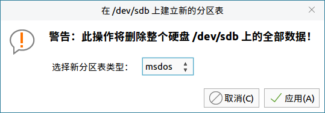

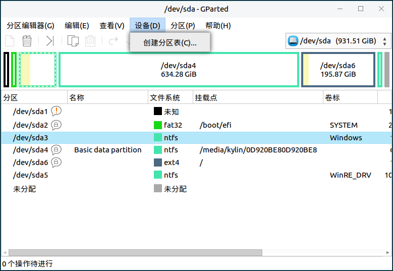

### 分 区
用户可以通过点击：菜单 > 分区，对磁盘进行删除、更改大小/移动、格式化等操作，如图12所示。

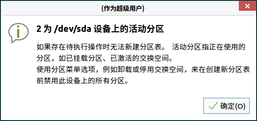

#### 更改大小&移动
用户可以通过点击：菜单 > 分区 > 更改大小&移动，如图13所示。

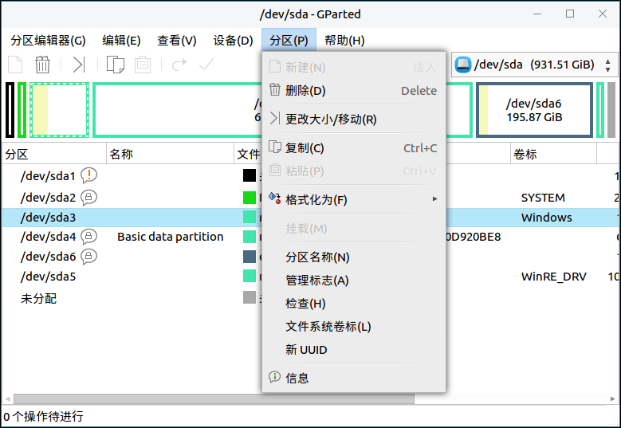

#### 格式化
用户可以通过点击：菜单 > 分区 > 格式化，如图14所示。

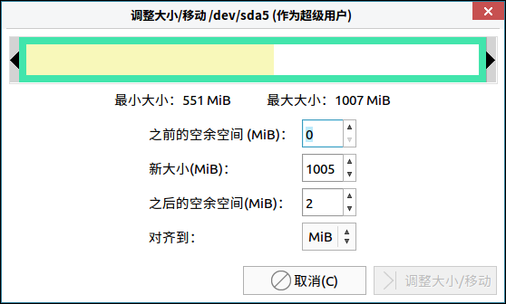

#### 管理标志
用户可以通过点击：菜单 > 分区 > 管理标志，如管理“/dev/sda5”的标志，如图15所示。

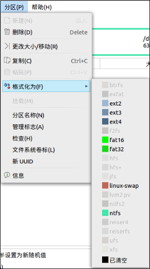

#### 检查分区
用户可以通过点击：菜单 > 分区 > 检查，如检查“/dev/sda5”分区，如图16所示。

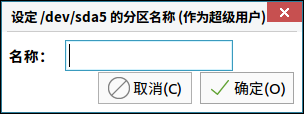

#### 文件系统卷标
用户可以通过点击：菜单 > 分区 > 文件系统，可以修改文件系统卷标，如图17所示为“/dev/sda5”分区卷标信息。

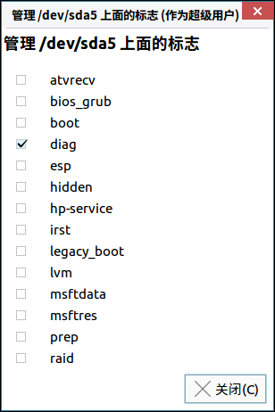

#### 新UUID
用户可以通过点击：菜单 > 分区 > 新UUID，需要注意的是更改UUID可能会验证windows产品激活密钥，如图18所示。

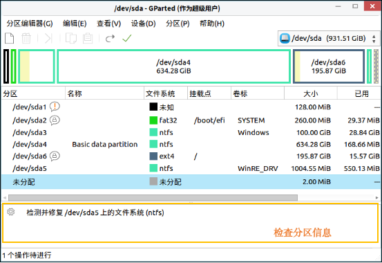

#### 信 息
用户可以通过点击：菜单 > 分区 > 信息，显示当前分区信息，如图19所示。

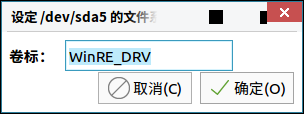

## 常见问题
### 使用分区编辑器的注意事项
用户在打开分区编辑器前，需要先进行授权进入，授权密码为登录系统时的用户密码，授权后等待加载进入主界面，如图所示。

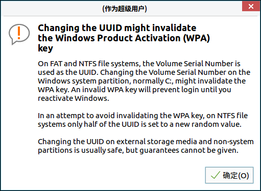
 

## 附 录
### 快捷键

|选项	|快捷键
| :------------ | :------------ |
|刷新设备（R）|	Ctrl+R
|退出（Q）|	Ctrl+Q
|撤销上次操作（U）|	Ctrl+Z
|应用全部操作（A）|	Ctrl+回车
|删除（D）|	Delete
|复制（C）|	Ctrl+C
|粘贴（P）|	Ctrl+V

