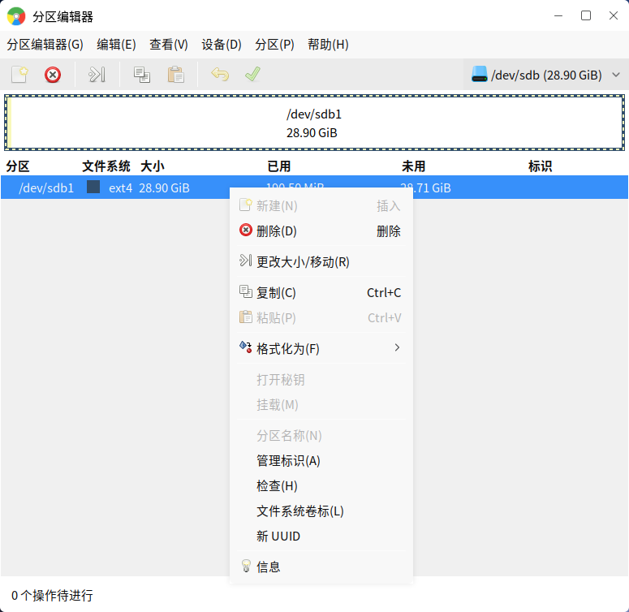

# 分区编辑器
## 概 述
分区编辑器提供了对本机所有存储设备（包括移动硬盘、U 盘）进行查看和编辑的功能。主界面如图1所示。

 

## 基本功能
磁盘分区中的色彩条表示分区大小；列表区展示了各个分区的详细信息，包含挂载点、大小等。

点击色彩条会在列表区中标记出该分区，点击列表区的分区也会在色彩条上显示，如图2所示。

点击菜单栏上的“分区”，或者在列表区右键单击，出现的菜单如图3所示。

### 创建新分区
在设备上的未分配区域上选择“新建”，如图4所示，用户可设置新分区的相关信息。

### 更改分区大小
在窗口中拖拽色彩条，或是输入新的大小，即可调整，如图5所示。

### 格式化
如图6所示，分区编辑器提供了多种格式可选。

### 标识和卷标
管理标识如图7所示。

卷标代表着分区的名字，通过“文件系统卷标”选项，用户可重命名卷标。

### 信 息
关于分区的详细信息，如图9所示。

 

## 高级功能
### 刷新设备
“分区编辑器” > “刷新设备”

如果硬盘设备或分区发生了变化，比如插入了U盘，就需要刷新设备，才能在分区编辑器中查看到新插入的U盘。

### 编 辑
点击“编辑”，可撤销上次操作，清除/应用全部待执行的操作。

### 查 看
点击“查看”，可设置是否在主界面上显示“设备信息”，“待执行操作”。

还可以查看文件系统支持列表，如图10所示。

### 分区表
点击“设备”，可在硬件设备上创建新分区表。

 

## 附 录
### 注意事项
1）“msdos”分区表在创建分区时，不支持设置分区名称。

2）“msdos”分区表只有“fat”文件系统可以选择“lba”标志。

### 快捷键

| 快捷键 | 功能 |
| :------------ | :------------ |
|Ctrl + R | 刷新设备|
|Ctrl + Q | 退出|
|Ctrl + Z | 撤销上次操作|
|Ctrl + Enter | 应用全部操作|
|Delete | 删除|
|Ctrl + C | 复制|
|Ctrl + V | 粘贴|

